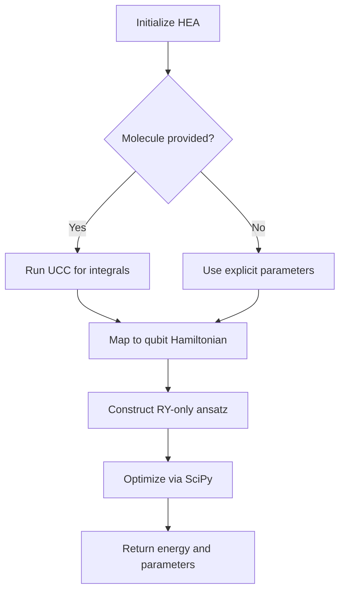
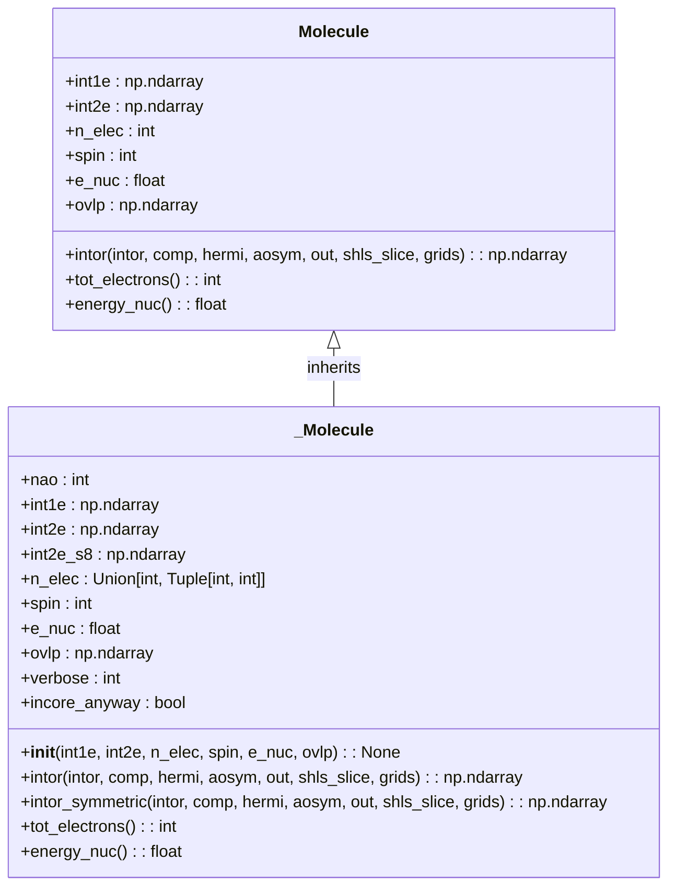
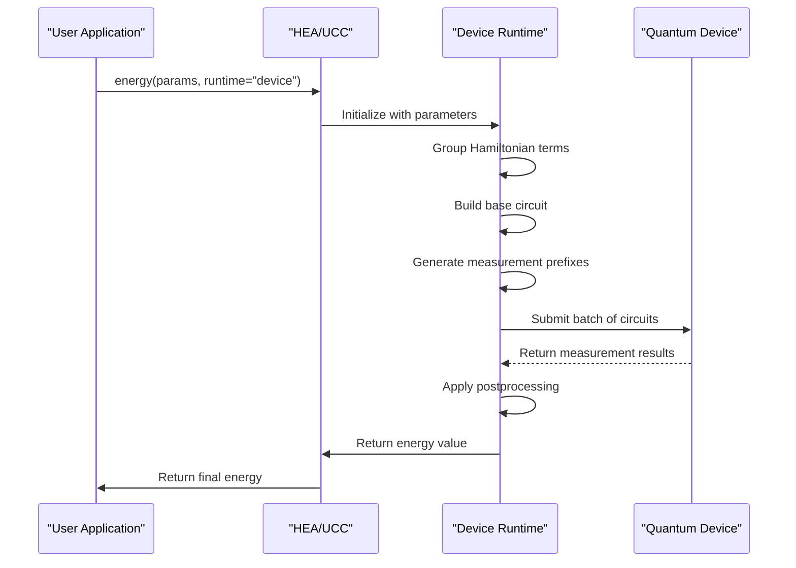
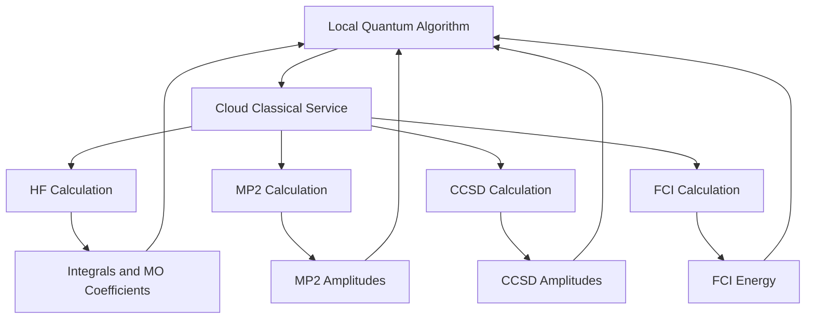

# Applications API

<cite>
**Referenced Files in This Document**   
- [HEA.py](file://src/tyxonq/applications/chem/algorithms/hea.py)
- [UCC.py](file://src/tyxonq/applications/chem/algorithms/ucc.py)
- [UCCSD.py](file://src/tyxonq/applications/chem/algorithms/uccsd.py)
- [kupccgsd.py](file://src/tyxonq/applications/chem/algorithms/kupccgsd.py)
- [puccd.py](file://src/tyxonq/applications/chem/algorithms/puccd.py)
- [molecule.py](file://src/tyxonq/applications/chem/molecule.py)
- [hea_device_runtime.py](file://src/tyxonq/applications/chem/runtimes/hea_device_runtime.py)
- [hea_numeric_runtime.py](file://src/tyxonq/applications/chem/runtimes/hea_numeric_runtime.py)
- [ucc_device_runtime.py](file://src/tyxonq/applications/chem/runtimes/ucc_device_runtime.py)
- [ucc_numeric_runtime.py](file://src/tyxonq/applications/chem/runtimes/ucc_numeric_runtime.py)
- [classical_methods.py](file://src/tyxonq/applications/chem/classical_chem_cloud/classical_methods.py)
- [clients.py](file://src/tyxonq/applications/chem/classical_chem_cloud/clients.py)
- [config.py](file://src/tyxonq/applications/chem/classical_chem_cloud/config.py)
- [cloud_uccsd_hea_demo.py](file://examples/cloud_uccsd_hea_demo.py)
</cite>

## Table of Contents
1. [Introduction](#introduction)
2. [Core Algorithms](#core-algorithms)
3. [Molecule Class](#molecule-class)
4. [Runtime Implementations](#runtime-implementations)
5. [Classical-Chemical Cloud Integration](#classical-chemical-cloud-integration)
6. [Configuration Options](#configuration-options)
7. [Example Usage](#example-usage)
8. [Conclusion](#conclusion)

## Introduction
The Tyxonq Applications module provides a comprehensive framework for quantum-assisted drug discovery (Quantum AIDD) through advanced quantum chemistry algorithms. This API documentation focuses on the `chem` package, which implements state-of-the-art quantum chemistry methods including Unitary Coupled Cluster (UCC/UCCSD), Hardware-Efficient Ansatz (HEA), k-UpCCGSD, and pUCCD. The framework supports both device-based execution on quantum hardware and exact numeric simulations, enabling researchers to perform variational quantum eigensolver (VQE) calculations for molecular energy estimation. The system integrates classical computational chemistry methods through cloud services, creating a hybrid quantum-classical workflow for drug discovery applications. The API is designed to be accessible while providing deep configurability for advanced users.

## Core Algorithms
The chem package implements several quantum chemistry algorithms for molecular energy calculations. These algorithms are designed to work within the variational quantum eigensolver (VQE) framework, where a parameterized quantum circuit (ansatz) is optimized to find the ground state energy of a molecular Hamiltonian.

### UCC/UCCSD Algorithms
The Unitary Coupled Cluster (UCC) and Unitary Coupled Cluster Singles and Doubles (UCCSD) algorithms are implemented as the primary methods for quantum chemistry calculations. UCCSD represents a specific instance of UCC that includes only single and double excitations from a Hartree-Fock reference state. The implementation follows the TCC (Tensor Contraction Compiler) style with compatibility for PySCF integrations. The algorithm constructs excitation operators based on molecular orbitals and optimizes parameters to minimize the energy expectation value. For open-shell systems, the ROUCCSD (Restricted Open-Shell UCCSD) variant is available, which handles systems with unpaired electrons.

**Section sources**
- [ucc.py](file://src/tyxonq/applications/chem/algorithms/ucc.py#L51-L1086)
- [uccsd.py](file://src/tyxonq/applications/chem/algorithms/uccsd.py#L17-L229)

### HEA Algorithm
The Hardware-Efficient Ansatz (HEA) algorithm implements a parameterized quantum circuit specifically designed for near-term quantum devices. The ansatz consists of alternating layers of single-qubit Y-rotations and entangling CNOT gates arranged in a linear chain. This structure minimizes gate depth while maintaining expressibility. The HEA implementation supports both direct construction from Hamiltonian terms and integration with molecular data through the from_molecule class method. The algorithm provides parameter-shift gradients for optimization and supports RDM (Reduced Density Matrix) calculations for post-VQE analysis.



**Diagram sources **
- [hea.py](file://src/tyxonq/applications/chem/algorithms/hea.py#L27-L648)

**Section sources**
- [hea.py](file://src/tyxonq/applications/chem/algorithms/hea.py#L27-L648)

### k-UpCCGSD and pUCCD Algorithms
The k-UpCCGSD (k-layer Unitary Pair Coupled Cluster Generalized Singles and Doubles) algorithm implements a generalized coupled cluster approach with k layers of excitation operators. This ansatz uses paired excitations and generalized singles, providing a balance between circuit depth and chemical accuracy. The implementation supports multiple initialization attempts (n_tries parameter) to mitigate the risk of converging to local minima. The pUCCD (pair Unitary Coupled Cluster Doubles) algorithm focuses specifically on pair-doubling excitations, making it particularly suitable for strongly correlated systems where electron pairing is dominant.

**Section sources**
- [kupccgsd.py](file://src/tyxonq/applications/chem/algorithms/kupccgsd.py#L14-L292)
- [puccd.py](file://src/tyxonq/applications/chem/algorithms/puccd.py#L19-L186)

## Molecule Class
The molecule module provides tools for molecular input and processing in quantum chemistry calculations. It includes both direct molecular constructors and utilities for generating common molecular configurations.

### Molecular Input Processing
The molecule class supports multiple methods for specifying molecular geometry, including direct atom specification, bond distances, and geometric configurations. Molecules can be defined using atomic symbols with Cartesian coordinates, or through specialized constructors for common molecular types. The class integrates with PySCF for Hartree-Fock calculations and integral computation. For testing and benchmarking purposes, the module provides predefined molecular instances including H2, H2O, N2, and CH4.



**Diagram sources **
- [molecule.py](file://src/tyxonq/applications/chem/molecule.py#L0-L310)

**Section sources**
- [molecule.py](file://src/tyxonq/applications/chem/molecule.py#L0-L310)

### Predefined Molecular Constructors
The module provides a comprehensive set of predefined molecular constructors for common chemical systems. These include hydrogen chains (h_chain), rings (h_ring), squares (h_square), and cubes (h_cube) for systematic studies of quantum systems. For real molecules, constructors are available for water (water), ammonia (nh3), methane (ch4), benzene (c6h6), and other important chemical compounds. Each constructor accepts parameters such as bond lengths, angles, and basis sets, allowing for flexible molecular configuration.

## Runtime Implementations
The chem package supports both device-based and exact numeric execution through specialized runtime implementations. These runtimes handle the execution of quantum circuits and energy calculations, abstracting the underlying hardware or simulation details.

### Device Runtime
The device runtime implementations execute quantum circuits on actual quantum hardware or simulators. The HEA and UCC algorithms both have dedicated device runtimes (HEADeviceRuntime and UCCDeviceRuntime) that handle circuit compilation, execution, and measurement. The runtime performs Hamiltonian grouping to minimize the number of circuit executions required for energy estimation. For gradient calculations, the parameter-shift method is implemented with π/2 shifts, batching all required circuits (base, plus, and minus variants) into a single submission for efficiency.



**Diagram sources **
- [hea_device_runtime.py](file://src/tyxonq/applications/chem/runtimes/hea_device_runtime.py#L0-L192)
- [ucc_device_runtime.py](file://src/tyxonq/applications/chem/runtimes/ucc_device_runtime.py#L0-L304)

**Section sources**
- [hea_device_runtime.py](file://src/tyxonq/applications/chem/runtimes/hea_device_runtime.py#L0-L192)
- [ucc_device_runtime.py](file://src/tyxonq/applications/chem/runtimes/ucc_device_runtime.py#L0-L304)

### Numeric Runtime
The numeric runtime implementations provide exact simulations of quantum circuits using classical computational methods. These runtimes are used when high-precision results are required without sampling noise. The HEANumericRuntime and UCCNumericRuntime classes implement statevector simulations using the framework's numerical backend. For UCC calculations, specialized numeric engines ("civector", "civector-large", "pyscf") are available for CI (Configuration Interaction) vector operations, enabling exact calculations for systems with active spaces. The numeric path is automatically selected when shots=0 is specified in the execution options.

**Section sources**
- [hea_numeric_runtime.py](file://src/tyxonq/applications/chem/runtimes/hea_numeric_runtime.py#L0-L100)
- [ucc_numeric_runtime.py](file://src/tyxonq/applications/chem/runtimes/ucc_numeric_runtime.py#L0-L292)

## Classical-Chemical Cloud Integration
The chem package integrates with classical computational chemistry methods through a cloud-based service, enabling hybrid quantum-classical workflows for drug discovery applications.

### Cloud Classical Methods
The classical_chem_cloud module provides integration with remote classical computation services for heavy computational tasks such as Hartree-Fock (HF), MP2, CCSD, and FCI calculations. This allows the quantum algorithms to leverage high-accuracy classical methods for initial state preparation, reference energy calculations, and amplitude initialization. The cloud integration is designed to offload computationally intensive classical kernels while keeping the quantum optimization loop local.



**Diagram sources **
- [classical_methods.py](file://src/tyxonq/applications/chem/classical_chem_cloud/classical_methods.py)
- [clients.py](file://src/tyxonq/applications/chem/classical_chem_cloud/clients.py)

**Section sources**
- [classical_methods.py](file://src/tyxonq/applications/chem/classical_chem_cloud/classical_methods.py)
- [clients.py](file://src/tyxonq/applications/chem/classical_chem_cloud/clients.py)

### Client-Server Architecture
The cloud integration follows a client-server architecture with the TyxonQClassicalClient handling communication with the remote service. The client submits calculation tasks as JSON payloads containing molecular data, method specifications, and configuration options. The server routes requests to appropriate computational backends (CPU or GPU) based on the requested device type. The configuration system supports multiple providers, with the current implementation focused on the TyxonQ cloud service. The integration allows users to specify classical_provider and classical_device parameters in algorithm constructors to control the execution environment for classical computations.

**Section sources**
- [config.py](file://src/tyxonq/applications/chem/classical_chem_cloud/config.py#L0-L41)
- [app.py](file://src/tyxonq/applications/chem/classical_chem_cloud/server/app.py#L0-L42)

## Configuration Options
The chem package provides extensive configuration options for both algorithms and runtimes, allowing users to customize behavior for specific use cases.

### Algorithm Configuration
Each quantum chemistry algorithm supports a range of configuration options through constructor parameters. Common options include:
- **runtime**: Specifies execution mode ("device" or "numeric")
- **mapping**: Fermion-to-qubit mapping ("parity", "jordan-wigner", "bravyi-kitaev")
- **active_space**: Tuple specifying active electrons and orbitals
- **init_method**: Initialization method for amplitudes ("mp2", "ccsd", "zeros")
- **classical_provider**: Cloud provider for classical computations ("local", "tyxonq")
- **classical_device**: Device for classical computations ("auto", "cpu", "gpu")

For UCC-based algorithms, additional options include:
- **mode**: Particle symmetry handling ("fermion", "qubit", "hcb")
- **decompose_multicontrol**: Whether to decompose multi-control gates
- **trotter**: Whether to use Trotterization for evolution

For HEA, specific options include:
- **layers**: Number of entangling layers
- **numeric_engine**: Numeric backend for simulations ("statevector", "mps")

### Runtime Configuration
Runtime behavior is controlled through parameters passed to energy and kernel methods. Key configuration options include:
- **shots**: Number of circuit executions (0 for exact simulation)
- **provider**: Execution provider ("simulator", "local", or hardware provider)
- **device**: Specific device or simulator type
- **postprocessing**: Postprocessing options for measurement results
- **noise**: Noise model configuration for realistic simulations

The framework automatically configures default values based on the execution context, such as using shots=0 for simulator providers to enable exact expectation values, while using shots=2048 for hardware providers to approximate real-world conditions.

## Example Usage
The examples directory contains demonstrations of quantum chemistry calculations using the chem package. These examples illustrate best practices for configuring and executing quantum algorithms.

### Cloud UCCSD and HEA Demo
The cloud_uccsd_hea_demo.py example demonstrates the integration of UCCSD and HEA algorithms with cloud-based classical computations. It shows how to configure algorithms to use remote classical services for Hartree-Fock and post-HF calculations while performing the quantum optimization locally. The example compares results from both algorithms and demonstrates the use of different fermion-to-qubit mappings.

**Section sources**
- [cloud_uccsd_hea_demo.py](file://examples/cloud_uccsd_hea_demo.py)

### Molecular Energy Calculations
Typical usage involves creating a molecular instance, initializing a quantum chemistry algorithm, and running the optimization to obtain the ground state energy. For example, calculating the energy of a hydrogen molecule:

```python
from tyxonq.chem import UCCSD
from tyxonq.chem.molecule import h2

uccsd = UCCSD(h2, init_method="mp2", active_space=(2, 2))
energy = uccsd.kernel()
```

This pattern applies to all quantum chemistry algorithms in the package, with variations in constructor parameters based on the specific algorithm requirements.

## Conclusion
The Tyxonq Applications module provides a comprehensive and flexible framework for quantum-assisted drug discovery through its advanced quantum chemistry algorithms. The chem package implements state-of-the-art methods including UCC/UCCSD, HEA, k-UpCCGSD, and pUCCD, supporting both device-based execution and exact numeric simulations. The integration with classical computational chemistry methods through cloud services enables powerful hybrid quantum-classical workflows. The API is designed to be accessible for users while providing deep configurability for advanced research applications. With its comprehensive set of molecular constructors, flexible runtime options, and seamless cloud integration, the framework provides a powerful platform for quantum chemistry calculations in drug discovery and materials science.