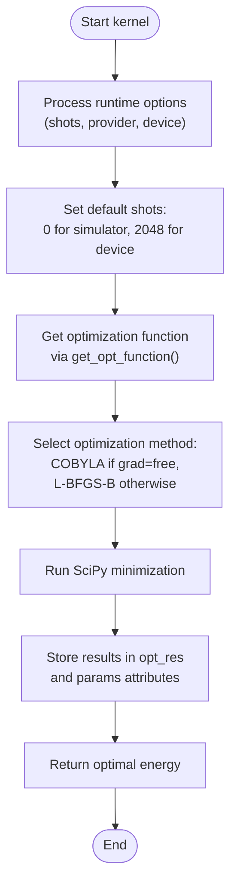

# HEA Algorithm

<cite>
**Referenced Files in This Document**   
- [hea.py](file://src/tyxonq/applications/chem/algorithms/hea.py)
</cite>

## Table of Contents
1. [Introduction](#introduction)
2. [HEA Class Initialization](#hea-class-initialization)
3. [Circuit Structure](#circuit-structure)
4. [Energy Evaluation Methods](#energy-evaluation-methods)
5. [Variational Optimization with Kernel Method](#variational-optimization-with-kernel-method)
6. [HEA Construction from Molecular Data](#hea-construction-from-molecular-data)
7. [Reduced Density Matrix Calculation](#reduced-density-matrix-calculation)
8. [Configuration Options](#configuration-options)
9. [Usage Examples](#usage-examples)

## Introduction
The Hardware-Efficient Ansatz (HEA) algorithm in TyxonQ is a variational quantum algorithm designed for molecular energy calculations using a parameterized quantum circuit. The HEA class implements a RY-only circuit structure with alternating layers of CNOT chains and RY rotations, enabling efficient execution on quantum hardware. This documentation details the initialization, circuit structure, energy evaluation, optimization, and post-processing methods of the HEA class, along with configuration options and usage examples.

## HEA Class Initialization
The HEA class can be initialized with molecular parameters, qubit count, circuit layers, and Hamiltonian specification. The constructor supports two initialization paths: direct specification of parameters or construction from molecular data.

When initializing directly, the following parameters are required:
- `n_qubits`: Number of qubits in the circuit
- `layers`: Number of alternating layers in the circuit
- `hamiltonian`: Hamiltonian specification as a list of coefficient-operator pairs

Alternatively, the class can be initialized from molecular data using the `molecule` or `atom` parameters, which triggers automatic construction via the `from_molecule` method. The initialization also supports configuration options for runtime selection, numeric engine, and classical optimization parameters.

The class maintains several internal attributes including `runtime`, `mapping`, `int1e`, `int2e`, `n_elec`, `spin`, and `e_core` for chemistry metadata, and optimization artifacts such as `grad`, `scipy_minimize_options`, `_params`, and `opt_res`.

**Section sources**
- [hea.py](file://src/tyxonq/applications/chem/algorithms/hea.py#L44-L123)

## Circuit Structure
The HEA implements a RY-only circuit structure consisting of an initial RY layer followed by alternating layers of CNOT chains and RY rotations. The circuit structure is defined as follows:

- Layer 0: Individual RY(θ₀,ᵢ) rotations on each qubit
- For each layer l from 1 to L: CNOT chain (0→1→...→n-1) followed by individual RY(θₗ,ᵢ) rotations

The total number of parameters is (layers + 1) × n_qubits. The circuit construction is handled by the `get_circuit` method, which can either use the default RY ansatz or instantiate from an external circuit template if provided. Barrier instructions are inserted between layers for visualization and compilation boundary control.


**Diagram sources**
- [hea.py](file://src/tyxonq/applications/chem/algorithms/hea.py#L125-L145)

**Section sources**
- [hea.py](file://src/tyxonq/applications/chem/algorithms/hea.py#L27-L648)

## Energy Evaluation Methods
The HEA class provides two primary methods for energy evaluation: `energy` and `energy_and_grad`. These methods support both device-based evaluation and numeric simulation through the `runtime` parameter.

### Energy Method
The `energy` method evaluates the expectation value of the Hamiltonian for a given set of parameters. When `runtime` is set to "numeric" or when `shots=0`, it uses the `HEANumericRuntime` for exact simulation. Otherwise, it uses `HEADeviceRuntime` for device-based evaluation with shot-based measurements.

The method internally performs basis grouping of the Hamiltonian terms, applies appropriate basis transformations (X→H, Y→S†H), and estimates the expectation value from Z-basis measurements.

### Energy and Gradient Method
The `energy_and_grad` method computes both the energy and its gradient using the parameter-shift rule. For each parameter θₖ, the gradient is calculated as:
gₖ = 0.5 × (E(θₖ + π/2) - E(θₖ - π/2))

This method follows the same runtime selection logic as the `energy` method, routing to either numeric or device-based evaluation based on the configuration.


**Diagram sources**
- [hea.py](file://src/tyxonq/applications/chem/algorithms/hea.py#L147-L163)
- [hea.py](file://src/tyxonq/applications/chem/algorithms/hea.py#L165-L182)

**Section sources**
- [hea.py](file://src/tyxonq/applications/chem/algorithms/hea.py#L147-L163)
- [hea.py](file://src/tyxonq/applications/chem/algorithms/hea.py#L165-L182)

## Variational Optimization with Kernel Method
The `kernel` method orchestrates the variational optimization process, integrating energy evaluation with classical optimization using SciPy minimizers. It handles configuration persistence, runtime option management, and optimizer selection based on the problem characteristics.

The method first processes runtime options, setting appropriate defaults for shots based on the execution environment (simulator vs. real device). It then constructs an optimization function through `get_opt_function`, which returns either just the energy function (when `grad="free"`) or a tuple of energy and gradient functions.

The optimization uses different strategies based on the gradient method:
- When `grad="free"`, it uses the COBYLA method without gradient information
- Otherwise, it uses the L-BFGS-B method with gradient information from parameter-shift

The method stores optimization results in the `opt_res` attribute and the optimized parameters in the `params` attribute.



**Diagram sources**
- [hea.py](file://src/tyxonq/applications/chem/algorithms/hea.py#L210-L253)

**Section sources**
- [hea.py](file://src/tyxonq/applications/chem/algorithms/hea.py#L185-L208)
- [hea.py](file://src/tyxonq/applications/chem/algorithms/hea.py#L210-L253)

## HEA Construction from Molecular Data
The HEA class provides multiple class methods for constructing instances from molecular data, supporting different fermion-to-qubit mappings and input formats.

### From Molecular Integrals
The `from_integral` class method constructs an HEA instance from molecular integrals (one-electron and two-electron integrals), electron count, and core energy. It follows these steps:
1. Constructs the fermionic Hamiltonian from the integrals
2. Maps the fermionic Hamiltonian to a qubit operator using the specified mapping (parity, Jordan-Wigner, or Bravyi-Kitaev)
3. Converts the qubit operator to a lightweight Hamiltonian list format
4. Instantiates the HEA with the appropriate number of qubits (accounting for parity mapping's two-qubit reduction)

The method supports the "parity", "jordan-wigner", and "bravyi-kitaev" mappings, with parity being the default. It also handles both integer and tuple forms of electron count specification.

### From PySCF Molecule
The `from_molecule` class method constructs an HEA instance directly from a PySCF molecule object. It automatically:
1. Runs RHF (or uses provided molecule data) to obtain molecular integrals and core energy
2. Calculates the number of alpha and beta electrons based on total electron count and spin
3. Delegates to `from_integral` for the actual HEA construction

This method also supports direct specification of molecular parameters (atom, basis, unit, charge, spin) without requiring a pre-constructed PySCF molecule.

### Alternative Construction Methods
The class also provides the `ry` method as a compatibility wrapper for older interfaces, and the `from_qiskit_circuit` method for constructing HEA instances from external parameterized circuits (e.g., Qiskit's RealAmplitudes).


**Diagram sources**
- [hea.py](file://src/tyxonq/applications/chem/algorithms/hea.py#L296-L349)
- [hea.py](file://src/tyxonq/applications/chem/algorithms/hea.py#L352-L410)

**Section sources**
- [hea.py](file://src/tyxonq/applications/chem/algorithms/hea.py#L296-L349)
- [hea.py](file://src/tyxonq/applications/chem/algorithms/hea.py#L352-L410)

## Reduced Density Matrix Calculation
The HEA class provides methods for calculating reduced density matrices (RDMs) for post-processing and analysis. These methods require that the HEA instance was constructed from molecular data (via `from_integral` or `from_molecule`) to have access to the necessary chemistry metadata.

### One-Body RDM
The `make_rdm1` method calculates the spin-traced one-body RDM. It works by:
1. Constructing fermionic operators for each matrix element
2. Mapping these to qubit operators using the same mapping as the original Hamiltonian
3. Evaluating the expectation value using the current circuit parameters
4. Scaling by 0.5 to account for spin tracing

The method handles both restricted (spin=0) and unrestricted cases, constructing appropriate fermionic operators for each scenario.

### Two-Body RDM
The `make_rdm2` method calculates the spin-traced two-body RDM. It follows a similar process to `make_rdm1` but with more complex fermionic operators that account for all combinations of creation and annihilation operators. The method exploits symmetry to reduce the number of evaluations by calculating only unique elements and filling in symmetric counterparts.

Both RDM methods use the `energy` method with `shots=0` for exact expectation value estimation on simulators, avoiding sampling noise that could affect the accuracy of the RDMs.


**Diagram sources**
- [hea.py](file://src/tyxonq/applications/chem/algorithms/hea.py#L519-L552)
- [hea.py](file://src/tyxonq/applications/chem/algorithms/hea.py#L554-L601)

**Section sources**
- [hea.py](file://src/tyxonq/applications/chem/algorithms/hea.py#L519-L552)
- [hea.py](file://src/tyxonq/applications/chem/algorithms/hea.py#L554-L601)

## Configuration Options
The HEA class supports various configuration options for different runtimes, gradient methods, and classical optimization parameters.

### Runtime Configuration
The `runtime` parameter controls whether calculations are performed on actual quantum devices ("device") or through numeric simulation ("numeric"). The `numeric_engine` parameter specifies the backend for numeric simulation, with options including "statevector", "cupynumeric", and "pytorch".

### Gradient Methods
The `grad` attribute determines the gradient computation method:
- "param-shift": Uses the parameter-shift rule for gradient computation
- "free": Indicates that gradients are not computed (used with gradient-free optimizers)

### Classical Optimization Parameters
The `scipy_minimize_options` attribute allows customization of the SciPy optimization process, including maximum iterations, tolerance, and other solver-specific options. The `kernel` method sets default maximum iterations based on the runtime (200 for numeric/analytic paths, 100 for device paths with sampling).

### Fermion-to-Qubit Mappings
The `mapping` parameter supports three fermion-to-qubit mappings:
- "parity": Reduces qubit count by 2 through symmetry exploitation
- "jordan-wigner": Standard mapping preserving locality
- "bravyi-kitaev": More efficient mapping with logarithmic locality

## Usage Examples
The HEA algorithm can be used in various workflows for molecular energy calculations. Here are typical usage patterns:

### Basic VQE Workflow
```python
# Construct HEA from molecule
hea = HEA.from_molecule(mol=molecule, n_layers=3, mapping="parity")

# Run variational optimization
energy = hea.kernel()

# Access results
print(f"Optimal energy: {energy}")
print(f"Optimization success: {hea.opt_res['success']}")
```

### RDM Calculation
```python
# After optimization, calculate RDMs
rdm1 = hea.make_rdm1()
rdm2 = hea.make_rdm2()

# Use RDMs for property calculations
```

### Custom Optimization Configuration
```python
# Configure optimization options
hea.scipy_minimize_options = {"maxiter": 300, "ftol": 1e-9}

# Run optimization with custom device options
energy = hea.kernel(shots=8192, provider="cloud", device="processor_1")
```

### Integration with PySCF
```python
# Use as PySCF-compatible solver
solver = HEA.as_pyscf_solver(n_layers=2, mapping="parity")
# Can be used in CASSCF or other PySCF workflows
```

These examples demonstrate the flexibility of the HEA implementation in TyxonQ for various quantum chemistry applications.

**Section sources**
- [hea.py](file://src/tyxonq/applications/chem/algorithms/hea.py#L27-L648)