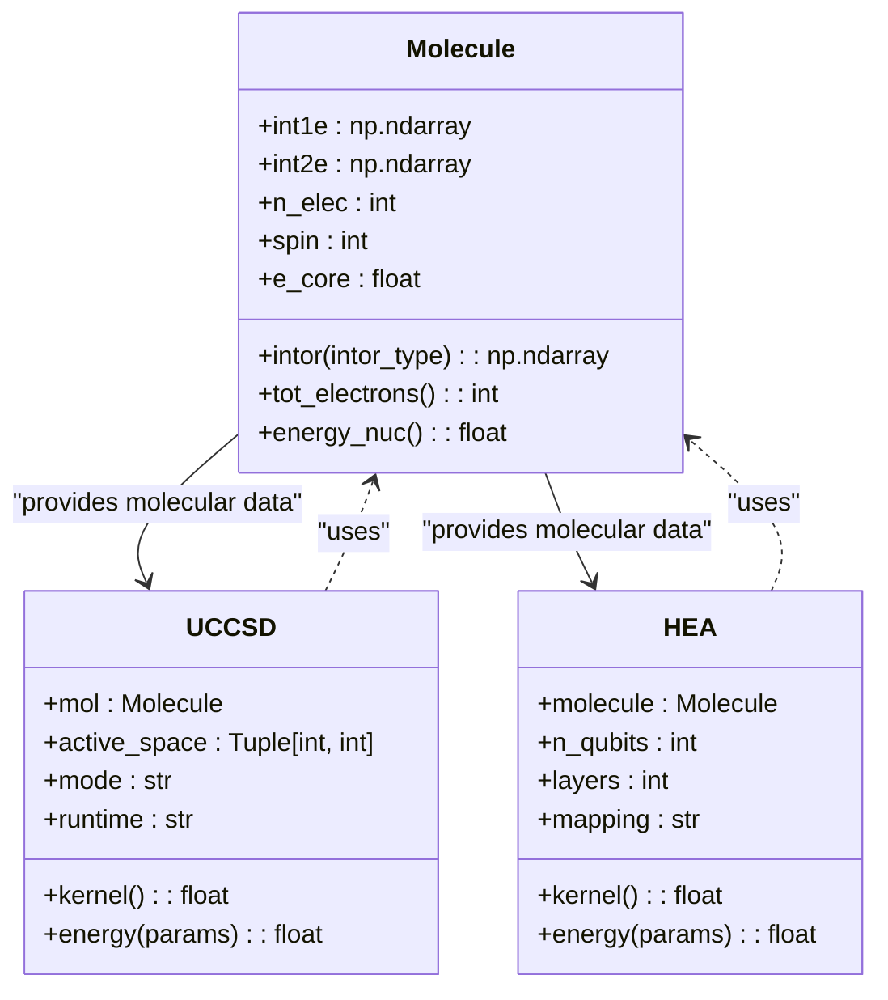

# Molecule Class

<cite>
**Referenced Files in This Document**   
- [molecule.py](file://src/tyxonq/applications/chem/molecule.py)
- [ucc.py](file://src/tyxonq/applications/chem/algorithms/ucc.py)
- [hea.py](file://src/tyxonq/applications/chem/algorithms/hea.py)
- [uccsd.py](file://src/tyxonq/applications/chem/algorithms/uccsd.py)
</cite>

## Table of Contents
1. [Introduction](#introduction)
2. [Molecule Class Initialization](#molecule-class-initialization)
3. [Property Access Methods](#property-access-methods)
4. [Active Space Specification](#active-space-specification)
5. [Integration with Quantum Chemistry Algorithms](#integration-with-quantum-chemistry-algorithms)
6. [Configuration Options](#configuration-options)
7. [Example Usage](#example-usage)

## Introduction
The Molecule class in TyxonQ's quantum chemistry applications provides a foundation for representing molecular systems and performing quantum chemical calculations. It serves as a bridge between classical computational chemistry (via PySCF integration) and quantum algorithms such as UCCSD and HEA. The class enables the creation and manipulation of molecular systems with specified atomic coordinates, basis sets, charge, spin, and unit specifications. This documentation details the initialization process, property access methods, active space capabilities, integration with quantum algorithms, configuration options, and practical examples of molecule creation and usage.

## Molecule Class Initialization
The Molecule class initialization supports multiple methods for defining molecular systems, including direct specification of atomic coordinates and integration with PySCF for Hartree-Fock calculations. The class can be initialized with atomic coordinates, basis sets, charge, spin, and unit specifications, allowing for flexible molecule creation. When initialized with atomic coordinates, the class automatically computes molecular orbitals and integrals using PySCF's Hartree-Fock method. The initialization process also supports direct molecule construction using PySCF-style parameters, enabling seamless integration with existing quantum chemistry workflows. The class handles both closed-shell and open-shell systems, with appropriate treatment of spin configurations.

**Section sources**
- [molecule.py](file://src/tyxonq/applications/chem/molecule.py#L2-L47)
- [ucc.py](file://src/tyxonq/applications/chem/algorithms/ucc.py#L59-L95)

## Property Access Methods
The Molecule class provides comprehensive property access methods for retrieving essential molecular information and integrals. These methods include access to one-electron and two-electron integrals, core energy, number of electrons, and spin configuration. The class implements the `intor` method to retrieve various types of integrals, including kinetic energy, nuclear attraction, overlap, and electron repulsion integrals. Additional methods provide access to the total number of electrons and nuclear energy. These properties are crucial for subsequent quantum chemistry calculations and algorithm implementations, ensuring that all necessary molecular information is readily available for further processing.

**Section sources**
- [molecule.py](file://src/tyxonq/applications/chem/molecule.py#L49-L97)

## Active Space Specification
The Molecule class supports active space specification capabilities to reduce computational complexity in quantum chemistry calculations. This feature allows users to define an active space approximation by specifying the number of active electrons and spatial orbitals. The active space approach focuses computational resources on the most chemically relevant electrons and orbitals, significantly reducing the computational cost of subsequent calculations. The class provides methods to select specific orbitals for the active space, with options to sort orbitals by energy or specify custom orbital indices. This capability is particularly valuable for large molecular systems where full configuration interaction calculations would be prohibitively expensive.

**Section sources**
- [ucc.py](file://src/tyxonq/applications/chem/algorithms/ucc.py#L59-L95)
- [uccsd.py](file://src/tyxonq/applications/chem/algorithms/uccsd.py#L17-L229)

## Integration with Quantum Chemistry Algorithms
The Molecule class integrates seamlessly with various quantum chemistry algorithms in the TyxonQ framework, particularly UCCSD and HEA. For UCCSD calculations, the class provides the necessary molecular integrals and orbital information required for constructing the unitary coupled cluster ansatz. The integration includes automatic computation of Hartree-Fock orbitals and energies, which serve as the reference state for UCCSD calculations. For HEA (Hardware-Efficient Ansatz) algorithms, the Molecule class enables the construction of parameterized quantum circuits based on molecular Hamiltonians. The class supports different fermion-to-qubit mappings (parity, Jordan-Wigner, Bravyi-Kitaev) and can generate the corresponding qubit Hamiltonians for use in variational quantum eigensolvers.

**Diagram sources**
- [molecule.py](file://src/tyxonq/applications/chem/molecule.py#L2-L97)
- [uccsd.py](file://src/tyxonq/applications/chem/algorithms/uccsd.py#L17-L229)
- [hea.py](file://src/tyxonq/applications/chem/algorithms/hea.py#L27-L648)

## Configuration Options
The Molecule class offers extensive configuration options for different classical computational backends and numerical precision settings. Users can specify the classical provider (local or cloud) and device for computational chemistry calculations, enabling both local execution and cloud-based computation. The class supports various numerical engines, including statevector, civector, and tensornetwork, allowing users to select the most appropriate computational approach based on system size and available resources. Precision settings can be configured to balance computational accuracy and performance. Additionally, the class provides options for specifying basis sets, units (Angstrom or Bohr), and convergence criteria for Hartree-Fock calculations, offering fine-grained control over the computational process.

**Section sources**
- [ucc.py](file://src/tyxonq/applications/chem/algorithms/ucc.py#L59-L95)
- [hea.py](file://src/tyxonq/applications/chem/algorithms/hea.py#L27-L648)

## Example Usage
The Molecule class provides convenient methods for creating common molecular systems, such as H2, for use in quantum chemistry algorithms. Examples include creating hydrogen molecules with specified bond distances, water molecules with defined bond lengths and angles, and more complex systems like benzene. These predefined molecule constructors simplify the process of setting up quantum chemistry calculations and enable rapid prototyping of quantum algorithms. The examples demonstrate how to create molecules, access their properties, and use them in quantum chemistry algorithms like UCCSD and HEA. The integration with PySCF ensures that all necessary molecular data is computed automatically, allowing users to focus on the quantum algorithm implementation rather than the underlying classical chemistry calculations.

**Section sources**
- [molecule.py](file://src/tyxonq/applications/chem/molecule.py#L97-L310)