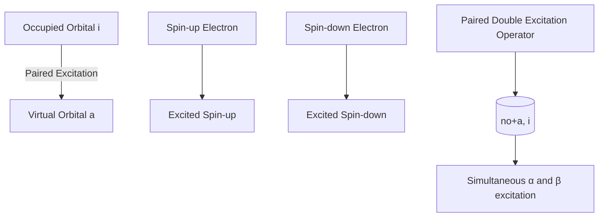
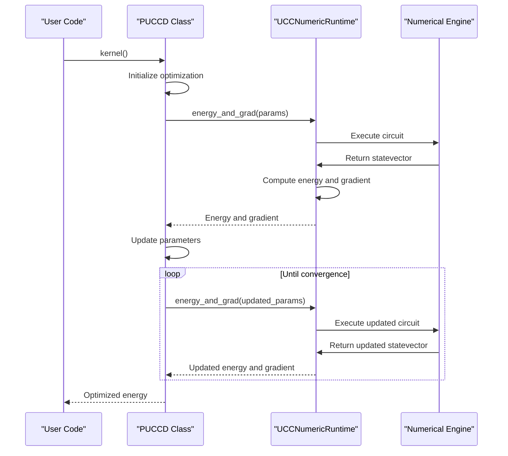
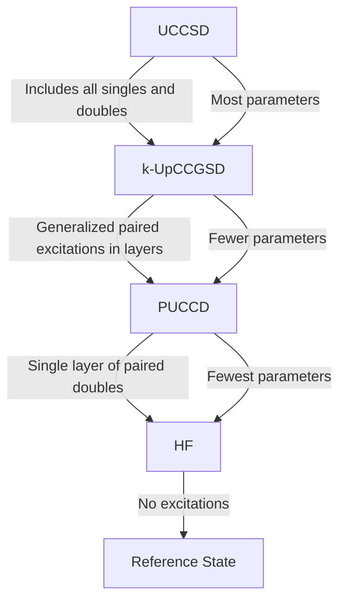

# PUCCD Algorithm

<cite>
**Referenced Files in This Document**   
- [puccd.py](file://src/tyxonq/applications/chem/algorithms/puccd.py)
- [ucc.py](file://src/tyxonq/applications/chem/algorithms/ucc.py)
- [kupccgsd.py](file://src/tyxonq/applications/chem/algorithms/kupccgsd.py)
- [uccsd.py](file://src/tyxonq/applications/chem/algorithms/uccsd.py)
- [molecule.py](file://src/tyxonq/applications/chem/molecule.py)
- [test_puccd.py](file://tests_mol_valid/test_puccd.py)
</cite>

## Table of Contents
1. [Introduction](#introduction)
2. [Class Initialization and Configuration](#class-initialization-and-configuration)
3. [Pair-Double Excitation Operators](#pair-double-excitation-operators)
4. [Circuit Construction and Parameterization](#circuit-construction-and-parameterization)
5. [Energy Calculation and Optimization Workflow](#energy-calculation-and-optimization-workflow)
6. [Relationship to Other UCC Variants](#relationship-to-other-ucc-variants)
7. [Runtime Configuration and Numerical Backends](#runtime-configuration-and-numerical-backends)
8. [Use Cases and Computational Advantages](#use-cases-and-computational-advantages)
9. [Code Examples](#code-examples)

## Introduction
The Pair Unitary Coupled Cluster Doubles (PUCCD) algorithm in TyxonQ implements a specialized quantum chemistry method designed for systems with strong electron pairing correlations. This algorithm extends the general Unitary Coupled Cluster (UCC) framework by restricting excitations to paired double excitations, which significantly reduces the number of parameters while maintaining accuracy for specific molecular systems. The PUCCD class inherits from the base UCC class and implements spin-adapted paired excitations that preserve the total spin symmetry of the system.

**Section sources**
- [puccd.py](file://src/tyxonq/applications/chem/algorithms/puccd.py#L19-L30)

## Class Initialization and Configuration
The PUCCD class is initialized with molecular input parameters that define the quantum chemical system. The constructor accepts either a PySCF Mole object or direct molecular specification through atom, basis, charge, and spin parameters. Active space configuration is controlled through the `active_space` parameter, which specifies the number of active electrons and orbitals, or through `active_orbital_indices` for custom orbital selection. The initial guess for the cluster amplitudes is determined by the `init_method` parameter, which supports "mp2" (default), "ccsd", "fe" (fermionic energy), and "zeros" options.

Molecular orbitals can be customized via the `mo_coeff` parameter, allowing users to provide pre-computed orbital coefficients. The algorithm operates in "hcb" (hard-core boson) mode by default, which is specifically designed for paired excitations. Runtime execution is controlled by the `runtime` parameter, with 'device' as the default option, while numerical simulations can be performed using various backends specified by `numeric_engine`.

**Section sources**
- [puccd.py](file://src/tyxonq/applications/chem/algorithms/puccd.py#L30-L81)
- [ucc.py](file://src/tyxonq/applications/chem/algorithms/ucc.py#L51-L150)

## Pair-Double Excitation Operators
The PUCCD ansatz is built upon spin-adapted paired excitation operators that simultaneously excite electron pairs from occupied to virtual orbitals. These operators are generated in the `get_ex_ops` method, which creates a sequence of paired double excitations. Each excitation operator is represented as a tuple of qubit indices, following the pattern (no + a, i) where 'no' is the number of occupied orbitals, 'a' is the virtual orbital index, and 'i' is the occupied orbital index.

The pairing structure ensures that both alpha and beta electrons are excited together, preserving the singlet state. The initial guess for the excitation amplitudes is derived from the spatial-to-spin transformed t2 amplitudes, specifically extracting the paired components t2[2*i, 2*i+1, 2*a, 2*a+1] that correspond to simultaneous excitation of spin-up and spin-down electrons. This spin-adapted approach reduces the parameter count compared to general UCC methods while maintaining physical accuracy for systems with strong pairing correlations.



**Diagram sources**
- [puccd.py](file://src/tyxonq/applications/chem/algorithms/puccd.py#L82-L95)

## Circuit Construction and Parameterization
The quantum circuit for PUCCD is constructed through the `get_circuit` method, which generates a TyxonQ Circuit object representing the ansatz. The circuit implements the exponential of the excitation operators using either standard gate decomposition or Givens-Swap gates when the `givens_swap` parameter is set to True. The Givens-Swap implementation is particularly efficient for paired excitations and leverages the hard-core boson mapping.

The parameterization scheme follows a one-to-one correspondence between excitation operators and circuit parameters, with each paired double excitation having its own variational parameter. The circuit construction supports Trotterization through the `trotter` parameter, which decomposes the UCC operator into Pauli strings for implementation on quantum hardware. The parameter ordering follows a specific convention where excitations are processed in reverse order of virtual orbitals to maintain consistency with Givens rotation circuits.

**Section sources**
- [puccd.py](file://src/tyxonq/applications/chem/algorithms/puccd.py#L155-L179)
- [ucc.py](file://src/tyxonq/applications/chem/algorithms/ucc.py#L600-L620)

## Energy Calculation and Optimization Workflow
The energy calculation workflow integrates seamlessly with the optimization process through the `kernel` method inherited from the UCC base class. The energy is computed as the expectation value of the molecular Hamiltonian with respect to the parameterized quantum state. For numerical simulations, the energy evaluation uses analytic methods when shots=0, switching to sampling-based estimation for finite shot counts.

The optimization process employs L-BFGS-B by default, with automatic handling of runtime options such as shots, provider, and device specifications. The optimization workflow includes automatic selection of appropriate numerical backends based on system size, with smaller systems using "civector" and larger systems using "civector-large" engines. The convergence criteria are automatically adjusted based on the execution mode, with tighter tolerances for analytic simulations compared to device-based executions.



**Diagram sources**
- [puccd.py](file://src/tyxonq/applications/chem/algorithms/puccd.py#L155-L179)
- [ucc.py](file://src/tyxonq/applications/chem/algorithms/ucc.py#L400-L450)

## Relationship to Other UCC Variants
PUCCD occupies a specific position within the hierarchy of UCC methods, representing a compromise between computational efficiency and physical accuracy. Compared to UCCSD, which includes all single and double excitations, PUCCD restricts the ansatz to only paired double excitations, significantly reducing the number of variational parameters. This makes PUCCD particularly suitable for systems where electron pairing dominates the correlation effects.

In contrast to k-UpCCGSD, which uses generalized paired excitations in a layered structure, PUCCD employs a more traditional UCC approach with a single layer of paired excitations. While k-UpCCGSD can capture more complex correlation patterns through its layered structure, PUCCD offers a simpler parameterization that is easier to optimize. The relationship between these methods is hierarchical: UCCSD ⊃ k-UpCCGSD ⊃ PUCCD in terms of expressiveness, but PUCCD ⊂ k-UpCCGSD ⊂ UCCSD in terms of parameter count.



**Diagram sources**
- [puccd.py](file://src/tyxonq/applications/chem/algorithms/puccd.py#L19-L30)
- [uccsd.py](file://src/tyxonq/applications/chem/algorithms/uccsd.py#L1-L50)
- [kupccgsd.py](file://src/tyxonq/applications/chem/algorithms/kupccgsd.py#L1-L50)

## Runtime Configuration and Numerical Backends
The PUCCD algorithm supports flexible configuration for different runtime environments and numerical backends. The `runtime` parameter controls whether calculations are performed on quantum devices ('device') or through numerical simulation ('numeric'). For numerical simulations, multiple backends are available: "statevector" for full statevector simulation, "civector" for CI vector methods suitable for smaller systems, and "civector-large" for larger systems.

The classical computation can be executed locally or offloaded to cloud resources through the `classical_provider` parameter, with 'local' as the default and support for cloud-based classical chemistry calculations. The `classical_device` parameter allows specification of computational resources, with 'auto' enabling automatic selection. Numerical precision and performance can be tuned through backend-specific options, with automatic selection based on system size to balance accuracy and computational efficiency.

**Section sources**
- [puccd.py](file://src/tyxonq/applications/chem/algorithms/puccd.py#L30-L81)
- [ucc.py](file://src/tyxonq/applications/chem/algorithms/ucc.py#L100-L150)

## Use Cases and Computational Advantages
PUCCD provides significant computational advantages for systems with strong electron pairing correlations, such as superconducting materials, strongly correlated electron systems, and certain types of molecular bonds where electron pairing is dominant. The reduced parameter space compared to UCCSD makes PUCCD particularly suitable for near-term quantum devices with limited coherence times and gate fidelities.

The algorithm excels in systems where the dominant correlation effects arise from paired electron excitations, such as in the description of Cooper pairs in superconductivity or in the bonding of certain diatomic molecules. By focusing on paired excitations, PUCCD maintains physical accuracy while reducing the circuit depth and number of measurements required, leading to improved noise resilience on current quantum hardware.

PUCCD is also advantageous for systems where spin contamination is a concern, as the spin-adapted nature of the paired excitations preserves the total spin symmetry of the wavefunction. This makes it particularly suitable for studying singlet ground states and avoiding the variational collapse to lower spin states that can occur with non-spin-adapted methods.

**Section sources**
- [puccd.py](file://src/tyxonq/applications/chem/algorithms/puccd.py#L19-L30)
- [test_puccd.py](file://tests_mol_valid/test_puccd.py#L30-L68)

## Code Examples
The following examples demonstrate the usage of PUCCD in quantum chemistry calculations. The first example shows initialization with a predefined molecule and energy calculation:

```python
from tyxonq.applications.chem import PUCCD
from tyxonq.applications.chem.molecule import h4

# Initialize PUCCD with H4 molecule
puccd = PUCCD(h4, init_method="mp2", active_space=(4, 4))
# Run optimization to find ground state energy
energy = puccd.kernel()
# Access the optimized energy directly
print(f"PUCCD energy: {puccd.e_puccd}")
```

For more complex systems, custom integrals can be used:

```python
import numpy as np
from tyxonq.applications.chem import PUCCD

# Create PUCCD from custom integrals
int1e = np.random.random((4, 4))
int2e = np.random.random((4, 4, 4, 4))
puccd = PUCCD.from_integral(int1e, int2e, n_elec=4, basis="sto-3g")
energy = puccd.kernel()
```

The circuit can be inspected or modified:

```python
# Get the quantum circuit with optimized parameters
circuit = puccd.get_circuit()
# Or get a Trotterized version
trotter_circuit = puccd.get_circuit(trotter=True)
# For specialized applications, get Givens-Swap circuit
givens_circuit = puccd.get_circuit(givens_swap=True)
```

**Section sources**
- [puccd.py](file://src/tyxonq/applications/chem/algorithms/puccd.py#L155-L179)
- [test_puccd.py](file://tests_mol_valid/test_puccd.py#L0-L28)
- [molecule.py](file://src/tyxonq/applications/chem/molecule.py#L0-L50)