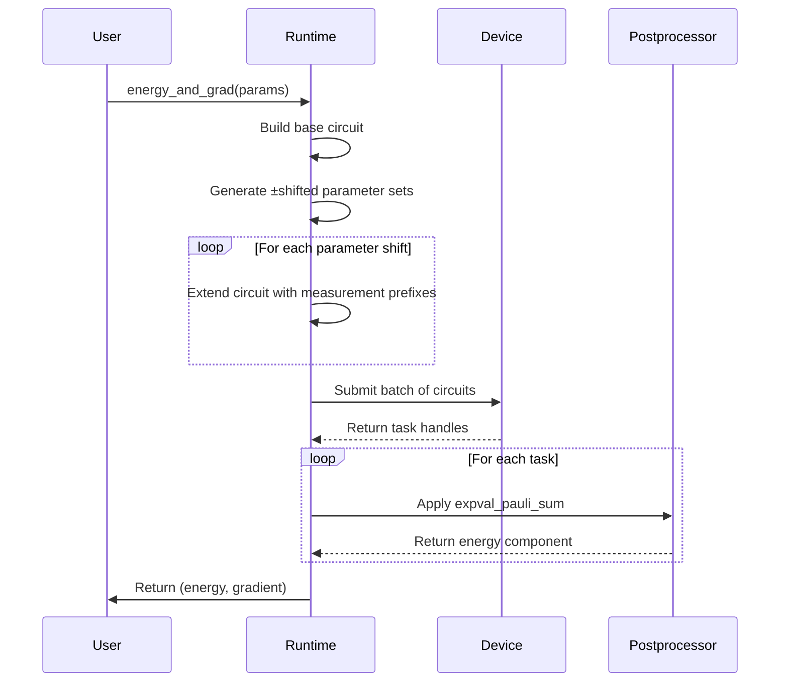
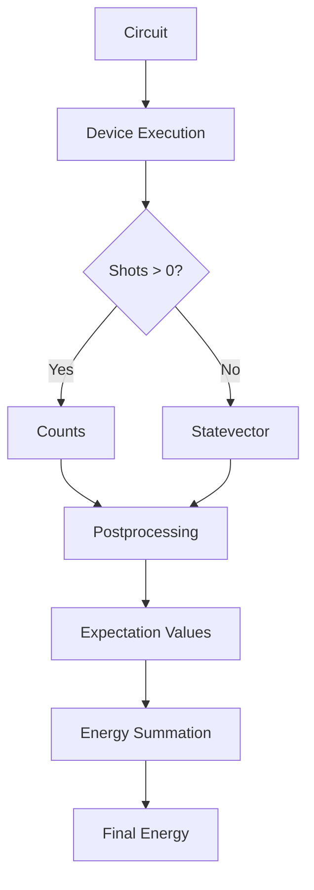

# Device Runtimes

<cite>
**Referenced Files in This Document**   
- [ucc_device_runtime.py](file://src/tyxonq/applications/chem/runtimes/ucc_device_runtime.py)
- [hea_device_runtime.py](file://src/tyxonq/applications/chem/runtimes/hea_device_runtime.py)
- [hamiltonian_grouping.py](file://src/tyxonq/libs/hamiltonian_encoding/hamiltonian_grouping.py)
- [base.py](file://src/tyxonq/devices/base.py)
- [postprocessing.py](file://src/tyxonq/postprocessing/__init__.py)
</cite>

## Table of Contents
1. [Introduction](#introduction)
2. [Core Device Runtime Classes](#core-device-runtime-classes)
3. [Energy and Gradient Computation](#energy-and-gradient-computation)
4. [Hamiltonian Grouping and Measurement Optimization](#hamiltonian-grouping-and-measurement-optimization)
5. [Integration with Device Abstraction and Postprocessing](#integration-with-device-abstraction-and-postprocessing)
6. [Configuration and Practical Usage](#configuration-and-practical-usage)
7. [Performance Trade-offs and Use Cases](#performance-trade-offs-and-use-cases)
8. [Conclusion](#conclusion)

## Introduction
The device runtimes in TyxonQ provide a shot-based execution framework for quantum chemistry algorithms, enabling evaluation on both real quantum hardware and simulators. These runtimes are designed to support variational algorithms such as UCC (Unitary Coupled Cluster) and HEA (Hardware-Efficient Ansatz) by implementing efficient energy and gradient computations through parameter-shift methods. By leveraging Hamiltonian grouping and measurement prefix caching, these runtimes minimize redundant operations and optimize measurement efficiency. This document details the implementation and usage of `UCCDeviceRuntime` and `HEADeviceRuntime`, their integration with the core device abstraction layer, and practical considerations for deployment across different providers and hardware configurations.

## Core Device Runtime Classes

The `UCCDeviceRuntime` and `HEADeviceRuntime` classes serve as specialized execution engines for quantum chemistry workflows, enabling parameterized ansatz circuits to be executed on quantum devices or simulators using shot-based sampling.

### UCCDeviceRuntime
This class implements a device runtime for UCC-based energy and gradient calculations. It supports Hartree-Fock initial states and configurable excitation operators with associated parameter IDs. The runtime constructs parameterized UCC circuits using the `build_ucc_circuit` utility and computes gradients via the parameter-shift rule with a shift value of π/2. Key attributes include:
- `n_qubits`: Number of qubits in the system
- `n_elec_s`: Tuple specifying the number of alpha and beta electrons
- `h_qubit_op`: The qubit Hamiltonian operator
- `ex_ops`: List of excitation operators
- `param_ids`: Optional mapping of parameters to excitation operators

The runtime precomputes Hamiltonian term groupings and caches measurement prefixes at initialization, ensuring reuse across multiple energy and gradient evaluations.

### HEADeviceRuntime
This class provides a device runtime for HEA-based variational algorithms. It supports both default RY-only ansatz circuits and custom circuit templates via the `circuit_template` parameter. The number of parameters is determined by the number of qubits and layers: `(layers + 1) * n`. The runtime allows optional consumption of precomputed `QubitOperator` instances for faster execution paths when shots are zero.

Both runtimes implement consistent interfaces for `energy` and `energy_and_grad` methods, abstracting away the underlying device execution details while maintaining compatibility with the broader framework.

**Section sources**
- [ucc_device_runtime.py](file://src/tyxonq/applications/chem/runtimes/ucc_device_runtime.py#L25-L302)
- [hea_device_runtime.py](file://src/tyxonq/applications/chem/runtimes/hea_device_runtime.py#L22-L190)

## Energy and Gradient Computation

### Energy Method
The `energy` method computes the expectation value of the Hamiltonian for a given set of parameters. It constructs the appropriate ansatz circuit (UCC or HEA), applies measurement basis transformations based on grouped Pauli terms, and executes the circuits on the specified device. The total energy is computed as the sum of contributions from each grouped measurement basis, plus an identity constant derived during Hamiltonian grouping.

For zero-shot simulations (exact statevector evaluation), an optimized analytic path can be used, bypassing measurement grouping and directly computing the full Hamiltonian expectation.

### Energy and Gradient Method
The `energy_and_grad` method implements parameter-shift gradient computation through batched circuit execution. For each parameter, it evaluates the energy at shifted values (±π/2 for finite difference, ±π/90 for small-step methods) and computes gradients using central differences. All required circuits—base, plus-shifted, and minus-shifted—are submitted in a single batch to minimize device communication overhead.

The method returns a tuple containing the energy value and the gradient vector. When no parameters are present (e.g., HF state only), it returns zero gradient.



**Diagram sources**
- [ucc_device_runtime.py](file://src/tyxonq/applications/chem/runtimes/ucc_device_runtime.py#L25-L302)
- [hea_device_runtime.py](file://src/tyxonq/applications/chem/runtimes/hea_device_runtime.py#L22-L190)

**Section sources**
- [ucc_device_runtime.py](file://src/tyxonq/applications/chem/runtimes/ucc_device_runtime.py#L151-L187)
- [hea_device_runtime.py](file://src/tyxonq/applications/chem/runtimes/hea_device_runtime.py#L100-L150)

## Hamiltonian Grouping and Measurement Optimization

### Hamiltonian Grouping
Both runtimes utilize Hamiltonian grouping to reduce the number of required measurements. The `group_qubit_operator_terms` and `group_hamiltonian_pauli_terms` functions partition the Hamiltonian into commuting groups that can be measured simultaneously. Each group corresponds to a unique measurement basis (e.g., XYYZ), and all terms within a group share the same basis transformation.

The grouping process extracts the identity component of the Hamiltonian and maps non-identity terms to their respective measurement bases. This reduces the total number of circuit executions needed for energy estimation.

### Measurement Prefix Caching
To optimize performance, both runtimes implement measurement prefix caching via the `_prefix_cache` dictionary. For each unique measurement basis, the required pre-measurement operations (Hadamard for X, S†H for Y) are computed once and reused across evaluations. The `_prefix_ops_for_bases` method generates the sequence of operations needed to rotate into the measurement basis, followed by Z-basis measurements on all qubits.

This caching mechanism significantly reduces computational overhead during repeated energy and gradient evaluations, especially in optimization loops where parameters change incrementally.

```mermaid
flowchart TD
A[Hamiltonian] --> B{Group Terms}
B --> C[Identity Constant]
B --> D[Measurement Groups]
D --> E[Basis: XXX]
D --> F[Basis: XYY]
D --> G[Basis: ZZZ]
E --> H[Prefix: H,H,H]
F --> I[Prefix: H,S†H,S†H]
G --> J[Prefix: (none)]
H --> K[Measure Z]
I --> K
J --> K
K --> L[Counts → Expectation]
```

**Diagram sources**
- [hamiltonian_grouping.py](file://src/tyxonq/libs/hamiltonian_encoding/hamiltonian_grouping.py#L11-L65)
- [ucc_device_runtime.py](file://src/tyxonq/applications/chem/runtimes/ucc_device_runtime.py#L50-L70)

**Section sources**
- [hamiltonian_grouping.py](file://src/tyxonq/libs/hamiltonian_encoding/hamiltonian_grouping.py#L11-L65)

## Integration with Device Abstraction and Postprocessing

### Device Abstraction Layer
The device runtimes integrate with TyxonQ's unified device abstraction layer through the `device_base.run` interface. This layer provides a consistent API for executing circuits across simulators and hardware backends. The `Device` protocol defines standard methods like `run` and `expval`, ensuring compatibility across different execution environments.

The `device_base.run` function handles provider and device resolution, noise injection, and result normalization, returning `DeviceTask` objects that encapsulate asynchronous execution details.

### Postprocessing Pipeline
After circuit execution, raw results (counts, statevectors, etc.) are processed through the `apply_postprocessing` function. This function supports multiple postprocessing methods, including:
- `expval_pauli_sum`: Computes expectation values from counts using grouped Pauli terms
- `readout_mitigation`: Applies readout error correction when calibration data is available

The postprocessing step aggregates results from all measurement groups, applies the identity constant offset, and returns the final energy value.



**Diagram sources**
- [base.py](file://src/tyxonq/devices/base.py#L224-L243)
- [postprocessing.py](file://src/tyxonq/postprocessing/__init__.py#L15-L132)

**Section sources**
- [base.py](file://src/tyxonq/devices/base.py#L224-L243)
- [postprocessing.py](file://src/tyxonq/postprocessing/__init__.py#L15-L132)

## Configuration and Practical Usage

### Provider and Device Configuration
The runtimes support multiple providers and devices:
- **Simulators**: `"simulator"` with device types `"statevector"`, `"density_matrix"`, or `"matrix_product_state"`
- **Hardware**: `"ibm"`, `"tyxonq"` with specific device identifiers

Configuration is passed via keyword arguments:
```python
runtime.energy(
    params,
    shots=1024,
    provider="simulator",
    device="statevector",
    noise={"type": "depolarizing", "p": 0.001}
)
```

### Noise Models
Noise can be injected during execution using the `noise` parameter. Supported models include depolarizing, amplitude damping, and custom channel definitions. Noise is automatically enabled for simulators when specified.

### Practical Examples
```python
# UCCSD on simulator
ucc_runtime = UCCDeviceRuntime(n_qubits=4, n_elec_s=(2,2), h_qubit_op=h_op)
energy = ucc_runtime.energy(params, shots=2048, provider="simulator", device="statevector")

# HEA on hardware
hea_runtime = HEADeviceRuntime(n=6, layers=3, hamiltonian=hamil, circuit_template=template)
energy, grad = hea_runtime.energy_and_grad(params, provider="ibm", device="ibmq_jakarta", shots=8192)
```

**Section sources**
- [ucc_device_runtime.py](file://src/tyxonq/applications/chem/runtimes/ucc_device_runtime.py#L25-L302)
- [hea_device_runtime.py](file://src/tyxonq/applications/chem/runtimes/hea_device_runtime.py#L22-L190)

## Performance Trade-offs and Use Cases

### Accuracy vs. Resource Usage
- **High shots (e.g., 8192+)**: Higher accuracy but longer execution times and higher costs on hardware
- **Low shots (e.g., 1024)**: Faster iterations but noisier gradients, suitable for early optimization stages
- **Zero shots**: Exact results via statevector simulation; limited to small systems due to memory constraints

### Use Cases
- **Device Runtimes Preferred**:
  - Hardware execution for real-device validation
  - Noise-aware algorithm development
  - Shot-noise studies and error mitigation research
  - Large-scale simulations using MPS or density matrix backends

- **Numeric Runtimes Preferred**:
  - Algorithm prototyping and debugging
  - Exact gradient verification
  - Small molecule benchmarks without sampling noise

The device runtimes are essential for bridging the gap between theoretical quantum algorithms and practical execution on near-term quantum devices, providing a robust framework for variational quantum chemistry applications.

**Section sources**
- [ucc_device_runtime.py](file://src/tyxonq/applications/chem/runtimes/ucc_device_runtime.py#L25-L302)
- [hea_device_runtime.py](file://src/tyxonq/applications/chem/runtimes/hea_device_runtime.py#L22-L190)

## Conclusion
The `UCCDeviceRuntime` and `HEADeviceRuntime` classes provide a powerful and efficient framework for executing quantum chemistry algorithms on real devices and simulators. Through advanced techniques like Hamiltonian grouping, measurement prefix caching, and batched parameter-shift gradient computation, these runtimes optimize both accuracy and resource utilization. Their seamless integration with TyxonQ's device abstraction and postprocessing layers enables flexible deployment across diverse quantum computing platforms, making them indispensable tools for practical quantum chemistry research and development.