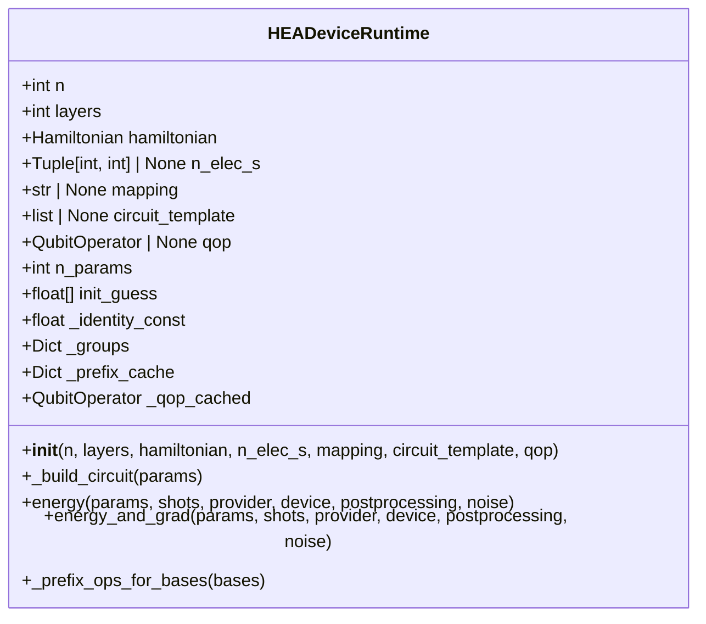
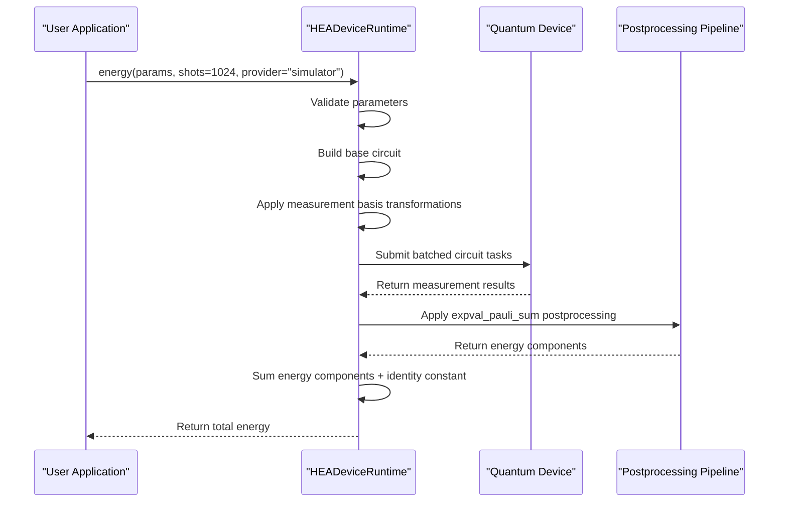
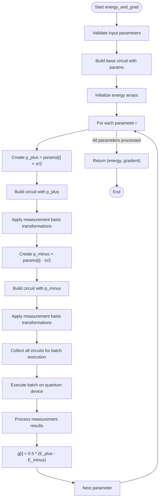
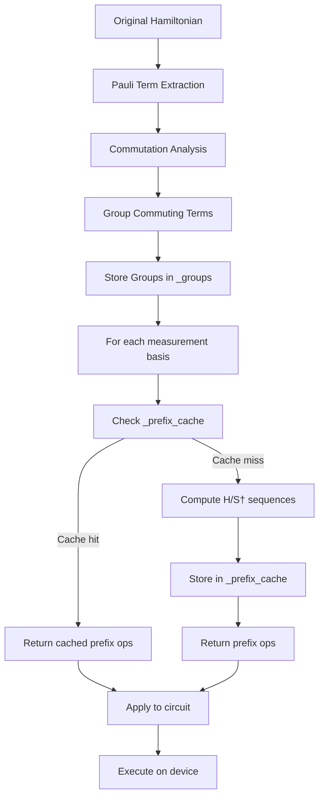
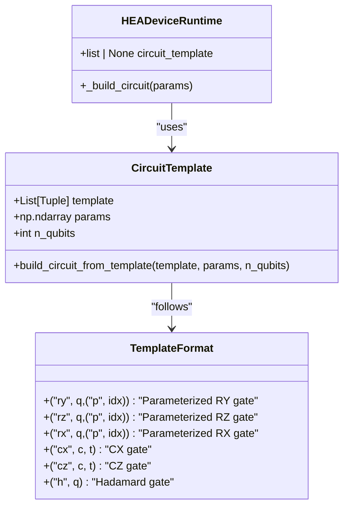
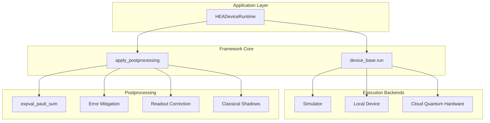
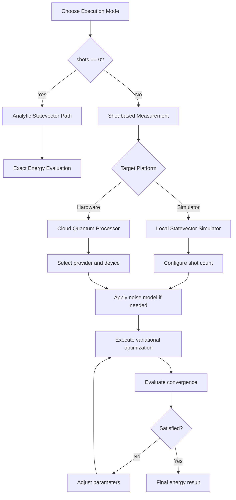

# HEA Device Runtime

<cite>
**Referenced Files in This Document**   
- [hea_device_runtime.py](file://src/tyxonq/applications/chem/runtimes/hea_device_runtime.py)
- [hea.py](file://src/tyxonq/applications/chem/algorithms/hea.py)
- [hamiltonian_grouping.py](file://src/tyxonq/compiler/utils/hamiltonian_grouping.py)
- [qiskit_real_amplitudes.py](file://src/tyxonq/libs/circuits_library/qiskit_real_amplitudes.py)
</cite>

## Table of Contents
1. [Introduction](#introduction)
2. [Initialization Parameters](#initialization-parameters)
3. [Energy Evaluation](#energy-evaluation)
4. [Gradient Computation](#gradient-computation)
5. [Hamiltonian Grouping and Measurement Optimization](#hamiltonian-grouping-and-measurement-optimization)
6. [Circuit Template Support](#circuit-template-support)
7. [Device Integration and Postprocessing](#device-integration-and-postprocessing)
8. [Practical Usage Examples](#practical-usage-examples)
9. [Performance Trade-offs and Use Cases](#performance-trade-offs-and-use-cases)
10. [Conclusion](#conclusion)

## Introduction

The HEADeviceRuntime class provides a specialized execution environment for Hardware-Efficient Ansatz (HEA) algorithms on quantum devices using shot-based evaluation. This runtime is designed to bridge the gap between theoretical quantum algorithms and practical quantum hardware execution by implementing efficient measurement strategies, optimized circuit compilation, and robust error mitigation techniques. The system enables variational quantum algorithms to run effectively on both quantum simulators and actual quantum hardware, supporting the full lifecycle from circuit construction to energy evaluation and gradient computation.

**Section sources**
- [hea_device_runtime.py](file://src/tyxonq/applications/chem/runtimes/hea_device_runtime.py#L22-L190)

## Initialization Parameters

The HEADeviceRuntime class is configured through several key initialization parameters that define the structure and behavior of the quantum circuit. The primary parameters include n (qubit count), layers (ansatz depth), and hamiltonian (problem Hamiltonian to be evaluated). These parameters establish the fundamental characteristics of the quantum system being simulated.

Additional configuration options include n_elec_s (electron configuration for chemistry problems), mapping (fermion-to-qubit mapping strategy such as parity or Jordan-Wigner), and circuit_template (custom circuit structure). The circuit_template parameter enables users to specify non-standard ansatz structures beyond the default RY-only configuration. An optional qop parameter allows for pre-computed QubitOperator caching, which can significantly accelerate computation when reusing Hamiltonian mappings across multiple evaluations.

The initialization process automatically calculates the number of parameters required for the ansatz, which follows the formula (layers + 1) * n for the default RY-only ansatz. It also generates a deterministic initial parameter guess using a fixed random seed to ensure reproducible results across different runs.

**Diagram sources**
- [hea_device_runtime.py](file://src/tyxonq/applications/chem/runtimes/hea_device_runtime.py#L22-L190)

**Section sources**
- [hea_device_runtime.py](file://src/tyxonq/applications/chem/runtimes/hea_device_runtime.py#L22-L45)

## Energy Evaluation

The energy method implements shot-based expectation value estimation for the given Hamiltonian. It accepts parameters for the ansatz circuit and various execution options including shots (number of measurements), provider (execution backend), device (specific device type), and postprocessing configuration. The method first validates the parameter vector length against the expected number of parameters, with special handling for custom circuit templates that may have different parameter requirements.

For shot-based evaluation, the method leverages pre-computed Hamiltonian grouping to minimize the number of required circuit executions. It constructs a base circuit from the provided parameters and then extends this circuit with measurement basis transformations for each group of commuting Pauli terms. This approach significantly reduces the total number of circuit executions needed compared to measuring each Pauli term individually.

The energy calculation incorporates an identity constant term that is separated from the main Hamiltonian during initialization. This constant represents the energy contribution from identity terms in the Hamiltonian and is added to the measured expectation values from the non-identity terms. The final energy value is computed by aggregating results from all measurement groups and applying the appropriate postprocessing pipeline.

**Diagram sources**
- [hea_device_runtime.py](file://src/tyxonq/applications/chem/runtimes/hea_device_runtime.py#L47-L97)

**Section sources**
- [hea_device_runtime.py](file://src/tyxonq/applications/chem/runtimes/hea_device_runtime.py#L47-L97)

## Gradient Computation

The energy_and_grad method implements parameter-shift gradient computation through batched circuit execution, enabling efficient gradient-based optimization of variational quantum algorithms. This method calculates gradients using the parameter-shift rule with a shift value of π/2, which provides exact gradients for circuits with RY rotations.

The implementation batches the evaluation of the base energy and all parameter-shifted variants into a single submission to minimize communication overhead with the quantum device. For each parameter, it constructs two shifted parameter vectors (plus and minus the shift value) and includes the corresponding circuits in the batch. This approach reduces the total number of device interactions from 2n+1 (for n parameters) to just one, significantly improving execution efficiency.

The gradient computation reuses the same Hamiltonian grouping and measurement optimization strategies as the energy method, ensuring consistent and efficient measurement across all circuit variants. After executing the batch of circuits, the method aggregates results by their associated tags (base, plus, minus) and computes the final gradient as the difference between plus and minus energy evaluations divided by two. This approach provides numerically stable gradient estimates while maintaining compatibility with shot-based measurement noise.

**Diagram sources**
- [hea_device_runtime.py](file://src/tyxonq/applications/chem/runtimes/hea_device_runtime.py#L99-L168)

**Section sources**
- [hea_device_runtime.py](file://src/tyxonq/applications/chem/runtimes/hea_device_runtime.py#L99-L168)

## Hamiltonian Grouping and Measurement Optimization

The HEA device runtime implements sophisticated Hamiltonian grouping and measurement prefix caching to optimize measurement efficiency. During initialization, the Hamiltonian is pre-processed using the group_hamiltonian_pauli_terms function from the compiler.utils.hamiltonian_grouping module. This function groups Pauli terms that can be measured simultaneously by identifying sets of commuting operators, significantly reducing the total number of required circuit executions.

The measurement optimization system includes a prefix cache that stores compiled measurement basis transformations for each unique measurement basis configuration. When the same measurement basis is required across multiple parameter evaluations (common in optimization loops), the system can reuse the pre-compiled transformation sequence instead of recomputing it. The _prefix_ops_for_bases method handles this caching mechanism, generating the appropriate sequence of H and S† gates to transform from the Z-basis to the required measurement basis (X requires H, Y requires S†H).

This optimization is particularly valuable in variational algorithms where the same Hamiltonian is evaluated thousands of times with different parameter values. By reusing both the grouping structure and measurement prefixes, the runtime minimizes computational overhead and reduces total execution time. The grouping strategy also enables more accurate energy estimates by ensuring that all terms in a commuting group are measured under identical experimental conditions, reducing systematic errors.

**Diagram sources**
- [hea_device_runtime.py](file://src/tyxonq/applications/chem/runtimes/hea_device_runtime.py#L40-L45)
- [hamiltonian_grouping.py](file://src/tyxonq/compiler/utils/hamiltonian_grouping.py#L15-L21)

**Section sources**
- [hea_device_runtime.py](file://src/tyxonq/applications/chem/runtimes/hea_device_runtime.py#L40-L45)
- [hamiltonian_grouping.py](file://src/tyxonq/compiler/utils/hamiltonian_grouping.py#L15-L21)

## Circuit Template Support

The HEADeviceRuntime class supports both the default RY-only ansatz and custom circuit templates through the build_circuit_from_template function. When a circuit_template is provided during initialization, the runtime uses this template to construct the quantum circuit instead of the default hardware-efficient structure. This flexibility enables integration with circuits designed in other quantum computing frameworks, particularly Qiskit.

The build_circuit_from_template function, located in the qiskit_real_amplitudes module, converts a parameterized template into an executable circuit by substituting parameter placeholders with actual parameter values. The template format uses a simple tuple-based representation where parameterized rotations are indicated by a placeholder tuple ("p", index) that references the corresponding parameter in the input vector. This approach allows for complex circuit structures with non-uniform parameter distributions and custom entanglement patterns.

The template system supports various quantum gates including single-qubit rotations (RY, RZ, RX), two-qubit entangling gates (CX, CZ), and Hadamard gates. Barrier and measurement instructions are ignored during conversion, allowing templates to include visualization or compilation hints without affecting the executed circuit. This template mechanism enables researchers to experiment with advanced ansatz structures while maintaining compatibility with the HEA optimization framework.

**Diagram sources**
- [hea_device_runtime.py](file://src/tyxonq/applications/chem/runtimes/hea_device_runtime.py#L50-L55)
- [qiskit_real_amplitudes.py](file://src/tyxonq/libs/circuits_library/qiskit_real_amplitudes.py#L76-L91)

**Section sources**
- [hea_device_runtime.py](file://src/tyxonq/applications/chem/runtimes/hea_device_runtime.py#L50-L55)
- [qiskit_real_amplitudes.py](file://src/tyxonq/libs/circuits_library/qiskit_real_amplitudes.py#L76-L91)

## Device Integration and Postprocessing

The HEA device runtime integrates with the core framework's device abstraction layer through the device_base.run interface, enabling seamless execution across different quantum computing platforms. This abstraction supports various providers including simulators, local execution engines, and cloud-based quantum hardware. The runtime can target different device types such as statevector simulators, density matrix simulators, and actual quantum processing units, allowing users to switch between exact simulation and noisy hardware execution with minimal code changes.

Postprocessing is handled through the apply_postprocessing function, which applies a configurable pipeline to the raw measurement results. The primary postprocessing method for energy evaluation is expval_pauli_sum, which computes expectation values from measurement counts while accounting for the specific Pauli terms in each measurement group. Additional postprocessing options can include error mitigation techniques, readout error correction, and classical shadow methods.

The integration architecture follows a modular design where the runtime delegates low-level execution details to the device layer while maintaining control over the high-level algorithmic structure. This separation of concerns allows the HEA runtime to focus on variational algorithm optimization while leveraging the framework's comprehensive device support and error mitigation capabilities. The system also supports noise models through the noise parameter, enabling realistic simulation of quantum hardware imperfections during algorithm development.

**Diagram sources**
- [hea_device_runtime.py](file://src/tyxonq/applications/chem/runtimes/hea_device_runtime.py#L78-L88)
- [hea_device_runtime.py](file://src/tyxonq/applications/chem/runtimes/hea_device_runtime.py#L90-L95)

**Section sources**
- [hea_device_runtime.py](file://src/tyxonq/applications/chem/runtimes/hea_device_runtime.py#L78-L95)

## Practical Usage Examples

The HEA device runtime can be configured for various quantum computing scenarios with different providers, device types, shot settings, and noise models. For high-precision simulation, users can set shots=0 to access the analytic statevector path, which computes exact expectation values without sampling noise. This mode is ideal for algorithm development and verification before transitioning to shot-based execution.

When targeting actual quantum hardware, users can specify provider="ibm" or provider="rigetti" to connect to cloud-based quantum processors, with device parameters selecting specific quantum processing units. Shot settings should be chosen based on the required precision and available quantum computing time, with typical values ranging from 1024 to 8192 shots for variational algorithms.

For noise-aware simulation, the noise parameter accepts configuration dictionaries that specify error rates for different quantum operations, enabling realistic performance prediction. This capability is particularly valuable for assessing algorithm robustness and optimizing error mitigation strategies. The runtime also supports hybrid workflows where initial optimization occurs on a noiseless simulator, followed by fine-tuning on a noisy simulator or actual hardware.

**Diagram sources**
- [hea.py](file://src/tyxonq/applications/chem/algorithms/hea.py#L147-L166)
- [hea.py](file://src/tyxonq/applications/chem/algorithms/hea.py#L165-L186)

**Section sources**
- [hea.py](file://src/tyxonq/applications/chem/algorithms/hea.py#L147-L186)

## Performance Trade-offs and Use Cases

The HEA device runtime presents important performance trade-offs between expressibility and trainability in variational quantum algorithms. The hardware-efficient ansatz structure provides high expressibility with relatively few parameters, making it suitable for near-term quantum devices with limited coherence times and gate fidelities. However, this expressibility can lead to trainability challenges such as barren plateaus, where gradients vanish exponentially with system size.

The runtime is particularly well-suited for quantum chemistry applications, materials science simulations, and other problems where the problem Hamiltonian has a known structure that can be efficiently grouped for measurement. It excels in scenarios requiring rapid prototyping and experimentation with different ansatz structures, thanks to its support for custom circuit templates and integration with multiple quantum computing platforms.

Compared to purely numeric simulation approaches, the HEA device runtime offers more realistic performance characteristics by incorporating shot noise and device-specific constraints. This makes it preferred for algorithm validation, error mitigation research, and preparing quantum algorithms for deployment on actual hardware. The runtime's measurement optimization techniques provide significant advantages over naive implementations, reducing total execution time by minimizing redundant circuit compilations and measurements.

**Section sources**
- [hea_device_runtime.py](file://src/tyxonq/applications/chem/runtimes/hea_device_runtime.py#L22-L190)
- [hea.py](file://src/tyxonq/applications/chem/algorithms/hea.py#L0-L37)

## Conclusion

The HEADeviceRuntime class provides a comprehensive solution for executing Hardware-Efficient Ansatz algorithms on quantum devices with shot-based evaluation. Through its sophisticated initialization parameters, optimized energy and gradient computation methods, and advanced measurement strategies, it enables efficient and accurate variational quantum algorithms. The runtime's support for custom circuit templates and seamless integration with the broader quantum computing framework makes it a versatile tool for both research and practical applications in quantum computing.