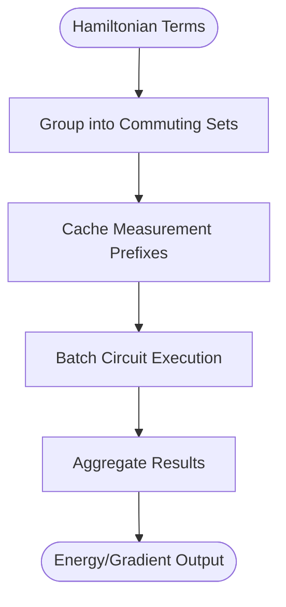
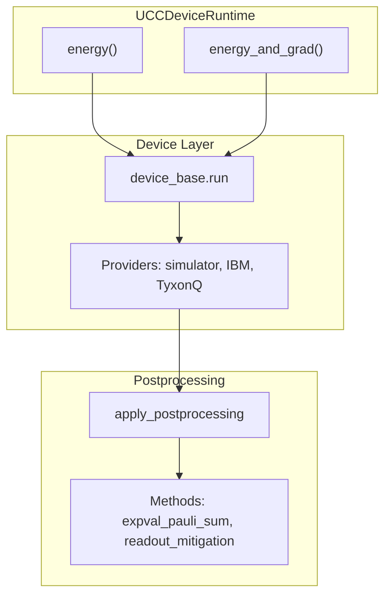

# UCC Device Runtime

<cite>
**Referenced Files in This Document**   
- [ucc_device_runtime.py](file://src/tyxonq/applications/chem/runtimes/ucc_device_runtime.py)
- [hamiltonian_grouping.py](file://src/tyxonq/compiler/utils/hamiltonian_grouping.py)
- [ucc.py](file://src/tyxonq/libs/circuits_library/ucc.py)
- [base.py](file://src/tyxonq/devices/base.py)
- [postprocessing.py](file://src/tyxonq/postprocessing/__init__.py)
- [circuit.py](file://src/tyxonq/core/ir/circuit.py)
</cite>

## Table of Contents
1. [Introduction](#introduction)
2. [Initialization Parameters](#initialization-parameters)
3. [Energy and Gradient Computation](#energy-and-gradient-computation)
4. [Hamiltonian Grouping and Measurement Optimization](#hamiltonian-grouping-and-measurement-optimization)
5. [Device Integration and Postprocessing](#device-integration-and-postprocessing)
6. [Practical Usage Examples](#practical-usage-examples)
7. [Performance Trade-offs and Use Cases](#performance-trade-offs-and-use-cases)
8. [Conclusion](#conclusion)

## Introduction
The UCCDeviceRuntime class provides a specialized execution environment for Unitary Coupled Cluster (UCC) algorithms on quantum devices using shot-based evaluation. It enables variational quantum eigensolver (VQE) workflows by supporting parameterized ansatz circuits constructed from excitation operators, with efficient energy and gradient computation through batched circuit execution. The runtime integrates with the core framework's device abstraction layer and implements optimization techniques such as Hamiltonian grouping and measurement prefix caching to minimize resource usage during variational optimization.

**Section sources**
- [ucc_device_runtime.py](file://src/tyxonq/applications/chem/runtimes/ucc_device_runtime.py#L1-L50)

## Initialization Parameters
The UCCDeviceRuntime class is initialized with several key parameters that configure the ansatz structure and excitation operators:

- **n_qubits**: Specifies the number of qubits in the system, determining the Hilbert space dimension.
- **n_elec_s**: A tuple indicating the number of alpha and beta electrons, used to construct the Hartree-Fock initial state.
- **h_qubit_op**: The qubit Hamiltonian operator represented as a QubitOperator, which defines the energy expectation value to be minimized.
- **ex_ops**: A list of excitation operators defined as tuples of qubit indices, specifying the allowed excitations in the UCC ansatz.
- **param_ids**: Optional list mapping excitation operators to parameter indices, enabling parameter sharing across multiple excitations.
- **mode**: Specifies the encoding scheme ("fermion", "qubit", or "hcb") for constructing the ansatz circuit.
- **decompose_multicontrol**: Boolean flag indicating whether multi-controlled gates should be decomposed into native gates.
- **trotter**: Boolean flag enabling Trotterized evolution of excitation operators.

These parameters collectively define the variational ansatz structure and determine how the parameterized circuit is constructed from the excitation operators.

**Section sources**
- [ucc_device_runtime.py](file://src/tyxonq/applications/chem/runtimes/ucc_device_runtime.py#L35-L80)

## Energy and Gradient Computation
The UCCDeviceRuntime implements two primary methods for energy and gradient evaluation: `energy` and `energy_and_grad`. These methods leverage parameter-shift gradient computation through batched circuit execution to efficiently estimate gradients on quantum devices.

The `energy` method computes the expectation value of the Hamiltonian for a given set of parameters by executing the parameterized ansatz circuit and measuring in the appropriate bases. It supports both zero-shot (statevector) and finite-shot (counts-based) evaluation modes, with results processed through the postprocessing pipeline.

The `energy_and_grad` method extends this capability by computing parameter-shift gradients using finite differences. For each parameter, it constructs shifted parameter vectors (±π/2 for finite-difference method) and evaluates the energy at these shifted points. The gradient is then computed as the difference between forward and backward evaluations. This method batches all circuit executions (base, plus, and minus shifts) into a single device submission to minimize communication overhead and improve efficiency.

Both methods utilize the `_energy_core` internal function, which handles the core execution logic including circuit construction, measurement basis transformation, and result aggregation.

**Section sources**
- [ucc_device_runtime.py](file://src/tyxonq/applications/chem/runtimes/ucc_device_runtime.py#L150-L300)

## Hamiltonian Grouping and Measurement Optimization
The UCCDeviceRuntime implements Hamiltonian grouping and measurement prefix caching to optimize measurement efficiency during variational optimization. These techniques reduce the number of required circuit executions by reusing compiled measurement bases across parameter evaluations.

During initialization, the Hamiltonian terms are grouped into commuting sets using the `group_qubit_operator_terms` function from the hamiltonian_grouping module. This grouping allows simultaneous measurement of all terms within a commuting group, significantly reducing the total number of measurement circuits needed. The grouping is performed once per runtime instance and reused across all energy and gradient evaluations.

Measurement prefix caching further optimizes performance by storing the quantum operations required to transform the computational basis into each measurement basis. The `_prefix_ops_for_bases` method computes and caches these transformation sequences, which include Hadamard gates for X-basis measurements and RZ-Hadamard sequences for Y-basis measurements. When evaluating energy or gradients, these cached prefixes are applied to the ansatz circuit before measurement, eliminating redundant computation of basis transformation sequences.

This optimization is particularly beneficial in variational workflows where the same measurement bases are used repeatedly across different parameter values during optimization.



**Diagram sources**
- [ucc_device_runtime.py](file://src/tyxonq/applications/chem/runtimes/ucc_device_runtime.py#L85-L100)
- [hamiltonian_grouping.py](file://src/tyxonq/compiler/utils/hamiltonian_grouping.py#L10-L20)

**Section sources**
- [ucc_device_runtime.py](file://src/tyxonq/applications/chem/runtimes/ucc_device_runtime.py#L80-L150)

## Device Integration and Postprocessing
The UCCDeviceRuntime integrates with the core framework's device abstraction layer through the `device_base.run` function, enabling execution on various quantum devices and simulators. This integration supports multiple providers (simulator, IBM, TyxonQ hardware) and device types (statevector, density matrix, matrix product state).

The runtime delegates circuit execution to the device layer, which handles provider-specific compilation and execution details. For hardware providers, circuits are automatically compiled to native gate sets, while simulator execution preserves the original circuit structure. The `run` method accepts various device-specific options such as shot count, noise models, and provider configuration.

Postprocessing is handled through the `apply_postprocessing` function, which processes raw measurement results into meaningful physical quantities. The postprocessing pipeline supports various methods including expectation value computation from Pauli measurements, readout error mitigation, and classical shadow tomography. The `expval_pauli_sum` method aggregates results from grouped Hamiltonian terms, adding the identity constant contribution to produce the final energy estimate.

This integration enables seamless switching between different execution backends while maintaining consistent interface semantics for energy and gradient computation.



**Diagram sources**
- [ucc_device_runtime.py](file://src/tyxonq/applications/chem/runtimes/ucc_device_runtime.py#L150-L300)
- [base.py](file://src/tyxonq/devices/base.py#L100-L200)
- [postprocessing.py](file://src/tyxonq/postprocessing/__init__.py#L10-L50)

**Section sources**
- [ucc_device_runtime.py](file://src/tyxonq/applications/chem/runtimes/ucc_device_runtime.py#L150-L300)
- [base.py](file://src/tyxonq/devices/base.py#L100-L300)
- [postprocessing.py](file://src/tyxonq/postprocessing/__init__.py#L10-L100)

## Practical Usage Examples
The UCCDeviceRuntime can be configured for various execution scenarios, including simulation and hardware execution with different providers and device types.

For simulator execution, the runtime can be configured with the statevector simulator for exact results or with finite shots to simulate realistic measurement noise:
```python
runtime = UCCDeviceRuntime(n_qubits=4, n_elec_s=(2,2), h_qubit_op=hamiltonian)
energy = runtime.energy(params, provider="simulator", device="statevector")
```

For hardware execution, the runtime can be configured with specific providers and device specifications:
```python
runtime = UCCDeviceRuntime(n_qubits=4, n_elec_s=(2,2), h_qubit_op=hamiltonian)
energy = runtime.energy(params, provider="ibm", device="ibmq_qasm_simulator", shots=8192)
```

Noise models can be incorporated by passing noise configuration dictionaries:
```python
noise_config = {"type": "depolarizing", "p": 0.01}
energy = runtime.energy(params, noise=noise_config, shots=4096)
```

The runtime also supports advanced configurations such as parameter sharing through the `param_ids` parameter and Trotterized evolution for complex excitation operators.

**Section sources**
- [ucc_device_runtime.py](file://src/tyxonq/applications/chem/runtimes/ucc_device_runtime.py#L150-L300)

## Performance Trade-offs and Use Cases
The UCCDeviceRuntime presents several performance trade-offs between accuracy and resource usage in variational quantum eigensolver workflows. The choice between shot-based evaluation and exact simulation involves a fundamental trade-off between computational cost and result precision.

Shot-based evaluation on quantum devices or simulators with finite shots introduces statistical uncertainty in energy and gradient estimates, requiring more circuit executions to achieve convergence. However, this approach better simulates realistic hardware conditions and enables direct execution on quantum processors. In contrast, zero-shot statevector simulation provides exact results but may not accurately reflect the behavior of noisy quantum hardware.

The UCCDeviceRuntime is preferred over numeric simulation in several scenarios:
- When validating algorithms on actual quantum hardware
- When studying the impact of measurement noise and finite statistics
- When integrating with hardware-specific calibration and error mitigation techniques
- When developing algorithms for near-term quantum devices

For large-scale simulations where hardware execution is impractical, the runtime's support for matrix product state and density matrix simulators provides a middle ground between exact simulation and hardware execution.

The measurement optimization techniques implemented in the runtime (Hamiltonian grouping and prefix caching) significantly reduce the overhead of variational optimization, making it particularly suitable for workflows with many parameters and repeated energy evaluations.

**Section sources**
- [ucc_device_runtime.py](file://src/tyxonq/applications/chem/runtimes/ucc_device_runtime.py#L1-L300)

## Conclusion
The UCCDeviceRuntime class provides a comprehensive framework for executing Unitary Coupled Cluster algorithms on quantum devices using shot-based evaluation. By implementing efficient parameter-shift gradient computation, Hamiltonian grouping, and measurement prefix caching, it optimizes the variational quantum eigensolver workflow for both simulation and hardware execution. The runtime's integration with the core framework's device abstraction layer and postprocessing pipeline enables flexible configuration across different providers, device types, and noise models. This makes it a valuable tool for developing and testing quantum chemistry algorithms in realistic execution environments.