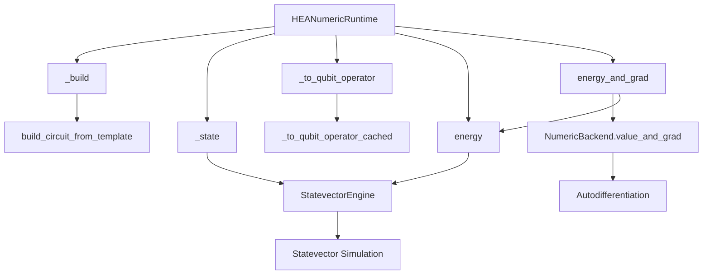
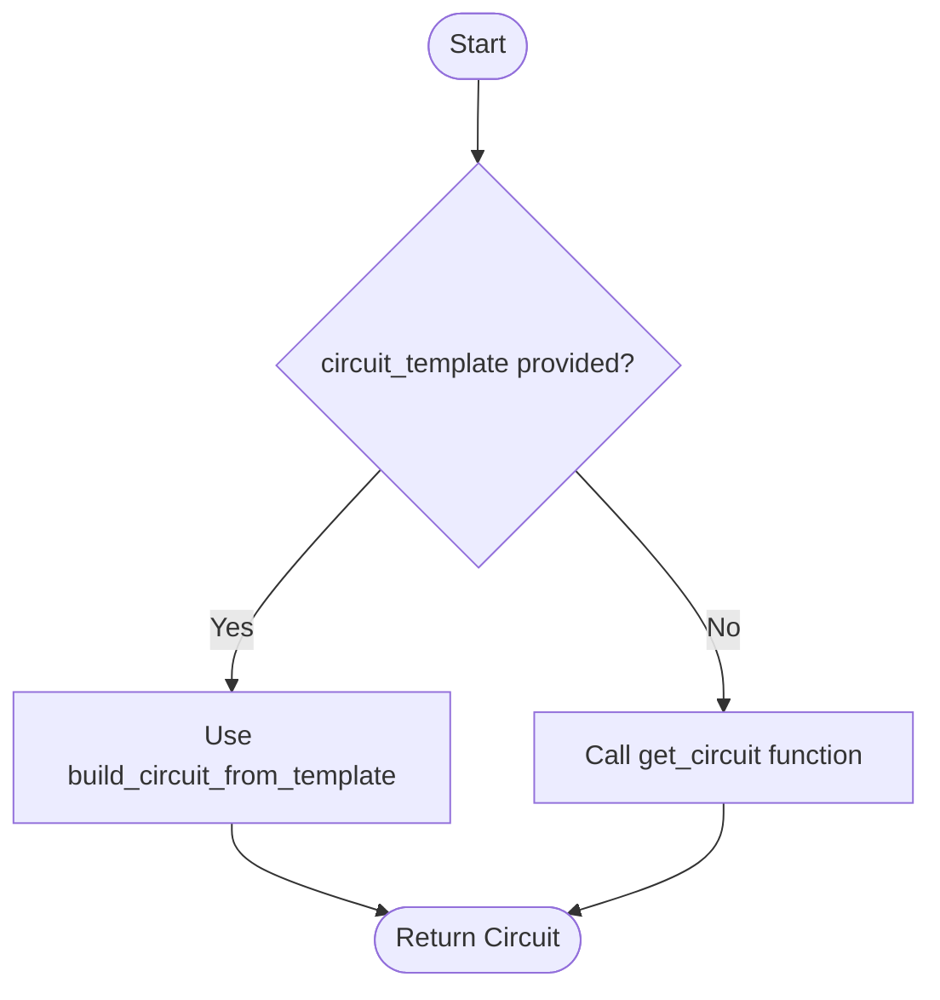
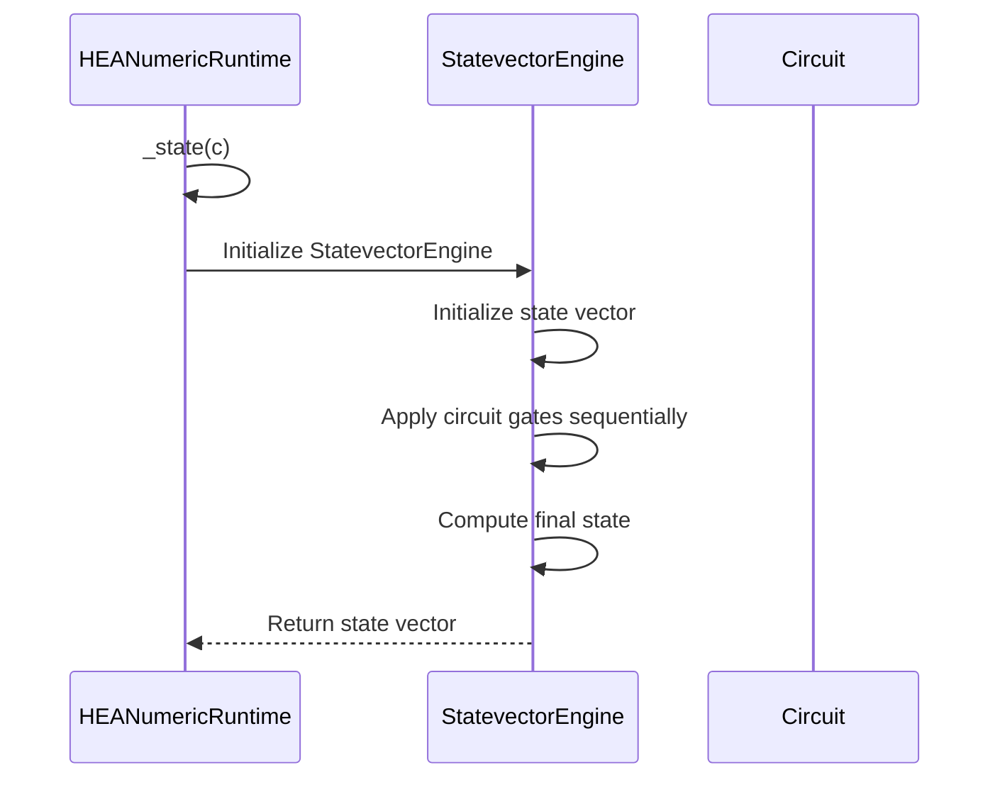
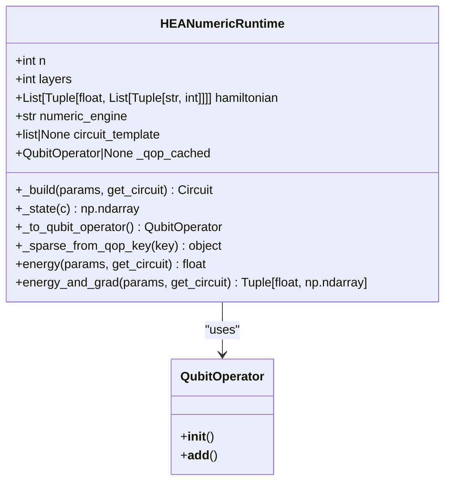
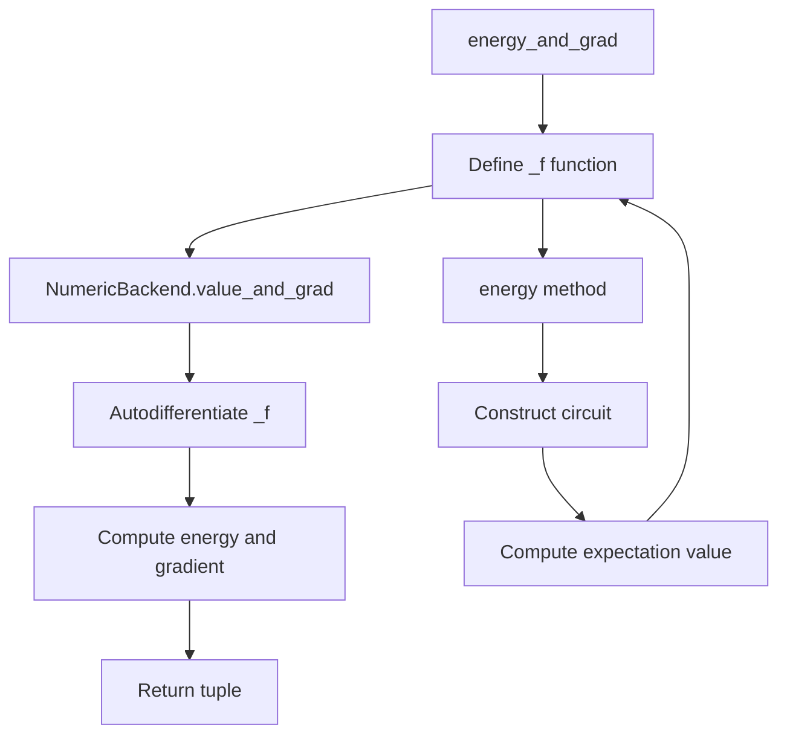

# HEA Numeric Runtime

<cite>
**Referenced Files in This Document**   
- [hea_numeric_runtime.py](file://src/tyxonq/applications/chem/runtimes/hea_numeric_runtime.py)
- [engine.py](file://src/tyxonq/devices/simulators/statevector/engine.py)
- [qiskit_real_amplitudes.py](file://src/tyxonq/libs/circuits_library/qiskit_real_amplitudes.py)
- [__init__.py](file://src/tyxonq/numerics/__init__.py)
</cite>

## Table of Contents
1. [Introduction](#introduction)
2. [Core Components](#core-components)
3. [Architecture Overview](#architecture-overview)
4. [Detailed Component Analysis](#detailed-component-analysis)
5. [Performance Considerations](#performance-considerations)
6. [Conclusion](#conclusion)

## Introduction

The HEANumericRuntime class serves as a critical component within TyxonQ's quantum chemistry applications, providing exact numerical evaluation capabilities for hardware-efficient ansatz (HEA) circuits. This runtime enables precise simulation of quantum circuits through statevector computation, supporting variational quantum algorithms such as VQE (Variational Quantum Eigensolver) with exact gradient computation. The class is specifically designed to facilitate research and validation of quantum chemistry models by offering a noise-free, high-precision execution environment that complements device-based quantum computation.

**Section sources**
- [hea_numeric_runtime.py](file://src/tyxonq/applications/chem/runtimes/hea_numeric_runtime.py#L14-L97)

## Core Components

The HEANumericRuntime class encapsulates the essential functionality for constructing, simulating, and evaluating HEA circuits with exact numerical precision. It manages circuit construction from templates or generator functions, Hamiltonian representation, statevector simulation, and energy/gradient computation through autodifferentiation. The runtime supports caching mechanisms for Hamiltonian operators to optimize repeated evaluations and provides flexibility in circuit construction approaches.

**Section sources**
- [hea_numeric_runtime.py](file://src/tyxonq/applications/chem/runtimes/hea_numeric_runtime.py#L14-L97)

## Architecture Overview

**Diagram sources**
- [hea_numeric_runtime.py](file://src/tyxonq/applications/chem/runtimes/hea_numeric_runtime.py#L14-L97)
- [engine.py](file://src/tyxonq/devices/simulators/statevector/engine.py#L31-L261)
- [qiskit_real_amplitudes.py](file://src/tyxonq/libs/circuits_library/qiskit_real_amplitudes.py#L76-L91)
- [__init__.py](file://src/tyxonq/numerics/__init__.py#L161-L194)

## Detailed Component Analysis

### Initialization and Configuration

The HEANumericRuntime class is initialized with parameters that define the quantum system and computational approach. The constructor accepts the number of qubits (n), number of circuit layers, and a Hamiltonian specification in coefficient-operator tuple format. An optional numeric_engine parameter allows selection between simulation backends (currently defaulting to "statevector" with future MPS support). Users can provide a circuit_template for template-based construction or rely on an external circuit generator function. The class also supports optional pre-mapped QubitOperator caching to optimize Hamiltonian processing.

**Section sources**
- [hea_numeric_runtime.py](file://src/tyxonq/applications/chem/runtimes/hea_numeric_runtime.py#L14-L23)

### Circuit Construction

The `_build` method handles circuit construction through two complementary approaches. When a circuit_template is provided during initialization, the runtime uses the `build_circuit_from_template` function to instantiate circuits by mapping parameter values to the template structure. This approach enables efficient reuse of predefined circuit architectures. In the absence of a template, the method delegates circuit generation to an external get_circuit function, providing flexibility for dynamic circuit construction. The template-based approach uses parameter indexing to map the input parameter vector to specific gate parameters in the circuit.

**Diagram sources**
- [hea_numeric_runtime.py](file://src/tyxonq/applications/chem/runtimes/hea_numeric_runtime.py#L24-L28)
- [qiskit_real_amplitudes.py](file://src/tyxonq/libs/circuits_library/qiskit_real_amplitudes.py#L76-L91)

### Statevector Simulation

The `_state` method interfaces with the StatevectorEngine to obtain full wavefunctions from quantum circuits. It supports multiple numeric engines, with the current implementation primarily using the statevector backend for exact simulation. The method converts the circuit to a statevector representation, returning the full quantum state as a complex-valued numpy array. This complete state information enables exact computation of expectation values and supports advanced analysis of quantum states.

**Diagram sources**
- [hea_numeric_runtime.py](file://src/tyxonq/applications/chem/runtimes/hea_numeric_runtime.py#L30-L41)
- [engine.py](file://src/tyxonq/devices/simulators/statevector/engine.py#L31-L261)

### Hamiltonian Processing

The HEANumericRuntime implements efficient Hamiltonian processing through two key methods: `_to_qubit_operator` and `_sparse_from_qop_key`. The class converts Hamiltonians from coefficient-operator tuple format to QubitOperator representations using cached computation to avoid redundant processing. The `_qop_key` method creates a hashable representation of the Hamiltonian for caching purposes. These methods leverage LRU caching with a maximum size of 64 entries to balance memory usage and performance. The conversion process handles both constant terms and operator strings, ensuring proper mapping to the OpenFermion QubitOperator format.

**Diagram sources**
- [hea_numeric_runtime.py](file://src/tyxonq/applications/chem/runtimes/hea_numeric_runtime.py#L43-L85)

### Energy and Gradient Computation

The energy and energy_and_grad methods provide the core evaluation capabilities of the runtime. The energy method computes expectation values by constructing the circuit, converting the Hamiltonian to a QubitOperator, and using the StatevectorEngine's expval method. The energy_and_grad method leverages Numba's value_and_grad functionality through the NumericBackend interface to compute both energy values and gradients simultaneously. This autodifferentiation capability is essential for variational optimization, enabling efficient gradient-based parameter updates in VQE and related algorithms.

**Diagram sources**
- [hea_numeric_runtime.py](file://src/tyxonq/applications/chem/runtimes/hea_numeric_runtime.py#L86-L97)
- [__init__.py](file://src/tyxonq/numerics/__init__.py#L161-L194)

## Performance Considerations

The HEANumericRuntime implements several performance optimization strategies. The LRU caching mechanism for Hamiltonian operator conversion reduces redundant computation during iterative optimization loops. The separation of circuit construction from evaluation allows for flexible parameterization schemes. However, the statevector-based simulation approach has exponential memory scaling with qubit count, limiting its applicability to smaller systems. Future support for MPS (Matrix Product State) backends is indicated in the code, suggesting plans for improved scalability. The current implementation falls back to statevector simulation even when "mps" is specified, indicating this functionality is under development.

**Section sources**
- [hea_numeric_runtime.py](file://src/tyxonq/applications/chem/runtimes/hea_numeric_runtime.py#L30-L41)
- [hea_numeric_runtime.py](file://src/tyxonq/applications/chem/runtimes/hea_numeric_runtime.py#L43-L61)

## Conclusion

The HEANumericRuntime class provides a robust foundation for exact numerical simulation of hardware-efficient ansatz circuits in quantum chemistry applications. Its design supports both template-based and function-generated circuit construction, enabling flexibility in algorithm implementation. The integration with statevector simulation and autodifferentiation frameworks allows for precise energy and gradient computation, making it particularly valuable for validating VQE implementations and testing gradient correctness. While currently limited by the exponential scaling of statevector simulation, the architecture appears designed to accommodate more scalable backends in the future. The runtime serves as an essential tool for algorithm development and verification before deployment on physical quantum devices.