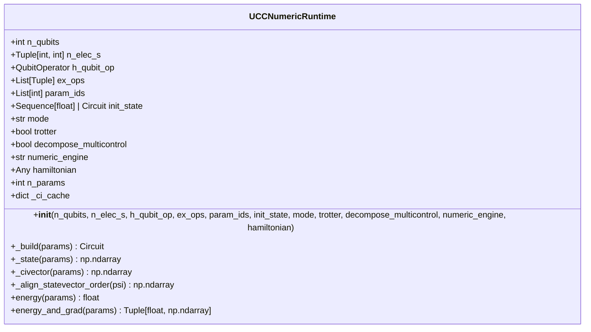
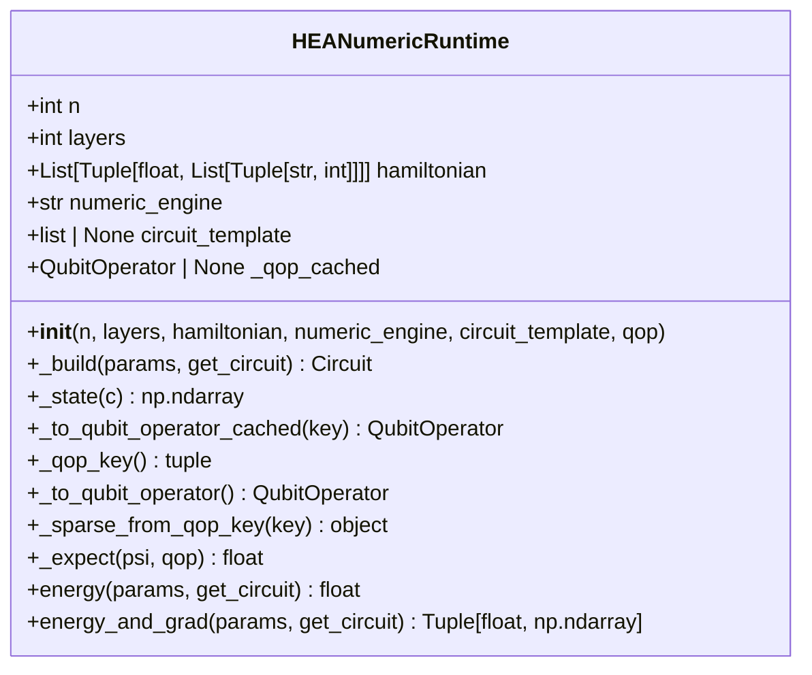
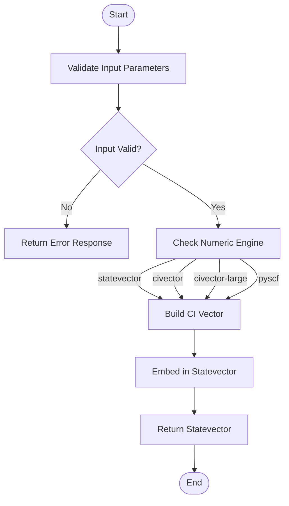
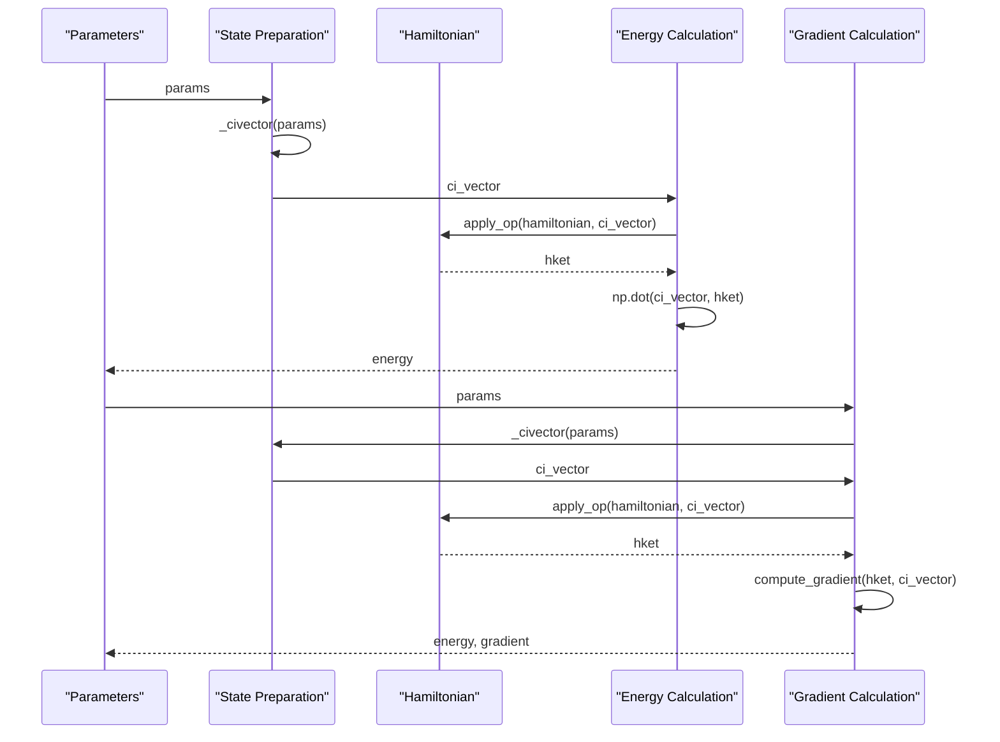

# Numeric Runtimes

<cite>
**Referenced Files in This Document**   
- [ucc_numeric_runtime.py](file://src/tyxonq/applications/chem/runtimes/ucc_numeric_runtime.py)
- [hea_numeric_runtime.py](file://src/tyxonq/applications/chem/runtimes/hea_numeric_runtime.py)
- [ci_state_mapping.py](file://src/tyxonq/applications/chem/chem_libs/quantum_chem_library/ci_state_mapping.py)
- [civector_ops.py](file://src/tyxonq/applications/chem/chem_libs/quantum_chem_library/civector_ops.py)
- [statevector_ops.py](file://src/tyxonq/applications/chem/chem_libs/quantum_chem_library/statevector_ops.py)
</cite>

## Table of Contents
1. [Introduction](#introduction)
2. [Core Components](#core-components)
3. [UCCNumericRuntime Implementation](#uccnumericruntime-implementation)
4. [HEANumericRuntime Implementation](#heanumericruntime-implementation)
5. [Numeric Engine Support](#numeric-engine-support)
6. [State Preparation Methods](#state-preparation-methods)
7. [Energy Calculation Techniques](#energy-calculation-techniques)
8. [Unified Interface and Integration](#unified-interface-and-integration)
9. [Configuration Examples](#configuration-examples)
10. [Numerical Stability and Performance](#numerical-stability-and-performance)

## Introduction

The numeric runtimes in TyxonQ's quantum chemistry applications provide exact numerical evaluation capabilities for quantum chemistry problems using statevector simulations. These runtimes are designed for algorithm development and validation, offering precise results through full wavefunction access. The two primary classes, `UCCNumericRuntime` and `HEANumericRuntime`, implement different quantum chemistry ansatzes while sharing a common numeric evaluation framework. These runtimes support multiple numeric engines including statevector, civector, mps, and pyscf, each with distinct trade-offs in memory usage and computational complexity. The unified interface allows seamless integration with the core framework's numerics backend, enabling researchers to validate quantum algorithms against exact classical solutions before deployment on quantum hardware.

## Core Components

The numeric runtime system consists of two main classes: `UCCNumericRuntime` for Unitary Coupled Cluster methods and `HEANumericRuntime` for Hardware-Efficient Ansatz approaches. Both classes provide exact numerical evaluation through statevector simulations and support various numeric engines. The implementation leverages specialized quantum chemistry libraries for CI vector operations, statevector manipulations, and Hamiltonian applications. The system is designed to handle different initial states, excitation operators, and Hamiltonian representations, making it suitable for comprehensive algorithm validation and development.

**Section sources**
- [ucc_numeric_runtime.py](file://src/tyxonq/applications/chem/runtimes/ucc_numeric_runtime.py#L40-L241)
- [hea_numeric_runtime.py](file://src/tyxonq/applications/chem/runtimes/hea_numeric_runtime.py#L14-L97)

## UCCNumericRuntime Implementation

The `UCCNumericRuntime` class implements exact numerical evaluation for Unitary Coupled Cluster methods in quantum chemistry. It provides a comprehensive interface for state preparation and energy calculation using various numeric engines. The class initializes with key parameters including the number of qubits, electron configuration, qubit Hamiltonian, excitation operators, and numeric engine specification. It supports different modes of operation and can handle both Trotterized and non-Trotterized circuits.



**Diagram sources**
- [ucc_numeric_runtime.py](file://src/tyxonq/applications/chem/runtimes/ucc_numeric_runtime.py#L40-L241)

**Section sources**
- [ucc_numeric_runtime.py](file://src/tyxonq/applications/chem/runtimes/ucc_numeric_runtime.py#L40-L241)

## HEANumericRuntime Implementation

The `HEANumericRuntime` class provides exact numerical evaluation for Hardware-Efficient Ansatz (HEA) methods in quantum chemistry. It is designed to work with parameterized quantum circuits that are tailored to specific quantum hardware architectures. The class initializes with the number of qubits, number of layers, Hamiltonian representation, and optional circuit template. It supports different numeric engines and provides methods for circuit building, state preparation, and energy calculation.



**Diagram sources**
- [hea_numeric_runtime.py](file://src/tyxonq/applications/chem/runtimes/hea_numeric_runtime.py#L14-L97)

**Section sources**
- [hea_numeric_runtime.py](file://src/tyxonq/applications/chem/runtimes/hea_numeric_runtime.py#L14-L97)

## Numeric Engine Support

The numeric runtimes support multiple engines for quantum chemistry calculations, each with distinct characteristics and trade-offs. The available engines include:

- **statevector**: Full statevector simulation using the StatevectorEngine, providing exact results but with exponential memory requirements
- **civector**: Configuration Interaction vector engine that operates in the CI subspace, reducing memory usage for systems with limited excitations
- **civector-large**: CI vector engine without caching, suitable for large-scale calculations where memory constraints are critical
- **pyscf**: Integration with the PySCF quantum chemistry package for advanced electronic structure calculations
- **mps**: Matrix Product State engine for approximate simulation of quantum systems with limited entanglement

The choice of numeric engine affects both memory usage and computational complexity. Statevector simulation provides the most accurate results but scales exponentially with the number of qubits. CI-based engines reduce memory requirements by operating in the relevant subspace of the full Hilbert space, making them suitable for larger systems. The PySCF engine leverages classical quantum chemistry methods for high-accuracy calculations, while the MPS engine provides a compromise between accuracy and scalability for systems with limited entanglement.

**Section sources**
- [ucc_numeric_runtime.py](file://src/tyxonq/applications/chem/runtimes/ucc_numeric_runtime.py#L95-L120)
- [ucc_numeric_runtime.py](file://src/tyxonq/applications/chem/runtimes/ucc_numeric_runtime.py#L122-L149)

## State Preparation Methods

The numeric runtimes implement sophisticated state preparation methods through the `_state` and `_civector` internal methods. These methods handle the transformation between different representations of quantum states and ensure compatibility with the chosen numeric engine.

### _state Method

The `_state` method prepares the full quantum state for evaluation. For the statevector engine, it builds the CI vector using excitation semantics and embeds it into the full statevector. For CI-based engines (civector, civector-large, pyscf), it follows the same process but operates directly in the CI subspace. The MPS engine currently falls back to statevector simulation, with plans for exact MPS contraction in future implementations.

### _civector Method

The `_civector` method constructs the Configuration Interaction vector in CI space following TCC (Tensor Contraction Engine) conventions. It handles different numeric engines by dispatching to appropriate backend functions: `get_civector` for the civector engine, `get_civector_nocache` for the large-scale CI engine, `get_civector_pyscf` for PySCF integration, and `get_statevector` for statevector-based calculations. The method also manages initial state translation, converting between circuit, statevector, and CI vector representations as needed.



**Diagram sources**
- [ucc_numeric_runtime.py](file://src/tyxonq/applications/chem/runtimes/ucc_numeric_runtime.py#L95-L120)
- [ucc_numeric_runtime.py](file://src/tyxonq/applications/chem/runtimes/ucc_numeric_runtime.py#L122-L149)
- [ci_state_mapping.py](file://src/tyxonq/applications/chem/chem_libs/quantum_chem_library/ci_state_mapping.py#L37-L96)

**Section sources**
- [ucc_numeric_runtime.py](file://src/tyxonq/applications/chem/runtimes/ucc_numeric_runtime.py#L95-L149)
- [ci_state_mapping.py](file://src/tyxonq/applications/chem/chem_libs/quantum_chem_library/ci_state_mapping.py#L37-L96)

## Energy Calculation Techniques

The numeric runtimes provide precise energy calculation through the `energy` and `energy_and_grad` methods, leveraging full wavefunction access for exact results. These methods implement different algorithms depending on the selected numeric engine, ensuring optimal performance and accuracy.

### Energy Method

The `energy` method computes the expectation value of the Hamiltonian with respect to the prepared quantum state. For CI-based engines, it applies the Hamiltonian operator to the CI vector and computes the dot product. For statevector-based calculations, it uses the statevector representation and appropriate Hamiltonian application methods. The method handles initial state translation and ensures compatibility between the state representation and Hamiltonian format.

### Energy and Gradient Method

The `energy_and_grad` method computes both the energy and its gradient with respect to the variational parameters. This is essential for variational quantum algorithms that require gradient information for optimization. The implementation varies by numeric engine:

- For the civector engine, it uses `energy_and_grad_civector` to compute energy and gradients in the CI subspace
- For the civector-large engine, it uses `energy_and_grad_civector_nocache` for memory-efficient gradient calculation
- For the pyscf engine, it uses `get_energy_and_grad_pyscf` to leverage PySCF's gradient capabilities
- For statevector-based calculations, it uses `energy_and_grad_statevector` with automatic differentiation

The gradient calculation follows the parameter shift rule or analytical differentiation, depending on the backend, providing accurate gradient information for optimization algorithms.



**Diagram sources**
- [ucc_numeric_runtime.py](file://src/tyxonq/applications/chem/runtimes/ucc_numeric_runtime.py#L169-L193)
- [civector_ops.py](file://src/tyxonq/applications/chem/chem_libs/quantum_chem_library/civector_ops.py#L98-L116)
- [statevector_ops.py](file://src/tyxonq/applications/chem/chem_libs/quantum_chem_library/statevector_ops.py#L65-L103)

**Section sources**
- [ucc_numeric_runtime.py](file://src/tyxonq/applications/chem/runtimes/ucc_numeric_runtime.py#L169-L193)
- [civector_ops.py](file://src/tyxonq/applications/chem/chem_libs/quantum_chem_library/civector_ops.py#L98-L116)
- [statevector_ops.py](file://src/tyxonq/applications/chem/chem_libs/quantum_chem_library/statevector_ops.py#L65-L103)

## Unified Interface and Integration

The numeric runtimes provide a unified interface that integrates seamlessly with the core framework's numerics backend. This interface abstracts the differences between various numeric engines and quantum chemistry ansatzes, allowing users to switch between different configurations without modifying their application code.

The integration is achieved through several key design patterns:

1. **Engine Abstraction**: The numeric_engine parameter allows users to select the appropriate engine for their specific use case, with automatic dispatch to the corresponding implementation.

2. **State Representation Conversion**: The system handles conversion between different state representations (circuit, statevector, CI vector) transparently, ensuring compatibility between components.

3. **Hamiltonian Interface**: A consistent interface for Hamiltonian application allows different representations (QubitOperator, sparse matrix, callable) to be used interchangeably.

4. **Parameter Management**: The runtime classes manage parameter indexing and mapping, supporting both direct parameter specification and parameter ID mapping.

5. **Caching and Optimization**: Internal caching mechanisms optimize repeated calculations, particularly for CI vector operations and operator tensors.

This unified interface enables researchers to validate quantum algorithms against exact classical solutions using different numeric engines, facilitating the development and testing of quantum chemistry methods before deployment on quantum hardware.

**Section sources**
- [ucc_numeric_runtime.py](file://src/tyxonq/applications/chem/runtimes/ucc_numeric_runtime.py#L40-L241)
- [hea_numeric_runtime.py](file://src/tyxonq/applications/chem/runtimes/hea_numeric_runtime.py#L14-L97)

## Configuration Examples

The numeric runtimes can be configured with various initial states, excitation operators, and Hamiltonian representations to support different quantum chemistry scenarios. Here are examples of typical configurations:

### UCC Configuration
```python
# Initialize UCCNumericRuntime with specific parameters
runtime = UCCNumericRuntime(
    n_qubits=4,
    n_elec_s=(2, 2),
    h_qubit_op=hamiltonian,
    ex_ops=[(0, 1), (2, 3), (0, 1, 2, 3)],
    param_ids=[0, 1, 2],
    init_state=initial_circuit,
    mode="fermion",
    numeric_engine="civector"
)
```

### HEA Configuration
```python
# Initialize HEANumericRuntime with circuit template
runtime = HEANumericRuntime(
    n=4,
    layers=3,
    hamiltonian=hamiltonian_terms,
    numeric_engine="statevector",
    circuit_template=template_circuit
)
```

These configurations demonstrate the flexibility of the numeric runtimes in handling different quantum chemistry problems. The UCC configuration shows a typical Unitary Coupled Cluster setup with single and double excitations, while the HEA configuration illustrates the use of a predefined circuit template for hardware-efficient ansatzes.

**Section sources**
- [ucc_numeric_runtime.py](file://src/tyxonq/applications/chem/runtimes/ucc_numeric_runtime.py#L40-L241)
- [hea_numeric_runtime.py](file://src/tyxonq/applications/chem/runtimes/hea_numeric_runtime.py#L14-L97)

## Numerical Stability and Performance

The numeric runtimes are designed with careful consideration of numerical stability and performance characteristics. Several factors influence the stability and efficiency of calculations:

### Memory Usage
- **Statevector engine**: O(2^N) memory complexity, suitable for small to medium systems (N ≤ 30)
- **CI-based engines**: O(M) memory complexity where M is the number of CI basis states, enabling larger systems with limited excitations
- **MPS engine**: O(dχ²) memory complexity where d is the physical dimension and χ is the bond dimension, providing a compromise between accuracy and scalability

### Computational Complexity
- **State preparation**: O(P×M) where P is the number of parameters and M is the state dimension
- **Energy calculation**: O(M²) for dense Hamiltonian application, O(M) for sparse operators
- **Gradient calculation**: O(P×M²) for finite difference, O(M²) for analytical methods

### Numerical Stability Considerations
- Use of double precision (float64) for all calculations to minimize rounding errors
- Careful handling of initial state translation to prevent precision loss
- Implementation of stable algorithms for CI vector evolution and Hamiltonian application
- Proper alignment of statevector bit order to match OpenFermion conventions

The numeric runtimes are ideal for algorithm development and validation, providing exact results that can be used to benchmark quantum hardware implementations. They are particularly valuable for testing new quantum chemistry methods, verifying circuit implementations, and studying the convergence of variational algorithms.

**Section sources**
- [ucc_numeric_runtime.py](file://src/tyxonq/applications/chem/runtimes/ucc_numeric_runtime.py#L40-L241)
- [hea_numeric_runtime.py](file://src/tyxonq/applications/chem/runtimes/hea_numeric_runtime.py#L14-L97)
- [civector_ops.py](file://src/tyxonq/applications/chem/chem_libs/quantum_chem_library/civector_ops.py#L98-L116)