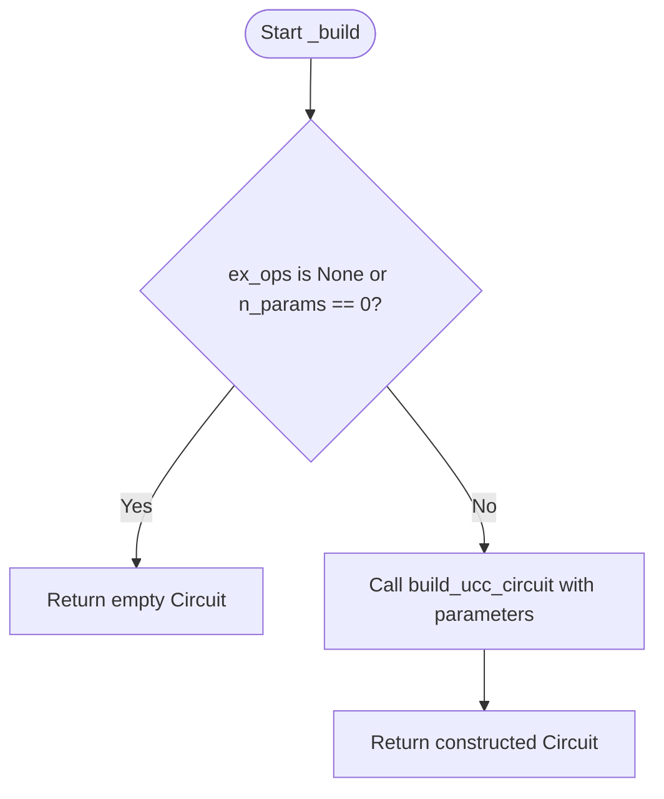
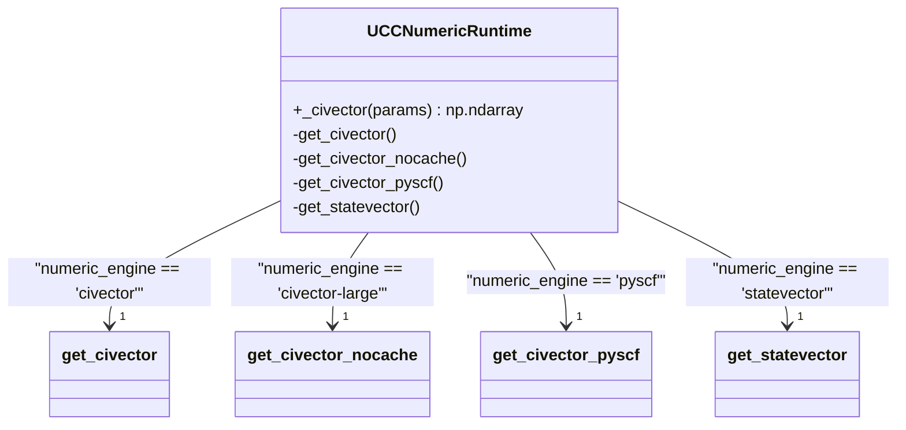
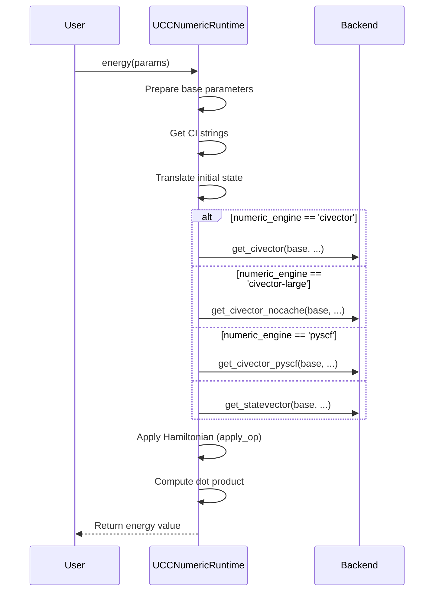
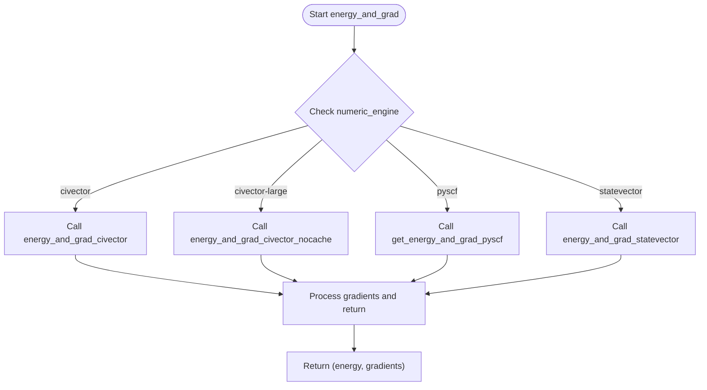
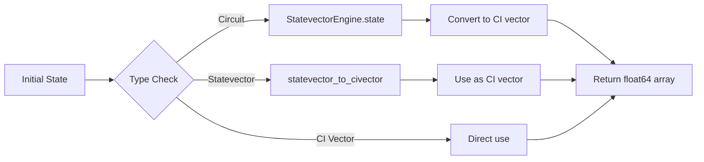

# UCC Numeric Runtime

<cite>
**Referenced Files in This Document**   
- [ucc_numeric_runtime.py](file://src/tyxonq/applications/chem/runtimes/ucc_numeric_runtime.py)
- [civector_ops.py](file://src/tyxonq/applications/chem/chem_libs/quantum_chem_library/civector_ops.py)
- [statevector_ops.py](file://src/tyxonq/applications/chem/chem_libs/quantum_chem_library/statevector_ops.py)
- [pyscf_civector.py](file://src/tyxonq/applications/chem/chem_libs/quantum_chem_library/pyscf_civector.py)
- [ci_state_mapping.py](file://src/tyxonq/applications/chem/chem_libs/quantum_chem_library/ci_state_mapping.py)
- [ucc.py](file://src/tyxonq/libs/circuits_library/ucc.py)
</cite>

## Table of Contents
1. [Introduction](#introduction)
2. [Initialization Parameters](#initialization-parameters)
3. [Core Methods](#core-methods)
4. [Energy Computation](#energy-computation)
5. [Supported Numeric Engines](#supported-numeric-engines)
6. [Usage Examples](#usage-examples)
7. [Numerical Precision and Integration](#numerical-precision-and-integration)
8. [Conclusion](#conclusion)

## Introduction

The UCCNumericRuntime class in TyxonQ provides a high-precision numerical simulation framework for unitary coupled cluster (UCC) methods in quantum chemistry applications. This runtime enables exact numerical simulations using either full statevector representations or configuration interaction (CI) vector subspaces, making it ideal for algorithm validation and benchmarking where exact results are required.

The class serves as the numeric backend for UCC-based quantum chemistry algorithms, offering multiple computational engines with different performance trade-offs. It handles the complete workflow from circuit construction to wavefunction preparation and energy computation, with support for analytic gradient calculation. The implementation aligns with OpenFermion's bit ordering conventions and integrates seamlessly with TyxonQ's core numerics backend.

**Section sources**
- [ucc_numeric_runtime.py](file://src/tyxonq/applications/chem/runtimes/ucc_numeric_runtime.py#L40-L241)

## Initialization Parameters

The UCCNumericRuntime class is initialized with a comprehensive set of parameters that define the quantum chemistry problem and computational approach:

- **n_qubits**: Integer specifying the total number of qubits in the system
- **n_elec_s**: Tuple of integers representing the number of alpha and beta electrons
- **h_qubit_op**: QubitOperator representing the qubit Hamiltonian
- **ex_ops**: Optional list of excitation operators as tuples
- **param_ids**: Optional list of parameter indices for excitation operators
- **init_state**: Optional initial state as a sequence of floats or Circuit
- **mode**: String specifying the mode ("fermion" by default)
- **trotter**: Boolean indicating whether to use Trotter decomposition
- **decompose_multicontrol**: Boolean for multicontrol gate decomposition
- **numeric_engine**: String specifying the computational engine
- **hamiltonian**: Optional Hamiltonian representation for the selected engine

The initialization process normalizes parameter IDs and sets up internal caches for CI vector operations. The numeric_engine parameter defaults to "statevector" if not specified, and the class computes the total number of parameters based on the excitation operators and parameter mappings.

**Section sources**
- [ucc_numeric_runtime.py](file://src/tyxonq/applications/chem/runtimes/ucc_numeric_runtime.py#L41-L78)

## Core Methods

### Circuit Construction with _build

The `_build` method constructs the UCC circuit based on the provided parameters. It utilizes the `build_ucc_circuit` function from the circuits library to generate the quantum circuit representing the unitary coupled cluster ansatz. When no excitation operators are specified or when there are zero parameters, it returns an empty circuit with the specified number of qubits.



**Diagram sources**
- [ucc_numeric_runtime.py](file://src/tyxonq/applications/chem/runtimes/ucc_numeric_runtime.py#L80-L93)
- [ucc.py](file://src/tyxonq/libs/circuits_library/ucc.py#L100-L128)

### Wavefunction Preparation with _state and _civector

The `_state` method prepares the full statevector representation of the quantum state. It supports multiple numeric engines and handles the conversion between CI vector space and full Hilbert space. For statevector and CI-based engines, it constructs the CI vector and embeds it into the full statevector at positions corresponding to valid CI basis states.

The `_civector` method constructs the wavefunction in the CI subspace following TCC (Tensor Contraction Engine) conventions. It handles different numeric engines by dispatching to appropriate backend functions:



**Diagram sources**
- [ucc_numeric_runtime.py](file://src/tyxonq/applications/chem/runtimes/ucc_numeric_runtime.py#L95-L149)
- [civector_ops.py](file://src/tyxonq/applications/chem/chem_libs/quantum_chem_library/civector_ops.py#L98-L116)
- [statevector_ops.py](file://src/tyxonq/applications/chem/chem_libs/quantum_chem_library/statevector_ops.py#L100-L120)
- [pyscf_civector.py](file://src/tyxonq/applications/chem/chem_libs/quantum_chem_library/pyscf_civector.py#L140-L158)

**Section sources**
- [ucc_numeric_runtime.py](file://src/tyxonq/applications/chem/runtimes/ucc_numeric_runtime.py#L95-L149)

## Energy Computation

### Energy Method

The `energy` method computes the expectation value of the Hamiltonian for the given parameters. It first prepares the wavefunction using the appropriate backend function based on the selected numeric engine, then applies the Hamiltonian operator and computes the dot product to obtain the energy value.



**Diagram sources**
- [ucc_numeric_runtime.py](file://src/tyxonq/applications/chem/runtimes/ucc_numeric_runtime.py#L169-L193)
- [civector_ops.py](file://src/tyxonq/applications/chem/chem_libs/quantum_chem_library/civector_ops.py#L98-L116)
- [statevector_ops.py](file://src/tyxonq/applications/chem/chem_libs/quantum_chem_library/statevector_ops.py#L100-L120)
- [pyscf_civector.py](file://src/tyxonq/applications/chem/chem_libs/quantum_chem_library/pyscf_civector.py#L140-L158)
- [hamiltonian_builders.py](file://src/tyxonq/applications/chem/chem_libs/hamiltonians_chem_library/hamiltonian_builders.py#L279-L295)

### Energy and Gradient Method

The `energy_and_grad` method computes both the energy and its analytic gradient with respect to the variational parameters. It uses engine-specific implementations to calculate the gradient efficiently:



The method returns a tuple containing the energy value and the gradient vector, with gradients scaled by a factor of 2.0 to match the expected convention.

**Section sources**
- [ucc_numeric_runtime.py](file://src/tyxonq/applications/chem/runtimes/ucc_numeric_runtime.py#L195-L241)

## Supported Numeric Engines

The UCCNumericRuntime supports multiple numeric engines, each with different performance characteristics:

### Statevector Engine
The default engine that performs simulations in the full Hilbert space using statevector representations. It offers high precision but scales exponentially with the number of qubits.

### CI Vector Engines
- **civector**: Uses cached tensor operations for CI vector evolution, optimized for repeated calculations
- **civector-large**: Uses non-cached operations suitable for large-scale problems where memory constraints prevent caching
- **pyscf**: Integrates with PySCF's FCI utilities for exact numeric baselines on small systems

### Matrix Product State (MPS) Engine
An experimental engine that uses matrix product state representations for potentially better scaling on certain problem types, though currently implemented as a fallback to statevector simulation.

Each engine makes different trade-offs between memory usage, computational complexity, and numerical precision, allowing users to select the most appropriate option for their specific use case.

**Section sources**
- [ucc_numeric_runtime.py](file://src/tyxonq/applications/chem/runtimes/ucc_numeric_runtime.py#L40-L241)

## Usage Examples

### Basic Configuration
```python
rt = UCCNumericRuntime(
    n_qubits=4,
    n_elec_s=(1, 1),
    h_qubit_op=hamiltonian,
    ex_ops=[(0, 1), (2, 3)],
    numeric_engine="statevector"
)
```

### With Custom Initial State
```python
# Using a circuit as initial state
initial_circuit = Circuit(4)
initial_circuit.X(0)
initial_circuit.X(1)

rt = UCCNumericRuntime(
    n_qubits=4,
    n_elec_s=(1, 1),
    h_qubit_op=hamiltonian,
    init_state=initial_circuit,
    numeric_engine="civector"
)
```

### Energy and Gradient Calculation
```python
# Compute energy for given parameters
params = [0.1, 0.2]
energy = rt.energy(params)

# Compute energy and gradient
energy, gradient = rt.energy_and_grad(params)
```

### Using PySCF Engine
```python
rt = UCCNumericRuntime(
    n_qubits=4,
    n_elec_s=(1, 1),
    h_qubit_op=hamiltonian,
    numeric_engine="pyscf",
    hamiltonian=pyscf_hamiltonian
)
```

**Section sources**
- [ucc_numeric_runtime.py](file://src/tyxonq/applications/chem/runtimes/ucc_numeric_runtime.py#L40-L241)

## Numerical Precision and Integration

### Bit Ordering Alignment
The UCCNumericRuntime handles bit ordering alignment between different conventions through the `_align_statevector_order` method. This ensures compatibility with OpenFermion's convention where qubit 0 acts on the least-significant bit, converting from simulators that use most-significant bit ordering.

### Initial State Translation
The `translate_init_state` function handles conversion of various initial state representations:
- Circuit objects are converted to statevectors using the StatevectorEngine
- Statevectors are converted to CI vectors using the CI basis mapping
- CI vectors are used directly after type conversion



**Diagram sources**
- [ucc_numeric_runtime.py](file://src/tyxonq/applications/chem/runtimes/ucc_numeric_runtime.py#L278-L290)
- [ci_state_mapping.py](file://src/tyxonq/applications/chem/chem_libs/quantum_chem_library/ci_state_mapping.py#L140-L166)

### Backend Integration
The class integrates with TyxonQ's core numerics backend through the NumericBackend interface, allowing for flexible computation on different hardware and numerical libraries. The energy_and_grad_statevector function uses the backend's value_and_grad wrapper to compute analytic gradients efficiently.

**Section sources**
- [ucc_numeric_runtime.py](file://src/tyxonq/applications/chem/runtimes/ucc_numeric_runtime.py#L40-L241)

## Conclusion

The UCCNumericRuntime class provides a comprehensive framework for exact numerical simulations of unitary coupled cluster methods in quantum chemistry. By supporting multiple computational engines and precise control over the simulation parameters, it enables researchers to validate quantum algorithms and obtain benchmark results with high accuracy.

The class's design emphasizes numerical precision and compatibility with established quantum chemistry conventions, particularly through its alignment with OpenFermion's bit ordering and integration with PySCF for exact reference calculations. Its modular architecture allows for easy extension with new numeric engines while maintaining a consistent interface for energy and gradient computation.

For algorithm development and validation, the UCCNumericRuntime serves as an essential tool, providing exact results against which device-based implementations can be compared. Its support for analytic gradients makes it particularly valuable for variational quantum algorithms where gradient-based optimization is required.