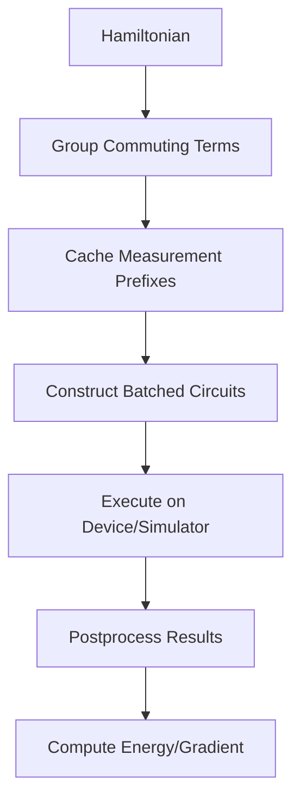

# Runtime Implementations

<cite>
**Referenced Files in This Document**   
- [ucc_device_runtime.py](file://src/tyxonq/applications/chem/runtimes/ucc_device_runtime.py)
- [hea_device_runtime.py](file://src/tyxonq/applications/chem/runtimes/hea_device_runtime.py)
- [ucc_numeric_runtime.py](file://src/tyxonq/applications/chem/runtimes/ucc_numeric_runtime.py)
- [hea_numeric_runtime.py](file://src/tyxonq/applications/chem/runtimes/hea_numeric_runtime.py)
- [hamiltonian_grouping.py](file://src/tyxonq/compiler/utils/hamiltonian_grouping.py)
- [device_base.py](file://src/tyxonq/devices/base.py)
</cite>

## Table of Contents
1. [Introduction](#introduction)
2. [Device Runtimes](#device-runtimes)
3. [Numeric Runtimes](#numeric-runtimes)
4. [Unified Interface and Integration](#unified-interface-and-integration)
5. [Hamiltonian Grouping and Measurement Optimization](#hamiltonian-grouping-and-measurement-optimization)
6. [Performance Considerations and Use Cases](#performance-considerations-and-use-cases)
7. [Configuration Examples](#configuration-examples)
8. [Conclusion](#conclusion)

## Introduction
This document provides comprehensive API documentation for the runtime implementations in TyxonQ's quantum chemistry applications. It details the device and numeric runtime classes designed for executing quantum chemistry algorithms such as UCC and HEA on quantum devices or simulators. The document covers the core functionality of these runtimes, including energy evaluation, gradient computation via parameter-shift methods, Hamiltonian grouping, and measurement prefix caching. It also explains the unified interface between different runtime types and their integration with the core framework's device abstraction and postprocessing layers. The documentation is intended for developers and researchers who need to understand and utilize these runtime classes for quantum chemistry simulations.

## Device Runtimes

The device runtimes in TyxonQ are designed for shot-based evaluation of quantum chemistry algorithms on quantum devices or simulators. They implement parameter-shift gradient computation through batched circuit execution, enabling efficient energy and gradient calculations. The two primary device runtime classes are `UCCDeviceRuntime` and `HEADeviceRuntime`, which support the Unitary Coupled Cluster (UCC) and Hardware-Efficient Ansatz (HEA) algorithms, respectively.

The `UCCDeviceRuntime` class is initialized with parameters such as the number of qubits, electron configuration, and a qubit operator representing the Hamiltonian. It supports Hartree-Fock initial states and configurable excitation operators with parameter IDs. The runtime precomputes Hamiltonian grouping and caches measurement prefixes to optimize evaluation efficiency. The `energy` method computes the expectation value of the Hamiltonian by grouping commuting Pauli terms and executing circuits in batches, while the `energy_and_grad` method implements parameter-shift gradient computation using finite differences with a shift of π/2.

Similarly, the `HEADeviceRuntime` class is designed for HEA-based quantum chemistry calculations. It is initialized with the number of qubits, layers, and a Hamiltonian represented as a list of Pauli terms. The runtime supports external circuit templates and provides methods for energy evaluation and gradient computation. The `energy_and_grad` method batches the evaluation of base energy and parameter-shifted circuits in a single device submission, reducing communication overhead and improving performance.

Both device runtimes integrate with TyxonQ's device abstraction layer, allowing configuration with different providers (e.g., simulator, IBM) and devices. They support noise models and postprocessing options, making them suitable for both idealized simulations and realistic hardware execution.

**Section sources**
- [ucc_device_runtime.py](file://src/tyxonq/applications/chem/runtimes/ucc_device_runtime.py#L25-L302)
- [hea_device_runtime.py](file://src/tyxonq/applications/chem/runtimes/hea_device_runtime.py#L22-L190)

## Numeric Runtimes

The numeric runtimes in TyxonQ provide exact numerical evaluation of quantum chemistry algorithms using statevector simulations. These runtimes are designed for high-precision calculations where shot noise is undesirable, such as in algorithm development, verification, and certain optimization scenarios. The two primary numeric runtime classes are `UCCNumericRuntime` and `HEANumericRuntime`, which correspond to the UCC and HEA algorithms, respectively.

The `UCCNumericRuntime` class is initialized with similar parameters to its device counterpart, including the number of qubits, electron configuration, and Hamiltonian. However, it operates in a noiseless, exact arithmetic environment using statevector simulations. The runtime supports multiple numeric engines, including "statevector", "civector", "civector-large", and "pyscf", allowing users to choose the most appropriate computational backend for their needs. The `energy` method computes the exact expectation value of the Hamiltonian by constructing the full statevector and applying the Hamiltonian operator directly. The `energy_and_grad` method implements exact gradient computation using analytical methods, providing precise derivatives for optimization algorithms.

The `HEANumericRuntime` class follows a similar design philosophy, providing exact numerical evaluation for HEA-based quantum chemistry calculations. It supports external circuit templates and integrates with TyxonQ's numeric backend system. The runtime uses LRU caching to optimize the conversion of Hamiltonian terms to qubit operators, reducing computational overhead in repeated evaluations. The `energy_and_grad` method leverages automatic differentiation through the `NumericBackend` to compute exact gradients, enabling efficient optimization in high-dimensional parameter spaces.

Both numeric runtimes are designed to align with their device counterparts in terms of interface and behavior, facilitating seamless switching between shot-based and exact numerical evaluation. They are particularly useful for algorithm development, benchmarking, and scenarios where high precision is required.

**Section sources**
- [ucc_numeric_runtime.py](file://src/tyxonq/applications/chem/runtimes/ucc_numeric_runtime.py#L40-L241)
- [hea_numeric_runtime.py](file://src/tyxonq/applications/chem/runtimes/hea_numeric_runtime.py#L14-L97)

## Unified Interface and Integration

TyxonQ's runtime system features a unified interface that abstracts the differences between device and numeric runtimes, enabling consistent usage patterns across different execution modes. This unified interface is implemented through a common set of methods and parameters, allowing users to switch between runtime types with minimal code changes.

The core of the unified interface is the `energy` and `energy_and_grad` methods, which are implemented consistently across both device and numeric runtimes. These methods accept a common set of parameters, including the parameter vector, provider, device, and postprocessing options. The interface also supports a consistent configuration model, where runtime-specific options are passed through keyword arguments, allowing for flexible and extensible configuration.

The integration with TyxonQ's core framework is achieved through the device abstraction layer and postprocessing system. The device abstraction layer provides a unified interface to different quantum computing backends, including simulators and hardware devices. This layer handles the translation of circuit representations to backend-specific formats and manages the execution of circuits on the target device. The postprocessing system provides a consistent framework for processing raw measurement results, including expectation value computation, readout error mitigation, and classical shadow reconstruction.

The unified interface also supports seamless integration with higher-level components of the TyxonQ framework, such as the VQE optimizer and RDM (Reduced Density Matrix) calculator. This integration enables end-to-end quantum chemistry workflows, from Hamiltonian construction to energy optimization and property calculation, using a consistent and intuitive API.

**Section sources**
- [ucc_device_runtime.py](file://src/tyxonq/applications/chem/runtimes/ucc_device_runtime.py#L25-L302)
- [hea_device_runtime.py](file://src/tyxonq/applications/chem/runtimes/hea_device_runtime.py#L22-L190)
- [ucc_numeric_runtime.py](file://src/tyxonq/applications/chem/runtimes/ucc_numeric_runtime.py#L40-L241)
- [hea_numeric_runtime.py](file://src/tyxonq/applications/chem/runtimes/hea_numeric_runtime.py#L14-L97)

## Hamiltonian Grouping and Measurement Optimization

Efficient evaluation of quantum chemistry algorithms requires careful optimization of Hamiltonian measurement strategies. TyxonQ implements advanced Hamiltonian grouping and measurement prefix caching mechanisms to minimize the number of circuit executions and reduce overall computational cost.

The Hamiltonian grouping functionality is implemented in the `hamiltonian_grouping.py` module, which provides two primary functions: `group_qubit_operator_terms` and `group_hamiltonian_pauli_terms`. These functions group commuting Pauli terms into measurement groups, allowing multiple terms to be measured simultaneously. The grouping algorithm analyzes the Pauli strings of each Hamiltonian term and groups terms that share the same measurement basis. This reduces the number of distinct circuit preparations required for full Hamiltonian evaluation.

The measurement prefix caching mechanism is implemented within the device runtime classes. When a runtime instance is created, it precomputes and caches the measurement prefixes for each grouped basis. These prefixes represent the basis transformation operations (e.g., Hadamard gates for X-basis measurement) that must be applied before measurement. By caching these prefixes, the runtime avoids redundant computation during repeated energy evaluations.

The integration of Hamiltonian grouping and measurement prefix caching significantly improves the efficiency of quantum chemistry calculations. For example, in the `UCCDeviceRuntime` class, the `_energy_core` method uses the precomputed groups and cached prefixes to construct a batch of circuits for simultaneous execution. This approach reduces the total number of circuit executions from potentially thousands to a much smaller number of grouped measurements.

The optimization is particularly beneficial for large-scale quantum chemistry problems, where the number of Hamiltonian terms can be very large. By grouping commuting terms and reusing measurement prefixes, TyxonQ achieves substantial reductions in computational overhead, making quantum chemistry simulations more practical on current quantum hardware.



**Diagram sources**
- [hamiltonian_grouping.py](file://src/tyxonq/compiler/utils/hamiltonian_grouping.py#L15-L20)
- [ucc_device_runtime.py](file://src/tyxonq/applications/chem/runtimes/ucc_device_runtime.py#L25-L302)

**Section sources**
- [hamiltonian_grouping.py](file://src/tyxonq/compiler/utils/hamiltonian_grouping.py#L15-L20)
- [ucc_device_runtime.py](file://src/tyxonq/applications/chem/runtimes/ucc_device_runtime.py#L25-L302)

## Performance Considerations and Use Cases

The choice between device and numeric runtimes in TyxonQ depends on the specific requirements of the quantum chemistry application, including accuracy, computational resources, and simulation goals. Understanding the performance characteristics and appropriate use cases for each runtime type is essential for effective utilization of the framework.

Device runtimes are optimized for shot-based evaluation on quantum devices or simulators. They are particularly suitable for:
- Realistic hardware simulations that include noise models
- Algorithm development and testing under resource constraints
- Educational purposes where shot noise and measurement statistics are relevant
- Integration with actual quantum hardware through cloud providers

The performance of device runtimes is primarily limited by the number of shots and the depth of the quantum circuits. Increasing the number of shots improves the statistical accuracy of the results but also increases computational time. The batched execution of parameter-shifted circuits in the `energy_and_grad` method helps mitigate this overhead by reducing the number of device interactions.

Numeric runtimes, on the other hand, are designed for exact numerical evaluation using statevector simulations. They are ideal for:
- High-precision calculations where shot noise is undesirable
- Algorithm verification and benchmarking
- Development of new quantum chemistry methods
- Scenarios requiring exact gradients for optimization

The performance of numeric runtimes is constrained by the exponential growth of the statevector with the number of qubits. While they provide exact results, their memory and computational requirements make them impractical for large-scale problems beyond approximately 30-40 qubits, depending on available computational resources.

In practice, a hybrid approach is often most effective, using numeric runtimes for algorithm development and verification, and device runtimes for realistic simulations and hardware integration. The unified interface in TyxonQ facilitates this workflow by allowing seamless switching between runtime types with minimal code changes.

**Section sources**
- [ucc_device_runtime.py](file://src/tyxonq/applications/chem/runtimes/ucc_device_runtime.py#L25-L302)
- [hea_device_runtime.py](file://src/tyxonq/applications/chem/runtimes/hea_device_runtime.py#L22-L190)
- [ucc_numeric_runtime.py](file://src/tyxonq/applications/chem/runtimes/ucc_numeric_runtime.py#L40-L241)
- [hea_numeric_runtime.py](file://src/tyxonq/applications/chem/runtimes/hea_numeric_runtime.py#L14-L97)

## Configuration Examples

This section provides practical examples of configuring and using the runtime implementations in TyxonQ for quantum chemistry applications. The examples demonstrate how to set up different providers, devices, and shot settings for both device and numeric runtimes.

Example 1: Configuring UCCDeviceRuntime with IBM provider
```python
runtime = UCCDeviceRuntime(
    n_qubits=4,
    n_elec_s=(2, 2),
    h_qubit_op=hamiltonian,
    ex_ops=excitation_ops
)
energy = runtime.energy(
    params=initial_params,
    shots=8192,
    provider="ibm",
    device="ibmq_qasm_simulator",
    noise={"type": "depolarizing", "p": 0.001}
)
```

Example 2: Using HEANumericRuntime with statevector engine
```python
runtime = HEANumericRuntime(
    n=6,
    layers=3,
    hamiltonian=hamiltonian_terms,
    numeric_engine="statevector"
)
energy, gradient = runtime.energy_and_grad(parameters)
```

Example 3: Switching between device and numeric runtimes
```python
# For algorithm development with exact results
runtime = UCCNumericRuntime(n_qubits=6, n_elec_s=(3, 3), h_qubit_op=hamiltonian)
exact_energy = runtime.energy(params)

# For realistic hardware simulation
runtime = UCCDeviceRuntime(n_qubits=6, n_elec_s=(3, 3), h_qubit_op=hamiltonian)
noisy_energy = runtime.energy(params, shots=4096, provider="simulator", device="statevector")
```

These examples illustrate the flexibility and consistency of the runtime interface in TyxonQ, enabling users to easily configure and switch between different execution modes based on their specific requirements.

**Section sources**
- [ucc_device_runtime.py](file://src/tyxonq/applications/chem/runtimes/ucc_device_runtime.py#L25-L302)
- [hea_device_runtime.py](file://src/tyxonq/applications/chem/runtimes/hea_device_runtime.py#L22-L190)
- [ucc_numeric_runtime.py](file://src/tyxonq/applications/chem/runtimes/ucc_numeric_runtime.py#L40-L241)
- [hea_numeric_runtime.py](file://src/tyxonq/applications/chem/runtimes/hea_numeric_runtime.py#L14-L97)

## Conclusion
The runtime implementations in TyxonQ provide a comprehensive and flexible framework for executing quantum chemistry algorithms on both quantum devices and classical simulators. The device runtimes enable shot-based evaluation with parameter-shift gradient computation, while the numeric runtimes offer exact numerical evaluation for high-precision calculations. The unified interface and integration with the core framework's device abstraction and postprocessing layers make it easy to switch between different execution modes and configure simulations for various use cases. The Hamiltonian grouping and measurement prefix caching mechanisms significantly improve evaluation efficiency, making quantum chemistry simulations more practical on current quantum hardware. Together, these features position TyxonQ as a powerful tool for quantum chemistry research and development.