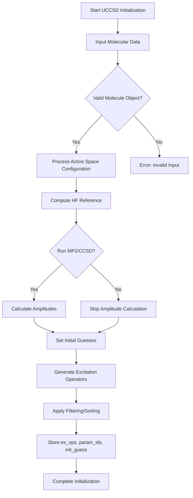
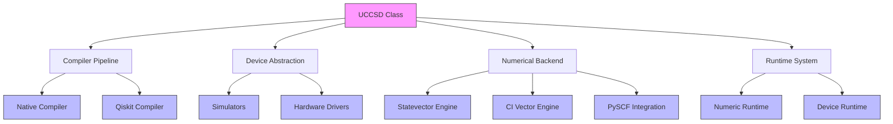

# UCCSD Algorithm

<cite>
**Referenced Files in This Document**   
- [uccsd.py](file://src/tyxonq/applications/chem/algorithms/uccsd.py)
- [molecule.py](file://src/tyxonq/applications/chem/molecule.py)
- [ucc_numeric_runtime.py](file://src/tyxonq/applications/chem/runtimes/ucc_numeric_runtime.py)
- [cloud_uccsd_hea_demo.py](file://examples/cloud_uccsd_hea_demo.py)
- [api.py](file://src/tyxonq/compiler/api.py)
- [ucc.py](file://src/tyxonq/applications/chem/algorithms/ucc.py) - *Added in recent commit*
</cite>

## Update Summary
**Changes Made**   
- Added new section on HOMO-LUMO gap calculation with detailed method descriptions
- Added documentation for `get_homo_lumo_gap` method and `homo_lumo_gap` property
- Updated referenced files to include ucc.py which contains the new HOMO-LUMO functionality
- Enhanced example usage section with HOMO-LUMO gap calculation examples

## Table of Contents
1. [Introduction](#introduction)
2. [UCCSD Class Initialization](#uccsd-class-initialization)
3. [Excitation Operator Generation](#excitation-operator-generation)
4. [Retrieving Excitation Operators and Parameters](#retrieving-excitation-operators-and-parameters)
5. [Accessing Final Energy Results](#accessing-final-energy-results)
6. [HOMO-LUMO Gap Calculation](#homo-lumo-gap-calculation)
7. [Example Usage with H2 Molecule](#example-usage-with-h2-molecule)
8. [Integration with Core Framework](#integration-with-core-framework)
9. [Configuration Options](#configuration-options)

## Introduction
The Unitary Coupled Cluster Singles and Doubles (UCCSD) algorithm in TyxonQ is a quantum chemistry method used for simulating molecular systems on quantum computers. It implements the UCCSD ansatz to approximate the ground state energy of molecules by constructing a parameterized quantum circuit based on single and double excitation operators derived from Hartree-Fock references. This documentation details the API for the UCCSD class, covering initialization parameters, excitation operator handling, energy computation, and integration with the broader TyxonQ framework.

**Section sources**
- [uccsd.py](file://src/tyxonq/applications/chem/algorithms/uccsd.py#L17-L229)

## UCCSD Class Initialization
The UCCSD class is initialized with molecular input parameters that define the system under study. The primary input is a PySCF `Mole` object or an RHF object, which contains all necessary molecular information such as atomic coordinates, basis set, charge, and spin multiplicity.

Key initialization parameters include:
- **mol**: The molecular system as a PySCF `Mole` or `RHF` object
- **init_method**: Method for determining initial amplitude guesses, accepting values like "mp2" (default), "ccsd", "fe", and "zeros"
- **active_space**: Tuple specifying the number of active electrons and orbitals for active space approximation
- **active_orbital_indices**: List of orbital indices to include in the active space
- **mo_coeff**: Optional molecular orbital coefficients; if provided, skips RHF calculation
- **pick_ex2**: Boolean flag to screen out two-body excitations based on initial guess amplitude
- **epsilon**: Threshold value (default 1e-12) for discarding small-amplitude excitations
- **sort_ex2**: Whether to sort two-body excitations by amplitude magnitude
- **mode**: Particle symmetry handling mode, either "fermion" (default) or "qubit"
- **runtime**: Execution environment, typically 'device' for quantum hardware simulation
- **numeric_engine**: Backend engine for numerical computations
- **classical_provider**: Classical computation provider, supporting "local" or cloud-based options
- **classical_device**: Device specification for classical computations

When `init_method` is set to "zeros", both `pick_ex2` and `sort_ex2` are automatically disabled. The initialization process computes necessary quantum chemistry data including Hartree-Fock energy, MP2/CCSD amplitudes, and FCI reference energies when requested.



**Diagram sources **
- [uccsd.py](file://src/tyxonq/applications/chem/algorithms/uccsd.py#L33-L143)

**Section sources**
- [uccsd.py](file://src/tyxonq/applications/chem/algorithms/uccsd.py#L33-L143)

## Excitation Operator Generation
The excitation operator generation process in UCCSD involves creating both single and double excitation operators while applying filtering and ordering based on amplitude thresholds. The algorithm uses the `pick_ex2` and `sort_ex2` parameters to control this process.

The `pick_and_sort` method handles the filtering and sorting of two-body excitation operators:
- When `do_pick` is True, excitations with amplitudes below the `t2_discard_eps` threshold are discarded
- When `do_sort` is True, operators are sorted in descending order of amplitude magnitude
- The method ensures unique parameter IDs are assigned and properly mapped

This process helps optimize the ansatz by removing negligible excitations and prioritizing significant ones, potentially improving convergence during optimization. The filtering threshold (`epsilon`) defaults to 1e-12, which is sufficiently small to only remove numerically insignificant terms while preserving physically meaningful excitations.

```mermaid
flowchart TD
A[Start pick_and_sort] --> B{do_sort?}
B --> |Yes| C[Sort ex_ops by amplitude]
B --> |No| D[List ex_ops as-is]
C --> E[Sorted Operators]
D --> E
E --> F[Iterate Through Operators]
F --> G{do_pick and |amp| < eps?}
G --> |Yes| H[Skip Operator]
G --> |No| I[Include Operator]
H --> J
I --> J
J --> K[Collect ex_ops, param_ids]
K --> L[Find Unique param_ids]
L --> M[Map to Sequential IDs]
M --> N[Return Filtered/Scaled Results]
```

**Diagram sources **
- [uccsd.py](file://src/tyxonq/applications/chem/algorithms/uccsd.py#L200-L220)

**Section sources**
- [uccsd.py](file://src/tyxonq/applications/chem/algorithms/uccsd.py#L200-L220)

## Retrieving Excitation Operators and Parameters
The `get_ex_ops` method retrieves the complete set of excitation operators, parameter mappings, and initial guesses for the UCCSD ansatz. This method combines single and double excitation operators while applying the configured filtering and sorting logic.

The method returns three components:
- **ex_op**: List of excitation operators represented as tuples of integers
- **param_ids**: Mapping from excitations to parameter indices
- **init_guess**: Initial parameter values for optimization

Single excitation operators are generated first, followed by double excitations. The double excitations are then processed through the `pick_and_sort` method according to the `pick_ex2` and `sort_ex2` settings. The parameter IDs for double excitations are offset by the maximum single excitation parameter ID plus one to ensure unique parameter indexing across all excitation types.

The returned excitation operators follow the format where single excitations are represented as (a, i) indicating excitation from orbital i to a, and double excitations as (b, a, j, i) indicating simultaneous excitations from orbitals i,j to a,b.

**Section sources**
- [uccsd.py](file://src/tyxonq/applications/chem/algorithms/uccsd.py#L147-L198)

## Accessing Final Energy Results
The `e_uccsd` property provides access to the final energy results after UCCSD calculation. This property returns the computed UCCSD energy as a float value through the `energy()` method call.

The energy calculation incorporates both electronic and nuclear repulsion components, providing the total molecular energy. The property serves as a convenient accessor for the optimized energy value, which can be compared against reference methods like FCI (Full Configuration Interaction) to assess accuracy.

The energy computation can be performed using different runtime backends, with the choice between device-based quantum simulation and numeric computation paths. When shots are set to zero, the system automatically routes to the analytic numeric engine path for exact results without sampling noise.

**Section sources**
- [uccsd.py](file://src/tyxonq/applications/chem/algorithms/uccsd.py#L223-L227)

## HOMO-LUMO Gap Calculation
The UCCSD class provides methods for calculating the HOMO-LUMO gap, which is the energy difference between the highest occupied molecular orbital (HOMO) and the lowest unoccupied molecular orbital (LUMO). This gap is a key indicator of molecular stability and reactivity.

### get_homo_lumo_gap Method
The `get_homo_lumo_gap` method calculates the HOMO-LUMO gap and returns detailed information about the orbital energies:

**Parameters:**
- **homo_idx**: Manual specification of HOMO orbital index (0-based). If None, automatically determined from electron count.
- **lumo_idx**: Manual specification of LUMO orbital index (0-based). If None, automatically determined from electron count.
- **include_ev**: Whether to include eV conversion in output. Default False.

**Returns:**
- **homo_energy**: Energy of HOMO orbital (Hartree)
- **lumo_energy**: Energy of LUMO orbital (Hartree)
- **gap**: HOMO-LUMO energy gap (Hartree)
- **gap_ev**: HOMO-LUMO energy gap (eV) [only if include_ev=True]
- **homo_idx**: Index of HOMO orbital
- **lumo_idx**: Index of LUMO orbital
- **system_type**: 'closed-shell' or 'open-shell'

For closed-shell systems (spin=0): HOMO index = (n_electrons // 2) - 1, LUMO index = n_electrons // 2.
For open-shell systems (spin≠0): Uses orbital occupation analysis.
Orbital energies are obtained from the Hartree-Fock calculation.

### homo_lumo_gap Property
The `homo_lumo_gap` property provides a convenient way to access the HOMO-LUMO energy gap in Hartree units. It automatically determines HOMO and LUMO based on the molecular system and returns the gap value.

**Returns:**
- **float**: HOMO-LUMO gap in Hartree

**Section sources**
- [ucc.py](file://src/tyxonq/applications/chem/algorithms/ucc.py#L1089-L1246) - *Added in recent commit*

## Example Usage with H2 Molecule
The following example demonstrates UCCSD initialization and energy calculation for the hydrogen molecule (H2):

```python
from tyxonq.chem import UCCSD
from tyxonq.chem.molecule import h2

# Initialize UCCSD with H2 molecule
uccsd = UCCSD(h2)
# Run UCCSD calculation
e_ucc = uccsd.kernel()
# Access final energy
print(f"UCCSD energy: {e_ucc}")
```

Another example shows cloud-based computation using PySCF molecules:

```python
from pyscf import gto
from tyxonq.applications.chem.algorithms.uccsd import UCCSD

def build_h2():
    m = gto.Mole()
    m.atom = "H 0 0 0; H 0 0 0.74"
    m.basis = "sto-3g"
    m.charge = 0
    m.spin = 0
    m.build()
    return m

# Create molecule and run UCCSD
mol = build_h2()
ucc_local = UCCSD(mol)
e_local = ucc_local.kernel(shots=0, runtime="device", provider="simulator", device="statevector")
print(f"UCCSD local energy: {e_local}")
```

Example of HOMO-LUMO gap calculation:

```python
# Calculate HOMO-LUMO gap
gap_info = uccsd.get_homo_lumo_gap()
print(f"HOMO-LUMO gap: {gap_info['gap']:.6f} Hartree")

# Include eV conversion
gap_info = uccsd.get_homo_lumo_gap(include_ev=True)
print(f"HOMO-LUMO gap: {gap_info['gap_ev']:.6f} eV")

# Access the gap through property
gap = uccsd.homo_lumo_gap
print(f"Gap: {gap:.6f} Hartree")
```

These examples illustrate both direct molecule input using predefined molecules and explicit molecular construction through PySCF's Mole object.

**Section sources**
- [cloud_uccsd_hea_demo.py](file://examples/cloud_uccsd_hea_demo.py#L20-L56)
- [molecule.py](file://src/tyxonq/applications/chem/molecule.py#L200-L210)
- [ucc.py](file://src/tyxonq/applications/chem/algorithms/ucc.py#L1089-L1246) - *Added in recent commit*

## Integration with Core Framework
The UCCSD algorithm integrates with TyxonQ's core framework components through several key interfaces:

1. **Compiler Pipeline**: The generated UCCSD circuits are processed through the compiler pipeline, which handles circuit optimization, gate decomposition, and hardware-specific compilation. The `compile` function in `compiler/api.py` manages this process, supporting different compilation engines and output formats.

2. **Device Abstraction**: UCCSD calculations can target different execution environments through the device abstraction layer. This allows seamless switching between local simulators, cloud-based quantum processors, and various numerical backends.

3. **Numerical Backends**: The algorithm supports multiple numerical computation engines including "statevector", "civector", "civector-large", and "pyscf". The choice of backend affects both performance and accuracy characteristics.

4. **Runtime System**: The UCCSD class interfaces with runtime systems through `UCCNumericRuntime` and `UCCDeviceRuntime`, enabling both numeric simulation and device-based execution paths.

The integration architecture follows a modular design where the UCCSD class delegates specific responsibilities to specialized components, ensuring separation of concerns and flexibility in implementation choices.



**Diagram sources **
- [uccsd.py](file://src/tyxonq/applications/chem/algorithms/uccsd.py#L17-L229)
- [ucc_numeric_runtime.py](file://src/tyxonq/applications/chem/runtimes/ucc_numeric_runtime.py#L41-L241)
- [api.py](file://src/tyxonq/compiler/api.py#L40-L65)

**Section sources**
- [ucc_numeric_runtime.py](file://src/tyxonq/applications/chem/runtimes/ucc_numeric_runtime.py#L41-L241)
- [api.py](file://src/tyxonq/compiler/api.py#L40-L65)

## Configuration Options
The UCCSD algorithm supports various configuration options for different runtime environments and numerical backends:

**Runtime Configuration:**
- **runtime**: Specifies execution mode ('device' or 'numeric')
- **provider**: Quantum computing provider ('simulator', 'local', or cloud provider)
- **device**: Target device specification
- **shots**: Number of measurement shots (0 for exact analytic results)

**Numerical Backend Options:**
- **numeric_engine**: Computation engine choice:
  - "statevector": Full statevector simulation
  - "civector": Configuration Interaction vector
  - "civector-large": Large-scale CI vector
  - "pyscf": Direct integration with PySCF
- **trotter**: Whether to use Trotter decomposition for evolution
- **decompose_multicontrol**: Control over multi-qubit gate decomposition

**Classical Computation Settings:**
- **classical_provider**: Source for classical quantum chemistry calculations
  - "local": Local PySCF computation
  - "tyxonq": Cloud-based classical computation
- **classical_device**: Device specification for classical processing
- **run_fci**: Whether to compute FCI reference energy

**Optimization Parameters:**
- **scipy_minimize_options**: Custom optimization settings
- **grad**: Gradient computation method ("param-shift")
- **maxiter**: Maximum optimization iterations
- **ftol/gtol**: Convergence tolerances

These configuration options enable flexible deployment across different computational environments, from local development to cloud-based high-performance computing resources.

**Section sources**
- [uccsd.py](file://src/tyxonq/applications/chem/algorithms/uccsd.py#L33-L143)
- [ucc_numeric_runtime.py](file://src/tyxonq/applications/chem/runtimes/ucc_numeric_runtime.py#L41-L241)