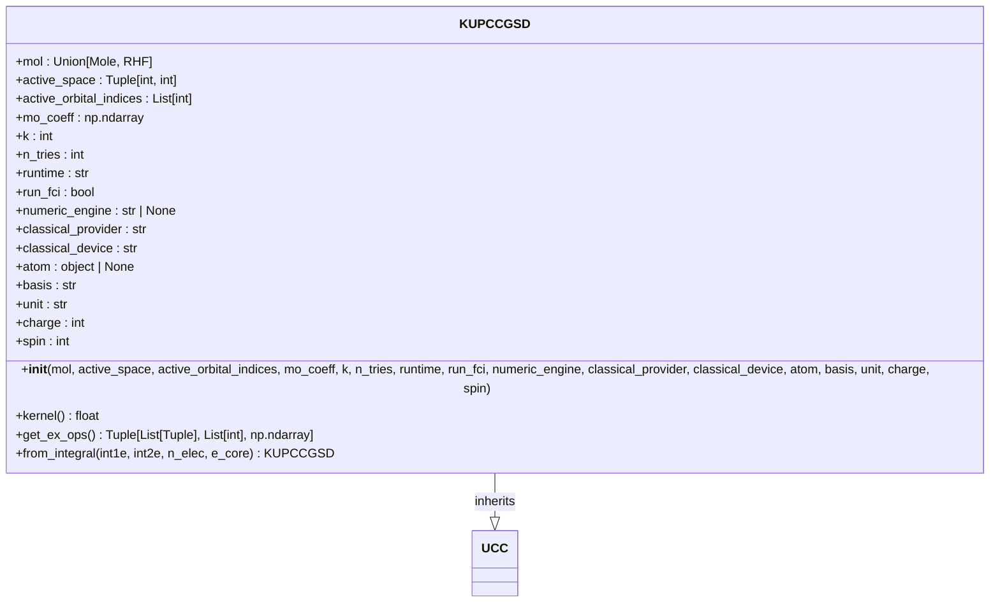
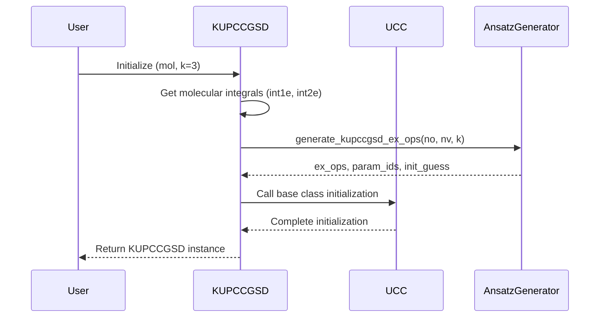
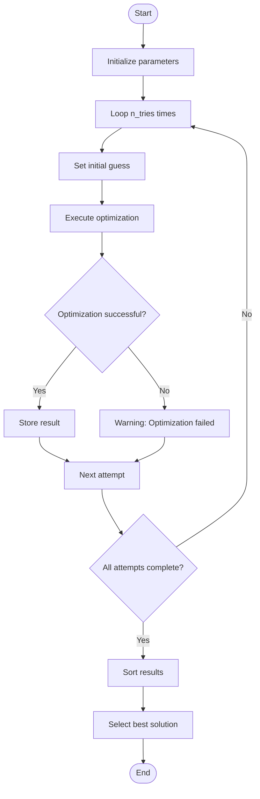
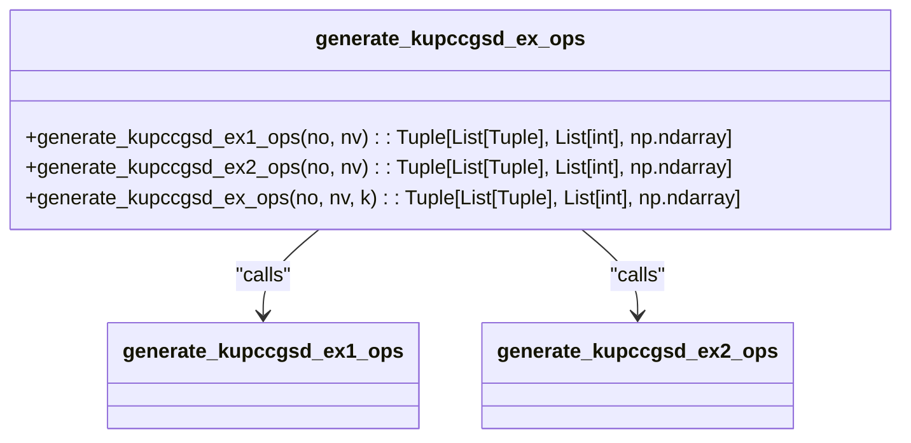
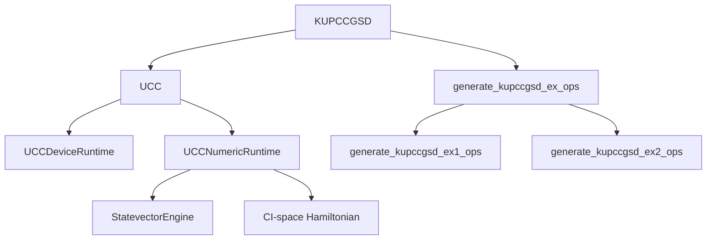

# k-UpCCGSD Algorithm

<cite>
**Referenced Files in This Document**   
- [kupccgsd.py](file://src/tyxonq/applications/chem/algorithms/kupccgsd.py)
- [ucc.py](file://src/tyxonq/applications/chem/algorithms/ucc.py)
- [molecule.py](file://src/tyxonq/applications/chem/molecule.py)
- [uccsd.py](file://src/tyxonq/applications/chem/algorithms/uccsd.py)
</cite>

## Table of Contents
1. [Introduction](#introduction)
2. [Core Components](#core-components)
3. [Architecture Overview](#architecture-overview)
4. [Detailed Component Analysis](#detailed-component-analysis)
5. [Dependency Analysis](#dependency-analysis)
6. [Performance Considerations](#performance-considerations)
7. [Troubleshooting Guide](#troubleshooting-guide)
8. [Conclusion](#conclusion)

## Introduction
The k-UpCCGSD (k-Unitary Pair Coupled Cluster Generalized Singles and Doubles) algorithm is an advanced quantum chemistry method designed to enhance the description of strongly correlated electron systems. It extends the standard UCCSD approach by introducing a k-layer structure that improves the ansatz's expressive power while maintaining a regular circuit pattern. This algorithm is particularly effective for large molecules and complex electronic structures where traditional methods may struggle. The k-UpCCGSD implementation in TyxonQ inherits from the UCC base class, leveraging existing infrastructure for gradient computation and optimization while introducing specialized excitation operators and a multi-try optimization strategy. The algorithm's design focuses on balancing computational complexity with accuracy, making it suitable for execution on both quantum devices and numerical simulators.

## Core Components

The core component of the k-UpCCGSD algorithm is the `KUPCCGSD` class, which inherits from the `_UCCBase` (UCC) class. This class implements the generalized singles and paired doubles excitation operators specific to the k-UpCCGSD approach. The initialization process involves setting up molecular parameters, active space configuration, and the k parameter that controls the excitation level. The algorithm generates excitation operators through the `get_ex_ops` method, which combines generalized single excitations and paired double excitations in a k-layer structure. The optimization workflow is managed by the `kernel` method, which implements a multi-try strategy to improve the likelihood of finding the global energy minimum. The class also provides methods for retrieving excitation operators and constructing instances from molecular integrals.

**Section sources**
- [kupccgsd.py](file://src/tyxonq/applications/chem/algorithms/kupccgsd.py#L20-L118)
- [kupccgsd.py](file://src/tyxonq/applications/chem/algorithms/kupccgsd.py#L120-L150)

## Architecture Overview

The k-UpCCGSD algorithm follows a modular architecture built upon the UCC framework. It inherits core functionality from the UCC base class while implementing specialized methods for excitation operator generation and optimization. The algorithm's structure allows for execution on both quantum devices and numerical backends through the runtime parameter. The architecture supports various configuration options for different computational environments, including classical provider and device specifications. The k-UpCCGSD implementation integrates with TyxonQ's chemistry library for molecular Hamiltonian construction and energy calculation.

**Diagram sources**
- [kupccgsd.py](file://src/tyxonq/applications/chem/algorithms/kupccgsd.py#L0-L378)

## Detailed Component Analysis

### KUPCCGSD Class Analysis

The `KUPCCGSD` class is the primary implementation of the k-UpCCGSD algorithm, inheriting from the UCC base class to reuse optimization and gradient computation infrastructure.

#### Initialization Method
The `__init__` method initializes the k-UpCCGSD algorithm with molecular input, active space parameters, and the k parameter that controls the excitation level. It accepts various configuration options including molecular specification, active space definition, and runtime environment settings. The method sets up the number of layers (k) and the number of optimization tries (n_tries), then generates the excitation operators and initial parameter guesses.

**Diagram sources**
- [kupccgsd.py](file://src/tyxonq/applications/chem/algorithms/kupccgsd.py#L20-L118)

#### Optimization Method
The `kernel` method implements the energy optimization workflow, executing multiple optimization runs with different initial parameter values to increase the probability of finding the global energy minimum. The method records the energy from each attempt and selects the lowest energy result as the final solution.

**Diagram sources**
- [kupccgsd.py](file://src/tyxonq/applications/chem/algorithms/kupccgsd.py#L120-L150)
- [ucc.py](file://src/tyxonq/applications/chem/algorithms/ucc.py#L153-L204)

### Excitation Operator Generation Analysis

The excitation operator generation in k-UpCCGSD follows a systematic approach that creates generalized singles and paired doubles operators. The `get_ex_ops` method combines these operators in a k-layer structure, where each layer contains the complete set of excitation operators.

**Diagram sources**
- [kupccgsd.py](file://src/tyxonq/applications/chem/algorithms/kupccgsd.py#L152-L202)

**Section sources**
- [kupccgsd.py](file://src/tyxonq/applications/chem/algorithms/kupccgsd.py#L152-L202)

## Dependency Analysis

The k-UpCCGSD algorithm has several key dependencies that enable its functionality. It inherits from the UCC base class, which provides essential infrastructure for optimization, gradient computation, and energy evaluation. The algorithm relies on molecular data structures from the molecule module for input representation. It also depends on the chemistry library for Hamiltonian construction and excitation operator generation. The runtime system allows the algorithm to execute on different computational backends, with dependencies on both device drivers and numerical simulation engines.

**Diagram sources**
- [kupccgsd.py](file://src/tyxonq/applications/chem/algorithms/kupccgsd.py#L20-L118)
- [ucc.py](file://src/tyxonq/applications/chem/algorithms/ucc.py#L24-L481)

**Section sources**
- [kupccgsd.py](file://src/tyxonq/applications/chem/algorithms/kupccgsd.py#L20-L118)
- [ucc.py](file://src/tyxonq/applications/chem/algorithms/ucc.py#L24-L481)

## Performance Considerations

The performance of the k-UpCCGSD algorithm is primarily influenced by the k parameter and the size of the active space. The k parameter directly affects circuit depth and the number of variational parameters, with higher k values increasing computational complexity exponentially. The algorithm's multi-try optimization strategy improves the likelihood of finding the global minimum but also increases computational cost proportionally to the number of tries. For large molecules or complex electronic structures, the algorithm may require significant computational resources, particularly when executed on quantum devices with limited qubit connectivity. The choice of numerical backend (numpy, cupy, or pytorch) can significantly impact performance, with GPU-accelerated backends providing substantial speedups for large-scale calculations. Memory usage scales with the size of the CI space, making the algorithm more suitable for systems with moderate numbers of orbitals and electrons.

## Troubleshooting Guide

When using the k-UpCCGSD algorithm, several issues may arise that require troubleshooting. Optimization failures are common and can be addressed by adjusting the number of tries (n_tries) or modifying the initial parameter ranges. Memory allocation errors may occur for large active spaces and can be mitigated by reducing the active space size or using more efficient numerical backends. Convergence issues may be resolved by adjusting optimization parameters or using different classical optimizers. When executing on quantum devices, circuit compilation errors may occur due to hardware constraints, which can be addressed by adjusting the circuit depth or using different qubit mappings. For numerical simulations, precision issues may arise from floating-point errors, which can be mitigated by using higher precision arithmetic or different numerical algorithms.

**Section sources**
- [kupccgsd.py](file://src/tyxonq/applications/chem/algorithms/kupccgsd.py#L20-L118)
- [ucc.py](file://src/tyxonq/applications/chem/algorithms/ucc.py#L24-L481)

## Conclusion

The k-UpCCGSD algorithm represents a significant advancement in quantum chemistry methods, offering improved accuracy for strongly correlated systems while maintaining a regular circuit structure suitable for near-term quantum devices. By introducing a k-layer structure with generalized singles and paired doubles excitations, the algorithm achieves a better balance between expressive power and computational complexity compared to standard UCCSD methods. The implementation in TyxonQ provides a flexible framework that supports various molecular inputs, active space configurations, and runtime environments. The multi-try optimization strategy enhances the algorithm's robustness, increasing the likelihood of finding accurate energy estimates. Future developments could focus on optimizing the excitation operator selection, improving the parameter initialization methods, and extending the algorithm to handle more complex chemical systems and reaction pathways.