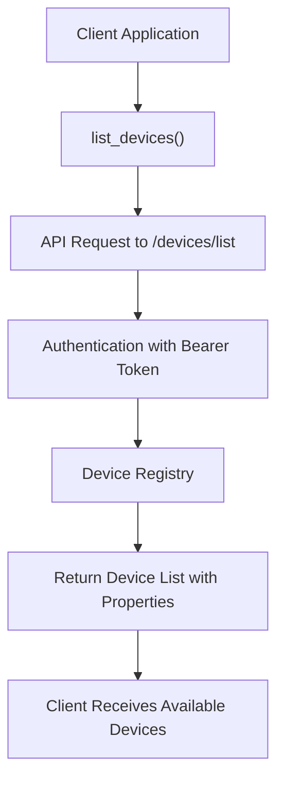
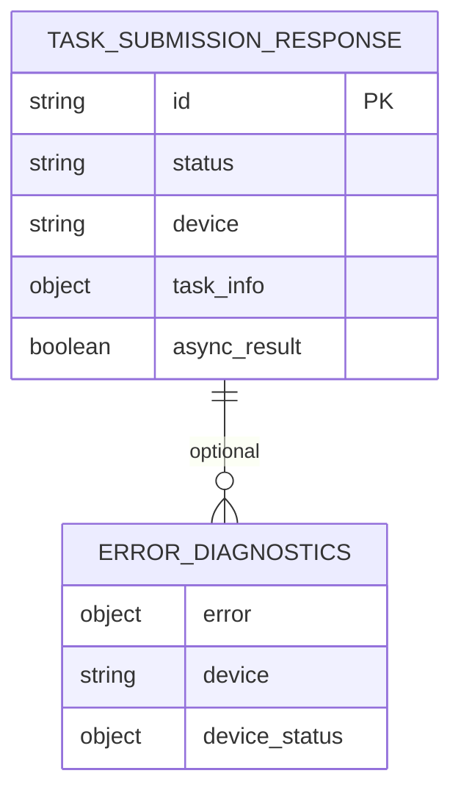
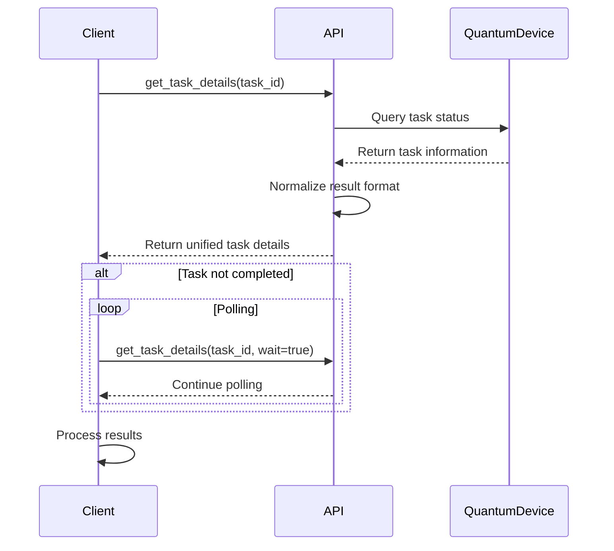
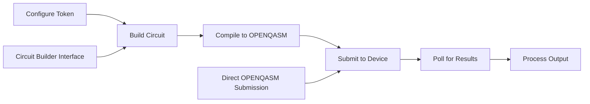

# Cloud API

<cite>
**Referenced Files in This Document**   
- [api.py](file://src/tyxonq/cloud/api.py)
- [driver.py](file://src/tyxonq/devices/hardware/tyxonq/driver.py)
- [config.py](file://src/tyxonq/devices/hardware/config.py)
- [circuit.py](file://src/tyxonq/core/ir/circuit.py)
- [cloud_api_devices.py](file://examples/cloud_api_devices.py)
- [cloud_api_task.py](file://examples/cloud_api_task.py)
- [cloud_api_task_qaoa.py](file://examples/cloud_api_task_qaoa.py)
</cite>

## Table of Contents
1. [Introduction](#introduction)
2. [Authentication Mechanism](#authentication-mechanism)
3. [Device Management](#device-management)
4. [Task Submission Process](#task-submission-process)
5. [Task Submission Response Format](#task-submission-response-format)
6. [Task Details and Listing](#task-details-and-listing)
7. [SDK Integration Layer](#sdk-integration-layer)
8. [Workflow Examples](#workflow-examples)
9. [Error Handling and Diagnostics](#error-handling-and-diagnostics)
10. [Rate Limiting and Best Practices](#rate-limiting-and-best-practices)

## Introduction
The Tyxonq Cloud module provides a RESTful quantum API gateway for managing quantum devices and submitting quantum tasks. This documentation details the cloud API's functionality, including device management, task submission, authentication, and SDK integration. The API enables users to interact with quantum hardware such as the Homebrew_S2 processor and simulators through a standardized interface. The system supports both direct quantum circuit submission and high-level SDK functions for seamless integration into quantum computing workflows.

## Authentication Mechanism
The Tyxonq Cloud API uses Bearer token authentication for secure access to quantum resources. Users must configure their API key using the `set_token` function, which stores the token in memory for the current session. The token can be provided directly or through the `TYXONQ_API_KEY` environment variable. Authentication is automatically included in all API requests through the Authorization header with the Bearer scheme. The system prioritizes in-memory tokens over environment variables and does not persist tokens to disk, ensuring security. For convenience, tokens can be scoped to specific providers or devices, allowing flexible access management across different quantum computing resources.

**Section sources**
- [config.py](file://src/tyxonq/devices/hardware/config.py#L20-L39)
- [api.py](file://src/tyxonq/cloud/api.py#L21-L22)

## Device Management
The cloud API provides endpoints for discovering and managing available quantum devices. Users can list all accessible devices through the `list_devices` function, which returns device identifiers with provider prefixes. Each device has specific properties including qubit count, connectivity, and operational status. The API supports both physical quantum processors and various simulator backends. Device selection can be optimized through flags that specify performance characteristics or experimental configurations. The system maintains default device settings that can be overridden at runtime, allowing users to target specific hardware configurations for their quantum tasks.

**Diagram sources **
- [driver.py](file://src/tyxonq/devices/hardware/tyxonq/driver.py#L44-L80)
- [cloud_api_devices.py](file://examples/cloud_api_devices.py#L1-L28)

## Task Submission Process
The task submission process in Tyxonq Cloud involves several key components: device selection, shot configuration, and circuit source formatting. Users can submit quantum circuits either as pre-compiled source code (such as OPENQASM) or as high-level circuit objects that are automatically compiled. The API supports optimization flags that influence compilation and execution strategies. Shot configuration allows users to specify the number of repetitions for statistical accuracy, with support for both single and batched shot values. Circuit sources can be provided in multiple formats, with OPENQASM being the primary format for direct hardware execution. The system automatically handles compilation when necessary, converting high-level circuit representations to device-specific instructions.

**Section sources**
- [driver.py](file://src/tyxonq/devices/hardware/tyxonq/driver.py#L82-L124)
- [circuit.py](file://src/tyxonq/core/ir/circuit.py#L404-L515)

## Task Submission Response Format
When a task is submitted to the Tyxonq Cloud API, the response contains essential information for tracking and retrieving results. The response includes a unique task identifier (ID), submission status, and device information. For successful submissions, the response contains the task ID which is used for subsequent status checks and result retrieval. Error responses include diagnostic information and, when possible, device status details to aid troubleshooting. The response format is consistent across different submission methods, whether using direct API calls or SDK functions. The system returns a list of task objects even for single submissions to maintain a uniform interface for batch and individual task processing.

**Diagram sources **
- [driver.py](file://src/tyxonq/devices/hardware/tyxonq/driver.py#L105-L124)
- [api.py](file://src/tyxonq/cloud/api.py#L41-L62)

## Task Details and Listing
The Tyxonq Cloud API provides comprehensive endpoints for retrieving task details and monitoring execution status. The `get_task_details` function allows users to query the current state of a submitted task, including execution progress, timing information, and final results. Task details include metadata such as queue position, scheduled time, execution duration, and completion timestamp. The response format normalizes results across different device types, providing a unified interface for accessing measurement outcomes. For completed tasks, the response includes the full result payload with measurement counts and additional metadata. The API supports both synchronous and asynchronous result retrieval, with configurable polling intervals and timeouts for long-running tasks.

**Diagram sources **
- [driver.py](file://src/tyxonq/devices/hardware/tyxonq/driver.py#L128-L166)
- [circuit.py](file://src/tyxonq/core/ir/circuit.py#L739-L776)

## SDK Integration Layer
The Tyxonq SDK provides high-level functions that simplify cloud integration and quantum task management. The integration layer includes convenience functions such as `set_token`, `submit_task`, and `run` that abstract the underlying API complexity. These functions are accessible through multiple entry points, including `tyxonq.api`, `tyxonq.apis`, and top-level `tyxonq` module functions, ensuring backward compatibility. The `run` function combines circuit compilation, task submission, and result retrieval into a single operation, with options to wait for completion or return immediately with a task handle. The SDK automatically handles compilation to device-specific formats like OPENQASM when submitting to quantum hardware, while supporting direct execution for simulators. This abstraction layer enables users to write portable code that works across different quantum computing backends.

**Section sources**
- [api.py](file://src/tyxonq/cloud/api.py#L73-L93)
- [circuit.py](file://src/tyxonq/core/ir/circuit.py#L539-L550)
- [__init__.py](file://src/tyxonq/__init__.py#L41-L81)

## Workflow Examples
The Tyxonq Cloud API supports multiple workflow patterns for quantum task execution, as demonstrated in the provided examples. The legacy-style workflow involves submitting pre-compiled OPENQASM source directly through the API facade, giving users fine-grained control over the quantum circuit representation. The chain-style workflow uses the Circuit class to build quantum circuits programmatically, then chains compilation, device configuration, and execution steps together in a fluent interface. Both workflows support asynchronous execution with polling for results. The examples demonstrate complete end-to-end processes from token configuration to result retrieval, including error handling and timing considerations. These patterns illustrate how users can integrate quantum computing into their applications using either low-level API access or high-level SDK abstractions.

**Diagram sources **
- [cloud_api_task.py](file://examples/cloud_api_task.py#L1-L64)
- [cloud_api_task_qaoa.py](file://examples/cloud_api_task_qaoa.py#L1-L84)

## Error Handling and Diagnostics
The Tyxonq Cloud API implements comprehensive error handling and diagnostic capabilities to assist users in troubleshooting quantum task execution. When a task submission fails, the system provides detailed error information including the specific error message and, when available, device status details. The API attempts to fetch device properties for diagnostics when submission errors occur, helping users identify configuration issues or device availability problems. Common error scenarios include invalid authentication tokens, unsupported circuit operations, and device-specific constraints. The system raises descriptive exceptions that include both the error response and relevant context information. For quantum hardware execution, the API handles transient failures through appropriate timeouts and retry logic, while providing clear feedback on task completion status.

**Section sources**
- [driver.py](file://src/tyxonq/devices/hardware/tyxonq/driver.py#L110-L124)
- [circuit.py](file://src/tyxonq/core/ir/circuit.py#L404-L515)

## Rate Limiting and Best Practices
When integrating with the Tyxonq Cloud API, users should follow best practices to ensure efficient and reliable quantum task execution. The API implements rate limiting to maintain system stability and fair resource allocation among users. Best practices include using batched operations when submitting multiple circuits, implementing exponential backoff for polling long-running tasks, and properly handling authentication tokens. Users should configure appropriate timeouts based on expected circuit execution duration and implement robust error handling for transient failures. For optimal performance, circuits should be pre-compiled when possible, and shot counts should be chosen based on the required statistical accuracy. The SDK's high-level functions like `run` with `wait=True` provide convenient abstractions that handle many of these considerations automatically, making them suitable for most use cases.

**Section sources**
- [driver.py](file://src/tyxonq/devices/hardware/tyxonq/driver.py#L82-L124)
- [circuit.py](file://src/tyxonq/core/ir/circuit.py#L404-L515)