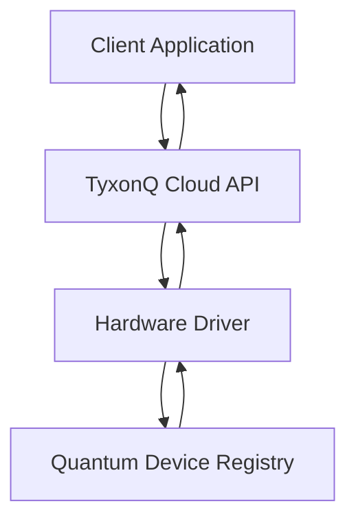
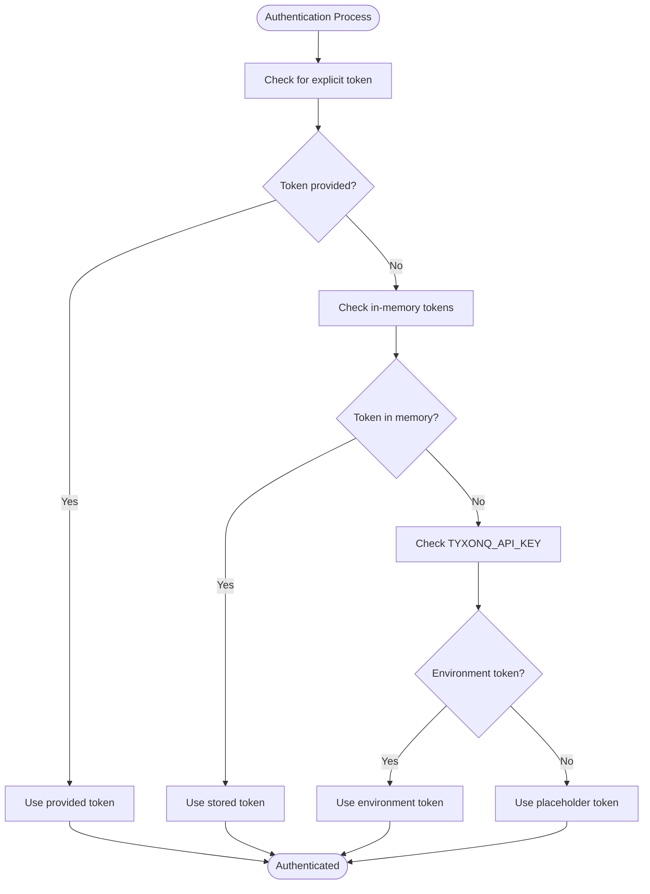

# Device Management

<cite>
**Referenced Files in This Document**   
- [cloud_api_devices.py](file://examples/cloud_api_devices.py)
- [api.py](file://src/tyxonq/cloud/api.py)
- [driver.py](file://src/tyxonq/devices/hardware/tyxonq/driver.py)
- [config.py](file://src/tyxonq/devices/hardware/config.py)
</cite>

## Table of Contents
1. [Introduction](#introduction)
2. [API Endpoint Overview](#api-endpoint-overview)
3. [Authentication](#authentication)
4. [Request Structure](#request-structure)
5. [Response Format](#response-format)
6. [Device Properties](#device-properties)
7. [Usage Examples](#usage-examples)
8. [Error Handling](#error-handling)
9. [Best Practices](#best-practices)

## Introduction

The TyxonQ Cloud API provides access to quantum computing resources through a RESTful interface. The Device Management system enables users to discover available quantum hardware and retrieve detailed specifications for informed decision-making in quantum algorithm development and execution. This documentation focuses on the `/api/v1/devices/list` endpoint, which serves as the primary interface for enumerating and inspecting quantum devices accessible through the TyxonQ platform.

The API is designed to support both interactive exploration and programmatic integration, allowing researchers and developers to select appropriate hardware based on specific quantum computing requirements such as qubit count, coherence times, and gate fidelity.

**Section sources**
- [api.py](file://src/tyxonq/cloud/api.py#L1-L50)
- [driver.py](file://src/tyxonq/devices/hardware/tyxonq/driver.py#L1-L40)

## API Endpoint Overview

The Device Management functionality is exposed through the POST `/api/v1/devices/list` endpoint, which returns comprehensive information about available quantum devices. This endpoint is implemented within the TyxonQ hardware driver and accessed through the cloud API facade.

The endpoint follows a provider-based architecture where "tyxonq" represents the quantum computing provider. The base URL and API version are configurable through environment variables or default settings, allowing for flexible deployment configurations.



**Diagram sources**
- [api.py](file://src/tyxonq/cloud/api.py#L37-L38)
- [driver.py](file://src/tyxonq/devices/hardware/tyxonq/driver.py#L55-L61)

## Authentication

Access to the Device Management API requires authentication using Bearer tokens. The system supports multiple methods for token provision:

1. **Explicit token parameter**: Pass the token directly in the API call
2. **Environment variable**: Set the `TYXONQ_API_KEY` environment variable
3. **Runtime input**: Provide the token programmatically using `set_token()`
4. **Interactive input**: Enter the token via command-line prompt

The authentication system first checks for an explicitly provided token, then looks for in-memory tokens set via `set_token()`, and finally falls back to the `TYXONQ_API_KEY` environment variable. If no token is available, a placeholder "ANY;0" token is used, which may provide limited access to public device information.



**Diagram sources**
- [config.py](file://src/tyxonq/devices/hardware/config.py#L40-L55)
- [driver.py](file://src/tyxonq/devices/hardware/tyxonq/driver.py#L44-L50)

## Request Structure

The POST `/api/v1/devices/list` request accepts optional filter parameters in the JSON payload. The request structure consists of:

- **HTTP Method**: POST
- **Endpoint**: `/api/v1/devices/list`
- **Content-Type**: application/json
- **Authentication**: Bearer token in Authorization header
- **Body**: Optional JSON object with filter criteria

The base URL and API version are configured in the `ENDPOINTS` dictionary, with defaults that can be overridden by environment variables `TYXONQ_BASE_URL` and `TYXONQ_API_VERSION`.

When no filter parameters are provided, the endpoint returns information about all available devices. Filter parameters can be used to narrow the results based on specific criteria, though the exact filter options are not specified in the current implementation.

**Section sources**
- [driver.py](file://src/tyxonq/devices/hardware/tyxonq/driver.py#L55-L61)
- [config.py](file://src/tyxonq/devices/hardware/config.py#L10-L15)

## Response Format

The API returns a JSON response containing a list of available devices with their specifications. The response structure includes:

- **devices**: Array of device objects, each containing:
  - id: Unique identifier for the device
  - qubit_count: Number of physical qubits
  - connectivity: Qubit connectivity topology
  - coherence_times: T1 and T2 relaxation times
  - gate_fidelities: Single-qubit and two-qubit gate error rates
  - operational_state: Current availability status
  - native_gates: Supported native gate set
  - calibration_date: Timestamp of last calibration

The client-side implementation transforms the raw API response by prefixing device IDs with "tyxonq::" to create fully qualified device identifiers that can be used in subsequent API calls for task submission.

```json
[
  "tyxonq::device_001",
  "tyxonq::device_002"
]
```

For detailed device properties, a separate call to `list_properties()` returns the complete specification without the "memo" field.

**Section sources**
- [driver.py](file://src/tyxonq/devices/hardware/tyxonq/driver.py#L55-L61)
- [driver.py](file://src/tyxonq/devices/hardware/tyxonq/driver.py#L64-L76)

## Device Properties

Quantum devices are characterized by several key hardware specifications that impact algorithm performance and feasibility:

- **Qubit Count**: The number of physical qubits available, which determines the maximum circuit width
- **Coherence Times**: T1 (energy relaxation time) and T2 (dephasing time) which limit circuit depth
- **Gate Error Rates**: Single-qubit gate errors (typically 10^-4 to 10^-3) and two-qubit gate errors (typically 10^-3 to 10^-2)
- **Connectivity**: Physical qubit connectivity graph (linear, grid, all-to-all, etc.)
- **Readout Fidelity**: Measurement accuracy, typically 95-99%
- **Calibration Status**: Date and time of last calibration, affecting parameter reliability

These properties are critical for determining whether a device is suitable for a particular quantum algorithm. For example, variational algorithms like VQE may require high-fidelity two-qubit gates, while quantum simulation algorithms may prioritize large qubit counts and long coherence times.

The `list_properties()` function retrieves comprehensive device specifications that can be used to evaluate hardware suitability for specific computational tasks.

**Section sources**
- [driver.py](file://src/tyxonq/devices/hardware/tyxonq/driver.py#L64-L76)
- [api.py](file://src/tyxonq/cloud/api.py#L37-L38)

## Usage Examples

The following example demonstrates how to list available quantum devices using the TyxonQ API:

```python
from __future__ import annotations

import os
import json
import tyxonq as tq
import getpass

def main():
    token = getpass.getpass("Enter your token: ")
    if token:
        tq.set_token(token, provider="tyxonq", device=None)
    devs = tq.api.list_devices(provider="tyxonq") if hasattr(tq, "api") else []
    print(json.dumps(devs, indent=2, ensure_ascii=False))

if __name__ == "__main__":
    main()
```

This script performs the following steps:
1. Prompts the user for an API token
2. Sets the token for the TyxonQ provider
3. Calls `list_devices()` to retrieve available devices
4. Prints the device list in formatted JSON

For programmatic use without interactive prompts:

```python
import tyxonq as tq

# Set token from environment or variable
tq.set_token("your-api-token-here", provider="tyxonq")

# List available devices
devices = tq.api.list_devices(provider="tyxonq")
print(f"Available devices: {devices}")

# Get detailed properties for device analysis
properties = tq.api.list_properties("tyxonq::device_001")
print(f"Device specifications: {properties}")
```

**Section sources**
- [cloud_api_devices.py](file://examples/cloud_api_devices.py#L1-L28)
- [api.py](file://src/tyxonq/cloud/api.py#L37-L38)

## Error Handling

The Device Management API implements standard HTTP status codes and Python exception handling:

- **200 OK**: Successful response with device list
- **401 Unauthorized**: Invalid or missing authentication token
- **403 Forbidden**: Insufficient permissions to access device information
- **500 Internal Server Error**: Backend service failure

Client-side error handling includes:
- `ValueError`: Raised when device details are not found in the response
- `RuntimeError`: Raised for execution errors with diagnostic information
- `requests.exceptions.RequestException`: Network-related errors

The API also provides diagnostic information by attempting to fetch device properties when a task submission fails, helping users understand whether issues are related to device availability or configuration.

Best practice is to implement try-except blocks around API calls and check for both HTTP errors and Python exceptions.

**Section sources**
- [driver.py](file://src/tyxonq/devices/hardware/tyxonq/driver.py#L78-L100)
- [driver.py](file://src/tyxonq/devices/hardware/tyxonq/driver.py#L140-L150)

## Best Practices

When working with the Device Management API, consider the following best practices:

1. **Token Management**: Store API tokens securely using environment variables rather than hardcoding them in source files
2. **Error Resilience**: Implement retry logic for transient network errors with exponential backoff
3. **Caching**: Cache device properties locally to reduce API calls, especially since hardware characteristics change infrequently
4. **Device Selection**: Choose devices based on algorithm requirements:
   - High-depth circuits: Prioritize long T1/T2 times
   - Entanglement-heavy algorithms: Prioritize high two-qubit gate fidelity
   - Large problem sizes: Prioritize high qubit count
5. **Calibration Awareness**: Check calibration dates as recently calibrated devices typically perform better
6. **Resource Monitoring**: Regularly check device availability as quantum processors undergo maintenance and calibration

For production applications, consider implementing a device scoring system that ranks available hardware based on weighted criteria relevant to your specific use case.

**Section sources**
- [config.py](file://src/tyxonq/devices/hardware/config.py#L40-L55)
- [driver.py](file://src/tyxonq/devices/hardware/tyxonq/driver.py#L64-L76)