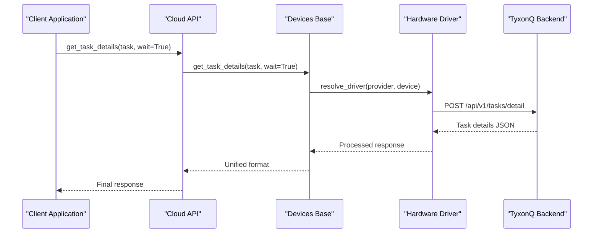
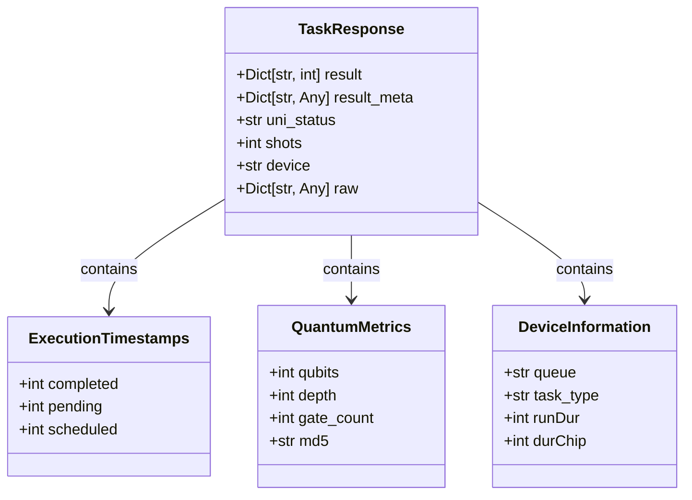
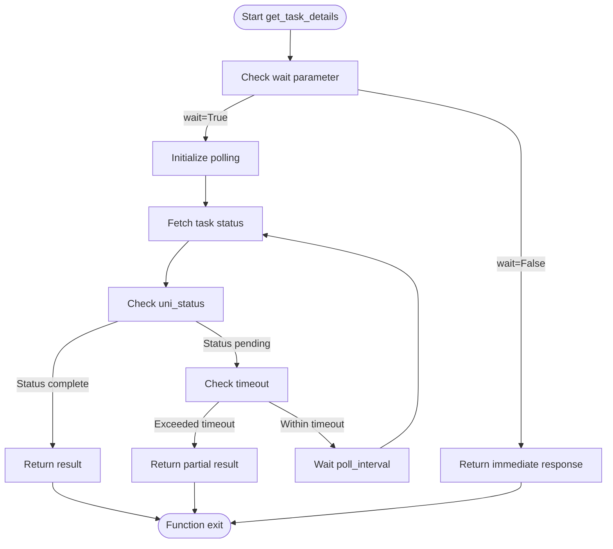
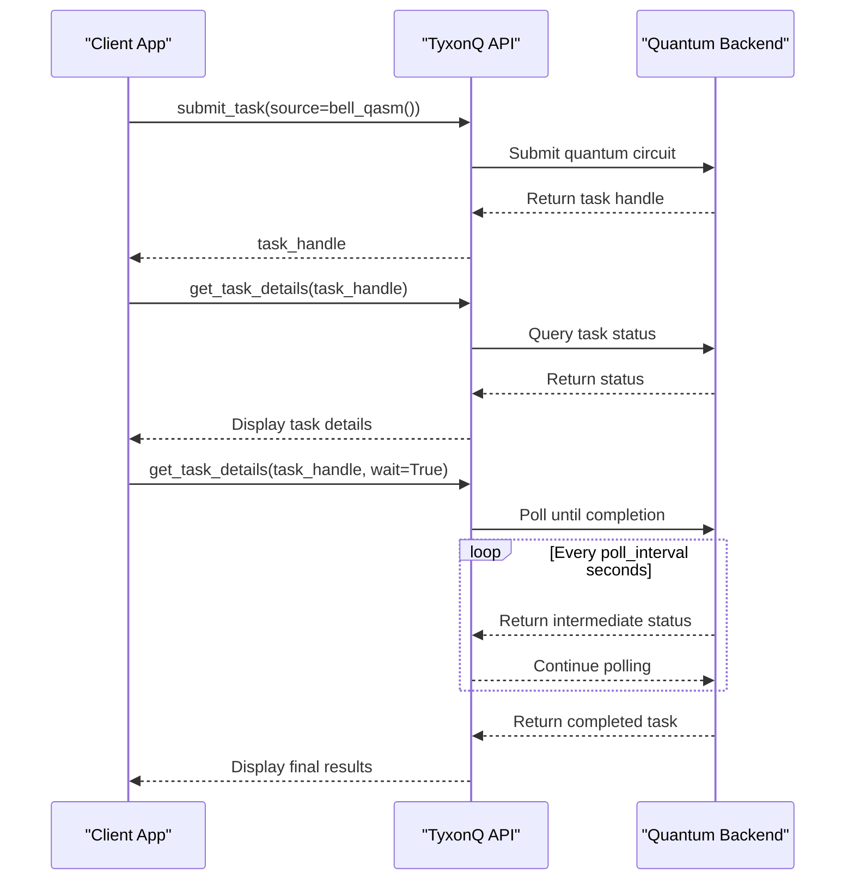
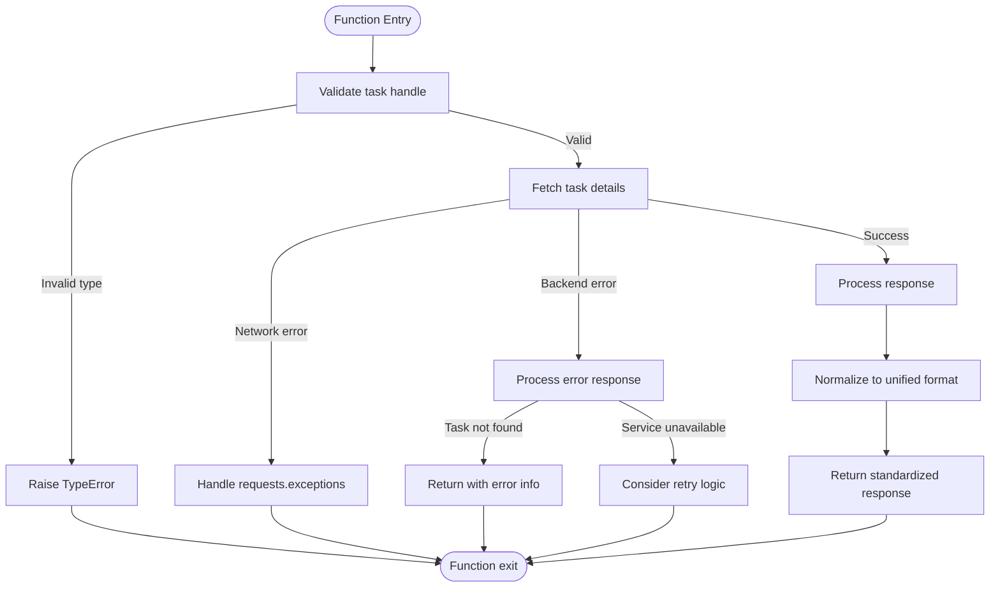
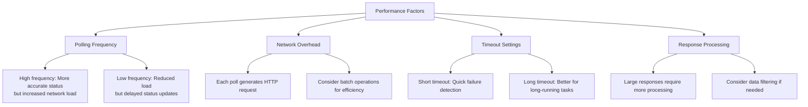

# Task Details Retrieval

<cite>
**Referenced Files in This Document**   
- [api.py](file://src/tyxonq/cloud/api.py)
- [base.py](file://src/tyxonq/devices/base.py)
- [driver.py](file://src/tyxonq/devices/hardware/tyxonq/driver.py)
- [circuit.py](file://src/tyxonq/core/ir/circuit.py)
- [cloud_api_task.py](file://examples/cloud_api_task.py)
</cite>

## Table of Contents
1. [Introduction](#introduction)
2. [Function Parameters and Configuration](#function-parameters-and-configuration)
3. [Architecture and Delegation Flow](#architecture-and-delegation-flow)
4. [Response Structure and Data Format](#response-structure-and-data-format)
5. [Polling Mechanisms and Asynchronous Behavior](#polling-mechanisms-and-asynchronous-behavior)
6. [Usage Examples and Patterns](#usage-examples-and-patterns)
7. [Error Handling and Common Issues](#error-handling-and-common-issues)
8. [Performance Considerations](#performance-considerations)
9. [Conclusion](#conclusion)

## Introduction
The `/api/v1/tasks/detail` endpoint in the TyxonQ Cloud API enables retrieval of detailed execution information for quantum computing tasks. This functionality is exposed through the `get_task_details` function, which provides comprehensive insights into task execution, including quantum circuit metrics, device information, execution timestamps, and measurement results. The system supports both synchronous and asynchronous workflows, with built-in polling capabilities for monitoring long-running tasks. This documentation details the implementation, usage patterns, and best practices for interacting with the task details retrieval functionality.

## Function Parameters and Configuration
The `get_task_details` function accepts several parameters that control its behavior and interaction with the quantum computing backend:

- **task**: The primary identifier for the task, which can be a task handle or identifier string
- **token**: Optional authentication token (currently reserved for future use)
- **wait**: Boolean flag indicating whether to poll for task completion (default: False)
- **poll_interval**: Time interval between polling attempts in seconds (default: 2.0s)
- **timeout**: Maximum time to wait for task completion in seconds (default: 60.0s)

These parameters provide flexibility in how clients interact with the API, allowing for both immediate status checks and active monitoring of task progress. The default values are optimized for typical use cases while allowing customization for specific requirements.

**Section sources**
- [api.py](file://src/tyxonq/cloud/api.py#L65-L70)
- [base.py](file://src/tyxonq/devices/base.py#L347-L381)

## Architecture and Delegation Flow
The task details retrieval functionality follows a layered architecture with clear delegation patterns. The cloud API serves as a facade that delegates to lower-level components, ensuring separation of concerns and maintainability.

**Diagram sources**
- [api.py](file://src/tyxonq/cloud/api.py#L65-L70)
- [base.py](file://src/tyxonq/devices/base.py#L347-L381)
- [driver.py](file://src/tyxonq/devices/hardware/tyxonq/driver.py#L128-L182)

The delegation flow begins with the cloud API layer, which passes the request to the devices base layer. The base layer resolves the appropriate hardware driver based on the provider and device information, then delegates to the specific driver implementation. This architecture enables support for multiple quantum computing providers while maintaining a consistent interface.

**Section sources**
- [api.py](file://src/tyxonq/cloud/api.py#L65-L70)
- [base.py](file://src/tyxonq/devices/base.py#L347-L381)
- [driver.py](file://src/tyxonq/devices/hardware/tyxonq/driver.py#L128-L182)

## Response Structure and Data Format
The task details response follows a standardized structure that provides comprehensive information about the executed quantum task. The response is normalized into a unified format regardless of the underlying provider.

**Diagram sources**
- [driver.py](file://src/tyxonq/devices/hardware/tyxonq/driver.py#L128-L182)
- [base.py](file://src/tyxonq/devices/base.py#L347-L381)

The response structure includes several key components:
- **result**: Normalized measurement counts in dictionary format (e.g., {'00': 51, '11': 49})
- **result_meta**: Metadata containing shots, device information, and raw response data
- **Execution timestamps**: Detailed timing information including pending, scheduled, and completed times
- **Quantum circuit metrics**: Gate count, circuit depth, number of qubits, and circuit hash
- **Device information**: Queue name, device identifier, and execution duration metrics

This comprehensive response structure enables clients to analyze task performance, verify circuit execution, and debug potential issues.

**Section sources**
- [driver.py](file://src/tyxonq/devices/hardware/tyxonq/driver.py#L128-L182)
- [base.py](file://src/tyxonq/devices/base.py#L347-L381)

## Polling Mechanisms and Asynchronous Behavior
The task details retrieval system supports both synchronous and asynchronous workflows through its polling mechanism. When the `wait` parameter is set to `True`, the function implements active polling to monitor task completion.

**Diagram sources**
- [base.py](file://src/tyxonq/devices/base.py#L347-L381)
- [driver.py](file://src/tyxonq/devices/hardware/tyxonq/driver.py#L128-L182)

The polling mechanism follows these steps:
1. If `wait=False`, return the current task status immediately
2. If `wait=True`, enter a polling loop that continues until:
   - The task reaches a completed state (uni_status in ["done", "completed", "success", "finished"])
   - The timeout duration is exceeded
3. Between polling attempts, sleep for the specified `poll_interval` (minimum 0.05s)
4. Return the final or partial task details

This design allows clients to choose between immediate non-blocking calls and blocking calls that wait for task completion.

**Section sources**
- [base.py](file://src/tyxonq/devices/base.py#L347-L381)
- [driver.py](file://src/tyxonq/devices/hardware/tyxonq/driver.py#L128-L182)

## Usage Examples and Patterns
The task details retrieval functionality can be used in various patterns depending on the application requirements. The examples in `cloud_api_task.py` demonstrate common usage scenarios.

**Diagram sources**
- [cloud_api_task.py](file://examples/cloud_api_task.py#L0-L64)
- [api.py](file://src/tyxonq/cloud/api.py#L65-L70)

Two primary usage patterns emerge from the examples:
1. **Immediate status check**: Retrieve the current status of a task without waiting for completion
2. **Blocking wait for completion**: Use `wait=True` to poll until the task completes or times out

The example code demonstrates both legacy-style submission using OPENQASM source and chain-style submission using the Circuit API, showing how task details can be retrieved in both workflows.

**Section sources**
- [cloud_api_task.py](file://examples/cloud_api_task.py#L0-L64)
- [api.py](file://src/tyxonq/cloud/api.py#L65-L70)

## Error Handling and Common Issues
The task details retrieval system includes comprehensive error handling for various failure scenarios. Understanding these patterns is crucial for building robust applications.

**Diagram sources**
- [base.py](file://src/tyxonq/devices/base.py#L347-L381)
- [driver.py](file://src/tyxonq/devices/hardware/tyxonq/driver.py#L128-L182)

Common issues and their handling include:
- **Non-existent tasks**: The API returns an error response that is propagated to the client
- **Timeout management**: When the timeout is exceeded, the function returns the latest available status
- **Network errors**: HTTP requests are wrapped with appropriate exception handling
- **Invalid task handles**: Type checking ensures only valid task objects are processed

Clients should implement appropriate error handling based on these patterns, particularly when dealing with network-dependent operations.

**Section sources**
- [base.py](file://src/tyxonq/devices/base.py#L347-L381)
- [driver.py](file://src/tyxonq/devices/hardware/tyxonq/driver.py#L128-L182)

## Performance Considerations
Effective use of the task details retrieval functionality requires consideration of performance implications, particularly regarding polling frequency and resource utilization.

**Diagram sources**
- [base.py](file://src/tyxonq/devices/base.py#L347-L381)
- [driver.py](file://src/tyxonq/devices/hardware/tyxonq/driver.py#L128-L182)

Key performance considerations include:
- **Polling frequency**: The `poll_interval` parameter should be tuned based on application requirements. For real-time monitoring, shorter intervals (1-2s) are appropriate, while longer intervals (5-10s) suffice for less time-sensitive applications.
- **Synchronous vs. asynchronous workflows**: Using `wait=True` for synchronous workflows is convenient but blocks the calling thread. For batch operations or high-throughput scenarios, manual polling with `wait=False` provides better control and resource utilization.
- **Timeout settings**: The default 60-second timeout is suitable for most tasks, but can be adjusted based on expected execution times.
- **Network efficiency**: Each polling request generates network traffic, so applications should balance the need for timely updates with network efficiency.

**Section sources**
- [base.py](file://src/tyxonq/devices/base.py#L347-L381)
- [driver.py](file://src/tyxonq/devices/hardware/tyxonq/driver.py#L128-L182)

## Conclusion
The task details retrieval functionality in the TyxonQ Cloud API provides a comprehensive interface for monitoring and analyzing quantum computing tasks. Through its flexible parameter configuration, standardized response format, and robust polling mechanisms, it supports both simple status checks and complex monitoring workflows. The layered architecture ensures maintainability and extensibility, while the comprehensive error handling enables reliable application development. By understanding the performance considerations and usage patterns, developers can effectively integrate this functionality into their quantum computing applications, whether for interactive exploration or large-scale batch processing.