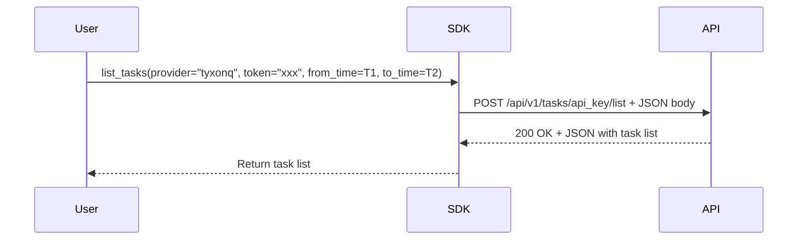
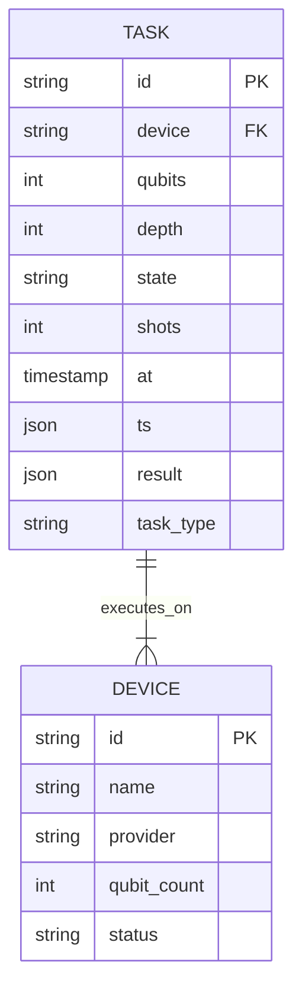
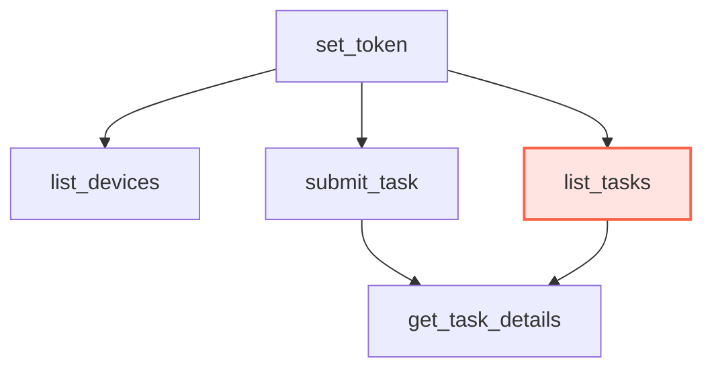

# Task Listing

<cite>
**Referenced Files in This Document**   
- [api.py](file://src/tyxonq/cloud/api.py)
- [driver.py](file://src/tyxonq/devices/hardware/tyxonq/driver.py)
- [cloud_api_task.py](file://examples/cloud_api_task.py)
</cite>

## Table of Contents
1. [Introduction](#introduction)
2. [Authentication and Setup](#authentication-and-setup)
3. [Expected Task Listing Functionality](#expected-task-listing-functionality)
4. [Query Parameters and Filtering](#query-parameters-and-filtering)
5. [Response Format](#response-format)
6. [Usage Examples](#usage-examples)
7. [Error Conditions](#error-conditions)
8. [Relationship to Other API Functions](#relationship-to-other-api-functions)
9. [Conclusion](#conclusion)

## Introduction
This document outlines the expected behavior of the task listing functionality at the `/api/v1/tasks/api_key/list` endpoint in the TyxonQ Cloud API. While no explicit `list_tasks` function is currently implemented in the codebase, this functionality is anticipated as part of enterprise-grade quantum computing services. The expected behavior is inferred from standard API design patterns and existing functions such as `list_devices`. Users are expected to retrieve their submitted quantum computing tasks, with support for filtering by provider, device, or time ranges. This capability would enable better job tracking, auditability, and resource management within the platform.

## Authentication and Setup
Access to the task listing functionality requires authentication via an API key. Users must first authenticate using the `set_token` function, which stores the token in memory for subsequent API calls. The token can be scoped to a specific provider and device, allowing for fine-grained access control. If no provider or device is specified, default values are used. The API key is never persisted to disk by the client library, ensuring security. Authentication is validated on each request to the `/api/v1/tasks/api_key/list` endpoint, and requests without valid credentials will be rejected.

**Section sources**
- [api.py](file://src/tyxonq/cloud/api.py#L21-L22)
- [driver.py](file://src/tyxonq/devices/hardware/tyxonq/driver.py#L44-L47)

## Expected Task Listing Functionality
Although a dedicated `list_tasks` function is not present in the current implementation, the expected functionality would allow users to retrieve a list of their previously submitted tasks. Based on the pattern established by `list_devices`, the `list_tasks` function would likely accept parameters such as `provider`, `token`, and additional filtering criteria. The function would make an HTTP POST request to the `/api/v1/tasks/api_key/list` endpoint, including the authentication token in the Authorization header. The response would contain metadata about each task, including submission time, status, associated device, and other relevant details.

**Diagram sources**
- [api.py](file://src/tyxonq/cloud/api.py#L37-L38)
- [driver.py](file://src/tyxonq/devices/hardware/tyxonq/driver.py#L128-L182)

## Query Parameters and Filtering
The expected `list_tasks` function would support several query parameters to enable flexible filtering of results. These would include:
- `provider`: Filter tasks by cloud provider (e.g., "tyxonq")
- `device`: Filter tasks by specific quantum device
- `from_time`: Return only tasks submitted after this timestamp
- `to_time`: Return only tasks submitted before this timestamp
- `status`: Filter by task status (e.g., "pending", "running", "completed", "failed")

These parameters would be passed as keyword arguments to the function and included in the JSON payload of the HTTP request. The filtering would be performed server-side, reducing bandwidth usage and improving performance for clients retrieving large numbers of tasks.

**Section sources**
- [api.py](file://src/tyxonq/cloud/api.py#L37-L38)
- [driver.py](file://src/tyxonq/devices/hardware/tyxonq/driver.py#L44-L80)

## Response Format
The response from the `/api/v1/tasks/api_key/list` endpoint would be a JSON object containing a list of task metadata. Each task entry would include:
- `id`: Unique identifier for the task
- `device`: Quantum device on which the task was executed
- `qubits`: Number of qubits used
- `depth`: Circuit depth
- `state`: Current status of the task
- `shots`: Number of shots executed
- `at`: Timestamp of task submission
- `ts`: Dictionary of timestamps for various task states
- `result`: Aggregated measurement results (if completed)
- `task_type`: Type of quantum computation

The response would be normalized to a unified structure, with raw data available in the `result_meta.raw` field for advanced users who need access to the complete server response.

**Diagram sources**
- [driver.py](file://src/tyxonq/devices/hardware/tyxonq/driver.py#L128-L182)

## Usage Examples
Users would interact with the task listing functionality through the TyxonQ Python SDK. A typical usage pattern would involve setting the API token, then calling the `list_tasks` function with appropriate filters. For example, a user might retrieve all tasks submitted to the "tyxonq" provider in the last 24 hours. The function would return a list of task objects that could be further inspected using `get_task_details`. This pattern mirrors the existing `cloud_api_task.py` example, which demonstrates task submission and retrieval, suggesting that task listing would follow similar design principles.

**Section sources**
- [cloud_api_task.py](file://examples/cloud_api_task.py#L0-L64)
- [api.py](file://src/tyxonq/cloud/api.py#L65-L70)

## Error Conditions
The task listing functionality would be subject to several potential error conditions:
- **Invalid API Key**: Requests with invalid or expired tokens would return a 401 Unauthorized error
- **Permission Denied**: Users attempting to access tasks they do not own would receive a 403 Forbidden error
- **Provider Not Found**: Requests for non-existent providers would return a 404 Not Found error
- **Server Error**: Internal server issues would result in 5xx status codes
- **Rate Limiting**: Excessive requests might be throttled with a 429 Too Many Requests response

Error responses would include descriptive messages to help users diagnose and resolve issues. The client SDK would raise appropriate exceptions that wrap these HTTP errors, providing a consistent error handling interface.

**Section sources**
- [driver.py](file://src/tyxonq/devices/hardware/tyxonq/driver.py#L82-L124)
- [api.py](file://src/tyxonq/cloud/api.py#L41-L62)

## Relationship to Other API Functions
The expected `list_tasks` functionality would complement existing API functions such as `set_token`, `list_devices`, and `get_task_details`. The `set_token` function establishes authentication context, `list_devices` enables discovery of available quantum resources, and `get_task_details` provides in-depth information about individual tasks. Together, these functions form a complete workflow for quantum job management. The absence of `list_tasks` represents a gap in this workflow, particularly for enterprise users who need to audit or manage large numbers of submitted jobs. Its implementation would complete the CRUD (Create, Read, Update, Delete) operations for task management.

**Diagram sources**
- [api.py](file://src/tyxonq/cloud/api.py#L21-L22)
- [api.py](file://src/tyxonq/cloud/api.py#L37-L38)
- [api.py](file://src/tyxonq/cloud/api.py#L65-L70)

## Conclusion
While the `list_tasks` function is not currently implemented in the TyxonQ codebase, its expected functionality can be inferred from existing API patterns and enterprise requirements. The `/api/v1/tasks/api_key/list` endpoint would enable users to retrieve and filter their submitted quantum computing tasks, providing essential capabilities for job tracking and resource management. Authentication would be handled via API keys using the established `set_token` mechanism, and responses would follow the unified format used by other API functions. The addition of this functionality would complete the task management workflow and enhance the platform's suitability for enterprise use cases.