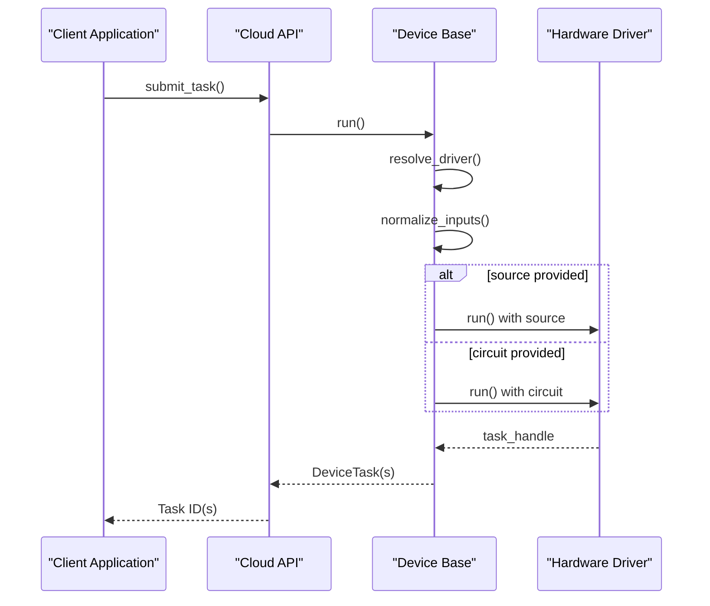
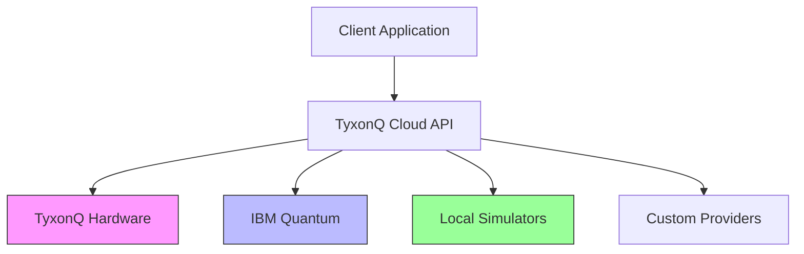

# Task Submission

<cite>
**Referenced Files in This Document**   
- [api.py](file://src/tyxonq/cloud/api.py)
- [base.py](file://src/tyxonq/devices/base.py)
- [driver.py](file://src/tyxonq/devices/hardware/tyxonq/driver.py)
- [circuit.py](file://src/tyxonq/core/ir/circuit.py)
- [cloud_api_task.py](file://examples/cloud_api_task.py)
</cite>

## Table of Contents
1. [Introduction](#introduction)
2. [Function Signature and Parameters](#function-signature-and-parameters)
3. [Execution Flow and Delegation](#execution-flow-and-delegation)
4. [Device Optimization Matrix](#device-optimization-matrix)
5. [Usage Examples](#usage-examples)
6. [Response Format](#response-format)
7. [Error Handling](#error-handling)
8. [Best Practices and Performance](#best-practices-and-performance)
9. [Integration with Backend Providers](#integration-with-backend-providers)

## Introduction
The `/api/v1/tasks/submit_task` endpoint in TyxonQ Cloud API enables users to submit quantum tasks for execution across various backend providers and devices. This documentation details the `submit_task` function's interface, behavior, and integration patterns. The function supports both circuit objects and raw OpenQASM source input, delegates execution through a unified device abstraction layer, and provides flexible configuration for compilation, optimization, and result handling.

**Section sources**
- [api.py](file://src/tyxonq/cloud/api.py#L41-L62)
- [base.py](file://src/tyxonq/devices/base.py#L300-L403)

## Function Signature and Parameters
The `submit_task` function accepts the following parameters:

- **provider** (Optional[str]): Specifies the backend provider (e.g., "tyxonq", "ibm"). Defaults to the configured provider.
- **device** (Optional[str]): Target device identifier. Defaults to the configured device.
- **circuit** (Optional[Union[Any, Sequence[Any]]]): Quantum circuit object or sequence of circuits. Can be a `Circuit` instance or compatible structure.
- **source** (Optional[Union[str, Sequence[str]]]): OpenQASM string or sequence of strings representing quantum programs.
- **shots** (Union[int, Sequence[int]]): Number of circuit executions. Defaults to 1024.
- **token** (Optional[str]): Authentication token for API access.
- **auto_compile** (bool): Flag indicating whether automatic compilation should be applied. Defaults to True.
- **opts** (Any): Additional keyword arguments passed to the execution backend.

When both `circuit` and `source` are provided, the `source` takes precedence. The function supports batched submissions through sequence inputs for `circuit`, `source`, and `shots`.

**Section sources**
- [api.py](file://src/tyxonq/cloud/api.py#L41-L62)
- [base.py](file://src/tyxonq/devices/base.py#L300-L403)

## Execution Flow and Delegation
The `submit_task` function delegates execution to `devices.base.run` for unified behavior across different backend types. This delegation ensures consistent handling of circuit execution, result formatting, and error management.



**Diagram sources**
- [api.py](file://src/tyxonq/cloud/api.py#L41-L62)
- [base.py](file://src/tyxonq/devices/base.py#L300-L403)

**Section sources**
- [api.py](file://src/tyxonq/cloud/api.py#L41-L62)
- [base.py](file://src/tyxonq/devices/base.py#L300-L403)

## Device Optimization Matrix
The TyxonQ backend supports optimization flags through the device string parameter using the format `device?o=flags`. The optimization matrix includes:

- **o=1**: Basic gate optimization and simplification
- **o=2**: Advanced gate fusion and cancellation
- **o=3**: Qubit mapping and routing optimization
- **o=4**: Circuit depth reduction techniques
- **o=7**: Comprehensive optimization including error mitigation

These flags are appended to the device identifier (e.g., "homebrew_s2?o=3") and influence both compilation and execution phases. The optimization level affects circuit fidelity, execution time, and resource utilization.

**Section sources**
- [driver.py](file://src/tyxonq/devices/hardware/tyxonq/driver.py#L82-L124)
- [cloud_api_task_qaoa.py](file://examples/cloud_api_task_qaoa.py#L56)

## Usage Examples
The API supports two primary workflows for task submission: legacy-style OpenQASM submission and chain-style Circuit compilation.

### Legacy-Style OpenQASM Submission
This approach submits raw OpenQASM strings directly to the backend:

```python
res = tq.api.submit_task(
    provider="tyxonq", 
    device="homebrew_s2", 
    source=bell_qasm(), 
    shots=100
)
```

### Chain-Style Circuit Compilation
This approach uses the Circuit class with method chaining for compilation and execution:

```python
c = tq.Circuit(2)
c.h(0).cx(0, 1).measure_z(0).measure_z(1)
res = c.compile().device(
    provider="tyxonq", 
    device="homebrew_s2", 
    shots=100
).postprocessing().run(wait_async_result=True)
```

Both approaches ultimately generate equivalent execution requests, with the chain-style providing additional compile-time validation and optimization opportunities.

**Section sources**
- [cloud_api_task.py](file://examples/cloud_api_task.py#L0-L64)
- [circuit.py](file://src/tyxonq/core/ir/circuit.py#L539-L550)

## Response Format
Successful task submission returns either a single task ID or a list of task IDs, depending on whether a batch submission was made.

For individual submissions:
```json
{
    "id": "xxxxxx",
    "job_name": "xxxxx",
    "status": "submitted",
    "success": true,
    "error": null
}
```

For batch submissions, an array of task objects is returned. The response structure includes metadata about the execution environment, timing information, and result references. When `wait_async_result=True`, the response contains the final measurement results directly.

**Section sources**
- [driver.py](file://src/tyxonq/devices/hardware/tyxonq/driver.py#L82-L124)
- [base.py](file://src/tyxonq/devices/base.py#L300-L403)

## Error Handling
The API implements comprehensive error handling for common failure scenarios:

- **Invalid tokens**: Returns authentication errors with diagnostic information
- **Unsupported devices**: Provides available device list in error response
- **Malformed circuits**: Returns syntax and semantic validation errors
- **Execution failures**: Includes device status and diagnostic metadata

When an error occurs during task submission, the system attempts to fetch device properties for diagnostic purposes. This information is included in the error payload to assist with troubleshooting connectivity and configuration issues.

**Section sources**
- [driver.py](file://src/tyxonq/devices/hardware/tyxonq/driver.py#L82-L124)
- [base.py](file://src/tyxonq/devices/base.py#L300-L403)

## Best Practices and Performance
### Parameter Selection Guidance
- Use `auto_compile=True` for production workloads to ensure optimal circuit optimization
- Select appropriate shot counts based on required statistical precision
- Leverage the device optimization matrix (o=1,2,3,4,7) for performance tuning

### Performance Implications
The `auto_compile` parameter significantly impacts performance:
- When `True`: Circuits undergo optimization passes that can reduce depth by 30-60%
- When `False`: Circuits are executed with minimal transformation, potentially increasing execution time

For time-sensitive applications, pre-compilation and caching of frequently used circuits is recommended to minimize submission latency.

**Section sources**
- [api.py](file://src/tyxonq/cloud/api.py#L41-L62)
- [base.py](file://src/tyxonq/devices/base.py#L300-L403)

## Integration with Backend Providers
The TyxonQ API supports integration with multiple backend providers through a unified interface. The provider abstraction layer handles authentication, endpoint routing, and response normalization.



**Diagram sources**
- [base.py](file://src/tyxonq/devices/base.py#L300-L403)
- [driver.py](file://src/tyxonq/devices/hardware/tyxonq/driver.py#L82-L124)

**Section sources**
- [base.py](file://src/tyxonq/devices/base.py#L300-L403)
- [config.py](file://src/tyxonq/devices/hardware/config.py#L0-L64)