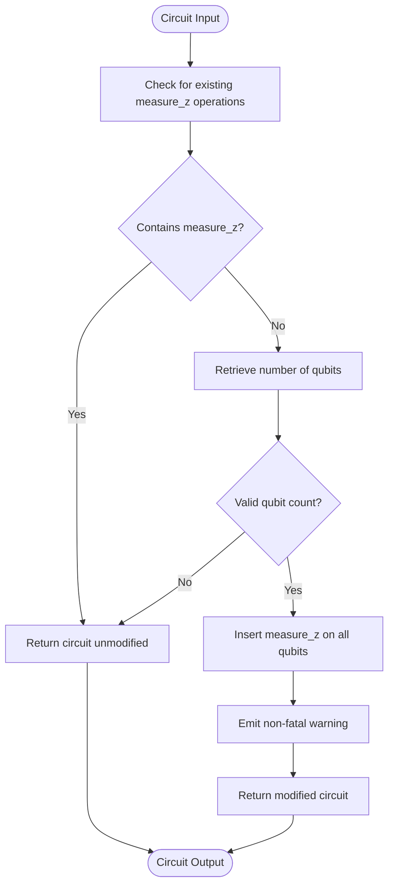

# AutoMeasure Pass

<cite>
**Referenced Files in This Document**   
- [auto_measure.py](file://src/tyxonq/compiler/stages/rewrite/auto_measure.py)
</cite>

## Table of Contents
1. [Introduction](#introduction)
2. [Core Functionality](#core-functionality)
3. [Behavior and Detection Logic](#behavior-and-detection-logic)
4. [Code Transformation Example](#code-transformation-example)
5. [Rationale for Default Measurement Behavior](#rationale-for-default-measurement-behavior)
6. [Integration with Compilation Pipeline](#integration-with-compilation-pipeline)
7. [Common Issues and Considerations](#common-issues-and-considerations)

## Introduction

The AutoMeasurePass is a compiler transformation stage within TyxonQ's quantum compilation framework designed to ensure circuit execution completeness by automatically inserting Z-basis measurements on all qubits when no explicit measurements are present. This pass operates during the rewrite phase of the compilation pipeline and serves as a safeguard to prevent execution of measurement-less quantum circuits, which would otherwise yield no observable results.

**Section sources**
- [auto_measure.py](file://src/tyxonq/compiler/stages/rewrite/auto_measure.py#L10-L34)

## Core Functionality

The AutoMeasurePass implements a conditional transformation that analyzes quantum circuits for existing measurement operations and applies automatic measurement insertion when necessary. The primary function `execute_plan` takes a quantum circuit as input and returns a potentially modified circuit with appended measurements.

The pass follows a simple decision logic: if the circuit contains any explicit `measure_z` operations, it is returned unmodified. Otherwise, the pass appends a `measure_z` operation for each qubit in the circuit, indexed from 0 to `num_qubits-1`. This ensures that every qubit's final state is measured in the computational basis, making the circuit's output observable.

A non-fatal warning is emitted when automatic measurements are inserted, informing users that this transformation has occurred. This warning serves as both documentation of the modification and a prompt for users to consider whether explicit measurement specification would be more appropriate for their use case.



**Diagram sources**
- [auto_measure.py](file://src/tyxonq/compiler/stages/rewrite/auto_measure.py#L22-L34)

**Section sources**
- [auto_measure.py](file://src/tyxonq/compiler/stages/rewrite/auto_measure.py#L22-L34)

## Behavior and Detection Logic

The AutoMeasurePass employs a straightforward detection mechanism to determine whether a circuit already contains measurement operations. It iterates through the circuit's operations, checking for any tuple or list elements where the first element (the operation name) is `"measure_z"` (case-insensitive). The detection is performed using Python's built-in `any()` function with a generator expression that examines each operation.

The pass considers a circuit to have measurements if any `measure_z` operation is present, regardless of which qubits are being measured. This means that even a circuit with measurements on only a subset of its qubits will not trigger the auto-measurement insertion. The pass only activates when the circuit is completely devoid of any `measure_z` operations.

For circuits that trigger the transformation, the pass retrieves the total number of qubits from the circuit's `num_qubits` attribute. It then creates a new sequence of operations by extending the existing circuit with `measure_z` operations for each qubit index from 0 to `num_qubits-1`. The transformation preserves all existing operations and simply appends the measurement instructions at the end of the circuit.

**Section sources**
- [auto_measure.py](file://src/tyxonq/compiler/stages/rewrite/auto_measure.py#L24-L26)

## Code Transformation Example

Consider a quantum circuit that prepares a Bell state on two qubits but does not include any measurement operations:

```python
# Original circuit (conceptual)
circuit = Circuit(num_qubits=2)
circuit.add("h", 0)
circuit.add("cx", 0, 1)
# No measurements specified
```

When this circuit passes through the AutoMeasurePass, the following transformation occurs:

1. The pass detects that no `measure_z` operations are present in the circuit
2. It retrieves the number of qubits (2) from the circuit metadata
3. It emits a warning: "No explicit measurements found; auto-added Z measurements on all qubits during compilation."
4. It appends `measure_z` operations for qubits 0 and 1 to the circuit

The resulting circuit is equivalent to:

```python
# Transformed circuit (conceptual)
circuit = Circuit(num_qubits=2)
circuit.add("h", 0)
circuit.add("cx", 0, 1)
circuit.add("measure_z", 0)
circuit.add("measure_z", 1)
```

This transformation ensures that when the circuit is executed, measurement outcomes will be available for both qubits, allowing for proper result interpretation and analysis.

**Section sources**
- [auto_measure.py](file://src/tyxonq/compiler/stages/rewrite/auto_measure.py#L27-L34)

## Rationale for Default Measurement Behavior

The AutoMeasurePass implements a pragmatic default behavior that addresses a common issue in quantum circuit development: the accidental omission of measurement operations. In quantum computing, circuits without measurements produce no observable outputs, rendering their execution effectively meaningless for most practical applications.

By automatically inserting Z-basis measurements on all qubits, the pass ensures that every compiled circuit produces measurable results, preventing silent failures due to missing measurements. This behavior aligns with the principle of least surprise, as users can expect their circuits to produce observable outcomes even if they forget to specify measurements.

The choice of Z-basis measurements reflects the computational basis, which is the most commonly used measurement basis in quantum algorithms. For many applications, particularly those involving classical bitstring outputs (like variational algorithms or quantum machine learning), Z-basis measurements are appropriate and expected.

The non-fatal warning system strikes a balance between automation and user awareness. Rather than silently modifying circuits, the pass informs users of the transformation, allowing them to either accept the default behavior or explicitly specify their desired measurement scheme in future iterations.

**Section sources**
- [auto_measure.py](file://src/tyxonq/compiler/stages/rewrite/auto_measure.py#L13-L19)

## Integration with Compilation Pipeline

The AutoMeasurePass is integrated into TyxonQ's compilation pipeline as a rewrite-stage transformation. It is typically included in compilation plans through the `build_plan` function, which resolves stage names to their corresponding pass implementations. The pass is identified by the name `"rewrite/auto_measure"` and is instantiated via the `_resolve_stage` function in the compile plan builder.

The pass operates early in the compilation workflow, ensuring that measurement operations are present before subsequent optimization and scheduling stages. This ordering is important because later stages like lightcone optimization may use measurement locations to determine which operations are within the observable lightcone of the final state.

As a composable pass, AutoMeasurePass conforms to the standard `Pass` interface with the `execute_plan` method, allowing it to be chained with other compilation stages in a flexible pipeline. Its no-op behavior when measurements are already present ensures that it can be safely included in compilation workflows without interfering with circuits that have explicit measurement specifications.

**Section sources**
- [auto_measure.py](file://src/tyxonq/compiler/stages/rewrite/auto_measure.py#L10-L34)
- [compile_plan.py](file://src/tyxonq/compiler/compile_engine/native/compile_plan.py#L44-L94)

## Common Issues and Considerations

While the AutoMeasurePass provides valuable default behavior, it can lead to unintended consequences in certain scenarios. The most significant issue arises in circuits designed for state inspection or tomography, where automatic measurement insertion can interfere with the intended experimental protocol.

For state tomography or process tomography experiments, researchers often need to execute the same circuit multiple times with different measurement bases. The automatic insertion of Z-basis measurements prevents this flexibility, as the measurement basis becomes fixed by the compiler rather than controlled by the experiment design.

Similarly, in circuits intended for mid-circuit measurement or feed-forward operations, the automatic appending of measurements at the end of the circuit can conflict with the intended measurement schedule. The pass does not distinguish between final measurements and intermediate measurements, treating any `measure_z` operation as sufficient to disable the auto-insertion behavior.

Users should be aware that the presence of any `measure_z` operation, even on a single qubit, will prevent the pass from adding measurements to other qubits. This can lead to partial measurement configurations that may not be immediately obvious, particularly in complex circuits with multiple measurement operations.

To avoid unintended measurement insertion, users should explicitly specify their desired measurement scheme in all production circuits. This practice not only prevents automatic modifications but also makes the circuit's intended behavior more transparent and reproducible.

**Section sources**
- [auto_measure.py](file://src/tyxonq/compiler/stages/rewrite/auto_measure.py#L24-L26)