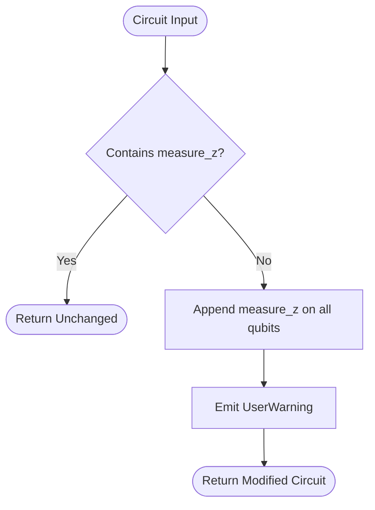
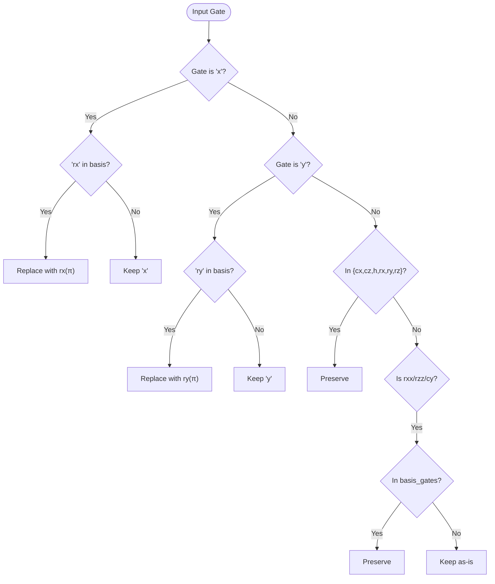
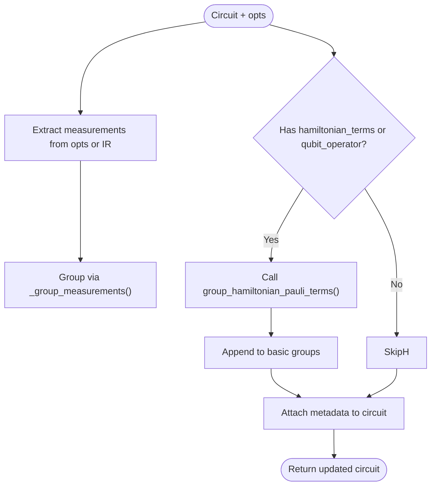
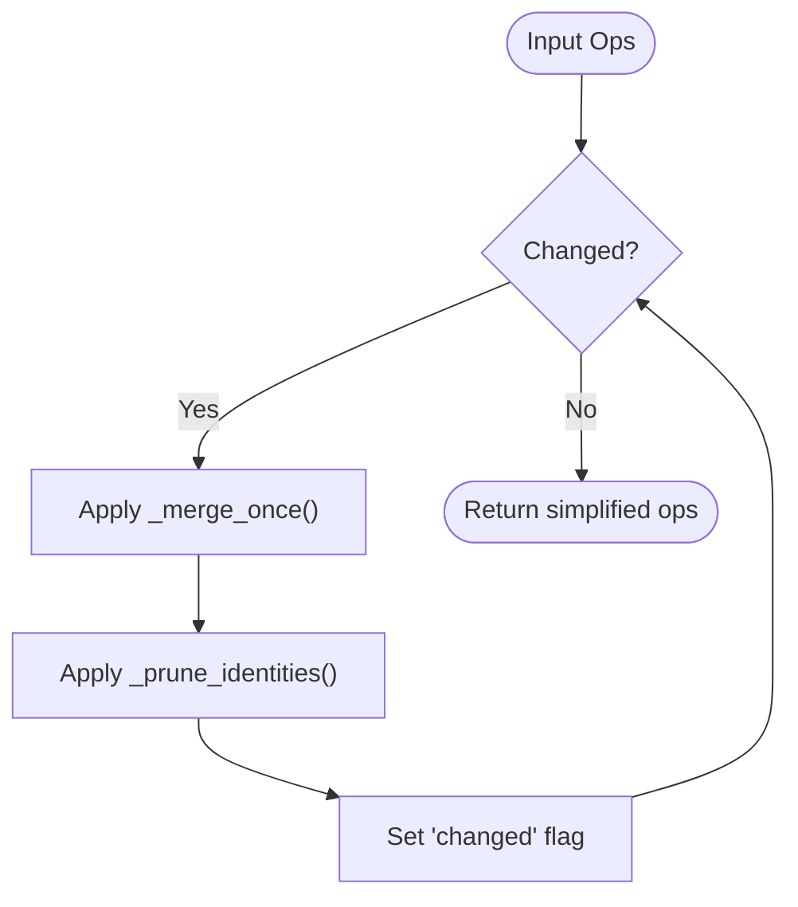

# Circuit Rewrite Passes

<cite>
**Referenced Files in This Document**   
- [auto_measure.py](file://src/tyxonq/compiler/stages/rewrite/auto_measure.py)
- [gates_transform.py](file://src/tyxonq/compiler/stages/rewrite/gates_transform.py)
- [measurement.py](file://src/tyxonq/compiler/stages/rewrite/measurement.py)
- [merge_prune.py](file://src/tyxonq/compiler/stages/rewrite/merge_prune.py)
- [hamiltonian_grouping.py](file://src/tyxonq/libs/hamiltonian_encoding/hamiltonian_grouping.py)
</cite>

## Table of Contents
1. [Introduction](#introduction)
2. [Core Components](#core-components)
3. [Auto-Measurement Insertion](#auto-measurement-insertion)
4. [Gate Representation Transformation](#gate-representation-transformation)
5. [Measurement Grouping and Observable Handling](#measurement-grouping-and-observable-handling)
6. [Gate Merging and Identity Pruning](#gate-merging-and-identity-pruning)
7. [Configuration Options and Common Issues](#configuration-options-and-common-issues)
8. [Impact on Execution Efficiency and Accuracy](#impact-on-execution-efficiency-and-accuracy)
9. [Conclusion](#conclusion)

## Introduction
The circuit rewrite stage in TyxonQ's compiler comprises a series of optimization passes designed to standardize, simplify, and prepare quantum circuits for efficient execution. These passes—`auto_measure`, `gates_transform`, `measurement`, and `merge_prune`—operate sequentially to enhance circuit structure by inserting implicit measurements, transforming gate representations into canonical forms, grouping observables for efficient measurement, and eliminating redundant operations. This document details each module’s role, transformation logic, configuration options, and impact on circuit execution.

## Core Components

The rewrite stage consists of four primary modules, each responsible for a distinct optimization task:
- **auto_measure**: Ensures all qubits are measured when no explicit measurements exist.
- **gates_transform**: Rewrites gates into a target basis set for hardware compatibility.
- **measurement**: Groups measurement operations and attaches metadata for downstream processing.
- **merge_prune**: Simplifies circuits by merging adjacent gates and removing identity operations.

These components collectively improve circuit clarity, reduce execution overhead, and enable advanced scheduling strategies.

**Section sources**
- [auto_measure.py](file://src/tyxonq/compiler/stages/rewrite/auto_measure.py#L1-L37)
- [gates_transform.py](file://src/tyxonq/compiler/stages/rewrite/gates_transform.py#L1-L52)
- [measurement.py](file://src/tyxonq/compiler/stages/rewrite/measurement.py#L1-L164)
- [merge_prune.py](file://src/tyxonq/compiler/stages/rewrite/merge_prune.py#L1-L85)

## Auto-Measurement Insertion

The `AutoMeasurePass` ensures that every quantum circuit has explicit measurement instructions. If no `measure_z` operations are present in the circuit, the pass appends a `measure_z` operation on each qubit from 0 to `num_qubits - 1`. This behavior prevents silent failures due to missing measurements and aligns with common user expectations.

A non-fatal warning is issued to inform users when auto-insertion occurs, promoting transparency. The pass is idempotent: if any measurement already exists, it leaves the circuit unchanged.

**Diagram sources**
- [auto_measure.py](file://src/tyxonq/compiler/stages/rewrite/auto_measure.py#L22-L34)

**Section sources**
- [auto_measure.py](file://src/tyxonq/compiler/stages/rewrite/auto_measure.py#L1-L37)

## Gate Representation Transformation

The `GatesTransformPass` rewrites quantum gates into a standardized basis set, enhancing compatibility with backend devices. By default, the target basis is `["h", "rx", "rz", "cx", "cz"]`, but this can be overridden via the `basis_gates` option.

Key transformations include:
- `x` → `rx(π)` if `rx` is in the basis
- `y` → `ry(π)` if `ry` is in the basis
- Transparent preservation of `cx`, `cz`, `h`, `rx`, `ry`, `rz`
- Optional retention of `rxx`, `rzz`, `cy` if specified in the basis

This pass ensures that high-level gates are expressed in terms of native or efficiently simulatable operations, reducing interpretation overhead during execution.

**Diagram sources**
- [gates_transform.py](file://src/tyxonq/compiler/stages/rewrite/gates_transform.py#L23-L49)

**Section sources**
- [gates_transform.py](file://src/tyxonq/compiler/stages/rewrite/gates_transform.py#L1-L52)

## Measurement Grouping and Observable Handling

The `MeasurementRewritePass` organizes measurement operations into groups based on shared measurement bases, enabling shot reuse and efficient execution. It supports two input types:
- Explicit `measurements` list via options
- Implicit derivation from `measure_z` operations in the circuit IR

For Hamiltonian expectation value calculations, the pass integrates with `hamiltonian_terms` or `qubit_operator` inputs, grouping Pauli terms by their tensor product basis. This allows simultaneous measurement of commuting observables, minimizing circuit repetitions.

The grouping strategy is greedy and product-basis-safe: measurements are merged only if their wire mappings do not conflict. Metadata such as `basis_map`, `wires`, and `estimated_shots_per_group` are stored in `circuit.metadata`, enabling downstream optimizers and schedulers to leverage this information.

**Diagram sources**
- [measurement.py](file://src/tyxonq/compiler/stages/rewrite/measurement.py#L29-L88)
- [hamiltonian_grouping.py](file://src/tyxonq/libs/hamiltonian_encoding/hamiltonian_grouping.py#L11-L65)

**Section sources**
- [measurement.py](file://src/tyxonq/compiler/stages/rewrite/measurement.py#L1-L164)
- [hamiltonian_grouping.py](file://src/tyxonq/libs/hamiltonian_encoding/hamiltonian_grouping.py#L11-L65)

## Gate Merging and Identity Pruning

The `MergePrunePass` simplifies circuits by applying algebraic identities to adjacent single-qubit gates. It uses a rule-based system defined in `DEFAULT_MERGE_RULES`, such as:
- `x` followed by `x` → identity (`i`)
- `s` followed by `s` → `z`
- `t` followed by `t` → `s`
- `rz(θ1)` followed by `rz(θ2)` → `rz(θ1 + θ2)`

The pass iteratively applies `_merge_once` until no further changes occur, then removes all identity gates via `_prune_identities`. The `_same_wire` helper ensures that only gates acting on the same qubit are merged.

This optimization reduces circuit depth and gate count, directly improving simulation speed and reducing error accumulation on noisy hardware.

**Diagram sources**
- [merge_prune.py](file://src/tyxonq/compiler/stages/rewrite/merge_prune.py#L35-L79)

**Section sources**
- [merge_prune.py](file://src/tyxonq/compiler/stages/rewrite/merge_prune.py#L1-L85)

## Configuration Options and Common Issues

Each rewrite pass supports configurable behavior:
- `auto_measure`: No configurable parameters; behavior is fixed.
- `gates_transform`: Accepts `basis_gates` list to define target gate set.
- `measurement`: Supports `measurements`, `hamiltonian_terms`, `qubit_operator`, and `n_qubits` options.
- `merge_prune`: Allows custom `rules` dictionary to override default merge behavior.

Common issues include:
- **Incorrect gate merging**: Occurs when non-commuting gates are incorrectly merged. The current implementation avoids this by only merging adjacent gates on the same wire with predefined rules.
- **Over-aggressive measurement grouping**: May occur if basis conflicts are not properly detected. The `_group_measurements` function ensures basis consistency before merging.
- **Loss of precision in parameterized gates**: When merging `rz` or `rx` gates, floating-point precision must be preserved. The implementation uses standard float addition.

## Impact on Execution Efficiency and Accuracy

These rewrite passes significantly enhance both efficiency and accuracy:
- **Efficiency**: Gate merging reduces circuit depth; measurement grouping minimizes shot requirements; basis transformation enables hardware-native execution.
- **Accuracy**: Removing identity gates reduces noise exposure; standardized gates improve numerical stability; proper measurement grouping preserves observable semantics.

Together, these optimizations ensure that circuits are both compact and semantically correct, enabling reliable and high-performance quantum computation.

## Conclusion

The circuit rewrite stage in TyxonQ plays a critical role in preparing quantum programs for execution. Through automatic measurement insertion, gate canonicalization, observable grouping, and redundancy elimination, these passes transform high-level circuits into optimized, executable forms. Their modular design allows for extensibility and integration with advanced scheduling and error mitigation strategies, forming a robust foundation for scalable quantum computing workflows.