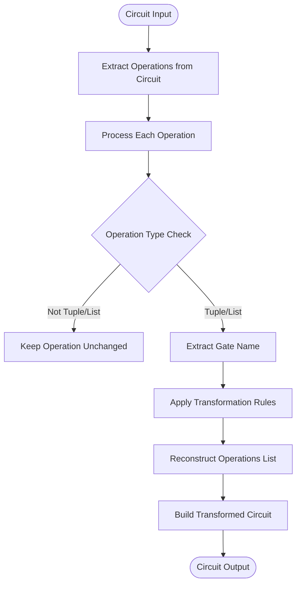
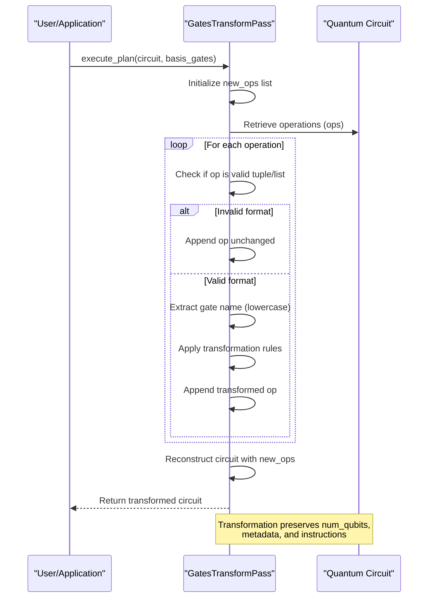
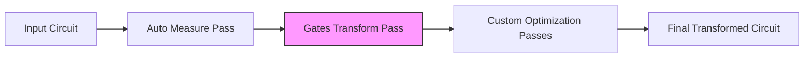

# Gates Transform Pass

<cite>
**Referenced Files in This Document**   
- [gates_transform.py](file://src/tyxonq/compiler/stages/rewrite/gates_transform.py)
- [circuit.py](file://src/tyxonq/core/ir/circuit.py)
- [base.py](file://src/tyxonq/devices/base.py)
- [native_compiler.py](file://src/tyxonq/compiler/compile_engine/native/native_compiler.py)
- [compile_plan.py](file://src/tyxonq/compiler/compile_engine/native/compile_plan.py)
</cite>

## Table of Contents
1. [Introduction](#introduction)
2. [Core Functionality](#core-functionality)
3. [Default Basis Gates](#default-basis-gates)
4. [Transformation Rules](#transformation-rules)
5. [Execution Flow](#execution-flow)
6. [Circuit Processing Mechanism](#circuit-processing-mechanism)
7. [Example Transformations](#example-transformations)
8. [Basis Gate Configuration](#basis-gate-configuration)
9. [Integration in Compilation Pipeline](#integration-in-compilation-pipeline)
10. [Potential Issues and Limitations](#potential-issues-and-limitations)

## Introduction
The GatesTransformPass module is a critical component in TyxonQ's quantum compiler infrastructure, responsible for rewriting quantum gates to conform to a specified basis gate set. This transformation ensures hardware compatibility by converting high-level quantum operations into a standardized set of gates supported by target quantum devices. The pass plays a vital role in the compilation pipeline, enabling quantum circuits to be executed on physical hardware with specific gate set constraints.

**Section sources**
- [gates_transform.py](file://src/tyxonq/compiler/stages/rewrite/gates_transform.py#L9-L49)

## Core Functionality
The GatesTransformPass class implements gate rewriting logic that transforms quantum operations according to a preferred basis gate set. When executed, the pass processes each operation in a quantum circuit and applies transformation rules based on the specified basis_gates list. The transformed circuit maintains the same quantum functionality while using only gates from the allowed set, facilitating execution on quantum hardware with limited native gate support.



**Diagram sources**
- [gates_transform.py](file://src/tyxonq/compiler/stages/rewrite/gates_transform.py#L23-L49)

**Section sources**
- [gates_transform.py](file://src/tyxonq/compiler/stages/rewrite/gates_transform.py#L9-L49)

## Default Basis Gates
The GatesTransformPass utilizes a default basis gate set of ['h', 'rx', 'rz', 'cx', 'cz'] when no alternative is specified. This canonical set represents a common foundation for quantum computation, comprising Hadamard (h), X-rotation (rx), Z-rotation (rz), controlled-X (cx), and controlled-Z (cz) gates. These gates form a universal set capable of approximating any quantum operation, making them suitable for most quantum hardware platforms. The default selection balances expressiveness with hardware feasibility across various quantum computing architectures.

**Section sources**
- [gates_transform.py](file://src/tyxonq/compiler/stages/rewrite/gates_transform.py#L12-L13)
- [native_compiler.py](file://src/tyxonq/compiler/compile_engine/native/native_compiler.py#L19-L21)

## Transformation Rules
The GatesTransformPass implements specific transformation rules to rewrite quantum gates according to the basis gate set. The primary rules include:
- X gate transformation to RX(π) when RX is allowed in the basis set
- Y gate transformation to RY(π) when RY is allowed in the basis set
- Transparent forwarding of gates already in the allowed set (CX, CZ, H, RX, RY, RZ)
- Conditional preservation of extended gates (RXX, RZZ, CY) if explicitly requested
- Default passthrough for unsupported or unrecognized gates

These rules ensure that fundamental quantum operations are properly converted while maintaining circuit integrity and computational equivalence.

```mermaid
graph TD
XGate[X Gate] --> |rx in basis_gates| RXGate[RX(π)]
YGate[Y Gate] --> |ry in basis_gates| RYGate[RY(π)]
CXGate[CX Gate] --> AllowedGates[Allowed: CX, CZ, H, RX, RY, RZ]
CZGate[CZ Gate] --> AllowedGates
HGate[H Gate] --> AllowedGates
RXGate[RX Gate] --> AllowedGates
RYGate[RY Gate] --> AllowedGates
RZGate[RZ Gate] --> AllowedGates
RXXGate[RXX Gate] --> |rxx in basis_gates| PreserveRXX[Preserve RXX]
RZZGate[RZZ Gate] --> |rzz in basis_gates| PreserveRZZ[Preserve RZZ]
CYGate[CY Gate] --> |cy in basis_gates| PreserveCY[Preserve CY]
OtherGate[Other Gates] --> Passthrough[Pass Through Unchanged]
```

**Diagram sources**
- [gates_transform.py](file://src/tyxonq/compiler/stages/rewrite/gates_transform.py#L14-L19)

**Section sources**
- [gates_transform.py](file://src/tyxonq/compiler/stages/rewrite/gates_transform.py#L14-L19)

## Execution Flow
The execute_plan method of GatesTransformPass follows a systematic execution flow to transform quantum circuits. It begins by initializing an empty list for new operations, then iterates through each operation in the input circuit. For each operation, the method determines whether transformation is required based on the gate type and the specified basis_gates list. After processing all operations, the method reconstructs a new circuit with the transformed operations while preserving the original circuit's metadata and instructions.



**Diagram sources**
- [gates_transform.py](file://src/tyxonq/compiler/stages/rewrite/gates_transform.py#L23-L49)

**Section sources**
- [gates_transform.py](file://src/tyxonq/compiler/stages/rewrite/gates_transform.py#L23-L49)

## Circuit Processing Mechanism
The circuit processing mechanism in GatesTransformPass systematically analyzes and transforms each operation in the quantum circuit. The method accesses the circuit's operations through the ops attribute, processes them individually, and constructs a new operations list with appropriate transformations. The implementation preserves non-operation elements and handles edge cases such as malformed operations. After processing all operations, the method creates a new circuit instance with the transformed operations while maintaining the original circuit's structural properties, including the number of qubits, metadata, and instructions.

**Section sources**
- [gates_transform.py](file://src/tyxonq/compiler/stages/rewrite/gates_transform.py#L23-L49)
- [circuit.py](file://src/tyxonq/core/ir/circuit.py#L48-L727)

## Example Transformations
The GatesTransformPass demonstrates its functionality through specific circuit transformations. For example, when processing a circuit containing an X gate with the default basis_gates ['h', 'rx', 'rz', 'cx', 'cz'], the X gate is transformed to RX(π). Similarly, a Y gate would be transformed to RY(π) when RY is included in the basis set. Gates already present in the basis set, such as H, CX, or CZ, are preserved without modification. This transformation process ensures that the resulting circuit contains only gates compatible with the target hardware's native gate set.

**Section sources**
- [gates_transform.py](file://src/tyxonq/compiler/stages/rewrite/gates_transform.py#L30-L37)

## Basis Gate Configuration
The GatesTransformPass supports configurable basis gates through the basis_gates parameter, allowing users to specify custom gate sets for transformation. When no basis_gates are provided, the pass defaults to ['h', 'rx', 'rz', 'cx', 'cz']. Users can override this default by passing a custom list of allowed gates, enabling hardware-specific optimizations. The configuration is typically inherited from the compilation pipeline options, allowing seamless integration with device-specific requirements and optimization strategies.

**Section sources**
- [gates_transform.py](file://src/tyxonq/compiler/stages/rewrite/gates_transform.py#L23-L24)
- [native_compiler.py](file://src/tyxonq/compiler/compile_engine/native/native_compiler.py#L19-L21)

## Integration in Compilation Pipeline
The GatesTransformPass is integrated into TyxonQ's compilation pipeline as a standard rewrite stage. It is automatically included in the default compilation plan, typically positioned after auto-measurement insertion and before other optimization passes. The pass is invoked through the NativeCompiler, which constructs a compilation plan that includes the gates_transform stage. This integration ensures that gate rewriting occurs early in the compilation process, providing a standardized gate set for subsequent optimization and scheduling stages.



**Diagram sources**
- [compile_plan.py](file://src/tyxonq/compiler/compile_engine/native/compile_plan.py#L88-L94)
- [native_compiler.py](file://src/tyxonq/compiler/compile_engine/native/native_compiler.py#L58-L62)

**Section sources**
- [compile_plan.py](file://src/tyxonq/compiler/compile_engine/native/compile_plan.py#L88-L94)
- [native_compiler.py](file://src/tyxonq/compiler/compile_engine/native/native_compiler.py#L58-L62)

## Potential Issues and Limitations
While the GatesTransformPass provides essential gate rewriting functionality, it has certain limitations. The pass implements minimal transformation rules and may not handle complex gate decompositions beyond X→RX(π) and Y→RY(π). Unsupported gates are passed through unchanged, which could lead to execution failures on hardware with strict gate set requirements. Additionally, the pass does not perform advanced optimizations such as gate cancellation or circuit simplification, focusing solely on basis gate conformance. Users should ensure that their specified basis_gates adequately cover the required quantum operations for their target hardware.

**Section sources**
- [gates_transform.py](file://src/tyxonq/compiler/stages/rewrite/gates_transform.py#L14-L19)