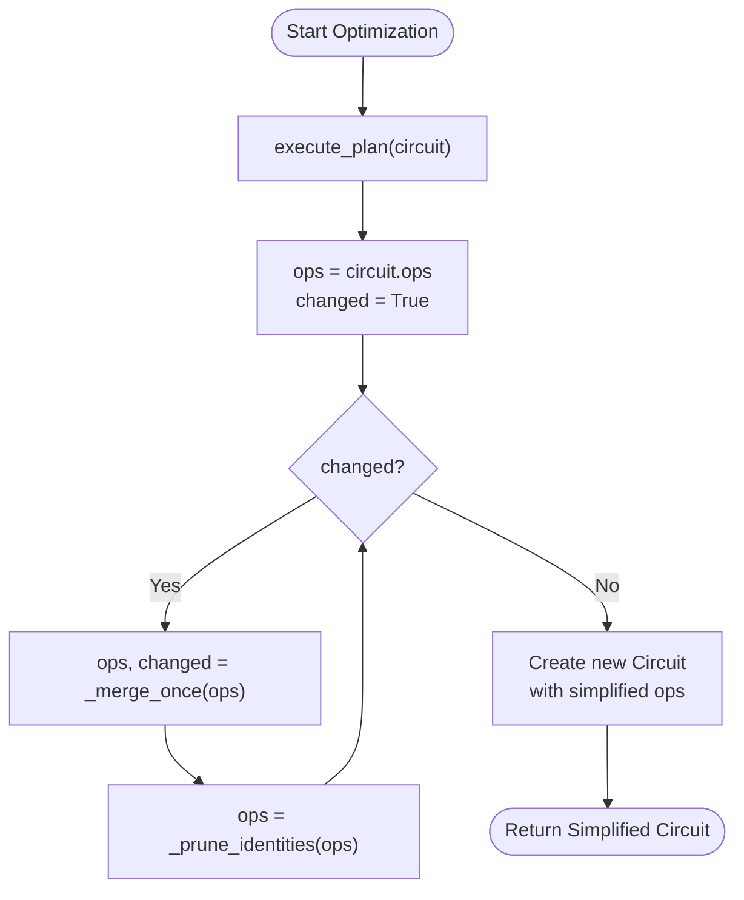
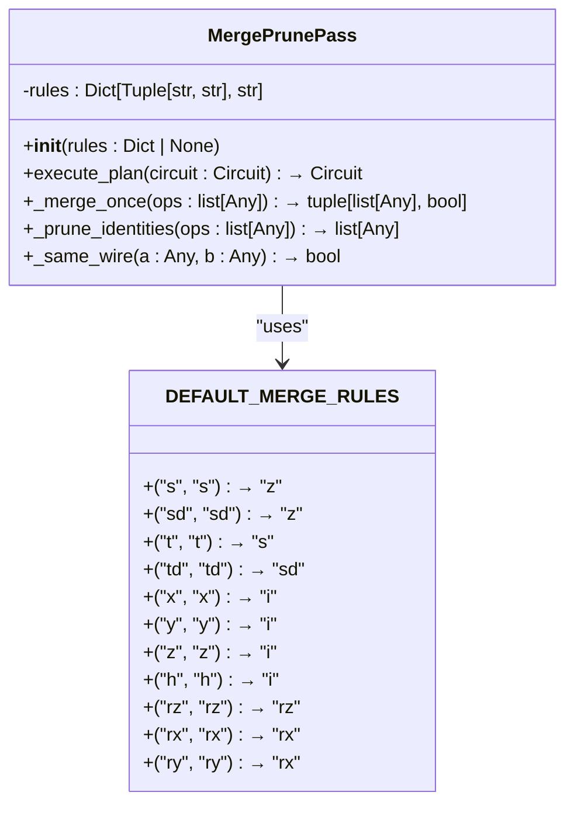
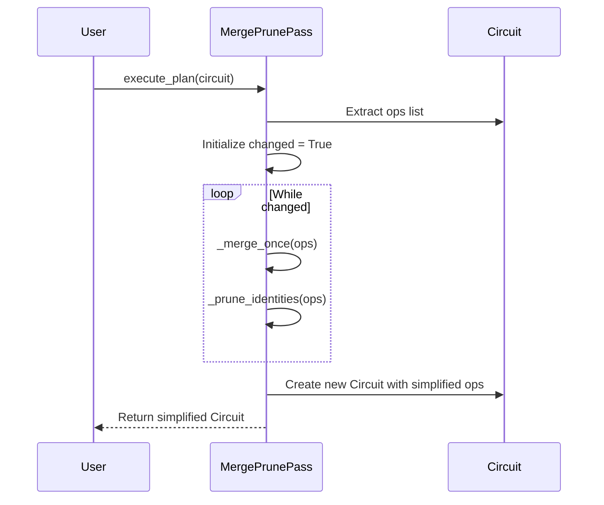
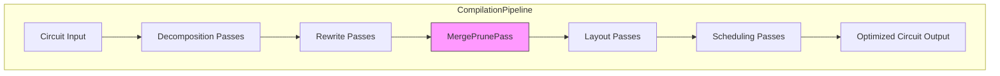

# Merge and Prune Pass

<cite>
**Referenced Files in This Document**  
- [src/tyxonq/compiler/stages/rewrite/merge_prune.py](file://src/tyxonq/compiler/stages/rewrite/merge_prune.py)
- [src/tyxonq/core/ir/circuit.py](file://src/tyxonq/core/ir/circuit.py)
- [src/tyxonq/compiler/compile_engine/native/compile_plan.py](file://src/tyxonq/compiler/compile_engine/native/compile_plan.py)
</cite>

## Table of Contents
1. [Introduction](#introduction)
2. [Core Functionality](#core-functionality)
3. [Internal Mechanics](#internal-mechanics)
4. [Gate Fusion Rules](#gate-fusion-rules)
5. [Execution Flow](#execution-flow)
6. [Configuration and Customization](#configuration-and-customization)
7. [Integration in Compilation Pipeline](#integration-in-compilation-pipeline)
8. [Performance and Limitations](#performance-and-limitations)
9. [Conclusion](#conclusion)

## Introduction

The MergePrunePass module is a lightweight optimization pass within TyxonQ's compiler framework designed to simplify quantum circuits by merging adjacent single-qubit gates and removing identity operations. This pass operates on the compiler's intermediate representation (IR) of quantum circuits, specifically targeting sequences of operations that can be algebraically reduced without altering the circuit's computational outcome.

As a rewrite-stage optimization, MergePrunePass plays a crucial role in preparing circuits for efficient execution by reducing circuit depth and eliminating redundant operations. The pass is particularly effective for simplifying parameterized quantum circuits commonly used in variational algorithms, where consecutive rotations often appear during circuit construction.

**Section sources**
- [src/tyxonq/compiler/stages/rewrite/merge_prune.py](file://src/tyxonq/compiler/stages/rewrite/merge_prune.py#L24-L82)

## Core Functionality

The MergePrunePass implements two primary optimization strategies: gate merging and identity pruning. Gate merging combines consecutive single-qubit operations on the same qubit into a single equivalent gate when algebraic identities permit such simplification. Identity pruning removes operations that have no net effect on the quantum state, such as pairs of inverse gates or explicit identity gates.

This optimization pass operates iteratively on the circuit's operation list, processing gates in their execution order. The pass continues to apply transformations until no further changes can be made, ensuring that all possible simplifications are exhausted. The result is a functionally equivalent but more compact circuit representation with reduced gate count and circuit depth.

The lightweight nature of this pass makes it suitable for frequent application during circuit development and optimization workflows. Unlike more sophisticated optimization techniques that may require complex analysis or numerical computation, MergePrunePass relies on simple pattern matching and algebraic rules, making it computationally inexpensive to execute.

**Section sources**
- [src/tyxonq/compiler/stages/rewrite/merge_prune.py](file://src/tyxonq/compiler/stages/rewrite/merge_prune.py#L24-L82)

## Internal Mechanics

The MergePrunePass employs a systematic approach to circuit simplification through its internal methods and data structures. At the core of its operation is the iterative application of two complementary processes: merging adjacent gates and pruning identity operations.

**Diagram sources**
- [src/tyxonq/compiler/stages/rewrite/merge_prune.py](file://src/tyxonq/compiler/stages/rewrite/merge_prune.py#L35-L43)
- [src/tyxonq/compiler/stages/rewrite/merge_prune.py](file://src/tyxonq/compiler/stages/rewrite/merge_prune.py#L45-L73)
- [src/tyxonq/compiler/stages/rewrite/merge_prune.py](file://src/tyxonq/compiler/stages/rewrite/merge_prune.py#L81-L82)

The `_merge_once` method scans the operation list sequentially, examining pairs of consecutive gates. When two gates act on the same qubit (determined by the `_same_wire` method), the pass checks if their combination matches any rule in the fusion table. If a match is found, the gates are replaced according to the rule, and the `changed` flag is set to trigger another iteration.

The `_prune_identities` method performs a single pass through the operation list, filtering out any operations identified as identities. This method works in conjunction with the merging process, as many identity operations are created during the merging of inverse gates (e.g., RX(θ) followed by RX(-θ)).

**Section sources**
- [src/tyxonq/compiler/stages/rewrite/merge_prune.py](file://src/tyxonq/compiler/stages/rewrite/merge_prune.py#L45-L73)
- [src/tyxonq/compiler/stages/rewrite/merge_prune.py](file://src/tyxonq/compiler/stages/rewrite/merge_prune.py#L81-L82)
- [src/tyxonq/compiler/stages/rewrite/merge_prune.py](file://src/tyxonq/compiler/stages/rewrite/merge_prune.py#L75-L80)

## Gate Fusion Rules

The behavior of MergePrunePass is governed by a predefined set of fusion rules stored in the `DEFAULT_MERGE_RULES` dictionary. These rules specify how pairs of consecutive gates should be combined, with each rule mapping a tuple of gate names to their replacement.

**Diagram sources**
- [src/tyxonq/compiler/stages/rewrite/merge_prune.py](file://src/tyxonq/compiler/stages/rewrite/merge_prune.py#L9-L21)
- [src/tyxonq/compiler/stages/rewrite/merge_prune.py](file://src/tyxonq/compiler/stages/rewrite/merge_prune.py#L24-L82)

The fusion rules include both cancellation rules and parameter merging rules. Cancellation rules handle cases where two identical Pauli gates cancel each other out, resulting in an identity operation. For example, two consecutive X gates (X·X) simplify to the identity (I), as do pairs of Y, Z, or H gates.

Parameter merging rules apply to rotation gates, where consecutive rotations around the same axis can be combined by summing their angles. Specifically, consecutive RZ or RX rotations are merged into a single rotation with the sum of their angles. The rule for RY gates is slightly different, as consecutive RY rotations are merged into an RX rotation, reflecting a specific algebraic identity in the implementation.

The wire-matching logic, implemented in the `_same_wire` method, ensures that only gates acting on the same qubit are considered for merging. This method validates that both operations are properly formatted tuples or lists and compares their qubit indices to determine if they operate on the same quantum wire.

**Section sources**
- [src/tyxonq/compiler/stages/rewrite/merge_prune.py](file://src/tyxonq/compiler/stages/rewrite/merge_prune.py#L9-L21)
- [src/tyxonq/compiler/stages/rewrite/merge_prune.py](file://src/tyxonq/compiler/stages/rewrite/merge_prune.py#L75-L80)

## Execution Flow

The execution flow of MergePrunePass follows a well-defined pattern that ensures comprehensive simplification of the input circuit. When the `execute_plan` method is invoked with a circuit, it initiates an iterative optimization process that continues until no further changes can be made.

The process begins by extracting the circuit's operations into a mutable list. A `changed` flag is initialized to `True` to ensure at least one iteration of the optimization loop. Within each iteration, the pass first attempts to merge adjacent gates using the `_merge_once` method, which returns both the modified operation list and a boolean indicating whether any merges occurred.

Following the merge attempt, the `_prune_identities` method is applied to remove any identity operations that may have been created during the merging process or were present in the original circuit. This two-step approach—merge followed by prune—ensures that newly created identities are eliminated in the same iteration, preventing them from blocking subsequent merges.

**Diagram sources**
- [src/tyxonq/compiler/stages/rewrite/merge_prune.py](file://src/tyxonq/compiler/stages/rewrite/merge_prune.py#L35-L43)
- [src/tyxonq/compiler/stages/rewrite/merge_prune.py](file://src/tyxonq/compiler/stages/rewrite/merge_prune.py#L45-L73)
- [src/tyxonq/compiler/stages/rewrite/merge_prune.py](file://src/tyxonq/compiler/stages/rewrite/merge_prune.py#L81-L82)

The iterative nature of this process allows for cascading simplifications, where the removal of one gate enables further merges that were previously blocked. For example, consider a sequence of three RZ gates: RZ(α), RZ(β), RZ(γ). In the first iteration, the first two gates merge into RZ(α+β), creating a new pair RZ(α+β), RZ(γ) that can be merged in the next iteration into RZ(α+β+γ).

Once no further changes occur during an iteration, the optimization loop terminates, and a new circuit is constructed with the simplified operation list. The use of `dataclasses.replace` ensures that the original circuit remains unmodified while creating an efficient copy with the updated operations.

**Section sources**
- [src/tyxonq/compiler/stages/rewrite/merge_prune.py](file://src/tyxonq/compiler/stages/rewrite/merge_prune.py#L35-L43)

## Configuration and Customization

MergePrunePass supports customization through its constructor, which accepts an optional rules parameter allowing users to extend or modify the default fusion behavior. When instantiated without arguments, the pass uses the predefined `DEFAULT_MERGE_RULES`, but custom rules can be provided to tailor the optimization to specific use cases or hardware constraints.

The constructor creates a copy of the default rules dictionary and updates it with any user-provided rules, enabling both the addition of new fusion patterns and the override of existing ones. This design allows for flexible configuration while preserving the core optimization capabilities.

For example, a user might want to add a rule for merging specific gate combinations not covered by the defaults or modify the behavior of existing rules to better match their circuit patterns. The ability to customize the fusion rules makes MergePrunePass adaptable to various quantum computing paradigms and algorithmic requirements.

The configuration mechanism follows a simple key-value structure where keys are tuples of gate name pairs and values specify the replacement gate. This straightforward interface makes it easy to define and integrate custom optimization rules without requiring changes to the pass's internal implementation.

**Section sources**
- [src/tyxonq/compiler/stages/rewrite/merge_prune.py](file://src/tyxonq/compiler/stages/rewrite/merge_prune.py#L28-L33)

## Integration in Compilation Pipeline

MergePrunePass is integrated into TyxonQ's compilation pipeline as a standard optimization pass that can be included in custom compilation plans. The pass is registered under the name "rewrite/merge_prune" in the compiler's stage resolution system, allowing it to be referenced by name when constructing compilation workflows.

**Diagram sources**
- [src/tyxonq/compiler/compile_engine/native/compile_plan.py](file://src/tyxonq/compiler/compile_engine/native/compile_plan.py#L41-L42)
- [src/tyxonq/compiler/stages/rewrite/merge_prune.py](file://src/tyxonq/compiler/stages/rewrite/merge_prune.py#L24-L82)

The pass operates on the Circuit IR, which represents quantum circuits as a sequence of operation descriptors. Each operation is stored as a tuple containing the gate name followed by its parameters, such as qubit indices and rotation angles. This representation enables the pass to efficiently analyze and transform the circuit structure without requiring complex parsing or interpretation.

When included in a compilation plan, MergePrunePass is executed as part of the rewrite stage, typically after decomposition passes have normalized the gate set and before layout and scheduling optimizations. This positioning ensures that the pass can operate on a standardized gate representation while still allowing subsequent optimizations to benefit from the reduced circuit complexity.

The integration with the compilation framework follows the Pass interface contract, implementing the `execute_plan` method that accepts a circuit and optional parameters. This standardized interface enables seamless composition with other optimization passes and facilitates the creation of modular, reusable compilation workflows.

**Section sources**
- [src/tyxonq/compiler/compile_engine/native/compile_plan.py](file://src/tyxonq/compiler/compile_engine/native/compile_plan.py#L41-L42)
- [src/tyxonq/core/ir/circuit.py](file://src/tyxonq/core/ir/circuit.py#L48-L727)

## Performance and Limitations

MergePrunePass offers a lightweight and efficient approach to circuit simplification with minimal computational overhead. The pass operates in linear time relative to the number of operations in the worst case, with the iterative nature potentially requiring multiple passes through the operation list. However, the simplicity of the operations—primarily tuple comparisons and list manipulations—ensures that the pass executes quickly even for moderately sized circuits.

The primary limitation of MergePrunePass is its focus on single-qubit gate simplification, which means it does not address optimizations involving multi-qubit gates or more complex circuit patterns. For example, the pass cannot simplify sequences involving controlled gates or detect and eliminate more sophisticated algebraic identities that span multiple qubits.

Additionally, the pass operates only on adjacent gates, meaning that non-consecutive gates that could potentially be merged are not considered. This locality constraint prevents the pass from performing optimizations that require reordering or commuting gates, which would necessitate more complex analysis of gate commutation relations.

Despite these limitations, MergePrunePass provides significant value as an early-stage optimization that can dramatically reduce circuit depth in many practical scenarios. Its effectiveness is particularly pronounced in variational quantum algorithms, where parameterized circuits often contain numerous consecutive rotation gates that are ideal candidates for merging.

The pass serves as a foundational optimization that can be combined with more sophisticated techniques in a comprehensive optimization pipeline. By first applying MergePrunePass to eliminate obvious redundancies, subsequent optimization passes can operate on a cleaner, more compact circuit representation, potentially improving their effectiveness and reducing their computational requirements.

**Section sources**
- [src/tyxonq/compiler/stages/rewrite/merge_prune.py](file://src/tyxonq/compiler/stages/rewrite/merge_prune.py#L24-L82)

## Conclusion

The MergePrunePass module represents a fundamental optimization technique in TyxonQ's compiler framework, providing efficient simplification of quantum circuits through gate merging and identity removal. By leveraging simple algebraic identities and pattern matching, the pass achieves meaningful circuit compression with minimal computational cost.

The implementation demonstrates a clean separation of concerns, with distinct methods handling merging, pruning, and wire validation. The use of configurable fusion rules allows for flexibility in optimization strategies while maintaining a simple and predictable interface. Integrated into the broader compilation pipeline, MergePrunePass serves as an essential preprocessing step that prepares circuits for more advanced optimizations and efficient execution.

While limited to single-qubit gate simplification, the pass delivers substantial benefits in reducing circuit depth and gate count, particularly for parameterized quantum circuits common in variational algorithms. Its lightweight nature makes it suitable for frequent application during circuit development, enabling rapid iteration and optimization.

As quantum algorithms continue to grow in complexity, foundational optimizations like MergePrunePass will remain crucial components of efficient quantum software development, providing the first line of defense against circuit bloat and ensuring that quantum programs are as compact and efficient as possible before execution.