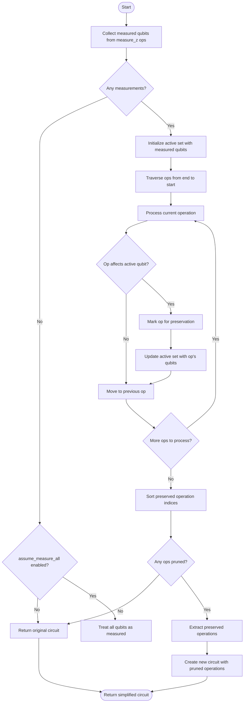
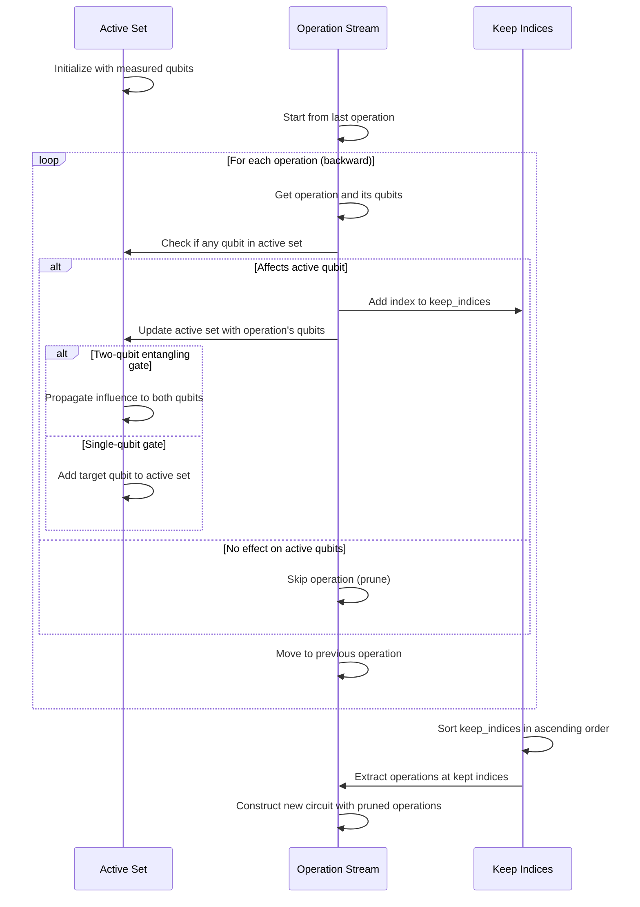
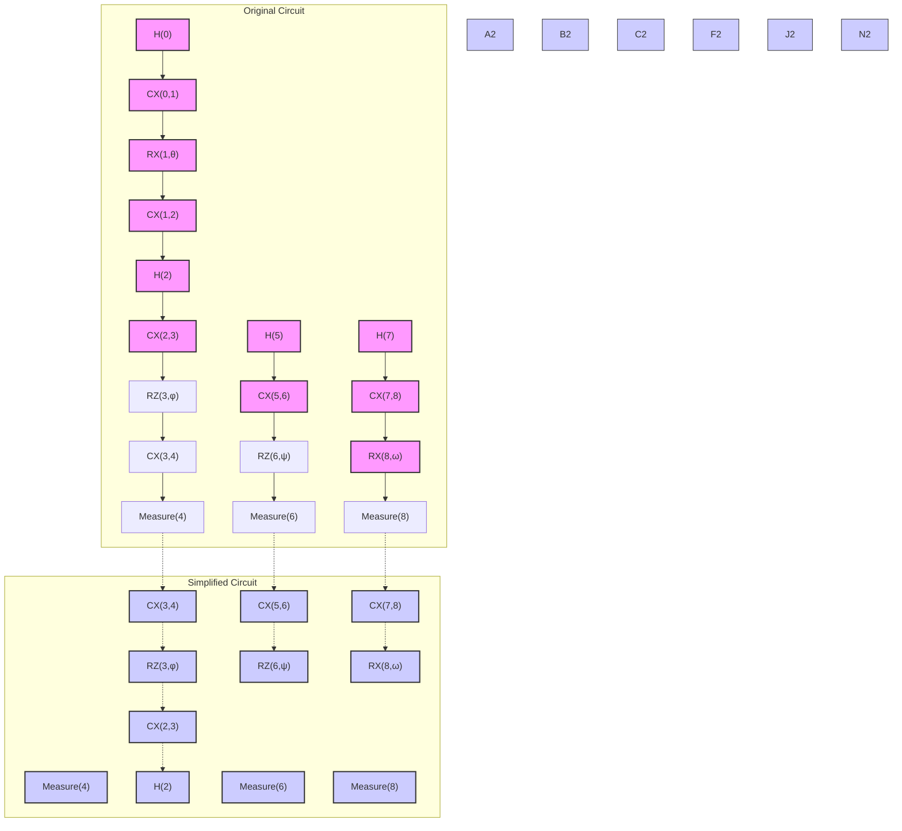

# Circuit Simplification

<cite>
**Referenced Files in This Document**   
- [lightcone.py](file://src/tyxonq/compiler/stages/simplify/lightcone.py)
- [test_compiler_simplify_lightcone.py](file://tests_core_module/test_compiler_simplify_lightcone.py)
- [test_compiler_simplify_lightcone_extras.py](file://tests_core_module/test_compiler_simplify_lightcone_extras.py)
- [circuit.py](file://src/tyxonq/core/ir/circuit.py)
- [compile_plan.py](file://src/tyxonq/compiler/compile_engine/native/compile_plan.py)
</cite>

## Table of Contents
1. [Introduction](#introduction)
2. [Lightcone Optimization Algorithm](#lightcone-optimization-algorithm)
3. [Backward Traversal and Qubit Influence Tracking](#backward-traversal-and-qubit-influence-tracking)
4. [Gate Pruning Logic](#gate-pruning-logic)
5. [Example: Simplification on Large Circuits with Local Observables](#example-simplification-on-large-circuits-with-local-observables)
6. [Performance Gains and Limitations](#performance-gains-and-limitations)
7. [Interaction with Other Optimization Passes](#interaction-with-other-optimization-passes)
8. [Configuration Options](#configuration-options)
9. [Common Issues and Troubleshooting](#common-issues-and-troubleshooting)
10. [Conclusion](#conclusion)

## Introduction

The circuit simplification stage in TyxonQ's compiler leverages lightcone optimization to significantly reduce quantum circuit size by identifying and removing operations that do not affect measured qubits. This optimization is particularly effective for circuits with local observables, where only a subset of qubits are measured. The lightcone pass operates as a backward slicing algorithm that starts from measurement operations and propagates influence backward through entangling gates, preserving only those operations within the causal lightcone of the measured qubits. This document details the implementation in `lightcone.py`, explaining the algorithm's core mechanics, performance characteristics, and integration within the broader compiler pipeline.

**Section sources**
- [lightcone.py](file://src/tyxonq/compiler/stages/simplify/lightcone.py#L9-L95)

## Lightcone Optimization Algorithm

The LightconeSimplifyPass implements a backward slicing algorithm that identifies operations affecting measured qubits. The algorithm begins by collecting all qubits involved in explicit `measure_z` operations. If no measurements are present and the `assume_measure_all` option is disabled, the circuit remains unchanged. When `assume_measure_all` is enabled, all qubits are treated as measured, preserving the entire circuit. The core of the algorithm involves backward traversal from the end of the circuit to the beginning, maintaining an active set of qubits that influence measurement outcomes. For each operation encountered during traversal, the algorithm determines whether it acts on any active qubit. If so, the operation is preserved and its qubits are added to the active set, with special handling for two-qubit entangling gates that propagate influence across both qubits.

**Diagram sources**
- [lightcone.py](file://src/tyxonq/compiler/stages/simplify/lightcone.py#L9-L95)

**Section sources**
- [lightcone.py](file://src/tyxonq/compiler/stages/simplify/lightcone.py#L9-L95)

## Backward Traversal and Qubit Influence Tracking

The backward traversal mechanism systematically processes operations from the end of the circuit to the beginning, ensuring that only operations influencing measurement outcomes are preserved. The algorithm maintains an active set of qubits that have been identified as influencing measurement results. As each operation is processed, the `op_qubits` helper function determines which qubits the operation affects and whether it is a two-qubit entangling gate. Single-qubit operations only preserve influence on their target qubit, while two-qubit gates like `cx`, `cz`, and `swap` propagate influence to both involved qubits, expanding the active set. This propagation is crucial for correctly identifying operations that indirectly affect measured qubits through entanglement. The traversal continues until all operations have been evaluated, with preserved operations collected by their indices for reconstruction of the simplified circuit.

**Diagram sources**
- [lightcone.py](file://src/tyxonq/compiler/stages/simplify/lightcone.py#L40-L89)

**Section sources**
- [lightcone.py](file://src/tyxonq/compiler/stages/simplify/lightcone.py#L40-L89)

## Gate Pruning Logic

The gate pruning logic in the LightconeSimplifyPass carefully evaluates each operation's impact on measured qubits before deciding whether to preserve it. The `op_qubits` function categorizes operations based on their qubit footprint and entangling characteristics, returning both the affected qubits and a boolean indicating whether the operation is a two-qubit entangling gate. This classification enables appropriate handling of influence propagation: single-qubit gates only affect their target qubit, while two-qubit gates propagate influence to both involved qubits, potentially expanding the lightcone. Special cases include barrier operations, which are treated as having no qubit dependencies and are only preserved if they appear between operations that are themselves preserved. Measurement operations are always preserved, as they represent the final observable outcomes. The pruning decision is made during backward traversal: if an operation affects any qubit in the current active set, it is preserved and its qubits are added to the active set for subsequent operations.

**Section sources**
- [lightcone.py](file://src/tyxonq/compiler/stages/simplify/lightcone.py#L40-L89)

## Example: Simplification on Large Circuits with Local Observables

Consider a large quantum circuit with 100 qubits where only qubits 42 and 43 are measured for a local observable calculation. The circuit contains extensive operations on qubits 0-41 and 44-99 that are unrelated to the measurement qubits. Without lightcone optimization, the entire circuit would be executed, including thousands of irrelevant operations. With lightcone simplification enabled, the algorithm identifies that only operations influencing qubits 42 and 43 need to be preserved. Starting from the `measure_z` operations on qubits 42 and 43, the backward traversal identifies the causal chain: any `cx` gate involving qubit 42 or 43, then any gate affecting the control qubits of those `cx` gates, and so on. Operations on completely isolated qubit groups (0-41 and 44-99) are pruned, reducing the circuit size by potentially 90% or more. This dramatic reduction translates directly to faster execution times and lower resource requirements, particularly beneficial for noisy intermediate-scale quantum (NISQ) devices where circuit depth directly impacts error rates.

**Diagram sources**
- [test_compiler_simplify_lightcone.py](file://tests_core_module/test_compiler_simplify_lightcone.py#L5-L31)
- [test_compiler_simplify_lightcone_extras.py](file://tests_core_module/test_compiler_simplify_lightcone_extras.py#L5-L41)

**Section sources**
- [test_compiler_simplify_lightcone.py](file://tests_core_module/test_compiler_simplify_lightcone.py#L5-L31)
- [test_compiler_simplify_lightcone_extras.py](file://tests_core_module/test_compiler_simplify_lightcone_extras.py#L5-L41)

## Performance Gains and Limitations

The lightcone optimization provides substantial performance gains for circuits with localized measurements, often reducing circuit depth by 50-90% in variational quantum algorithms like VQE or QAOA where only specific qubits are measured. This reduction directly translates to shorter execution times, lower error rates on physical devices, and reduced memory requirements for simulation. However, the optimization has important limitations. When measurements are global (affecting all qubits) or when the `assume_measure_all` option is enabled, no pruning occurs, as all operations potentially influence the measurement outcome. The algorithm also cannot optimize circuits with mid-circuit measurements and feed-forward operations, as these create complex dependency patterns beyond simple backward slicing. Additionally, the current implementation focuses on `measure_z` operations and may not fully optimize circuits with other measurement bases without appropriate preprocessing.

**Section sources**
- [lightcone.py](file://src/tyxonq/compiler/stages/simplify/lightcone.py#L9-L95)

## Interaction with Other Optimization Passes

The LightconeSimplifyPass integrates within TyxonQ's compiler pipeline alongside other optimization stages, with careful consideration given to pass ordering. It typically follows basic rewriting passes like `rewrite/auto_measure` and `rewrite/gates_transform` that normalize the circuit representation, ensuring a consistent input format for lightcone analysis. The lightcone pass precedes more aggressive optimizations like gate merging or layout assignment, as reducing circuit size early improves the efficiency of subsequent passes. When combined with the `rewrite/merge_prune` pass, lightcone simplification can achieve compounding benefits: lightcone removes entire operation blocks, while merge_prune optimizes the remaining circuit at a finer granularity. The pass ordering is managed through the `build_plan` function, which constructs the complete optimization pipeline, ensuring that lightcone simplification occurs at the appropriate stage for maximum effectiveness.

**Diagram sources**
- [compile_plan.py](file://src/tyxonq/compiler/compile_engine/native/compile_plan.py#L25-L54)
- [lightcone.py](file://src/tyxonq/compiler/stages/simplify/lightcone.py#L9-L95)

**Section sources**
- [compile_plan.py](file://src/tyxonq/compiler/compile_engine/native/compile_plan.py#L25-L54)

## Configuration Options

The LightconeSimplifyPass supports configuration through optional parameters passed to the `execute_plan` method. The primary configuration option is `assume_measure_all`, a boolean flag that determines the behavior when no explicit measurement operations are present in the circuit. When `assume_measure_all` is `False` (the default), circuits without measurement operations remain unchanged, as there is no basis for determining which operations affect observable outcomes. When `assume_measure_all` is `True`, all qubits are treated as measured, preserving the entire circuit. This option is useful for circuits where measurement is implied but not explicitly represented in the IR, or for debugging purposes when the full circuit behavior needs to be preserved. The configuration is passed through the compiler pipeline, allowing users to control lightcone optimization behavior at the top level of circuit compilation.

**Section sources**
- [lightcone.py](file://src/tyxonq/compiler/stages/simplify/lightcone.py#L15-L25)

## Common Issues and Troubleshooting

Common issues with lightcone optimization typically stem from incorrect dependency analysis or unexpected circuit transformations. One frequent issue occurs when measurement operations are removed or transformed by earlier passes in the pipeline, causing the lightcone pass to find no explicit measurements and thus preserve the entire circuit when `assume_measure_all` is disabled. This can be resolved by ensuring that measurement operations are preserved until the lightcone pass executes. Another issue arises with circuits containing classical control flow or mid-circuit measurements, where the simple backward slicing approach may incorrectly prune operations that affect later measurements. In such cases, disabling lightcone optimization or restructuring the circuit may be necessary. Debugging typically involves examining the circuit before and after lightcone simplification, verifying that all intended measurement operations are present and that the active qubit propagation correctly identifies the expected lightcone.

**Section sources**
- [lightcone.py](file://src/tyxonq/compiler/stages/simplify/lightcone.py#L9-L95)
- [test_compiler_simplify_lightcone.py](file://tests_core_module/test_compiler_simplify_lightcone.py#L5-L31)

## Conclusion

The lightcone optimization in TyxonQ's compiler provides a powerful mechanism for reducing quantum circuit size by eliminating operations that do not affect measured qubits. Through backward traversal from measurement points and careful tracking of qubit influence, the algorithm identifies and preserves only those operations within the causal lightcone of observable outcomes. This optimization delivers significant performance gains for circuits with local observables, reducing execution time and error rates while maintaining measurement accuracy. When integrated appropriately within the compiler pipeline and configured correctly for the specific use case, lightcone simplification enhances the efficiency of quantum circuit execution without compromising computational integrity.