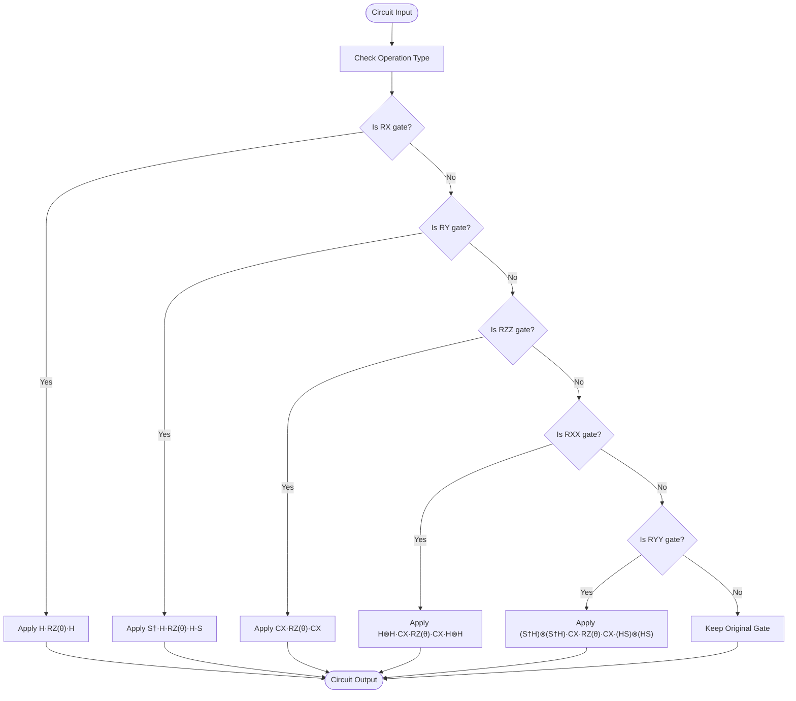
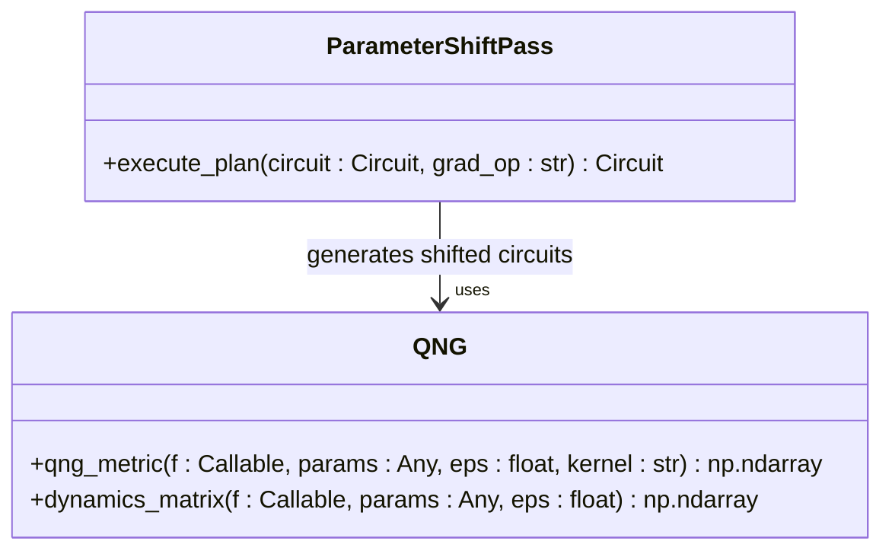
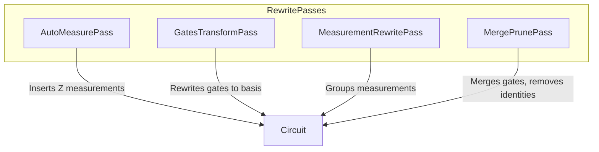
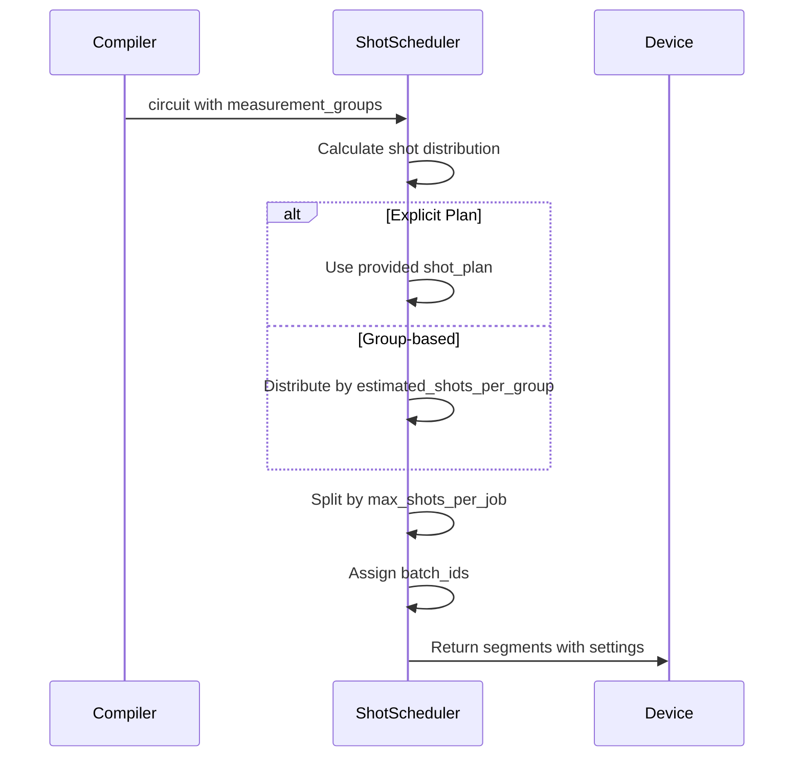
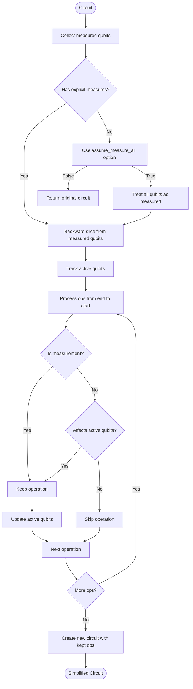
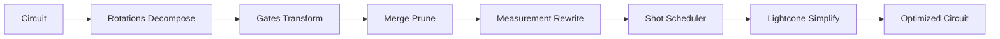

# Compilation Stages

<cite>
**Referenced Files in This Document**   
- [rotations.py](file://src/tyxonq/compiler/stages/decompose/rotations.py)
- [parameter_shift_pass.py](file://src/tyxonq/compiler/stages/gradients/parameter_shift_pass.py)
- [qng.py](file://src/tyxonq/compiler/stages/gradients/qng.py)
- [auto_measure.py](file://src/tyxonq/compiler/stages/rewrite/auto_measure.py)
- [gates_transform.py](file://src/tyxonq/compiler/stages/rewrite/gates_transform.py)
- [measurement.py](file://src/tyxonq/compiler/stages/rewrite/measurement.py)
- [merge_prune.py](file://src/tyxonq/compiler/stages/rewrite/merge_prune.py)
- [shot_scheduler.py](file://src/tyxonq/compiler/stages/scheduling/shot_scheduler.py)
- [lightcone.py](file://src/tyxonq/compiler/stages/simplify/lightcone.py)
- [compile_plan.py](file://src/tyxonq/compiler/compile_engine/native/compile_plan.py)
</cite>

## Table of Contents
1. [Introduction](#introduction)
2. [Decompose Stage: Rotations Decomposition](#decompose-stage-rotations-decomposition)
3. [Gradients Stage: Parameter Shift and QNG](#gradients-stage-parameter-shift-and-qng)
4. [Rewrite Stage: Circuit Rewriting Passes](#rewrite-stage-circuit-rewriting-passes)
5. [Scheduling Stage: Shot Scheduler](#scheduling-stage-shot-scheduler)
6. [Simplify Stage: Lightcone Optimization](#simplify-stage-lightcone-optimization)
7. [Pipeline Integration and Execution](#pipeline-integration-and-execution)
8. [Common Issues and Solutions](#common-issues-and-solutions)

## Introduction
The TyxonQ compiler pipeline consists of multiple modular stages that transform quantum circuits for efficient execution on various backends. Each stage performs specific optimizations and transformations, enabling hardware-aware compilation while preserving circuit semantics. This document details the implementation, interfaces, and usage patterns of key compilation stages: decompose (rotations), gradients (parameter_shift_pass, qng), rewrite (auto_measure, gates_transform, measurement, merge_prune), scheduling (shot_scheduler), and simplify (lightcone). The stages work together through a composable pipeline system that allows flexible configuration and extension.

**Section sources**
- [compile_plan.py](file://src/tyxonq/compiler/compile_engine/native/compile_plan.py#L0-L97)

## Decompose Stage: Rotations Decomposition

The rotations decomposition stage converts parametric rotation gates into fundamental gate sets supported by target hardware. This transformation enables execution on devices with limited native gate support.

### Implementation Details
The `RotationsDecomposePass` class implements standard quantum gate identities to decompose various rotation gates into sequences of H, RZ, and CX gates. The pass processes each operation in the circuit and applies the following transformations:

- RX(θ) → H · RZ(θ) · H
- RY(θ) → S† · H · RZ(θ) · H · S (where S=RZ(π/2))
- RZZ(θ) → CX · RZ(θ on target) · CX
- RXX(θ) → H⊗H · CX · RZ(θ on target) · CX · H⊗H
- RYY(θ) → (S†H)⊗(S†H) · CX · RZ(θ on target) · CX · (HS)⊗(HS)

The implementation handles both single-qubit and two-qubit rotation gates, preserving parameter values during decomposition. Non-rotation gates are passed through unchanged.

### Interface and Usage
The pass is invoked through the compilation pipeline and accepts no additional parameters. It operates on the circuit's operation list and returns a new circuit with decomposed gates.



**Diagram sources**
- [rotations.py](file://src/tyxonq/compiler/stages/decompose/rotations.py#L10-L66)

**Section sources**
- [rotations.py](file://src/tyxonq/compiler/stages/decompose/rotations.py#L10-L66)

## Gradients Stage: Parameter Shift and QNG

The gradients stage provides tools for computing quantum gradients using parameter shift rules and quantum natural gradient methods.

### Parameter Shift Pass
The `ParameterShiftPass` populates metadata for parameter-shift gradient computation. It generates shifted circuits for a specified operation type and stores them in the circuit's metadata.

#### Implementation Details
The pass takes a `grad_op` parameter specifying which operation type to differentiate (e.g., "rz"). It uses the `generate_shifted_circuits` function to create plus and minus shifted versions of the circuit, storing them along with metadata in the circuit's metadata dictionary under the "gradients" key.

#### Interface and Usage
```python
# Example usage
pass_instance = ParameterShiftPass()
circuit = pass_instance.execute_plan(circuit, grad_op="rz")
```

The resulting circuit contains gradient information accessible via `circuit.metadata["gradients"]["rz"]`, which includes "plus", "minus", and "meta" fields.

### Quantum Natural Gradient (QNG)
The QNG module provides numerical computation of the Fubini-Study metric (quantum Fisher information matrix) using finite differences.

#### Implementation Details
The `qng_metric` function computes the quantum natural gradient metric using central differences. It takes a function `f` that maps parameters to a state vector, the current parameters, and a step size `eps`. The implementation supports two kernels:
- "qng": Projected metric with state orthogonalization
- "dynamics": Raw <dψ|dψ> metric

The `dynamics_matrix` function is a convenience alias for the dynamics kernel.

#### Interface and Usage
```python
# Example usage
metric = qng_metric(f, params, eps=1e-5, kernel="qng")
```

The function returns a real symmetric matrix of shape (num_params, num_params) representing the QNG metric.



**Diagram sources**
- [parameter_shift_pass.py](file://src/tyxonq/compiler/stages/gradients/parameter_shift_pass.py#L11-L28)
- [qng.py](file://src/tyxonq/compiler/stages/gradients/qng.py#L0-L114)

**Section sources**
- [parameter_shift_pass.py](file://src/tyxonq/compiler/stages/gradients/parameter_shift_pass.py#L11-L28)
- [qng.py](file://src/tyxonq/compiler/stages/gradients/qng.py#L0-L114)

## Rewrite Stage: Circuit Rewriting Passes

The rewrite stage contains multiple passes that transform circuit structure and operations for optimization and compatibility.

### Auto Measure Pass
The `AutoMeasurePass` automatically inserts Z measurements on all qubits when no explicit measurements are present.

#### Implementation Details
The pass checks if any "measure_z" operations exist in the circuit. If none are found, it appends Z measurements on all qubits from 0 to num_qubits-1 and issues a warning to inform the user.

#### Interface and Usage
```python
# Example usage
pass_instance = AutoMeasurePass()
circuit = pass_instance.execute_plan(circuit)
```

### Gates Transform Pass
The `GatesTransformPass` rewrites gates according to a specified basis gate set.

#### Implementation Details
The pass uses a configurable basis_gates list (default: ["h","rx","rz","cx","cz"]) to determine which gates to transform. It applies the following rules:
- X gate → RX(π) if RX is in basis_gates
- Y gate → RY(π) if RY is in basis_gates
- Preserves CX, CZ, H, RX, RY, RZ gates
- Optionally preserves RXX, RZZ, CY gates if requested

#### Interface and Usage
```python
# Example usage
pass_instance = GatesTransformPass()
circuit = pass_instance.execute_plan(circuit, basis_gates=["h","rx","rz","cx"])
```

### Measurement Rewrite Pass
The `MeasurementRewritePass` groups measurement operations for efficient execution.

#### Implementation Details
The pass groups measurement items by non-overlapping wires with consistent basis, storing grouping information in circuit metadata. It supports both explicit measurement specifications and derivation from circuit operations. For Hamiltonian terms, it groups Pauli terms that can be measured simultaneously.

#### Interface and Usage
```python
# Example usage
pass_instance = MeasurementRewritePass()
circuit = pass_instance.execute_plan(circuit, measurements=meas_list)
```

### Merge Prune Pass
The `MergePrunePass` merges adjacent gates using simple identities and removes identity gates.

#### Implementation Details
The pass uses a rule dictionary to define gate merging behavior. Default rules include:
- S·S → Z, SD·SD → Z
- T·T → S, TD·TD → SD
- X·X → I, Y·Y → I, Z·Z → I, H·H → I
- RZ·RZ → RZ(summed angle), RX·RX → RX(summed angle)

The pass iteratively applies merging and pruning until no further changes occur.

#### Interface and Usage
```python
# Example usage
pass_instance = MergePrunePass(custom_rules)
circuit = pass_instance.execute_plan(circuit)
```



**Diagram sources**
- [auto_measure.py](file://src/tyxonq/compiler/stages/rewrite/auto_measure.py#L10-L34)
- [gates_transform.py](file://src/tyxonq/compiler/stages/rewrite/gates_transform.py#L9-L49)
- [measurement.py](file://src/tyxonq/compiler/stages/rewrite/measurement.py#L9-L88)
- [merge_prune.py](file://src/tyxonq/compiler/stages/rewrite/merge_prune.py#L24-L82)

**Section sources**
- [auto_measure.py](file://src/tyxonq/compiler/stages/rewrite/auto_measure.py#L10-L34)
- [gates_transform.py](file://src/tyxonq/compiler/stages/rewrite/gates_transform.py#L9-L49)
- [measurement.py](file://src/tyxonq/compiler/stages/rewrite/measurement.py#L9-L88)
- [merge_prune.py](file://src/tyxonq/compiler/stages/rewrite/merge_prune.py#L24-L82)

## Scheduling Stage: Shot Scheduler

The shot scheduler stage converts measurement grouping information into executable shot segments.

### Implementation Details
The `ShotSchedulerPass` validates and normalizes shot plans, while the `schedule` function creates execution plans based on measurement grouping metadata. The scheduler supports two modes:
- **Explicit mode**: Uses provided shot_plan directly
- **Group-based mode**: Distributes total_shots according to estimated_shots_per_group weights

The scheduler respects device constraints such as max_shots_per_job and supports batching when enabled by device_rule.

### Interface and Usage
```python
# Example usage
segments = schedule(circuit, shot_plan=[1000, 2000], total_shots=3000)
# or
segments = schedule(circuit, total_shots=3000)
```

The output is a dictionary containing the circuit and segments list, where each segment includes shots, basis, wires, basis_map, and batch_id information.



**Diagram sources**
- [shot_scheduler.py](file://src/tyxonq/compiler/stages/scheduling/shot_scheduler.py#L121-L133)

**Section sources**
- [shot_scheduler.py](file://src/tyxonq/compiler/stages/scheduling/shot_scheduler.py#L0-L136)

## Simplify Stage: Lightcone Optimization

The lightcone simplification stage removes operations that do not affect measured qubits.

### Implementation Details
The `LightconeSimplifyPass` performs backward slicing from measured qubits to identify operations in the lightcone. It keeps:
- All measurement operations
- Operations acting on qubits that eventually affect measured qubits
- Operations connected through entangling gates to the lightcone

The pass handles both explicit measurements and the assume_measure_all option, which treats all qubits as measured when no explicit measurements exist.

### Interface and Usage
```python
# Example usage
pass_instance = LightconeSimplifyPass()
circuit = pass_instance.execute_plan(circuit, assume_measure_all=True)
```

The pass preserves circuit semantics while removing irrelevant operations, reducing circuit depth and execution time.



**Diagram sources**
- [lightcone.py](file://src/tyxonq/compiler/stages/simplify/lightcone.py#L9-L95)

**Section sources**
- [lightcone.py](file://src/tyxonq/compiler/stages/simplify/lightcone.py#L9-L95)

## Pipeline Integration and Execution

The compilation stages are integrated through the CompilePlan system, which composes multiple passes into a single execution pipeline.

### Pipeline Construction
The `build_plan` function creates a CompilePlan from a list of stage names:

```python
# Example pipeline construction
pipeline = build_plan([
    "decompose/rotations",
    "rewrite/gates_transform",
    "rewrite/merge_prune",
    "rewrite/measurement",
    "scheduling/shot_scheduler",
    "simplify/lightcone"
])
```

Each stage name resolves to a specific Pass instance through the _resolve_stage function.

### Execution Flow
The CompilePlan executes passes sequentially, passing the transformed circuit from one stage to the next:



### Configuration and Parameters
Each pass accepts specific parameters through the opts dictionary:
- **RotationsDecomposePass**: No parameters
- **ParameterShiftPass**: grad_op (operation name)
- **AutoMeasurePass**: No parameters
- **GatesTransformPass**: basis_gates (list of allowed gates)
- **MeasurementRewritePass**: measurements, hamiltonian_terms, qubit_operator
- **MergePrunePass**: rules (custom merging rules)
- **ShotSchedulerPass**: shot_plan, total_shots
- **LightconeSimplifyPass**: assume_measure_all (boolean)

**Section sources**
- [compile_plan.py](file://src/tyxonq/compiler/compile_engine/native/compile_plan.py#L0-L97)

## Common Issues and Solutions

### Missing Measurements
**Issue**: Circuits without explicit measurements may produce unexpected results.

**Solution**: Use AutoMeasurePass to automatically add Z measurements, or explicitly add measurements in the circuit construction.

### Incompatible Gate Sets
**Issue**: Target hardware may not support certain gate types.

**Solution**: Use GatesTransformPass with an appropriate basis_gates list, or DecomposePass to break down complex gates.

### Excessive Shot Allocation
**Issue**: Default shot distribution may not be optimal for variance reduction.

**Solution**: Provide custom shot_plan or implement variance-aware grouping in MeasurementRewritePass.

### Performance Bottlenecks
**Issue**: Large circuits may have slow compilation times.

**Solution**: Apply LightconeSimplifyPass early to reduce circuit size, or disable unnecessary passes.

### Gradient Computation Failures
**Issue**: Parameter shift may fail for non-differentiable operations.

**Solution**: Ensure grad_op specifies a valid parametric gate, and verify the circuit structure supports differentiation.

**Section sources**
- [rotations.py](file://src/tyxonq/compiler/stages/decompose/rotations.py#L10-L66)
- [parameter_shift_pass.py](file://src/tyxonq/compiler/stages/gradients/parameter_shift_pass.py#L11-L28)
- [auto_measure.py](file://src/tyxonq/compiler/stages/rewrite/auto_measure.py#L10-L34)
- [gates_transform.py](file://src/tyxonq/compiler/stages/rewrite/gates_transform.py#L9-L49)
- [measurement.py](file://src/tyxonq/compiler/stages/rewrite/measurement.py#L9-L88)
- [merge_prune.py](file://src/tyxonq/compiler/stages/rewrite/merge_prune.py#L24-L82)
- [shot_scheduler.py](file://src/tyxonq/compiler/stages/scheduling/shot_scheduler.py#L0-L136)
- [lightcone.py](file://src/tyxonq/compiler/stages/simplify/lightcone.py#L9-L95)