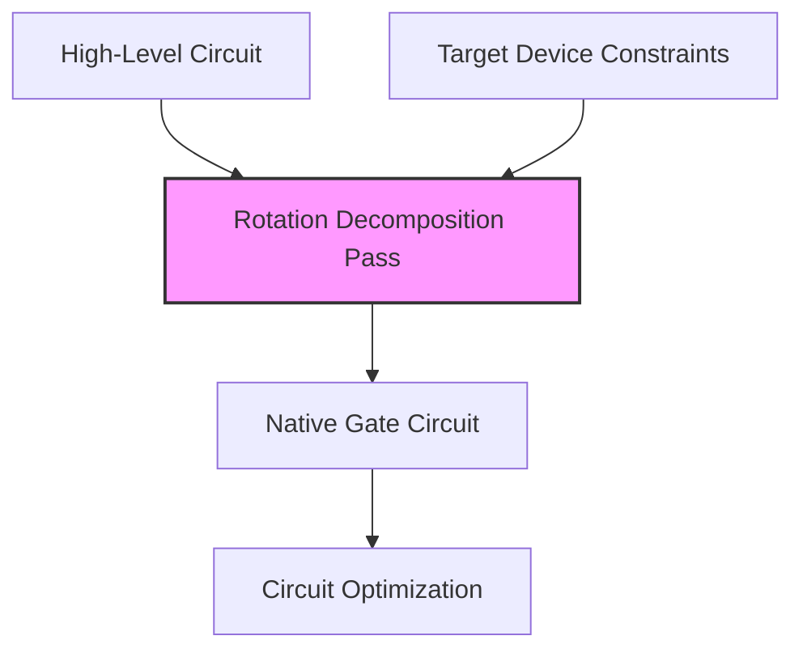
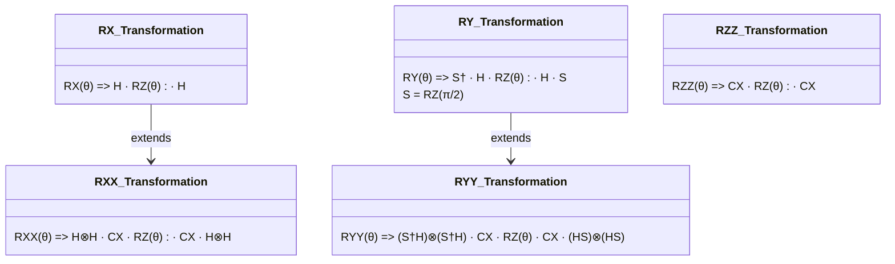
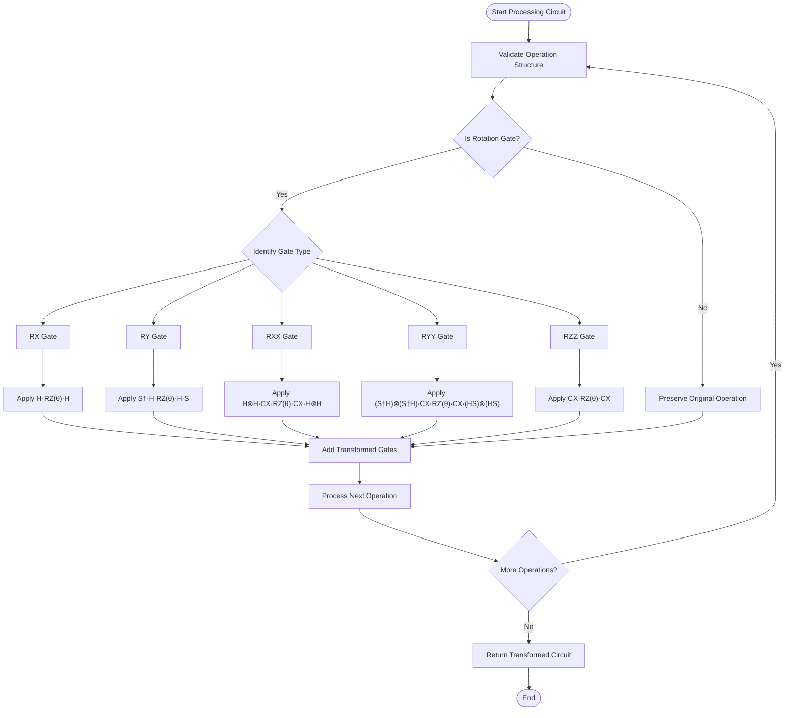
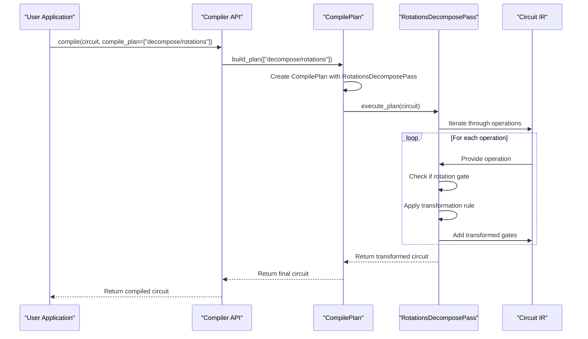
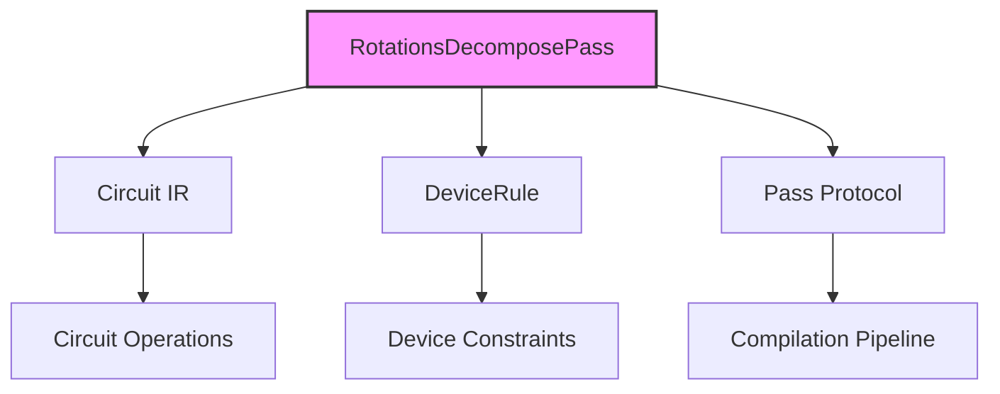

# Decomposition Stage

<cite>
**Referenced Files in This Document**  
- [rotations.py](file://src/tyxonq/compiler/stages/decompose/rotations.py)
- [circuit.py](file://src/tyxonq/core/ir/circuit.py)
- [base.py](file://src/tyxonq/devices/base.py)
- [compile_plan.py](file://src/tyxonq/compiler/compile_engine/native/compile_plan.py)
- [api.py](file://src/tyxonq/compiler/api.py)
</cite>

## Table of Contents
1. [Introduction](#introduction)
2. [Core Components](#core-components)
3. [Architecture Overview](#architecture-overview)
4. [Detailed Component Analysis](#detailed-component-analysis)
5. [Dependency Analysis](#dependency-analysis)
6. [Performance Considerations](#performance-considerations)
7. [Troubleshooting Guide](#troubleshooting-guide)
8. [Conclusion](#conclusion)

## Introduction
The decomposition stage in TyxonQ's compiler pipeline is responsible for transforming high-level quantum operations into native gate sets supported by target quantum devices. This document focuses specifically on the rotation decomposition pass, which systematically rewrites parametric rotation gates into elementary gates from the native set {H, RZ, CX}. This transformation is essential for ensuring compatibility with physical quantum hardware that may not directly support arbitrary rotation gates. The process preserves the quantum circuit's semantics while adapting it to device-specific constraints.

## Core Components
The rotation decomposition functionality is implemented in the `RotationsDecomposePass` class within the `rotations.py` file. This component operates on TyxonQ's intermediate representation (IR) of quantum circuits, analyzing each operation and applying transformation rules to decompose high-level rotation gates into sequences of native gates. The implementation supports decomposition of single-qubit gates (RX, RY) and two-qubit entangling gates (RXX, RYY, RZZ), ensuring comprehensive coverage of common parametric operations used in variational quantum algorithms.

**Section sources**
- [rotations.py](file://src/tyxonq/compiler/stages/decompose/rotations.py#L1-L70)

## Architecture Overview
The rotation decomposition pass integrates into TyxonQ's modular compiler pipeline as a discrete transformation stage. It operates after circuit construction and before device-specific optimization, forming a critical link between high-level quantum algorithms and executable quantum programs. The pass follows a visitor pattern, iterating through circuit operations and replacing decomposable gates with equivalent sequences of native gates. This architecture enables clean separation of concerns, allowing the decomposition logic to be developed and tested independently while maintaining compatibility with the broader compilation workflow.

**Diagram sources**
- [rotations.py](file://src/tyxonq/compiler/stages/decompose/rotations.py#L1-L70)
- [compile_plan.py](file://src/tyxonq/compiler/compile_engine/native/compile_plan.py#L44-L94)

## Detailed Component Analysis

### Rotation Decomposition Implementation
The `RotationsDecomposePass` class implements the core decomposition logic through its `execute_plan` method. For each operation in the input circuit, the method identifies rotation gates by their operation name and applies specific transformation rules to decompose them into native gates. The implementation handles both single-qubit and two-qubit rotation gates, with careful attention to parameter preservation and qubit indexing.

#### Transformation Rules
The decomposition pass applies the following mathematical identities to transform rotation gates:

**Diagram sources**
- [rotations.py](file://src/tyxonq/compiler/stages/decompose/rotations.py#L10-L35)

#### Circuit Rewriting Logic
The circuit rewriting process follows a systematic approach to ensure correctness and efficiency. The implementation iterates through each operation in the input circuit, identifies rotation gates by their lowercase operation name, and replaces them with equivalent sequences of native gates. Non-rotation operations are preserved unchanged, maintaining the overall circuit structure while only transforming the targeted gates.

**Diagram sources**
- [rotations.py](file://src/tyxonq/compiler/stages/decompose/rotations.py#L37-L69)

### Integration with Compilation Flow
The rotation decomposition pass integrates seamlessly into TyxonQ's compilation pipeline through the `build_plan` function, which constructs a sequence of compilation stages. The pass is registered under the name "decompose/rotations" and can be included in custom compilation plans alongside other optimization stages. This modular design allows users to control the compilation workflow while ensuring consistent application of decomposition rules.

**Diagram sources**
- [rotations.py](file://src/tyxonq/compiler/stages/decompose/rotations.py#L1-L70)
- [compile_plan.py](file://src/tyxonq/compiler/compile_engine/native/compile_plan.py#L44-L94)
- [api.py](file://src/tyxonq/compiler/api.py#L1-L66)

## Dependency Analysis
The rotation decomposition pass depends on several core components of the TyxonQ framework to function correctly. It requires access to the circuit's intermediate representation through the `Circuit` class, which provides the data structure for quantum operations. The pass also depends on the `DeviceRule` interface to potentially access device-specific constraints, though the current implementation primarily focuses on universal decomposition rules. The integration with the compilation pipeline is facilitated through the `Pass` protocol, ensuring compatibility with the modular compilation architecture.

**Diagram sources**
- [rotations.py](file://src/tyxonq/compiler/stages/decompose/rotations.py#L1-L70)
- [circuit.py](file://src/tyxonq/core/ir/circuit.py#L48-L727)
- [base.py](file://src/tyxonq/devices/base.py#L41-L52)

## Performance Considerations
The rotation decomposition pass impacts circuit depth and gate count, which are critical factors for quantum program execution. Each decomposition increases the number of gates in the circuit, potentially affecting execution time and error rates. For example, an RX gate is transformed into three native gates (H·RZ·H), while RY requires five gates (S†·H·RZ·H·S). Two-qubit gates like RXX and RYY require seven gates each, significantly increasing circuit depth. Users should consider these trade-offs when designing quantum algorithms, particularly for noisy intermediate-scale quantum (NISQ) devices where gate fidelity is crucial.

## Troubleshooting Guide
When using the rotation decomposition pass, users may encounter issues related to gate fidelity and device compatibility. If the compiled circuit fails to execute on target hardware, verify that the native gate set {H, RZ, CX} is supported by the device. Check the device rule configuration to ensure proper connectivity constraints are respected. For parametric circuits, ensure that rotation angles are properly preserved during decomposition. If unexpected behavior occurs, examine the transformed circuit to verify that decomposition rules have been applied correctly and that no operations were inadvertently modified.

**Section sources**
- [rotations.py](file://src/tyxonq/compiler/stages/decompose/rotations.py#L1-L70)
- [base.py](file://src/tyxonq/devices/base.py#L41-L52)

## Conclusion
The rotation decomposition pass plays a vital role in TyxonQ's compiler pipeline by enabling the execution of high-level quantum algorithms on physical quantum devices. By systematically transforming parametric rotation gates into native gate sequences, the pass bridges the gap between algorithmic design and hardware implementation. The modular design allows for easy integration into custom compilation workflows, while the comprehensive coverage of rotation gates ensures broad applicability across various quantum computing applications. Future enhancements could include optimization of decomposition sequences and support for additional gate sets to further improve circuit efficiency and device compatibility.