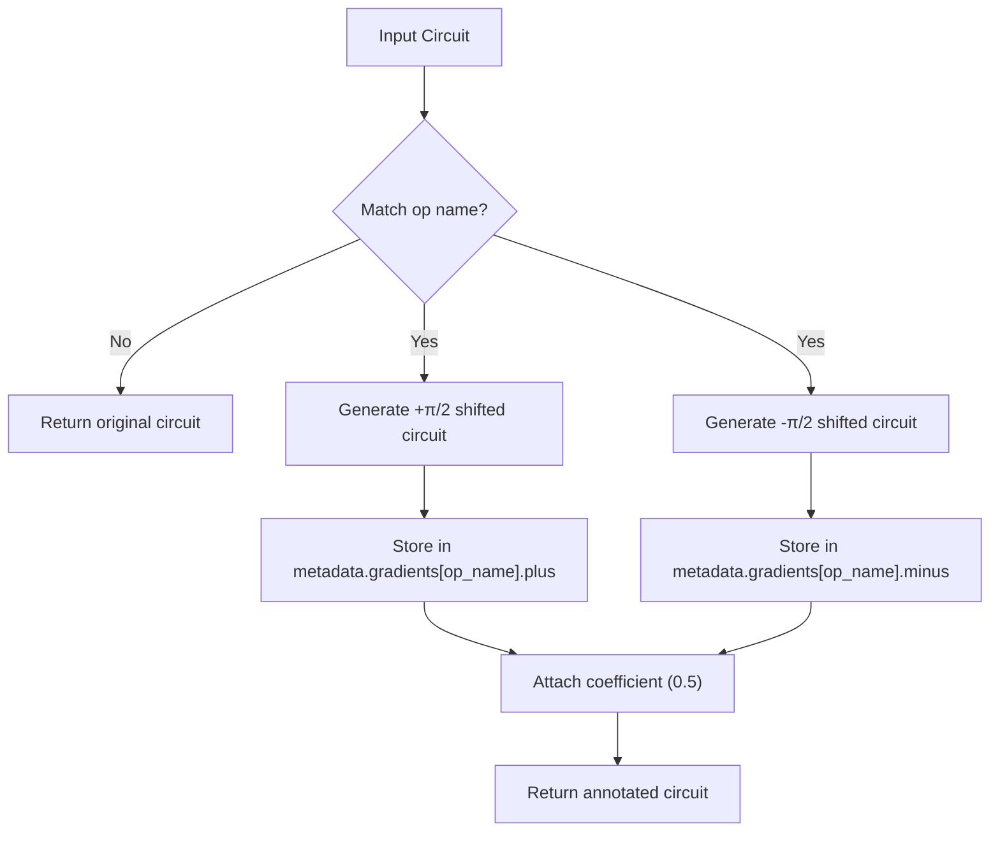
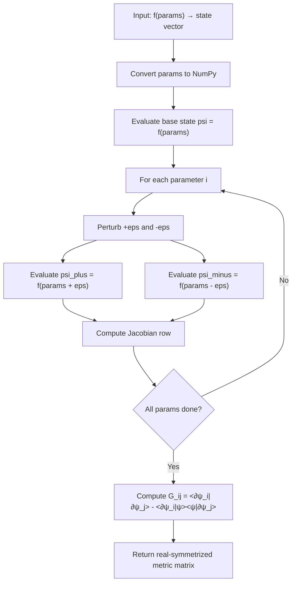

# Gradient Computation Passes

<cite>
**Referenced Files in This Document**   
- [parameter_shift_pass.py](file://src/tyxonq/compiler/stages/gradients/parameter_shift_pass.py)
- [qng.py](file://src/tyxonq/compiler/stages/gradients/qng.py)
- [parameter_shift.py](file://examples/parameter_shift.py)
- [generate_shifted_circuits.py](file://src/tyxonq/compiler/gradients/parameter_shift.py)
</cite>

## Table of Contents
1. [Introduction](#introduction)
2. [Parameter Shift Gradient Pass](#parameter-shift-gradient-pass)
3. [Quantum Natural Gradient (QNG) Computation](#quantum-natural-gradient-qng-computation)
4. [Integration with Variational Algorithms](#integration-with-variational-algorithms)
5. [Performance and Numerical Stability](#performance-and-numerical-stability)
6. [Common Pitfalls and Trade-offs](#common-pitfalls-and-trade-offs)
7. [Conclusion](#conclusion)

## Introduction
This document details the implementation and usage of two core gradient computation methods in TyxonQ's compiler: the parameter shift rule and the quantum natural gradient (QNG). These techniques are essential for optimizing variational quantum algorithms such as VQE and QAOA. The parameter shift method enables analytic gradient evaluation through circuit parameter perturbations, while QNG leverages geometric information via the quantum Fisher information matrix to guide optimization. Both are implemented as compiler passes that integrate seamlessly into the quantum circuit compilation pipeline.

## Parameter Shift Gradient Pass

The `ParameterShiftPass` class in `parameter_shift_pass.py` implements a compiler pass that generates metadata for analytic gradient evaluation using the parameter shift rule. It operates by identifying parameterized gates matching a specified operation name (e.g., "rz", "rx") and creating two modified circuit variants: one with the parameter shifted forward by π/2 and another shifted backward by π/2.

The pass populates the circuit's metadata with these shifted circuits and a coefficient (typically 0.5), which are later used to compute gradients as weighted differences of expectation values. This approach supports hardware-compatible gradient estimation without requiring explicit differentiation logic on quantum devices.

**Diagram sources**
- [parameter_shift_pass.py](file://src/tyxonq/compiler/stages/gradients/parameter_shift_pass.py#L11-L28)
- [parameter_shift.py](file://src/tyxonq/compiler/gradients/parameter_shift.py#L8-L35)

**Section sources**
- [parameter_shift_pass.py](file://src/tyxonq/compiler/stages/gradients/parameter_shift_pass.py#L1-L31)
- [parameter_shift.py](file://src/tyxonq/compiler/gradients/parameter_shift.py#L1-L38)

## Quantum Natural Gradient (QNG) Computation

The `qng.py` module provides utilities for computing the Quantum Natural Gradient using numerical Jacobians. The core function `qng_metric` computes the Fubini-Study metric tensor (quantum Fisher information matrix) by evaluating the state vector's sensitivity to parameter changes via central finite differences.

It accepts a parameter-to-state function `f`, parameter array `params`, and step size `eps`, returning a real symmetric matrix of shape (num_params, num_params). The metric can be computed in two kernels: "qng" (projected metric) and "dynamics" (unprojected). The implementation is backend-agnostic, supporting NumPy, PyTorch, and other array backends through automatic conversion.

The `dynamics_matrix` function is a convenience alias that calls `qng_metric` with `kernel='dynamics'`. This modular design allows integration with various quantum simulators and hardware backends while maintaining numerical stability.

**Diagram sources**
- [qng.py](file://src/tyxonq/compiler/stages/gradients/qng.py#L72-L104)

**Section sources**
- [qng.py](file://src/tyxonq/compiler/stages/gradients/qng.py#L1-L114)

## Integration with Variational Algorithms

Both gradient methods are designed for integration into variational quantum algorithms. The parameter shift pass is typically applied during circuit compilation, where the generated metadata enables gradient-aware execution on quantum devices. Example workflows in `parameter_shift.py` demonstrate how analytic gradients are computed by evaluating expectation values on the plus and minus circuits and combining them with the shift coefficient.

For QNG, the metric tensor is used within optimization loops to precondition standard gradients, improving convergence in parameter space with strong curvature. The numerical Jacobian approach ensures compatibility with any quantum backend that can return state vectors, making it suitable for both simulation and hardware execution when combined with appropriate measurement strategies.

Code examples show end-to-end usage patterns, including finite-difference validation for correctness testing and shot-based estimation for realistic noise modeling. These patterns are directly applicable to VQE, QAOA, and other variational workflows.

**Section sources**
- [parameter_shift.py](file://examples/parameter_shift.py#L93-L182)

## Performance and Numerical Stability

The parameter shift method offers exact analytic gradients when executed with infinite shots (analytic mode), but introduces sampling noise in finite-shot scenarios. Its computational cost scales linearly with the number of parameters, requiring two circuit evaluations per parameter. However, it avoids numerical instability associated with small finite-difference steps.

In contrast, QNG computation via `qng_metric` has O(P×D) complexity where P is the number of parameters and D is the state dimension. While more expensive than parameter shift for large circuits, it provides geometric insight that can accelerate convergence. The use of central differences (with default `eps=1e-5`) balances truncation and round-off errors, while the real-symmetrization step mitigates numerical noise in the metric tensor.

Both methods benefit from vectorized backend operations and can be optimized through caching and parallel execution of circuit evaluations.

**Section sources**
- [qng.py](file://src/tyxonq/compiler/stages/gradients/qng.py#L45-L65)
- [parameter_shift.py](file://src/tyxonq/compiler/gradients/parameter_shift.py#L20-L30)

## Common Pitfalls and Trade-offs

A key limitation of the parameter shift rule is its overhead: each parameter requires two additional circuit executions, leading to scalability challenges for deep circuits with many parameters. Additionally, the current implementation only shifts the first occurrence of a matching gate, which may not capture all parameter dependencies in complex circuits.

For QNG, the primary challenge is metric tensor inversion: near-singular matrices can cause numerical instability during optimization. Regularization techniques or truncated SVD may be required in practice. Furthermore, the finite-difference approximation assumes smooth parameter dependence, which may break down in noisy or discontinuous landscapes.

Users should choose between methods based on circuit depth, parameter count, noise levels, and convergence requirements. Parameter shift is preferred for shallow circuits and hardware execution, while QNG excels in simulation-based optimization where geometric information improves training dynamics.

**Section sources**
- [parameter_shift_pass.py](file://src/tyxonq/compiler/stages/gradients/parameter_shift_pass.py#L1-L31)
- [qng.py](file://src/tyxonq/compiler/stages/gradients/qng.py#L1-L114)

## Conclusion
TyxonQ's gradient computation framework provides robust support for both parameter shift and quantum natural gradient methods. The compiler-integrated design ensures seamless usage across different backends and applications. By leveraging circuit transformation metadata and numerical differentiation, these passes enable efficient and accurate gradient estimation critical for variational quantum algorithms. Future enhancements could include support for multiple shift rules, automatic gate detection, and hybrid gradient strategies.