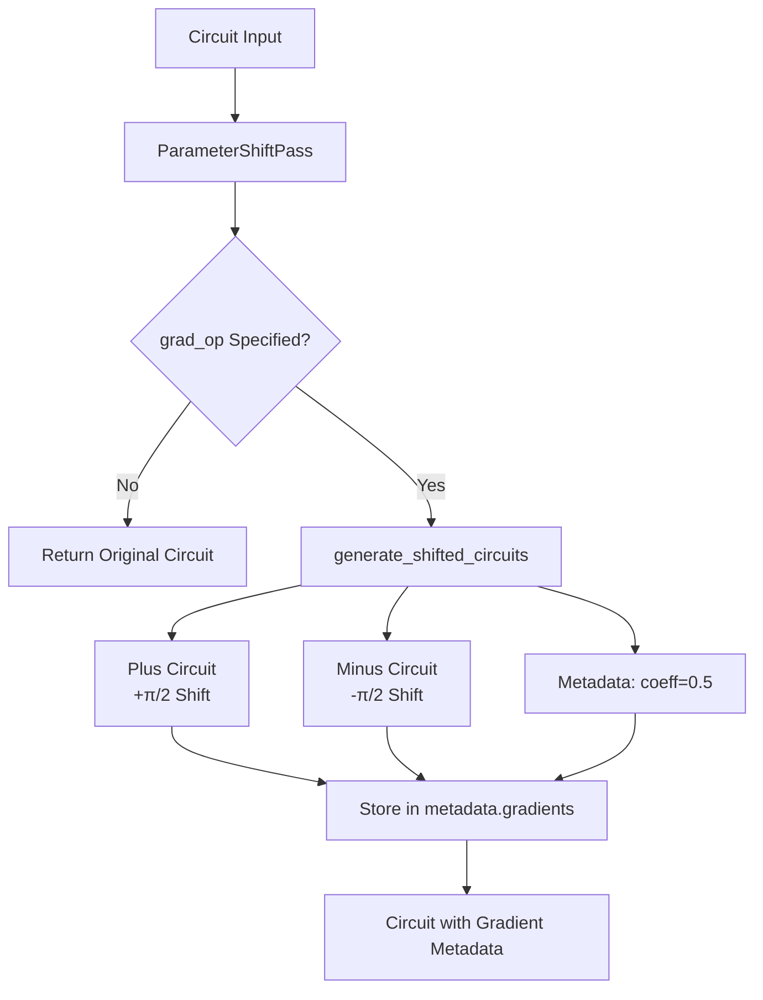
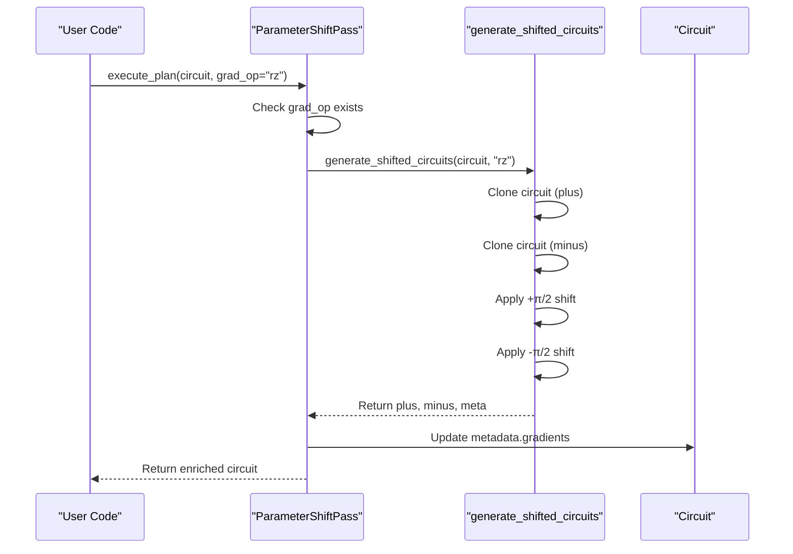
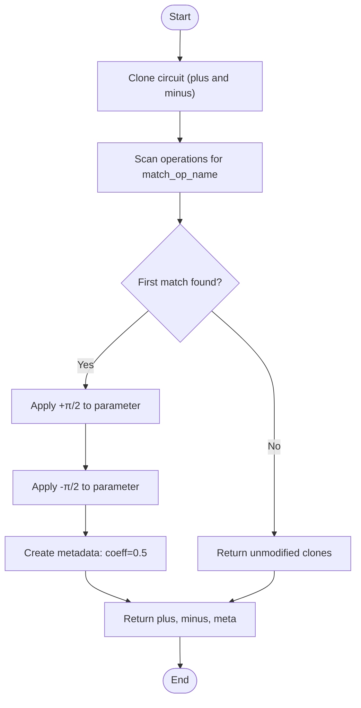

# Parameter Shift Gradient Pass

<cite>
**Referenced Files in This Document**   
- [parameter_shift_pass.py](file://src/tyxonq/compiler/stages/gradients/parameter_shift_pass.py)
- [parameter_shift.py](file://examples/parameter_shift.py)
- [circuit.py](file://src/tyxonq/core/ir/circuit.py)
- [parameter_shift.py](file://src/tyxonq/compiler/gradients/parameter_shift.py)
- [vqe.py](file://src/tyxonq/libs/circuits_library/vqe.py)
</cite>

## Table of Contents
1. [Introduction](#introduction)
2. [Core Components](#core-components)
3. [Architecture Overview](#architecture-overview)
4. [Detailed Component Analysis](#detailed-component-analysis)
5. [Performance Considerations](#performance-considerations)
6. [Troubleshooting Guide](#troubleshooting-guide)

## Introduction
The ParameterShiftPass in TyxonQ's compiler implements analytic gradient computation for variational quantum circuits using the parameter shift rule. This technique enables exact gradient estimation by evaluating the circuit at parameter values shifted by ±π/2, avoiding the approximation errors inherent in finite difference methods. The pass operates as a compiler stage that transforms a quantum circuit by generating plus and minus shifted variants for a specified parameterized gate (e.g., 'rz', 'rx'), then enriching the circuit's metadata with references to these derivative circuits. This approach is particularly valuable for variational algorithms like VQE and QAOA, where efficient and accurate gradient computation is essential for optimization convergence.

## Core Components

The ParameterShiftPass class serves as the primary component for implementing parameter shift gradient computation within TyxonQ's compiler framework. It follows the compiler pass interface pattern, accepting a Circuit object and transformation options to generate derivative circuits. The pass leverages the generate_shifted_circuits function to create two modified circuit instances: one with the target parameter increased by π/2 and another with it decreased by π/2. These shifted circuits are stored in the original circuit's metadata under the "gradients" key, enabling subsequent execution stages to access them for gradient calculation. The implementation supports any single-parameter gate by name specification through the grad_op option, making it flexible for various variational ansatz designs.

**Section sources**
- [parameter_shift_pass.py](file://src/tyxonq/compiler/stages/gradients/parameter_shift_pass.py#L11-L28)
- [parameter_shift.py](file://src/tyxonq/compiler/gradients/parameter_shift.py#L8-L35)

## Architecture Overview



**Diagram sources**
- [parameter_shift_pass.py](file://src/tyxonq/compiler/stages/gradients/parameter_shift_pass.py#L11-L28)
- [parameter_shift.py](file://src/tyxonq/compiler/gradients/parameter_shift.py#L8-L35)

## Detailed Component Analysis

### ParameterShiftPass Analysis

The ParameterShiftPass implements the execute_plan method, which serves as the interface for gradient computation within TyxonQ's compilation pipeline. This method accepts three primary inputs: a Circuit object representing the quantum circuit to be differentiated, an optional DeviceRule object containing device-specific constraints, and keyword arguments that include the critical grad_op parameter specifying which gate type to differentiate (e.g., 'rz'). When executed, the method first checks if a valid grad_op has been provided; if not, it returns the original circuit unchanged. Otherwise, it delegates to the generate_shifted_circuits function to create the plus and minus shifted circuit variants.

The execute_plan method enriches the input circuit's metadata by creating a nested structure under the "gradients" key, using the grad_op value as a sub-key. Within this structure, it stores references to the plus and minus shifted circuits along with metadata containing the parameter shift coefficient (0.5 for standard rotations). This metadata enrichment approach preserves the original circuit while making the derivative circuits accessible for subsequent processing stages, maintaining immutability principles within the compiler pipeline.



**Diagram sources**
- [parameter_shift_pass.py](file://src/tyxonq/compiler/stages/gradients/parameter_shift_pass.py#L11-L28)
- [parameter_shift.py](file://src/tyxonq/compiler/gradients/parameter_shift.py#L8-L35)

**Section sources**
- [parameter_shift_pass.py](file://src/tyxonq/compiler/stages/gradients/parameter_shift_pass.py#L11-L28)

### generate_shifted_circuits Implementation

The generate_shifted_circuits function implements the core logic for creating parameter-shifted circuit variants. It takes a Circuit object and a target operation name as inputs, then creates two identical copies of the circuit. The function scans through the circuit operations and applies a +π/2 shift to the first occurrence of the specified gate type in the plus circuit, and a -π/2 shift in the minus circuit. This implementation follows the standard parameter shift rule for rotation gates, where the gradient is computed as 0.5*(f(θ+π/2) - f(θ-π/2)). The function returns both shifted circuits along with metadata containing the shift coefficient, enabling proper gradient scaling during the final computation.



**Diagram sources**
- [parameter_shift.py](file://src/tyxonq/compiler/gradients/parameter_shift.py#L8-L35)

**Section sources**
- [parameter_shift.py](file://src/tyxonq/compiler/gradients/parameter_shift.py#L8-L35)

### VQE Ansatz Example

The following example demonstrates how to apply the ParameterShiftPass to generate derivative circuits for a variational quantum eigensolver (VQE) ansatz. The example creates a layered circuit with RX and RZZ gates, then applies the parameter shift pass to compute gradients with respect to the RZZ parameters. This approach enables analytic gradient computation for optimizing the VQE energy expectation, providing more accurate gradients than finite difference methods.

```python
# Example from parameter_shift.py
def build_layered_circuit_rzz_rx(paramzz, paramx):
    c = tq.Circuit(n)
    for j in range(m):
        for i in range(n - 1):
            c.rzz(i, i + 1, theta=float(paramzz[i, j]))
        for i in range(n):
            c.rx(i, theta=float(paramx[i, j]))
    return c

# Apply parameter shift for RZZ gates
pass_instance = ParameterShiftPass()
shifted_circuit = pass_instance.execute_plan(circuit, grad_op="rzz")
```

**Section sources**
- [parameter_shift.py](file://examples/parameter_shift.py#L48-L66)

## Performance Considerations

The ParameterShiftPass introduces performance implications related to circuit duplication and execution overhead. Since the pass generates two additional circuit instances for each parameter shift operation, memory usage increases proportionally to the number of parameters being differentiated. For large variational circuits with many parameters, this can lead to significant memory consumption. The computational cost also doubles compared to evaluating the original circuit alone, as both plus and minus shifted circuits must be executed to compute the gradient.

Numerical stability is generally excellent with the parameter shift method, as it provides analytic gradients without the truncation errors associated with finite difference methods. However, when using shot-based execution with limited measurement samples, statistical noise can affect gradient accuracy. The method is fully compatible with shot-based execution, but users should be aware that gradient variance scales with the inverse of the number of shots. For noisy intermediate-scale quantum (NISQ) devices, this may require careful shot allocation strategies to balance gradient accuracy with execution time.

## Troubleshooting Guide

Common issues when using the ParameterShiftPass include incorrect op_name specification and metadata collision. If the grad_op parameter does not match any gate names in the circuit, the pass will return the original circuit unchanged, potentially leading to silent failures in gradient computation. Users should verify that the operation name matches exactly (case-sensitive) with the gates in their circuit. Another potential issue is metadata collision, where existing "gradients" metadata might be overwritten. The current implementation uses setdefault to create the gradients dictionary, but subsequent calls with different grad_op values will add new entries rather than overwrite existing ones.

Additional considerations include ensuring that the target gate actually has a parameter to shift (three or more elements in the operation tuple) and that the circuit contains at least one instance of the specified gate. The current implementation only shifts the first occurrence of the specified gate, which may not be appropriate for circuits with multiple instances of the same gate type that should be differentiated independently.

**Section sources**
- [parameter_shift_pass.py](file://src/tyxonq/compiler/stages/gradients/parameter_shift_pass.py#L11-L28)
- [parameter_shift.py](file://src/tyxonq/compiler/gradients/parameter_shift.py#L8-L35)