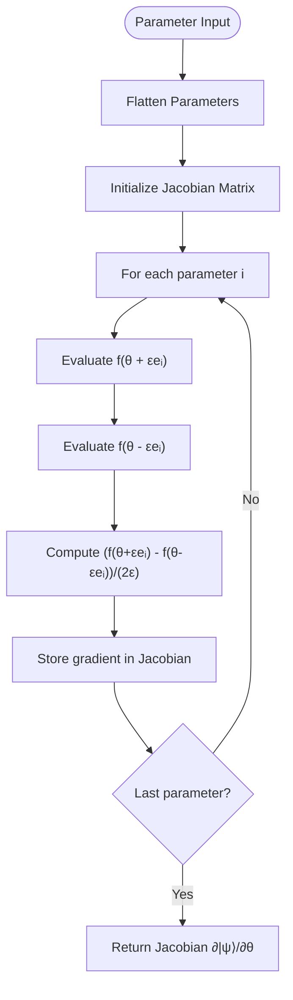
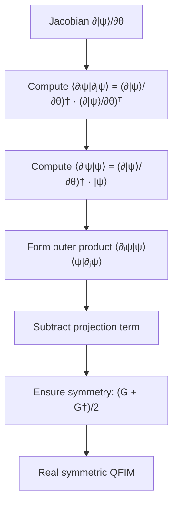
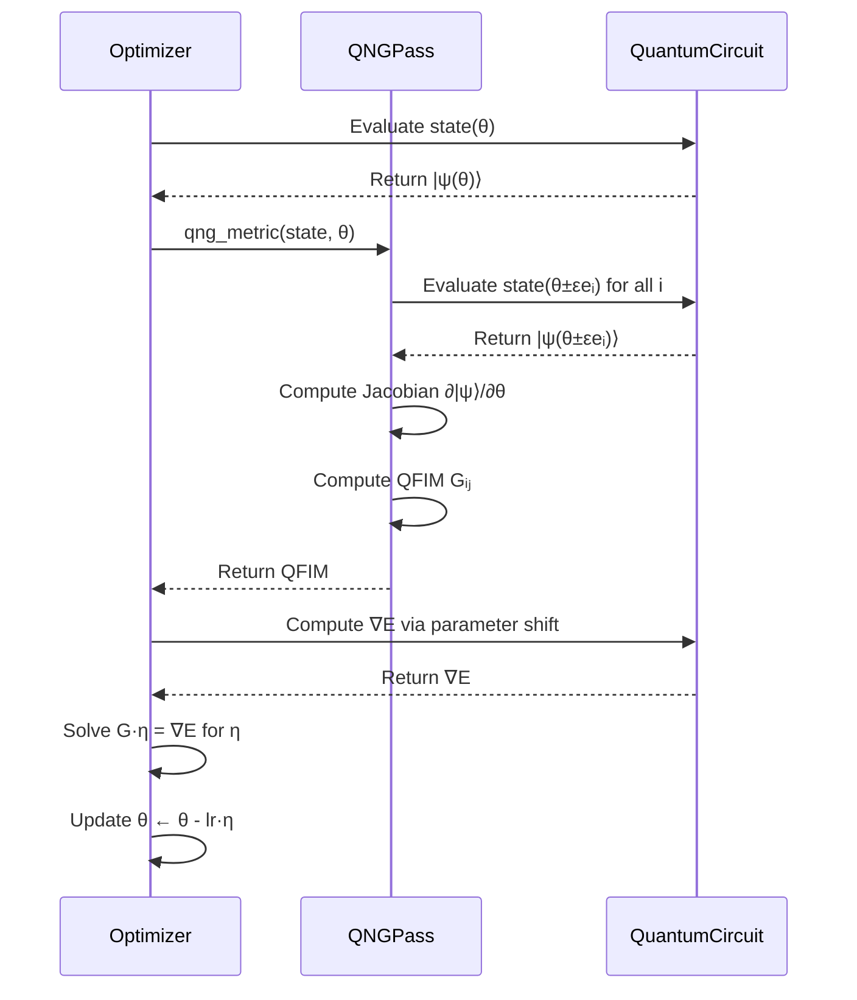

# Quantum Natural Gradient Pass

<cite>
**Referenced Files in This Document**   
- [qng.py](file://src/tyxonq/compiler/stages/gradients/qng.py)
- [quantumng.py](file://examples-ng/quantumng.py)
</cite>

## Table of Contents
1. [Introduction](#introduction)
2. [Core Implementation](#core-implementation)
3. [Metric Tensor Computation](#metric-tensor-computation)
4. [Integration with Variational Algorithms](#integration-with-variational-algorithms)
5. [Practical Example: VQE Workflow](#practical-example-vqe-workflow)
6. [Computational Considerations](#computational-considerations)
7. [Regularization and Stability](#regularization-and-stability)
8. [Common Pitfalls](#common-pitfalls)
9. [Conclusion](#conclusion)

## Introduction

The Quantum Natural Gradient (QNG) pass in TyxonQ's compiler implements a geometry-aware optimization technique for variational quantum algorithms. Unlike standard gradient descent that follows the steepest descent in parameter space, QNG accounts for the underlying quantum state space geometry by incorporating the Fubini-Study metric, equivalent to the quantum Fisher information matrix. This approach provides optimization directions that correspond to maximal changes in the quantum state rather than just parameter values, often leading to faster convergence in quantum optimization problems.

The implementation resides in the compiler's gradient stages and provides a backend-agnostic method for computing natural gradients using numerical techniques. It is designed to work seamlessly with variational algorithms like VQE and QAOA, offering an alternative optimization strategy that respects the non-Euclidean geometry of quantum state space.

## Core Implementation

The QNG pass is implemented as a collection of numerical utilities that compute the quantum natural gradient metric from parameterized quantum circuits. The core functionality is contained in the `qng.py` module, which provides methods for calculating the Fubini-Study metric tensor through finite difference approximations.

The implementation follows a modular design with three primary components: parameter-to-state mapping, Jacobian computation, and metric tensor formation. The system is designed to be backend-agnostic, accepting any callable that maps parameters to quantum state vectors, regardless of the underlying computational framework.

**Section sources**
- [qng.py](file://src/tyxonq/compiler/stages/gradients/qng.py#L0-L114)

## Metric Tensor Computation

The quantum natural gradient metric computation follows a three-step process that estimates the Fubini-Study metric using overlapping parameter-shifted circuits:

### Numerical Jacobian Estimation

The foundation of the metric computation is the numerical estimation of the Jacobian matrix ∂|ψ⟩/∂θ using central differences. For each parameter θᵢ, the implementation evaluates the quantum circuit at θ + εeᵢ and θ - εeᵢ, where ε is a small finite difference step (default 1e-5). The Jacobian computation flattens parameter arrays for perturbation while preserving their original structure for circuit evaluation.

**Diagram sources**
- [qng.py](file://src/tyxonq/compiler/stages/gradients/qng.py#L43-L69)

### Fubini-Study Metric Formation

The quantum Fisher information matrix (QFIM) is computed from the Jacobian using the formula:

Gᵢⱼ = ⟨∂ᵢψ|∂ⱼψ⟩ - ⟨∂ᵢψ|ψ⟩⟨ψ|∂ⱼψ⟩

This projects the metric onto the manifold of pure quantum states, removing components parallel to the state vector itself. The implementation provides two kernel options: the standard QNG kernel that applies this projection, and a dynamics kernel that computes the unprojected metric ⟨∂ᵢψ|∂ⱼψ⟩.

The computation involves matrix operations on the complex-valued Jacobian to form inner products, with final processing to ensure the output is a real symmetric matrix by averaging with its conjugate transpose.

**Diagram sources**
- [qng.py](file://src/tyxonq/compiler/stages/gradients/qng.py#L72-L104)

## Integration with Variational Algorithms

The QNG pass integrates with variational algorithms through a functional interface that connects the metric computation to optimization routines. The implementation provides a clean separation between the quantum component (state preparation) and classical optimization, allowing the natural gradient to be incorporated into standard gradient-based optimizers.

The integration follows the pattern where the energy function and state preparation function are separate callables. The QNG metric is computed with respect to the state preparation function, while gradients of the energy are computed separately. These components are then combined in the optimization loop to form the natural gradient update direction.

**Section sources**
- [qng.py](file://src/tyxonq/compiler/stages/gradients/qng.py#L72-L111)

## Practical Example: VQE Workflow

The quantumng.py example demonstrates a complete VQE workflow using the transverse field Ising model (TFIM) Hamiltonian. This implementation showcases the practical application of QNG in a variational quantum eigensolver context, with direct comparison to standard gradient descent.

### VQE Setup

The example defines a parameterized quantum circuit using a hardware-efficient ansatz with alternating layers of single-qubit rotations and entangling gates. The energy function computes the expectation value of the TFIM Hamiltonian, which includes nearest-neighbor ZZ interactions and transverse X fields.

### Optimization Comparison

The benchmark compares three optimization approaches:
1. Standard gradient descent using parameter-shift gradients
2. Quantum natural gradient descent with forward-mode metric computation
3. Quantum natural gradient descent with reverse-mode metric computation

The natural gradient updates are computed by solving the linear system G·η = ∇E, where G is the QFIM and ∇E is the standard gradient. This effectively transforms the gradient into the natural gradient η = G⁻¹∇E, providing a geometry-aware update direction.

**Diagram sources**
- [quantumng.py](file://examples-ng/quantumng.py#L0-L96)

**Section sources**
- [quantumng.py](file://examples-ng/quantumng.py#L0-L96)

## Computational Considerations

The QNG pass introduces significant computational overhead compared to standard gradient methods, primarily due to the metric tensor computation. The complexity scales as O(P²) where P is the number of parameters, as each element of the P×P metric tensor requires two circuit evaluations (for the central difference).

For large parameter spaces, this quadratic scaling can become prohibitive. The implementation uses central differences which require 2P circuit evaluations per metric computation, making it more expensive than forward or backward difference methods. However, central differences provide better numerical stability and accuracy.

Memory requirements are dominated by the storage of the Jacobian matrix, which has dimensions P×D where D is the Hilbert space dimension. For n-qubit systems, D = 2ⁿ, making the Jacobian storage challenging for systems beyond approximately 20 qubits.

## Regularization and Stability

The QNG implementation includes several mechanisms to ensure numerical stability and handle edge cases:

### Matrix Inversion

The natural gradient update requires solving the linear system G·η = ∇E rather than explicitly computing G⁻¹. This is more numerically stable and can leverage specialized solvers for symmetric positive semi-definite matrices. The implementation uses the backend's linear solver with the "sym" assumption to exploit the metric tensor's symmetry.

### Singular Matrix Handling

The quantum Fisher information matrix can become singular or ill-conditioned when parameters are redundant or when the ansatz has symmetries. The current implementation does not include explicit regularization, but the finite difference approach with non-zero ε provides implicit regularization by smoothing the metric.

For production use, additional regularization techniques such as Tikhonov regularization (adding λI to G) or truncated SVD could be employed to handle near-singular cases, though these are not currently implemented in the core QNG pass.

## Common Pitfalls

Several challenges arise when using the QNG pass in practice:

### Inaccurate Metric Estimation

The finite difference method is sensitive to the choice of step size ε. If ε is too large, the central difference approximation becomes inaccurate; if too small, it suffers from floating-point precision errors. The default value of 1e-5 represents a compromise, but optimal values may vary depending on the ansatz and parameter scales.

### Slow Inversion for High Dimensions

As the number of parameters increases, both the computation and inversion of the metric tensor become bottlenecks. For ansatzes with hundreds or thousands of parameters, the O(P³) inversion cost can dominate the optimization time, potentially negating the convergence benefits of natural gradients.

### Backend Compatibility

The current implementation converts all inputs to NumPy arrays, which may introduce overhead when working with native tensor types from frameworks like PyTorch or JAX. While this ensures backend-agnostic behavior, it prevents optimization opportunities available when keeping computations within a single framework.

## Conclusion

The Quantum Natural Gradient pass in TyxonQ provides a powerful geometry-aware optimization technique for variational quantum algorithms. By computing the Fubini-Study metric through numerical parameter shifts, it enables natural gradient updates that often converge faster than standard gradient descent, particularly in regions where the parameter-to-state mapping has significant curvature.

The implementation strikes a balance between generality and functionality, providing a backend-agnostic interface that can work with various quantum computing frameworks. However, users should be aware of the computational overhead and numerical challenges associated with metric tensor estimation and inversion, particularly for large-scale problems. Future enhancements could include analytical gradient methods, regularization techniques, and framework-specific optimizations to improve performance and robustness.