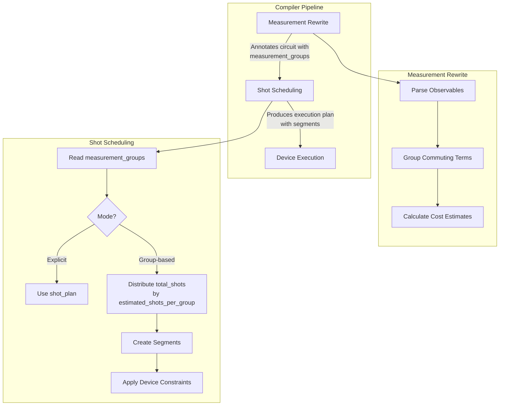
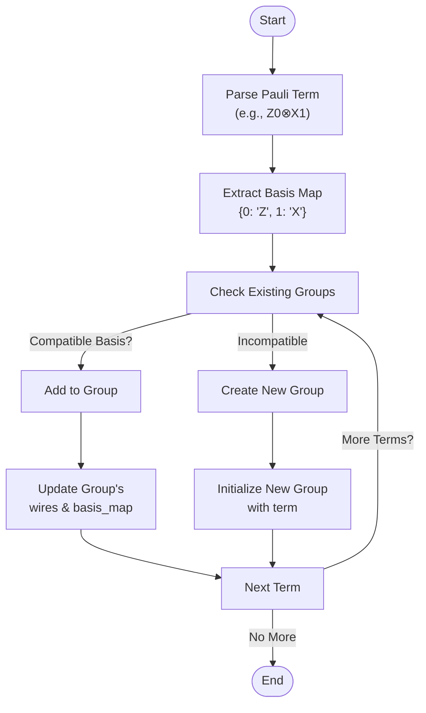

# Shot Scheduling

<cite>
**Referenced Files in This Document**   
- [shot_scheduler.py](file://src/tyxonq/compiler/stages/scheduling/shot_scheduler.py)
- [measurement.py](file://src/tyxonq/compiler/stages/rewrite/measurement.py)
- [hamiltonian_grouping.py](file://src/tyxonq/libs/hamiltonian_encoding/hamiltonian_grouping.py)
- [counts_expval.py](file://src/tyxonq/postprocessing/counts_expval.py)
</cite>

## Table of Contents
1. [Introduction](#introduction)
2. [Core Components](#core-components)
3. [Architecture Overview](#architecture-overview)
4. [Detailed Component Analysis](#detailed-component-analysis)
5. [Integration with Postprocessing](#integration-with-postprocessing)
6. [Configuration and Device Constraints](#configuration-and-device-constraints)
7. [Performance Benefits and Optimization](#performance-benefits-and-optimization)
8. [Common Issues and Troubleshooting](#common-issues-and-troubleshooting)
9. [Conclusion](#conclusion)

## Introduction

The shot scheduling stage in TyxonQ's compiler is a critical component responsible for optimizing the execution of quantum circuits, particularly for tasks involving the estimation of Hamiltonian expectation values. This stage bridges the gap between high-level measurement groupings and the concrete execution plan required by quantum devices. Its primary objective is to minimize total execution time by intelligently allocating a finite budget of measurement shots across multiple observables. This is achieved through a two-phase process: first, commuting Pauli terms are grouped into measurement-compatible sets; second, shots are dynamically distributed among these groups based on a cost model that estimates their resource requirements. The design is decoupled and extensible, ensuring that scheduling policies can evolve independently of device executors, making it a robust and testable part of the compilation pipeline.

## Core Components

The shot scheduling functionality is centered around the `schedule` function in `shot_scheduler.py`. This function consumes a quantum circuit annotated with measurement grouping metadata and produces an execution plan, or "segments," which dictate how the circuit should be run on a quantum device. The core logic involves two distinct modes of operation: an explicit mode where the user provides a predefined `shot_plan`, and a group-based mode where the scheduler automatically distributes a `total_shots` budget. In the group-based mode, the distribution is weighted by the `estimated_shots_per_group` value for each measurement group, which is calculated during the preceding measurement rewrite stage. The algorithm ensures the sum of allocated shots equals the total by using deterministic rounding, assigning any remainder to the final segment. This component is designed to be policy-agnostic, allowing for future enhancements like variance-aware cost models without requiring changes to the core scheduling logic.

**Section sources**
- [shot_scheduler.py](file://src/tyxonq/compiler/stages/scheduling/shot_scheduler.py#L43-L118)

## Architecture Overview

The shot scheduling process is a key stage within TyxonQ's compiler pipeline, situated between the measurement rewrite and the device execution phases. The architecture is designed for modularity and separation of concerns. The `MeasurementRewritePass` first analyzes the circuit's observables, grouping commuting Pauli terms into measurement-compatible sets and calculating an initial cost estimate for each group. This metadata is stored in the circuit's `measurement_groups` field. The `ShotScheduler` then takes this annotated circuit as input. It uses the `schedule` function to transform the high-level grouping information into a low-level execution plan. This plan is a list of segments, each specifying the number of shots (`shots`), the measurement basis (`basis`), the qubits involved (`wires`), and a map of qubit-to-basis assignments (`basis_map`). This decoupling allows the scheduling logic to be developed and tested independently of the specific hardware constraints, which are applied as a final step.



**Diagram sources**
- [shot_scheduler.py](file://src/tyxonq/compiler/stages/scheduling/shot_scheduler.py#L43-L118)
- [measurement.py](file://src/tyxonq/compiler/stages/rewrite/measurement.py#L30-L164)

## Detailed Component Analysis

### Measurement Grouping Strategy

The foundation of efficient shot scheduling lies in the measurement grouping strategy, implemented in the `MeasurementRewritePass`. This pass groups individual measurement terms based on their compatibility. Two terms can be measured simultaneously if they share a common eigenbasis, which for Pauli operators means they commute. The current implementation uses a greedy, product-basis-safe algorithm. It iterates through each measurement term and attempts to add it to an existing group. A term can be added if its measurement basis (e.g., X, Y, Z) for each qubit does not conflict with the basis already assigned to that qubit in the group. For example, a term requiring qubit 0 to be measured in the X basis can be grouped with another term that also measures qubit 0 in the X basis, but not with one that requires the Z basis. This grouping minimizes the number of distinct measurement settings, which is a primary driver of execution time.

The cost model for each group is a heuristic based on the number of items in the group and the number of qubits involved (`num_items * num_wires`). This reflects the intuition that larger groups with more qubits require more resources. For Hamiltonian terms, the `group_hamiltonian_pauli_terms` function in `hamiltonian_grouping.py` performs a more sophisticated grouping by directly analyzing the Pauli string of each term to determine its measurement basis, ensuring all terms in a group can be measured in a single setting.



**Diagram sources**
- [measurement.py](file://src/tyxonq/compiler/stages/rewrite/measurement.py#L120-L164)
- [hamiltonian_grouping.py](file://src/tyxonq/libs/hamiltonian_encoding/hamiltonian_grouping.py#L45-L66)

**Section sources**
- [measurement.py](file://src/tyxonq/compiler/stages/rewrite/measurement.py#L30-L164)
- [hamiltonian_grouping.py](file://src/tyxonq/libs/hamiltonian_encoding/hamiltonian_grouping.py#L1-L66)

### Dynamic Shot Allocation Algorithm

The dynamic shot allocation algorithm, implemented in the `schedule` function, is responsible for distributing the total shot budget across the pre-computed measurement groups. The algorithm operates in the group-based mode when a `total_shots` value is provided but no explicit `shot_plan` is given. It begins by extracting the `estimated_shots_per_group` from each group's metadata, ensuring a minimum weight of 1 to prevent division by zero. The total weight is calculated, and the shot allocation for each group is determined by the formula `shots_i = total_shots * (weight_i / total_weight)`, with rounding applied.

A critical feature of the algorithm is its deterministic handling of the rounding remainder. To guarantee that the sum of all allocated shots exactly equals `total_shots`, the remainder from the rounding operations is assigned to the last segment. This prevents any loss or over-allocation of shots, which is essential for accurate expectation value estimation. The algorithm is designed to be simple and predictable, making it easy to reason about and test. The output is a list of segments, each containing the allocated `shots` and the measurement context (`basis`, `wires`, `basis_map`) necessary for the executor to run the circuit.

```mermaid
flowchart TD
A[Start] --> B[Input: total_shots, groups]
B --> C[Get weights: estimated_shots_per_group]
C --> D[Calculate total_weight]
D --> E[Initialize rem = total_shots]
E --> F{For each group i}
F --> G[Calculate shots_i = round(total_shots * weight_i / total_weight)]
G --> H[If not last group: rem = rem - shots_i]
H --> I[If last group: shots_i = rem]
I --> J[Create segment with shots_i and context]
J --> K{More groups?}
K --> |Yes| F
K --> |No| L[Return segments]
```

**Diagram sources**
- [shot_scheduler.py](file://src/tyxonq/compiler/stages/scheduling/shot_scheduler.py#L60-L85)

**Section sources**
- [shot_scheduler.py](file://src/tyxonq/compiler/stages/scheduling/shot_scheduler.py#L43-L118)

## Integration with Postprocessing

The shot scheduling stage is tightly integrated with the postprocessing layer, specifically the `expval_pauli_sum` function in `counts_expval.py`. The execution plan generated by the scheduler dictates how the quantum device runs the circuit, producing a series of bitstring count results, one for each segment. The postprocessing layer then consumes these results. For each segment, the `expval_pauli_terms` function calculates the expectation values of all Pauli terms that can be measured in that segment's basis. The `expval_pauli_sum` function aggregates these individual expectation values, multiplying them by their respective coefficients from the Hamiltonian and summing them, along with the `identity_const`, to compute the final energy estimate. This seamless handoff from scheduling to postprocessing ensures that the measurement results are correctly interpreted and combined to achieve the desired physical observable.

**Section sources**
- [counts_expval.py](file://src/tyxonq/postprocessing/counts_expval.py#L86-L111)

## Configuration and Device Constraints

The `schedule` function accepts several configuration parameters to control its behavior. The primary parameters are `shot_plan` and `total_shots`, which define the two operational modes. Additionally, the function takes a `device_rule` object that allows the scheduler to respect hardware-specific constraints. The most critical constraint is `max_shots_per_job`, which limits the number of shots that can be submitted in a single job to the quantum device. The scheduler automatically splits any segment that exceeds this limit into multiple smaller segments. Furthermore, if the device supports batching (`supports_batch`), the scheduler can assign `batch_id` tags to segments, enabling the executor to submit multiple segments as a single batch job, which can significantly reduce communication overhead and queue times.

**Section sources**
- [shot_scheduler.py](file://src/tyxonq/compiler/stages/scheduling/shot_scheduler.py#L90-L118)

## Performance Benefits and Optimization

The primary performance benefit of the shot scheduling stage is the significant reduction in total execution time. By grouping commuting observables, the number of distinct circuit executions (each requiring separate compilation, queuing, and measurement) is minimized. This is far more efficient than measuring each observable individually. The dynamic shot allocation further optimizes resource usage by ensuring that groups with higher estimated costs (e.g., those with more terms or qubits) receive a proportionally larger share of the shot budget, leading to more accurate overall energy estimates. The decoupled design allows for future optimizations, such as replacing the current heuristic cost model with a variance-aware model that allocates more shots to terms with higher statistical variance, thereby minimizing the total error for a fixed shot budget.

## Common Issues and Troubleshooting

Two common issues can arise with the shot scheduling process. The first is suboptimal grouping, which can occur if the greedy grouping algorithm fails to find the most efficient partitioning of terms. This might happen with complex Hamiltonians where a non-greedy approach could yield fewer groups. The second issue is shot starvation for high-variance terms. The current cost model is based on group size and does not account for the statistical variance of individual terms. A term with high variance might be in a small group and thus receive very few shots, leading to a large error in its contribution to the final energy. To troubleshoot, users should first verify the `measurement_groups` metadata to ensure terms are being grouped correctly. If shot starvation is suspected, they may need to manually provide a `shot_plan` to override the automatic allocation and ensure critical terms receive sufficient shots.

## Conclusion

The shot scheduling stage in TyxonQ is a sophisticated yet well-structured component that plays a vital role in the efficient execution of variational quantum algorithms. By combining intelligent measurement grouping with dynamic shot allocation, it optimizes the use of expensive quantum resources. Its modular design, separating the concerns of grouping, scheduling, and execution, makes it a robust and maintainable part of the compiler. Future work will focus on enhancing the cost model to be variance-aware, which will further improve the accuracy of expectation value estimation for a given computational budget.