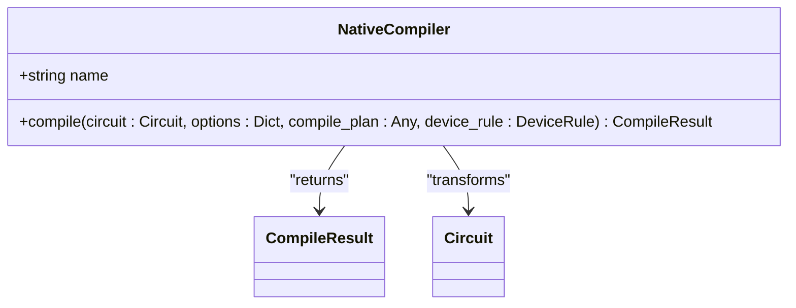
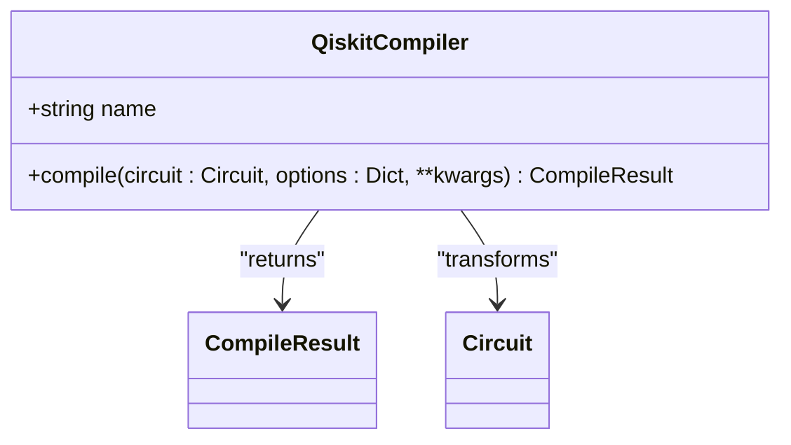
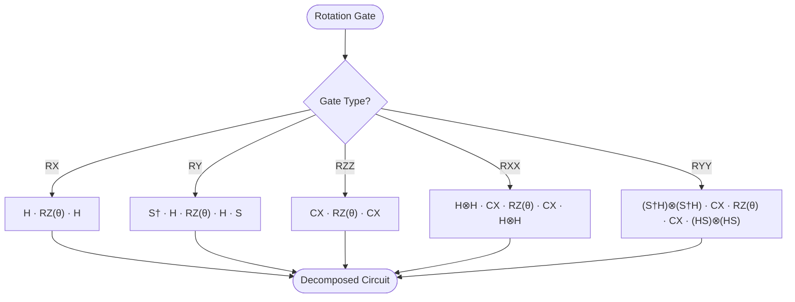

# Compiler API

<cite>
**Referenced Files in This Document**   
- [api.py](file://src/tyxonq/compiler/api.py)
- [native_compiler.py](file://src/tyxonq/compiler/compile_engine/native/native_compiler.py)
- [qiskit_compiler.py](file://src/tyxonq/compiler/compile_engine/qiskit/qiskit_compiler.py)
- [rotations.py](file://src/tyxonq/compiler/stages/decompose/rotations.py)
- [parameter_shift_pass.py](file://src/tyxonq/compiler/stages/gradients/parameter_shift_pass.py)
- [qng.py](file://src/tyxonq/compiler/stages/gradients/qng.py)
- [auto_measure.py](file://src/tyxonq/compiler/stages/rewrite/auto_measure.py)
- [gates_transform.py](file://src/tyxonq/compiler/stages/rewrite/gates_transform.py)
- [measurement.py](file://src/tyxonq/compiler/stages/rewrite/measurement.py)
- [merge_prune.py](file://src/tyxonq/compiler/stages/rewrite/merge_prune.py)
- [shot_scheduler.py](file://src/tyxonq/compiler/stages/scheduling/shot_scheduler.py)
- [lightcone.py](file://src/tyxonq/compiler/stages/simplify/lightcone.py)
- [circuit.py](file://src/tyxonq/core/ir/circuit.py)
</cite>

## Table of Contents
1. [Introduction](#introduction)
2. [Core Compilation Artifacts](#core-compilation-artifacts)
3. [Pluggable Compiler Architecture](#pluggable-compiler-architecture)
4. [Compilation Pipeline Stages](#compilation-pipeline-stages)
5. [Optimization Passes](#optimization-passes)
6. [Compiler Usage Examples](#compiler-usage-examples)
7. [Custom Pass Development](#custom-pass-development)
8. [Conclusion](#conclusion)

## Introduction
The TyxonQ Compiler module provides a comprehensive framework for quantum circuit compilation and optimization. This API documentation details the core compilation artifacts, pluggable architecture, pipeline stages, optimization passes, and extension mechanisms. The compiler supports both native and Qiskit backend compilation, enabling flexible integration with various quantum computing platforms.

## Core Compilation Artifacts

The compiler module defines two primary artifacts that form the foundation of the compilation process: `CompileResult` and `Pass`. These artifacts enable structured compilation workflows and extensible optimization capabilities.

### CompileResult
The `CompileResult` class, defined in `api.py`, represents the output of the compilation process. It is a TypedDict that contains the compiled circuit and associated metadata. The result includes the transformed circuit in the target format and comprehensive metadata about the compilation process, including options used, optimization level, and execution plan.

**Section sources**
- [api.py](file://src/tyxonq/compiler/api.py#L10-L14)

### Pass
The `Pass` class, also defined in `api.py`, represents a compilation pass that transforms a circuit for a specific target. It is implemented as a Protocol that defines the `execute_plan` method, which takes a circuit and optional parameters and returns a transformed circuit. This interface enables the creation of modular, reusable optimization passes that can be chained together in the compilation pipeline.

**Section sources**
- [api.py](file://src/tyxonq/compiler/api.py#L17-L20)

## Pluggable Compiler Architecture

The TyxonQ compiler features a pluggable architecture that supports multiple compilation backends, with native and Qiskit being the primary implementations. This architecture enables seamless integration with different quantum computing frameworks while maintaining a consistent API.

### Native Compiler
The native compiler, implemented in `native_compiler.py`, provides TyxonQ's default compilation pipeline. It supports compilation to the native IR format as well as QASM2 output through integration with the Qiskit backend. The native compiler automatically applies essential normalization passes and supports customizable optimization levels.

**Diagram sources**
- [native_compiler.py](file://src/tyxonq/compiler/compile_engine/native/native_compiler.py#L12-L98)
- [api.py](file://src/tyxonq/compiler/api.py#L10-L14)

### Qiskit Compiler
The Qiskit compiler, implemented in `qiskit_compiler.py`, provides integration with the Qiskit framework. It supports compilation to Qiskit circuits, QASM2 format, and can leverage Qiskit's transpilation capabilities. The compiler includes adapters for converting between TyxonQ's IR and Qiskit's QuantumCircuit representation.

**Diagram sources**
- [qiskit_compiler.py](file://src/tyxonq/compiler/compile_engine/qiskit/qiskit_compiler.py#L19-L76)
- [api.py](file://src/tyxonq/compiler/api.py#L10-L14)

### Unified Compilation Interface
The `compile` function in `api.py` serves as the unified entry point for the compilation process. It delegates to the appropriate compiler backend based on the specified `compile_engine` parameter. The function supports multiple output formats including IR, QASM2, and Qiskit circuits, and accepts engine-specific options through the `options` parameter.

**Section sources**
- [api.py](file://src/tyxonq/compiler/api.py#L23-L62)

## Compilation Pipeline Stages

The TyxonQ compiler implements a multi-stage compilation pipeline that transforms quantum circuits through a series of optimization and transformation passes. Each stage addresses specific aspects of circuit optimization and preparation for execution on quantum hardware.

### Decomposition Stage
The decomposition stage, implemented in `rotations.py`, decomposes parametric rotations into fundamental gate sets. The `RotationsDecomposePass` class transforms various rotation gates (RX, RY, RZZ, RXX, RYY) into equivalent circuits using H, RZ, and CX gates, enabling compatibility with hardware that supports only these basic operations.

**Diagram sources**
- [rotations.py](file://src/tyxonq/compiler/stages/decompose/rotations.py#L10-L66)

### Gradient Computation Stage
The gradient computation stage provides tools for calculating quantum gradients, essential for variational quantum algorithms. It includes the `ParameterShiftPass` for parameter shift rule-based gradient computation and the `qng` module for quantum natural gradient calculations.

#### Parameter Shift Pass
The `ParameterShiftPass` populates parameter-shift metadata for a target operation, enabling gradient computation through the parameter shift rule. It generates plus and minus shifted circuits for the specified operation and stores them in the circuit metadata.

**Section sources**
- [parameter_shift_pass.py](file://src/tyxonq/compiler/stages/gradients/parameter_shift_pass.py#L11-L28)

#### Quantum Natural Gradient
The `qng` module provides a backend-agnostic implementation of the Fubini-Study metric (quantum Fisher information matrix) using numerical Jacobians. The `qng_metric` function computes the quantum natural gradient metric, while `dynamics_matrix` provides a convenience alias with a different kernel.

**Section sources**
- [qng.py](file://src/tyxonq/compiler/stages/gradients/qng.py#L72-L104)

### Layout Stage
The layout stage handles qubit mapping and physical layout considerations. Currently, this stage is represented by an empty `__init__.py` file, indicating that layout optimization is either handled by other stages or is not yet implemented in this version of the compiler.

### Rewriting Stage
The rewriting stage performs various circuit transformations to optimize and standardize quantum circuits. It includes several passes that address different aspects of circuit rewriting.

#### Auto Measure Pass
The `AutoMeasurePass` automatically inserts Z measurements on all qubits when no explicit measurements are present in the circuit. This ensures that circuits are properly measured before execution, emitting a warning to inform users of the automatic addition.

**Section sources**
- [auto_measure.py](file://src/tyxonq/compiler/stages/rewrite/auto_measure.py#L0-L37)

#### Gates Transform Pass
The `GatesTransformPass` rewrites gates according to a preferred basis gate set. It transforms X gates to RX(π) and Y gates to RY(π) when the corresponding rotation gates are allowed in the basis, while preserving other gates as specified.

**Section sources**
- [gates_transform.py](file://src/tyxonq/compiler/stages/rewrite/gates_transform.py#L0-L52)

#### Measurement Pass
The `MeasurementRewritePass` handles measurement-related constructs by grouping measurement items and storing explicit grouping metadata in the circuit metadata. This enables safe shot reuse and improves observability for downstream scheduling.

**Section sources**
- [measurement.py](file://src/tyxonq/compiler/stages/rewrite/measurement.py#L0-L164)

#### Merge Prune Pass
The `MergePrunePass` merges adjacent gates using simple identities and prunes identity operations. It implements rules for merging gates like S·S→Z, T·T→S, and X·X→I, reducing circuit depth and improving efficiency.

**Section sources**
- [merge_prune.py](file://src/tyxonq/compiler/stages/rewrite/merge_prune.py#L0-L85)

### Scheduling Stage
The scheduling stage prepares circuits for execution by managing shot allocation and measurement settings.

#### Shot Scheduler
The `schedule` function in `shot_scheduler.py` creates an execution plan (segments) for measurement execution. It supports two modes: explicit shot plans provided by users and group-based distribution that allocates shots according to measurement grouping weights.

**Section sources**
- [shot_scheduler.py](file://src/tyxonq/compiler/stages/scheduling/shot_scheduler.py#L0-L136)

### Simplification Stage
The simplification stage optimizes circuits by removing unnecessary operations and reducing circuit complexity.

#### Lightcone Pass
The `LightconeSimplifyPass` performs backward slicing to identify and preserve only the operations that affect measured qubits. This lightcone analysis removes operations that do not contribute to the final measurement results, significantly reducing circuit size in many cases.

**Section sources**
- [lightcone.py](file://src/tyxonq/compiler/stages/simplify/lightcone.py#L0-L98)

## Optimization Passes

The TyxonQ compiler includes several optimization passes that enhance circuit efficiency and prepare circuits for execution on quantum hardware.

### parameter_shift_pass
The `parameter_shift_pass` implements the parameter shift rule for gradient computation. It generates shifted circuits for each parameter and stores the metadata needed for gradient calculation, enabling efficient optimization of variational quantum algorithms.

### qng
The `qng` pass provides quantum natural gradient computation using numerical methods. It calculates the Fubini-Study metric (quantum Fisher information matrix) through finite differences, offering a backend-agnostic approach to natural gradient optimization.

### auto_measure
The `auto_measure` pass automatically adds Z measurements to all qubits when no explicit measurements are present. This ensures that circuits produce measurable outputs while maintaining the original circuit semantics.

### gates_transform
The `gates_transform` pass normalizes gates to a preferred basis set, improving compatibility with quantum hardware that supports only specific gate types. It transforms X and Y gates to their rotation equivalents when possible.

### measurement
The `measurement` pass groups measurement operations to enable shot reuse and optimize measurement efficiency. It analyzes measurement patterns and creates optimal groupings that minimize the number of distinct measurement settings.

### merge_prune
The `merge_prune` pass reduces circuit depth by merging adjacent gates and removing identity operations. It applies algebraic identities to combine gates and eliminate redundant operations, improving circuit efficiency.

### shot_scheduler
The `shot_scheduler` pass allocates shots across different measurement groups based on their estimated requirements. It creates an execution plan that optimizes shot distribution while respecting hardware constraints.

### lightcone
The `lightcone` pass performs dependency analysis to identify and remove operations that do not affect measurement outcomes. By tracing dependencies backward from measurement operations, it preserves only the essential circuit components.

## Compiler Usage Examples

The examples directory contains several demonstrations of compiler usage and configuration. These examples illustrate how to use the compiler API for various quantum computing tasks, including circuit compilation, gradient computation, and variational algorithms.

### Basic Compilation
The `circuit_compiler.py` example demonstrates basic compilation of quantum circuits using the TyxonQ compiler. It shows how to compile circuits to different output formats and access compilation metadata.

### Gradient Computation
The `parameter_shift.py` example illustrates the use of parameter shift rule for gradient computation in variational quantum algorithms. It demonstrates how to use the `parameter_shift_pass` to generate shifted circuits and compute gradients.

### Variational Algorithms
Several examples, including `vqe_extra.py` and `simple_qaoa.py`, demonstrate the use of the compiler in variational quantum algorithms. These examples show how compilation, gradient computation, and optimization are integrated in practical quantum applications.

**Section sources**
- [circuit.py](file://src/tyxonq/core/ir/circuit.py#L373-L402)

## Custom Pass Development

The TyxonQ compiler provides a framework for developing and integrating custom compilation passes. Developers can create new passes by implementing the `Pass` protocol and registering them with the compiler.

### Pass Interface
Custom passes must implement the `Pass` protocol, which requires the `execute_plan` method. This method takes a circuit and optional parameters and returns a transformed circuit. The pass can access and modify circuit operations, metadata, and other properties as needed.

### Integration
Custom passes can be integrated into the compilation pipeline by adding them to the compile plan. The native compiler automatically prepends essential normalization passes and executes the custom passes in the specified order.

### Best Practices
When developing custom passes, consider the following best practices:
- Ensure passes are idempotent when possible
- Preserve circuit semantics unless explicitly intended to modify them
- Use circuit metadata to store pass-specific information
- Handle edge cases and invalid inputs gracefully
- Provide clear documentation for pass parameters and behavior

**Section sources**
- [api.py](file://src/tyxonq/compiler/api.py#L17-L20)

## Conclusion
The TyxonQ Compiler module provides a comprehensive and extensible framework for quantum circuit compilation and optimization. Its pluggable architecture supports multiple backends, while its modular pipeline enables flexible optimization strategies. The compiler's rich set of optimization passes addresses key challenges in quantum computing, from circuit simplification to gradient computation. By providing a clear API for custom pass development, the compiler empowers researchers and developers to extend its capabilities for specialized applications.