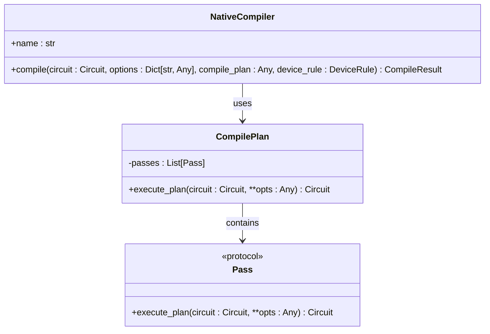
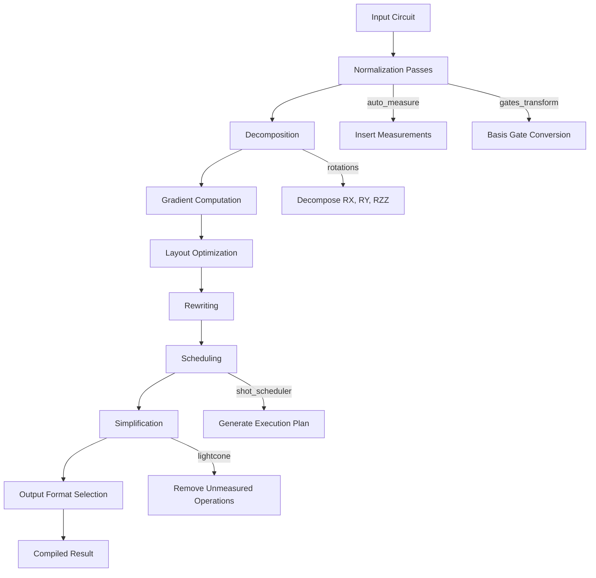
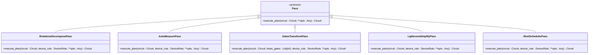
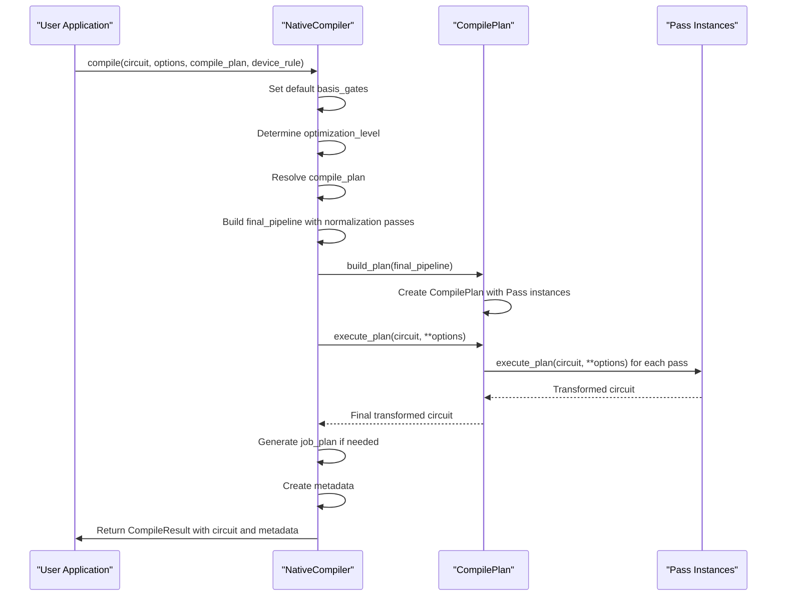

# Native Compiler

<cite>
**Referenced Files in This Document**  
- [native_compiler.py](file://src/tyxonq/compiler/compile_engine/native/native_compiler.py)
- [compile_plan.py](file://src/tyxonq/compiler/compile_engine/native/compile_plan.py)
- [rotations.py](file://src/tyxonq/compiler/stages/decompose/rotations.py)
- [auto_measure.py](file://src/tyxonq/compiler/stages/rewrite/auto_measure.py)
- [gates_transform.py](file://src/tyxonq/compiler/stages/rewrite/gates_transform.py)
- [lightcone.py](file://src/tyxonq/compiler/stages/simplify/lightcone.py)
- [shot_scheduler.py](file://src/tyxonq/compiler/stages/scheduling/shot_scheduler.py)
- [circuit.py](file://src/tyxonq/core/ir/circuit.py)
- [circuit_compiler.py](file://examples/circuit_compiler.py)
</cite>

## Table of Contents
1. [Introduction](#introduction)
2. [NativeCompiler Class Overview](#nativecompiler-class-overview)
3. [Compilation Parameters](#compilation-parameters)
4. [Native Compilation Pipeline](#native-compilation-pipeline)
5. [Pass Protocol and Stage Integration](#pass-protocol-and-stage-integration)
6. [Execution Flow Through Compilation Stages](#execution-flow-through-compilation-stages)
7. [Configuration Options](#configuration-options)
8. [Error Handling](#error-handling)
9. [Performance Considerations](#performance-considerations)
10. [Usage Examples](#usage-examples)
11. [Conclusion](#conclusion)

## Introduction

The NativeCompiler class in TyxonQ's compiler module provides a comprehensive framework for quantum circuit compilation. This documentation details the compile method's parameters, the native compilation pipeline, integration with Pass protocol implementations, and execution flow through various compilation stages. The compiler orchestrates a sequence of optimization passes including decomposition, gradient computation, layout, rewriting, scheduling, and simplification to transform quantum circuits into executable formats.

**Section sources**
- [native_compiler.py](file://src/tyxonq/compiler/compile_engine/native/native_compiler.py#L12-L98)

## NativeCompiler Class Overview

The NativeCompiler class serves as the primary interface for quantum circuit compilation in the TyxonQ framework. It implements a flexible compilation pipeline that can be customized through various parameters and optimization passes.

The compiler follows a modular design where different compilation stages are implemented as separate Pass classes that adhere to the Pass protocol. This design enables extensibility and allows users to customize the compilation process by selecting specific optimization passes.



**Diagram sources**
- [native_compiler.py](file://src/tyxonq/compiler/compile_engine/native/native_compiler.py#L12-L98)
- [compile_plan.py](file://src/tyxonq/compiler/compile_engine/native/compile_plan.py#L69-L88)
- [api.py](file://src/tyxonq/compiler/api.py#L17-L20)

**Section sources**
- [native_compiler.py](file://src/tyxonq/compiler/compile_engine/native/native_compiler.py#L12-L98)

## Compilation Parameters

The compile method of NativeCompiler accepts several parameters that control the compilation process:

- **circuit**: The input quantum circuit to be compiled, represented as a Circuit object
- **options**: A dictionary of compilation options including output format, optimization level, and basis gates
- **compile_plan**: Specifies the sequence of compilation passes to apply
- **device_rule**: Contains device-specific constraints and capabilities

The method signature is:
```python
def compile(self, circuit: "Circuit", options: Dict[str, Any] = {}, compile_plan=None, device_rule=None) -> "CompileResult"
```

The options dictionary supports several key parameters:
- `output`: Specifies the output format (ir, qasm, qasm2, qiskit)
- `optimization_level`: Integer from 0-3 controlling optimization intensity
- `basis_gates`: List of gates to use as the target basis set
- `shot_plan`: Specifies shot distribution for measurement execution
- `total_shots`: Total number of shots for the compiled circuit

**Section sources**
- [native_compiler.py](file://src/tyxonq/compiler/compile_engine/native/native_compiler.py#L15-L98)

## Native Compilation Pipeline

The native compilation pipeline orchestrates multiple stages to transform quantum circuits into optimized executable formats. The pipeline follows a structured sequence of operations that progressively refine the circuit representation.

The compilation process begins with normalization passes that ensure circuit consistency, followed by decomposition of complex gates into fundamental operations. Subsequent stages handle rewriting, layout optimization, scheduling, and final simplification.



**Diagram sources**
- [native_compiler.py](file://src/tyxonq/compiler/compile_engine/native/native_compiler.py#L15-L98)
- [compile_plan.py](file://src/tyxonq/compiler/compile_engine/native/compile_plan.py#L10-L66)

**Section sources**
- [native_compiler.py](file://src/tyxonq/compiler/compile_engine/native/native_compiler.py#L15-L98)
- [compile_plan.py](file://src/tyxonq/compiler/compile_engine/native/compile_plan.py#L10-L94)

## Pass Protocol and Stage Integration

The compilation pipeline is built on the Pass protocol, which defines a standard interface for compilation stages. Each pass implements the execute_plan method that transforms a circuit according to specific optimization rules.

The CompilePlan class manages a sequence of Pass instances, executing them in order to achieve the desired compilation outcome. This modular design allows for flexible pipeline configuration and easy extension with new optimization passes.



**Diagram sources**
- [api.py](file://src/tyxonq/compiler/api.py#L17-L20)
- [rotations.py](file://src/tyxonq/compiler/stages/decompose/rotations.py#L10-L66)
- [auto_measure.py](file://src/tyxonq/compiler/stages/rewrite/auto_measure.py#L10-L34)
- [gates_transform.py](file://src/tyxonq/compiler/stages/rewrite/gates_transform.py#L9-L49)
- [lightcone.py](file://src/tyxonq/compiler/stages/simplify/lightcone.py#L9-L95)
- [shot_scheduler.py](file://src/tyxonq/compiler/stages/scheduling/shot_scheduler.py#L121-L133)

**Section sources**
- [api.py](file://src/tyxonq/compiler/api.py#L17-L20)
- [rotations.py](file://src/tyxonq/compiler/stages/decompose/rotations.py#L10-L66)
- [auto_measure.py](file://src/tyxonq/compiler/stages/rewrite/auto_measure.py#L10-L34)
- [gates_transform.py](file://src/tyxonq/compiler/stages/rewrite/gates_transform.py#L9-L49)
- [lightcone.py](file://src/tyxonq/compiler/stages/simplify/lightcone.py#L9-L95)
- [shot_scheduler.py](file://src/tyxonq/compiler/stages/scheduling/shot_scheduler.py#L121-L133)

## Execution Flow Through Compilation Stages

The execution flow through the compilation stages follows a well-defined sequence that ensures proper circuit transformation. The process begins with the NativeCompiler's compile method, which constructs a CompilePlan from the specified compilation passes.

The pipeline execution follows these steps:
1. Resolve the compile_plan parameter to determine the sequence of passes
2. Prepend essential normalization passes (auto_measure, gates_transform)
3. Build the complete compilation plan using build_plan
4. Execute the plan on the input circuit
5. Apply scheduling if shot-related options are specified
6. Generate the final compilation result with metadata



**Diagram sources**
- [native_compiler.py](file://src/tyxonq/compiler/compile_engine/native/native_compiler.py#L15-L98)
- [compile_plan.py](file://src/tyxonq/compiler/compile_engine/native/compile_plan.py#L91-L94)

**Section sources**
- [native_compiler.py](file://src/tyxonq/compiler/compile_engine/native/native_compiler.py#L15-L98)
- [compile_plan.py](file://src/tyxonq/compiler/compile_engine/native/compile_plan.py#L91-L94)

## Configuration Options

The NativeCompiler supports various configuration options that control the compilation process:

### Output Format Options
- `ir` or `tyxonq`: Returns the circuit in internal representation format
- `qasm` or `qasm2`: Compiles to OpenQASM 2.0 format using Qiskit backend
- `qiskit`: Returns a Qiskit circuit object

### Optimization Options
- `optimization_level`: Controls the intensity of optimizations (0-3)
- `basis_gates`: Specifies the target gate set for compilation
- `compile_plan`: Custom sequence of compilation passes

### Scheduling Options
- `shot_plan`: Explicit shot distribution for measurement execution
- `total_shots`: Total number of shots for the circuit
- `device_rule`: Device-specific constraints affecting scheduling

The compiler automatically sets default basis gates to ["h", "rx", "rz", "cx", "cz"] if not specified in options. The optimization level is converted to an integer with a default value of 0.

**Section sources**
- [native_compiler.py](file://src/tyxonq/compiler/compile_engine/native/native_compiler.py#L15-L98)

## Error Handling

The NativeCompiler implements robust error handling to manage various failure scenarios during compilation:

- **Compilation failures**: When Qiskit compilation fails, the compiler falls back to returning the IR representation
- **Invalid shot plans**: The ShotSchedulerPass validates shot_plan options and raises ValueError for invalid inputs
- **Unknown compilation stages**: The _resolve_stage function raises ValueError for unrecognized stage names
- **Circuit validation**: The Circuit class performs structural validation during initialization

The compiler uses defensive programming practices, including type checking and range validation, to prevent runtime errors. When external dependencies like Qiskit are unavailable, the compiler provides graceful fallbacks rather than failing completely.

**Section sources**
- [native_compiler.py](file://src/tyxonq/compiler/compile_engine/native/native_compiler.py#L15-L98)
- [shot_scheduler.py](file://src/tyxonq/compiler/stages/scheduling/shot_scheduler.py#L128-L133)
- [compile_plan.py](file://src/tyxonq/compiler/compile_engine/native/compile_plan.py#L10-L66)
- [circuit.py](file://src/tyxonq/core/ir/circuit.py#L142-L169)

## Performance Considerations

The native compilation pipeline is designed with performance optimization in mind:

### Compilation Efficiency
- The pipeline uses a composable design with reusable Pass instances
- Circuit transformations are implemented as functional operations that avoid unnecessary data copying
- The lightcone simplification pass removes unmeasured operations to reduce circuit size

### Memory Management
- The compiler uses generators and iterators where possible to minimize memory usage
- Circuit operations are processed sequentially rather than loading entire circuits into memory
- Metadata is stored efficiently using dictionaries with string keys

### Execution Optimization
- The shot scheduler optimizes measurement execution by grouping compatible measurements
- Basis gate transformations reduce the number of physical gates required
- The decomposition pass converts complex gates into efficient sequences of fundamental operations

For optimal performance, users should:
- Specify appropriate optimization levels based on circuit complexity
- Use device-specific basis gates when targeting particular hardware
- Leverage the lightcone simplification pass for circuits with partial measurements

**Section sources**
- [native_compiler.py](file://src/tyxonq/compiler/compile_engine/native/native_compiler.py#L15-L98)
- [lightcone.py](file://src/tyxonq/compiler/stages/simplify/lightcone.py#L12-L95)
- [gates_transform.py](file://src/tyxonq/compiler/stages/rewrite/gates_transform.py#L23-L49)
- [rotations.py](file://src/tyxonq/compiler/stages/decompose/rotations.py#L21-L66)

## Usage Examples

The following examples demonstrate the use of the NativeCompiler with different optimization passes:

### Basic Compilation
```python
circuit = build_demo_circuit()
result = circuit.compile(
    compile_engine="default",
    output="ir",
    options={"optimization_level": 2}
)
```

### Custom Compilation Plan
```python
result = circuit.compile(
    compile_engine="default",
    output="qasm2",
    options={"basis_gates": ["cx", "h", "rz"]},
    compile_plan=["decompose/rotations", "simplify/lightcone"]
)
```

### Device-Specific Compilation
```python
device_rule = {"max_shots_per_job": 8192, "supports_batch": True}
result = circuit.compile(
    compile_engine="default",
    output="qiskit",
    options={"total_shots": 16384},
    device_rule=device_rule
)
```

### Advanced Scheduling
```python
result = circuit.compile(
    compile_engine="default",
    output="ir",
    options={
        "shot_plan": [1000, 2000, 1000],
        "optimization_level": 3
    }
)
```

**Section sources**
- [circuit_compiler.py](file://examples/circuit_compiler.py#L30-L52)

## Conclusion

The NativeCompiler class provides a powerful and flexible framework for quantum circuit compilation in the TyxonQ ecosystem. Its modular design based on the Pass protocol enables extensibility and customization of the compilation pipeline. The compiler orchestrates a comprehensive sequence of optimization stages including decomposition, rewriting, scheduling, and simplification to transform quantum circuits into efficiently executable formats.

Key features include support for multiple output formats, customizable optimization levels, device-specific compilation rules, and robust error handling. The integration with various Pass implementations allows users to tailor the compilation process to their specific needs, whether targeting simulation or real quantum hardware.

The examples provided demonstrate practical usage patterns for different compilation scenarios, highlighting the flexibility and power of the NativeCompiler interface. By understanding the compilation parameters, pipeline stages, and configuration options, users can effectively leverage the NativeCompiler to optimize their quantum circuits for various execution environments.