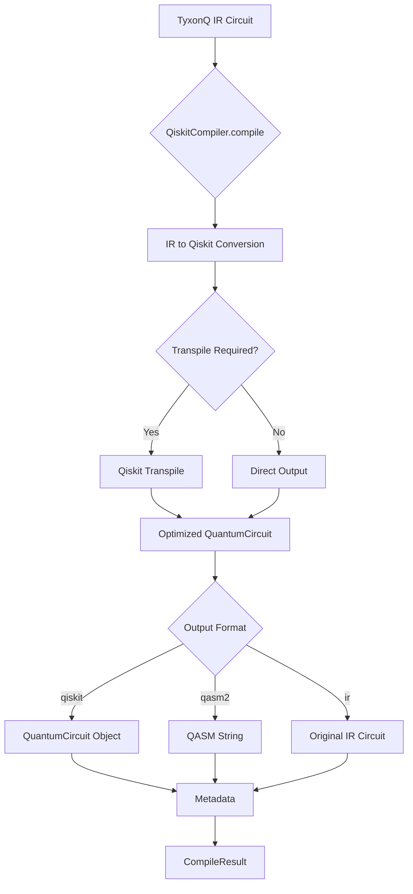
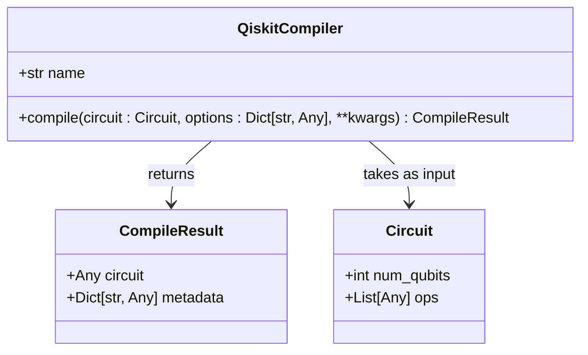
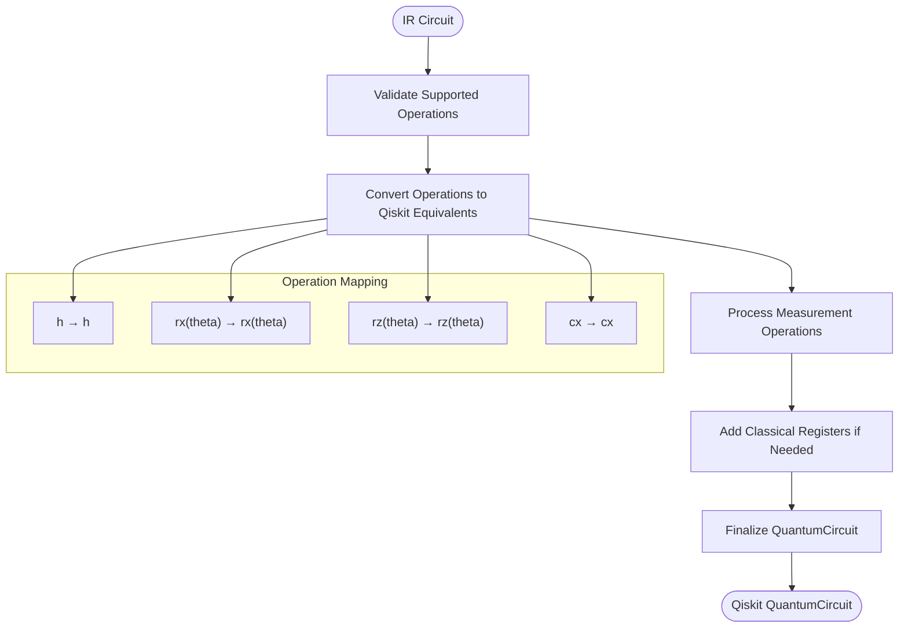
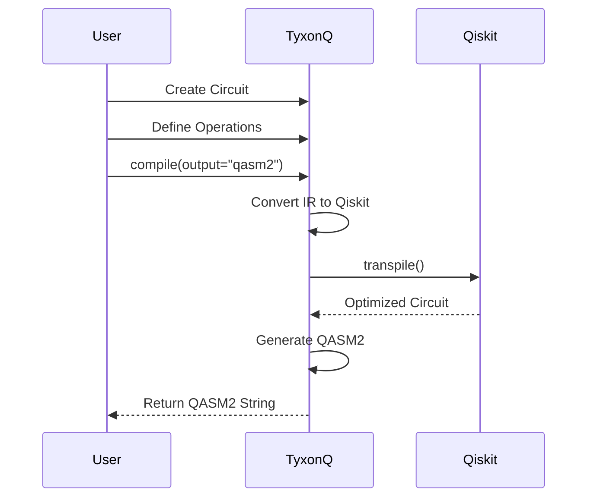

# Qiskit Compiler

<cite>
**Referenced Files in This Document**   
- [qiskit_compiler.py](file://src/tyxonq/compiler/compile_engine/qiskit/qiskit_compiler.py)
- [dialect.py](file://src/tyxonq/compiler/compile_engine/qiskit/dialect.py)
- [circuit_compiler.py](file://examples/circuit_compiler.py)
- [hamiltonian_building.py](file://examples/hamiltonian_building.py)
- [simple_qaoa.py](file://examples/simple_qaoa.py)
- [vqe_extra.py](file://examples/vqe_extra.py)
</cite>

## Table of Contents
1. [Introduction](#introduction)
2. [Core Components](#core-components)
3. [Architecture Overview](#architecture-overview)
4. [Detailed Component Analysis](#detailed-component-analysis)
5. [Usage Examples](#usage-examples)
6. [Configuration Options and Best Practices](#configuration-options-and-best-practices)
7. [Limitations and Integration Notes](#limitations-and-integration-notes)
8. [Conclusion](#conclusion)

## Introduction
The QiskitCompiler class in TyxonQ's compiler module provides a bridge between TyxonQ's Intermediate Representation (IR) circuits and the Qiskit quantum computing ecosystem. This documentation details the compile method's functionality, including dialect conversion, output format support, and integration with Qiskit's tools. The compiler enables users to transform native TyxonQ circuits into Qiskit-compatible representations for execution, visualization, and further processing within Qiskit's extensive framework.

## Core Components

The QiskitCompiler class serves as the primary interface for converting TyxonQ IR circuits into Qiskit-compatible formats. It supports multiple output types including native Qiskit QuantumCircuit objects and OpenQASM 2.0 strings. The compilation process involves dialect conversion from TyxonQ's internal representation to Qiskit's circuit model, with options for transpilation and measurement handling. The compiler integrates with Qiskit's transpile function when available, allowing for circuit optimization according to specified basis gates and optimization levels.

**Section sources**
- [qiskit_compiler.py](file://src/tyxonq/compiler/compile_engine/qiskit/qiskit_compiler.py#L19-L76)

## Architecture Overview

**Diagram sources**
- [qiskit_compiler.py](file://src/tyxonq/compiler/compile_engine/qiskit/qiskit_compiler.py#L19-L76)
- [dialect.py](file://src/tyxonq/compiler/compile_engine/qiskit/dialect.py#L1-L247)

## Detailed Component Analysis

### QiskitCompiler Class Analysis

The QiskitCompiler class implements the compile method that transforms TyxonQ IR circuits into various Qiskit-compatible outputs. The method accepts a Circuit object and a dictionary of options that control the compilation process. Key parameters include output format specification, measurement handling, and transpilation directives. The compiler first converts the IR circuit to a Qiskit QuantumCircuit using the ir_to_qiskit adapter function, then optionally applies Qiskit's transpile function based on the provided options.

The compilation process preserves circuit semantics while adapting to Qiskit's representation. Metadata is generated during compilation, including logical-to-physical qubit mappings and positional information that can be used for result interpretation. The compiler handles both explicit measurements in the IR and automatically adds measurements when required by the output format.

**Diagram sources**
- [qiskit_compiler.py](file://src/tyxonq/compiler/compile_engine/qiskit/qiskit_compiler.py#L19-L76)

### Dialect Conversion Process

The dialect conversion process is handled by the functions in dialect.py, which provide bidirectional translation between TyxonQ IR and Qiskit representations. The to_qiskit function converts IR operations to their Qiskit equivalents, supporting gates such as h, rx, rz, and cx. Measurement operations are handled specially, with options to add explicit measure_z operations or apply measure_all when no measurements are specified in the IR.

The conversion maintains qubit indexing and operation ordering, ensuring semantic equivalence between the original and converted circuits. For parameterized gates, the conversion preserves parameter values, including symbolic expressions which are processed by the free_pi function to replace symbolic π with numerical values.

**Diagram sources**
- [dialect.py](file://src/tyxonq/compiler/compile_engine/qiskit/dialect.py#L1-L247)

## Usage Examples

### Basic Compilation Workflow

The circuit_compiler.py example demonstrates the basic workflow for using the Qiskit compiler. Users create a TyxonQ circuit using the standard API, then invoke the compile method with appropriate options. The example shows compiling circuits at different optimization levels and generating QASM2 output for external use.

**Diagram sources**
- [circuit_compiler.py](file://examples/circuit_compiler.py#L0-L51)
- [qiskit_compiler.py](file://src/tyxonq/compiler/compile_engine/qiskit/qiskit_compiler.py#L19-L76)

### Circuit Roundtripping

The test_qiskit_provider_qasm.py and test_qiskit_provider_roundtrip.py test files demonstrate circuit roundtripping capabilities. This involves converting a TyxonQ IR circuit to QASM2 format, then parsing it back to IR to verify semantic preservation. The process validates that essential operations are maintained through the conversion cycle, ensuring compatibility with external tools that consume QASM.

**Section sources**
- [test_qiskit_provider_qasm.py](file://tests_core_module/test_qiskit_provider_qasm.py#L0-L17)
- [test_qiskit_provider_roundtrip.py](file://tests_core_module/test_qiskit_provider_roundtrip.py#L0-L19)

### Interoperability Scenarios

Examples such as hamiltonian_building.py, simple_qaoa.py, and vqe_extra.py illustrate interoperability scenarios where the Qiskit compiler enables integration with various quantum algorithms. These examples show how compiled circuits can be used in variational algorithms, quantum approximate optimization, and Hamiltonian simulation workflows. The compiler facilitates the use of Qiskit's ecosystem tools for circuit analysis, optimization, and execution.

**Section sources**
- [hamiltonian_building.py](file://examples/hamiltonian_building.py#L0-L93)
- [simple_qaoa.py](file://examples/simple_qaoa.py#L0-L192)
- [vqe_extra.py](file://examples/vqe_extra.py#L0-L195)

## Configuration Options and Best Practices

### Output Format Configuration

The Qiskit compiler supports multiple output formats controlled by the output parameter:
- **qiskit**: Returns a native Qiskit QuantumCircuit object
- **qasm2**: Returns an OpenQASM 2.0 string representation
- **ir**: Returns the original TyxonQ IR circuit (useful for debugging)

Best practices suggest using the qiskit format when further processing within Qiskit is required, and qasm2 when interfacing with external tools or for persistent storage.

### Transpilation Options

The compiler accepts standard Qiskit transpile options through the options dictionary:
- **optimization_level**: Controls the aggressiveness of circuit optimization (0-3)
- **basis_gates**: Specifies the target gate set for transpilation
- **add_measures**: Determines whether measurements are automatically added

When configuring transpilation, it's recommended to explicitly specify basis_gates to ensure compatibility with target hardware or simulation backends.

### Error Handling and Dependencies

The compiler includes robust error handling for missing Qiskit dependencies. When Qiskit is not available, the compiler raises a RuntimeError with descriptive messaging. Users should ensure Qiskit is properly installed in their environment before attempting to use the Qiskit compiler features.

**Section sources**
- [qiskit_compiler.py](file://src/tyxonq/compiler/compile_engine/qiskit/qiskit_compiler.py#L19-L76)
- [dialect.py](file://src/tyxonq/compiler/compile_engine/qiskit/dialect.py#L1-L247)

## Limitations and Integration Notes

### Supported Operations

The current implementation supports a subset of quantum operations:
- Single-qubit gates: h, rx, rz
- Two-qubit gate: cx
- Measurement: measure_z

Unsupported operations will raise a NotImplementedError during conversion. Users should verify their circuits contain only supported operations before compilation.

### Metadata Limitations

While the compiler preserves essential mapping information in metadata, some Qiskit-specific attributes may not be fully preserved during roundtrip conversions. The logical_physical_mapping and positional_logical_mapping fields provide basic qubit mapping information, but complex layout constraints may require additional processing.

### Integration with Qiskit Ecosystem

The generated Qiskit objects can be seamlessly integrated with Qiskit's ecosystem, including:
- Aer simulators for circuit execution
- Ignis tools for error mitigation
- Visualization functions for circuit diagrams
- Transpiler for further optimization

However, users should be aware that certain Qiskit features may not be fully compatible with circuits originating from TyxonQ IR, particularly those involving advanced pulse-level control or custom gate definitions.

**Section sources**
- [qiskit_compiler.py](file://src/tyxonq/compiler/compile_engine/qiskit/qiskit_compiler.py#L19-L76)
- [dialect.py](file://src/tyxonq/compiler/compile_engine/qiskit/dialect.py#L1-L247)

## Conclusion

The QiskitCompiler class provides essential interoperability between TyxonQ and the Qiskit quantum computing framework. By enabling conversion of TyxonQ IR circuits to Qiskit-compatible formats, it facilitates integration with Qiskit's extensive ecosystem of tools and backends. The compiler supports multiple output formats, configurable transpilation, and preserves essential circuit metadata, making it a valuable tool for users working across both frameworks. With proper configuration and awareness of its limitations, the Qiskit compiler enables seamless workflow integration and enhances the capabilities of quantum algorithm development in the TyxonQ environment.