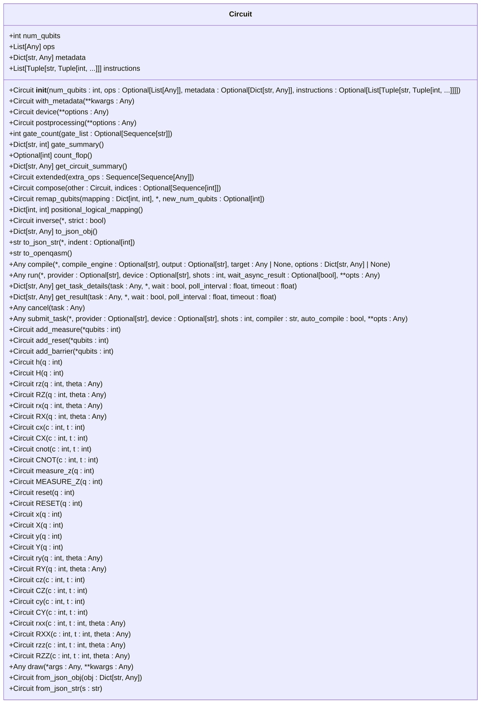
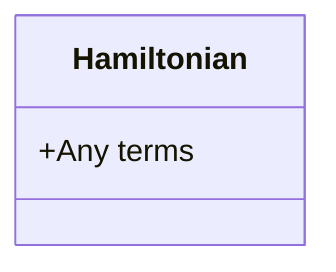
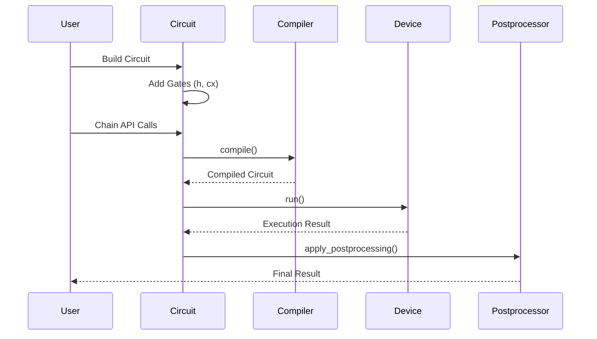
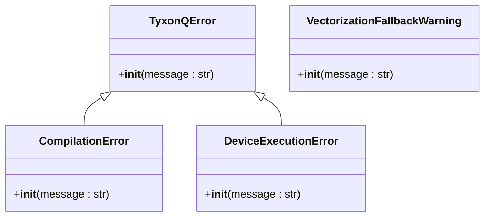
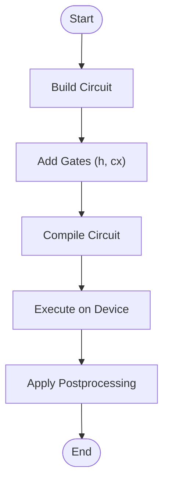

# Core API

<cite>
**Referenced Files in This Document**   
- [circuit.py](file://src/tyxonq/core/ir/circuit.py)
- [pulse.py](file://src/tyxonq/core/ir/pulse.py)
- [types.py](file://src/tyxonq/core/types.py)
- [errors.py](file://src/tyxonq/core/errors.py)
- [hamiltonian_building.py](file://examples/hamiltonian_building.py)
- [circuit_chain_demo.py](file://examples/circuit_chain_demo.py)
- [vqe.py](file://src/tyxonq/libs/circuits_library/vqe.py)
- [hea.py](file://src/tyxonq/applications/chem/algorithms/hea.py)
</cite>

## Table of Contents
1. [Introduction](#introduction)
2. [Circuit Class](#circuit-class)
3. [Hamiltonian Class](#hamiltonian-class)
4. [Dataclass-Based IR Design](#dataclass-based-ir-design)
5. [Chain API Pattern](#chain-api-pattern)
6. [Error Types and Type Definitions](#error-types-and-type-definitions)
7. [Usage Examples](#usage-examples)
8. [Integration with Compiler, Device, and Postprocessing Layers](#integration-with-compiler-device-and-postprocessing-layers)
9. [Conclusion](#conclusion)

## Introduction
The Core module of TyxonQ provides the foundational intermediate representation (IR) constructs for quantum computing workflows. This document details the primary IR components—Circuit and Hamiltonian classes—and their roles in circuit construction, operation management, and pulse-level control. The dataclass-based design ensures a consistent system-wide contract across the framework. The Chain API pattern enables streamlined workflows through build → compile → execute sequences. This API documentation also covers error types, type definitions, usage examples, and integration points with compiler, device, and postprocessing layers.

**Section sources**
- [circuit.py](file://src/tyxonq/core/ir/circuit.py#L48-L727)
- [circuit.py](file://src/tyxonq/core/ir/circuit.py#L731-L739)

## Circuit Class
The `Circuit` class serves as the minimal intermediate representation (IR) for quantum circuits. It encapsulates essential attributes such as the number of qubits (`num_qubits`) and a sequence of operation descriptors (`ops`). Operations are represented as tuples or lists, allowing flexibility for backends and compilers to interpret them appropriately.

Key methods include:
- **Gate Construction**: Methods like `h(q)`, `cx(c, t)`, and `rz(q, theta)` allow in-place addition of quantum gates.
- **Operation Management**: Functions such as `gate_count()` and `gate_summary()` provide lightweight analysis of circuit composition.
- **Pulse-Level Control**: The class supports direct execution via pre-compiled sources, enabling integration with hardware-specific pulse schedules.

The `Circuit` class also includes context manager support (`__enter__`, `__exit__`) for builder-style usage and structural validation through `__post_init__`.



**Diagram sources**
- [circuit.py](file://src/tyxonq/core/ir/circuit.py#L48-L727)

**Section sources**
- [circuit.py](file://src/tyxonq/core/ir/circuit.py#L48-L727)

## Hamiltonian Class
The `Hamiltonian` class represents the IR for a Hamiltonian, with its `terms` field accommodating backend-specific structures such as Pauli-sums, sparse representations, or dense matrices. This design allows flexibility while maintaining a consistent interface across different stages of compilation and device execution.

The class is designed to be extended by compiler stages or devices, which can specialize the `terms` field based on specific requirements. For example, in variational quantum algorithms like VQE, the Hamiltonian is often expressed as a list of tuples containing coefficients and Pauli operators.



**Diagram sources**
- [circuit.py](file://src/tyxonq/core/ir/circuit.py#L731-L739)

**Section sources**
- [circuit.py](file://src/tyxonq/core/ir/circuit.py#L731-L739)

## Dataclass-Based IR Design
The IR system in TyxonQ leverages Python's dataclass decorator to define structured data representations for quantum circuits and Hamiltonians. This approach ensures immutability and clarity in the data model, serving as a system-wide contract that all components adhere to.

Key benefits include:
- **Immutability**: Dataclasses provide a clear contract for data integrity.
- **Extensibility**: Fields can be easily extended without breaking existing code.
- **Serialization**: Built-in support for JSON serialization via `to_json_obj` and `to_json_str` methods.

This design facilitates seamless integration across various layers of the framework, from circuit construction to execution and postprocessing.

**Section sources**
- [circuit.py](file://src/tyxonq/core/ir/circuit.py#L48-L727)
- [circuit.py](file://src/tyxonq/core/ir/circuit.py#L731-L739)

## Chain API Pattern
The Chain API pattern in TyxonQ enables a fluent interface for constructing and executing quantum workflows. This pattern follows a build → compile → execute sequence, allowing users to chain configuration stages such as `device`, `postprocessing`, and `compile`.

Example workflow:
```python
result = (
    Circuit(2).h(0).cx(0, 1)
    .compile(compile_engine="qiskit")
    .device(provider="simulator", device="statevector", shots=1024)
    .postprocessing(method="none")
    .run()
)
```

Each method in the chain returns the `Circuit` object, enabling method chaining. This pattern simplifies complex workflows and enhances code readability.



**Diagram sources**
- [circuit.py](file://src/tyxonq/core/ir/circuit.py#L373-L402)
- [circuit.py](file://src/tyxonq/core/ir/circuit.py#L404-L515)

**Section sources**
- [circuit.py](file://src/tyxonq/core/ir/circuit.py#L178-L181)
- [circuit.py](file://src/tyxonq/core/ir/circuit.py#L183-L188)
- [circuit.py](file://src/tyxonq/core/ir/circuit.py#L373-L402)
- [circuit.py](file://src/tyxonq/core/ir/circuit.py#L404-L515)

## Error Types and Type Definitions
TyxonQ defines a hierarchy of error types to handle exceptions consistently across the framework. These include:
- `TyxonQError`: Base exception for all TyxonQ-related errors.
- `CompilationError`: Raised when compilation fails or produces invalid output.
- `DeviceExecutionError`: Raised when device execution encounters issues such as timeouts or connectivity problems.
- `VectorizationFallbackWarning`: Issued when vectorization is disabled or falls back to eager execution.

Type definitions are provided through dataclasses and protocols, ensuring type safety and clarity in function signatures.



**Diagram sources**
- [errors.py](file://src/tyxonq/core/errors.py#L1-L16)

**Section sources**
- [errors.py](file://src/tyxonq/core/errors.py#L1-L16)

## Usage Examples
Usage examples demonstrate circuit creation and manipulation using the Core module. For instance, constructing a Bell state circuit involves applying Hadamard and CNOT gates:

```python
circuit = Circuit(2).h(0).cx(0, 1)
```

Hamiltonian construction is illustrated in the `hamiltonian_building.py` example, where a transverse field Ising model (TFIM) Hamiltonian is built and evaluated using measurement counts.



**Diagram sources**
- [circuit_chain_demo.py](file://examples/circuit_chain_demo.py#L1-L304)
- [hamiltonian_building.py](file://examples/hamiltonian_building.py#L1-L93)

**Section sources**
- [circuit_chain_demo.py](file://examples/circuit_chain_demo.py#L1-L304)
- [hamiltonian_building.py](file://examples/hamiltonian_building.py#L1-L93)

## Integration with Compiler, Device, and Postprocessing Layers
The Core module integrates seamlessly with compiler, device, and postprocessing layers. The `compile` method delegates to the compiler API, while the `run` method submits circuits to devices using the device layer's `run` function. Postprocessing is applied through the `apply_postprocessing` function, which consumes the `_post_opts` dictionary.

This integration ensures a cohesive workflow from circuit definition to result retrieval, leveraging the Chain API pattern for streamlined execution.

**Section sources**
- [circuit.py](file://src/tyxonq/core/ir/circuit.py#L373-L402)
- [circuit.py](file://src/tyxonq/core/ir/circuit.py#L404-L515)
- [devices/base.py](file://src/tyxonq/devices/base.py#L0-L403)
- [postprocessing/io.py](file://src/tyxonq/postprocessing/io.py#L0-L221)

## Conclusion
The Core module of TyxonQ provides a robust foundation for quantum computing workflows through its Circuit and Hamiltonian classes. The dataclass-based IR design ensures consistency and extensibility, while the Chain API pattern simplifies complex workflows. Comprehensive error handling and type definitions enhance reliability, and integration with compiler, device, and postprocessing layers enables end-to-end quantum computation. Usage examples illustrate practical applications, making the Core module accessible and powerful for developers.