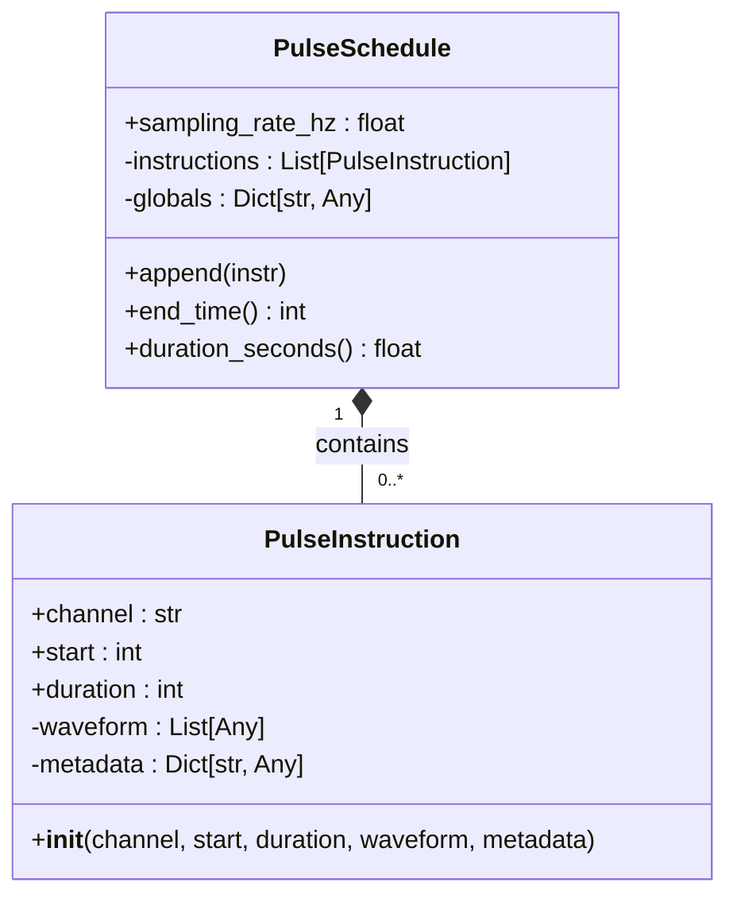
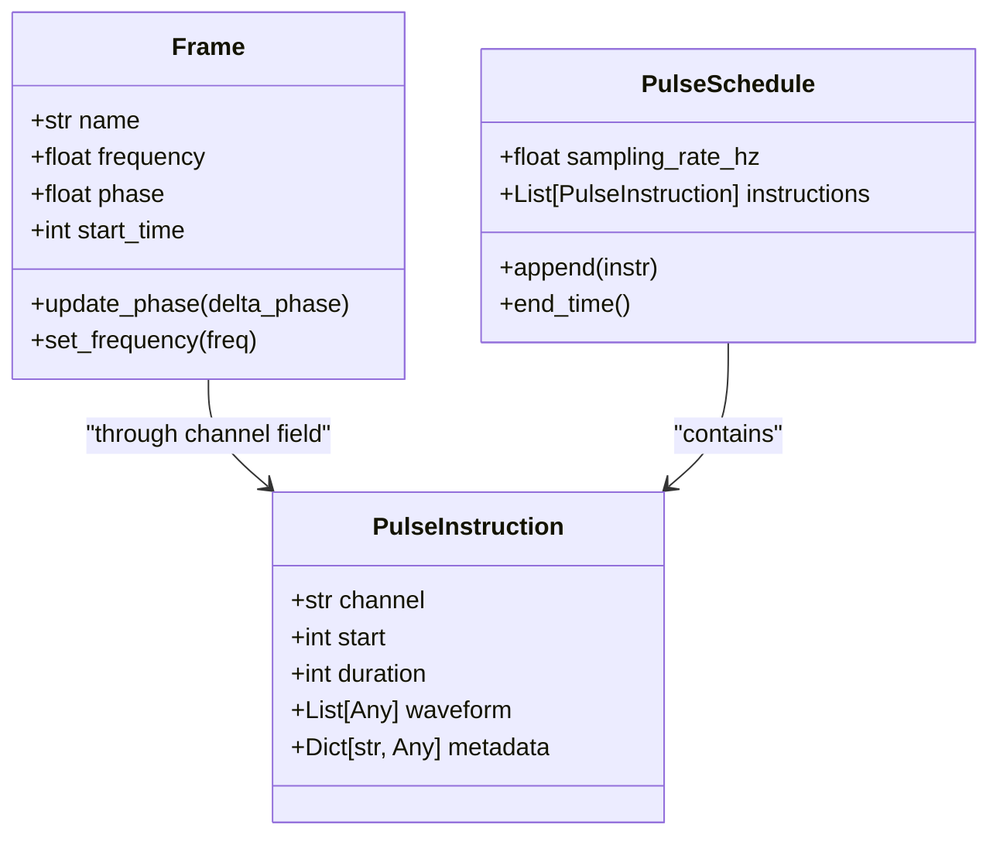

# Pulse IR

<cite>
**Referenced Files in This Document**   
- [pulse.py](file://src/tyxonq/core/ir/pulse.py)
- [waveforms.py](file://src/tyxonq/waveforms.py)
- [pulse_demo.py](file://examples/pulse_demo.py)
- [pulse_demo_scan.py](file://examples/pulse_demo_scan.py)
- [pulse_support_en.md](file://docs/pulse_support_en.md)
</cite>

## Table of Contents
1. [Introduction](#introduction)
2. [Core Components](#core-components)
3. [Waveform Types and Parameters](#waveform-types-and-parameters)
4. [TQASM 0.2 Syntax Specification](#tqasm-02-syntax-specification)
5. [Frame Management and Frequency Control](#frame-management-and-frequency-control)
6. [Calibration Program Construction](#calibration-program-construction)
7. [Integration with Circuit IR and Compilation Pipeline](#integration-with-circuit-ir-and-compilation-pipeline)
8. [Pulse Schedule Construction and Execution](#pulse-schedule-construction-and-execution)
9. [Error Handling and Hardware Constraints](#error-handling-and-hardware-constraints)
10. [Best Practices and Performance Considerations](#best-practices-and-performance-considerations)
11. [Practical Examples](#practical-examples)

## Introduction

The Pulse IR module in TyxonQ enables precise pulse-level control of quantum hardware, serving as a critical component in the intermediate representation system for quantum programs. This module allows users to define and manipulate microwave-level signals that directly drive quantum bits, enabling advanced quantum control techniques such as calibration, error suppression, and custom gate implementation. The Pulse IR provides a hardware-agnostic abstraction layer that translates high-level pulse definitions into executable instructions for specific quantum devices.

The Pulse IR system is designed to work seamlessly with the broader TyxonQ framework, integrating with the Circuit IR system and compilation pipeline to enable both high-level algorithm development and low-level hardware control. By providing direct access to pulse-level operations, the Pulse IR module supports the implementation of sophisticated quantum control protocols that are essential for improving gate fidelity and mitigating errors in quantum computations.

## Core Components

The Pulse IR module consists of two primary data classes that form the foundation of pulse-level control: `PulseInstruction` and `PulseSchedule`. These components work together to represent and manage timed pulse sequences for quantum hardware control.

The `PulseInstruction` class represents a single pulse operation targeting a specific hardware channel. It contains essential timing information (start time and duration in sample units), identifies the target channel (e.g., "d0", "u1"), and carries the waveform data as a list of real or complex amplitude samples. Additionally, it includes metadata that describes the pulse characteristics such as shape, amplitude, and standard deviation. This design maintains backend-agnostic time units by using sample counts, with conversion to seconds handled by the associated `PulseSchedule`.

The `PulseSchedule` class represents a collection of timed pulse instructions executed in sequence. It contains a sampling rate (in Hz) for time unit conversion, an ordered list of `PulseInstruction` objects, and optional global parameters for template expansion or backend-specific configurations. The `PulseSchedule` provides methods to append instructions, calculate the total schedule duration in both sample units and seconds, and determine the end time of the entire pulse sequence.



**Diagram sources**
- [pulse.py](file://src/tyxonq/core/ir/pulse.py#L7-L66)

**Section sources**
- [pulse.py](file://src/tyxonq/core/ir/pulse.py#L7-L66)

## Waveform Types and Parameters

TyxonQ supports multiple predefined pulse waveform types, each with specific parameters for controlling the shape and characteristics of the pulse. These waveforms are implemented as dataclasses in the `waveforms` module and can be parameterized for dynamic control in calibration experiments.

### Supported Waveform Types

| Waveform Type | Parameters | Primary Application |
|---------------|-----------|-------------------|
| `cosine_drag` | duration, amp, phase, alpha | Suppressing leakage state transitions in single-qubit gates |
| `flattop` | duration, amp, width | Quantum state preparation requiring flat-top pulses |
| `gaussian` | duration, amp, sigma, angle | Smooth pulse transitions for adiabatic evolution |
| `sine` | duration, amp, phase, freq, angle | Periodic oscillation experiments like Rabi oscillations |
| `drag` | duration, amp, sigma, beta | DRAG protocol for superconducting qubit control |
| `constant` | duration, amp | DC bias applications |
| `gaussian_square` | duration, amp, sigma, width | Square waves with Gaussian edges |
| `cosine` | duration, amp, freq, phase | Cosine pulses for various control applications |

### Detailed Parameter Specifications

#### CosineDrag Waveform
- `amp`: Real value representing waveform amplitude (|amp| ≤ 2)
- `duration`: Integer representing pulse length in sampling periods (0 < duration < 10000)
- `phase`: Real value representing phase angle in radians
- `alpha`: Real value representing DRAG coefficient (|alpha| ≤ 10)

**Mathematical Expression**:  
g(x) = (Amp / 2) × e^(i × phase) × [cos((2πx / duration) - π) + 1]  
output(x) = g(x) + i × alpha × g'(x)  
Domain: x ∈ [0, duration)

#### Flattop Waveform
- `amp`: Real value representing waveform amplitude (amp ≤ 2)
- `width`: Real value representing FWHM of Gaussian component (width ≤ 100)
- `duration`: Integer representing pulse length in sampling periods (duration ≤ 100,000)

**Mathematical Expression**:  
w = width (FWHM of Gaussian component)  
σ = w / √(4 log 2) (standard deviation)  
A = amp (amplitude)  
T = duration (duration)  
output(x) = (A / 2) × [erf((w + T - x) / σ) - erf((w - x) / σ)]  
Domain: x ∈ [0, T + 2w)

#### Gaussian Waveform
- `amp`: Real value representing waveform amplitude (|amp| ≤ 2)
- `duration`: Integer representing pulse length in sampling periods (0 < duration < 10000)
- `sigma`: Real value representing Gaussian standard deviation
- `angle`: Real value representing complex phase factor angle in radians

**Mathematical Expression**:  
f'(x) = exp(- (1/2) × ((x - duration/2)² / sigma²))  
f(x) = A × f'(x) when 0 ≤ x < duration  
A = amp × exp(i × angle)

#### Sine Waveform
- `amp`: Real value representing sine wave amplitude (|amp| ≤ 2)
- `phase`: Real value representing sine wave phase in radians
- `freq`: Real value representing sine wave frequency (reciprocal of sampling period)
- `angle`: Real value representing complex phase factor angle in radians
- `duration`: Integer representing pulse length in sampling periods (0 < duration < 10000)

**Mathematical Expression**:  
f(x) = A sin(2π × freq × x + phase) when 0 ≤ x < duration  
A = amp × exp(i × angle)

**Section sources**
- [waveforms.py](file://src/tyxonq/waveforms.py#L1-L98)
- [pulse_support_en.md](file://docs/pulse_support_en.md#L211-L349)

## TQASM 0.2 Syntax Specification

TQASM 0.2 defines the syntax for pulse-level quantum circuits using Backus-Naur Form (BNF) notation. This standardized format enables consistent representation of pulse-level operations across different components of the TyxonQ framework.

### Syntax Definition

```
<pulse> ::= <defcal>

<defcal> ::= "defcal" <id> <idlist> { <calgrammar> }

<calgrammar> ::= <calstatement>
               | <calgrammar> <calstatement>

<calstatement> ::= <framedecl>
                | <waveformplay>

<framedecl> ::= "frame" <id> "=" "newframe" (<idlist>);

<waveformplay> ::= "play" (<id>, <waveform>);

<waveform> ::= <id> (<explist>)
```

### Keyword Descriptions

| Keyword | Function | Syntax Format |
|---------|---------|---------------|
| `defcal` | Defines a custom parameterized waveform quantum gate | `defcal <gate_name> <parameter_list> { <calibration_statements> }` |
| `frame` | Declares a variable as frame type | `frame <frame_name> = newframe(<qubit>);` |
| `newframe` | Creates a new frame on target qubit for carrying waveforms | `newframe(<qubit_identifier>)` |
| `play` | Plays a waveform on specified frame | `play(<frame_name>, <waveform_function>(<parameters>));` |

### Complete Example

```tqasm
TQASM 0.2;
QREG q[1];

defcal hello_world a {
  frame drive_frame = newframe(a);
  play(drive_frame, cosine_drag(50, 0.2, 0.0, 0.0));
}

hello_world q[0];
```

This example demonstrates the complete workflow: declaring the TQASM version, defining a quantum register, creating a calibration program named "hello_world" with parameter "a", creating a frame on the qubit, playing a cosine DRAG waveform, and calling the calibration program on qubit q[0].

**Section sources**
- [pulse_support_en.md](file://docs/pulse_support_en.md#L122-L171)

## Frame Management and Frequency Control

Frames in the Pulse IR system represent logical channels that carry waveform signals and manage frequency and phase information for quantum operations. A frame is associated with a physical hardware channel and provides a layer of abstraction that enables frequency modulation and phase tracking.

When a pulse instruction is executed, the `channel` field in `PulseInstruction` directly associates with a frame instance. The frame determines the actual frequency and phase offset applied to the pulse. This design allows for dynamic frequency control and phase accumulation during pulse sequences.

The frame system supports operations such as frequency updates and phase adjustments, enabling advanced control techniques like frequency sweeps and phase calibration. When executing a `play` operation, the specified frame's frequency and phase settings are applied to the waveform, allowing for precise control over the quantum system's evolution.



**Diagram sources**
- [pulse.py](file://src/tyxonq/core/ir/pulse.py#L7-L63)
- [circuit.py](file://src/tyxonq/core/ir/circuit.py#L779)

**Section sources**
- [pulse.py](file://src/tyxonq/core/ir/pulse.py#L7-L63)

## Calibration Program Construction

The `DefcalBuilder` is the primary interface for constructing quantum bit calibration programs in TyxonQ. It provides a chainable API for defining parameterized pulse sequences that can be reused across different qubits and experimental conditions.

### Workflow

1. **Enable Pulse Mode**: Call `use_pulse()` on a `Circuit` object to switch to pulse-level control mode.
2. **Start Calibration Building**: Call `calibrate(name, params)` to create a `DefcalBuilder` instance for a named calibration program with specified parameters.
3. **Define Frames**: Use `new_frame(frame_name, qubit_param)` to create logical frames on target qubits.
4. **Play Waveforms**: Use `play(frame_name, waveform)` to associate waveforms with frames.
5. **Build Program**: Call `build()` to finalize the calibration program and generate the underlying `PulseSchedule`.

### Parameterization Support

All waveforms support parameterization through the `Param` class, enabling dynamic control and scanning experiments. For example:

```python
param_t = Param("t")
builder.play("drive_frame", waveforms.CosineDrag(param_t, 0.2, 0.0, 0.0))
```

This parameterization allows the same calibration program to be executed with different parameter values, facilitating optimization and characterization workflows.

**Section sources**
- [pulse_demo.py](file://examples/pulse_demo.py#L30-L50)
- [pulse_support_en.md](file://docs/pulse_support_en.md#L252-L272)

## Integration with Circuit IR and Compilation Pipeline

The Pulse IR module integrates seamlessly with the Circuit IR system and the overall compilation pipeline in TyxonQ. This integration enables hybrid quantum programs that combine high-level circuit operations with low-level pulse control.

When a circuit is converted to TQASM format, pulse-level operations are represented alongside gate-level operations, maintaining a unified intermediate representation. The compilation pipeline processes both types of operations, applying appropriate optimizations and transformations based on the target execution environment.

The integration allows for mixed-level programming where high-level algorithms can incorporate custom pulse sequences for specific operations, such as optimized single-qubit gates or specialized calibration routines. This capability is particularly valuable for implementing error mitigation techniques and hardware-specific optimizations.

**Section sources**
- [pulse.py](file://src/tyxonq/core/ir/pulse.py#L7-L66)
- [circuit.py](file://src/tyxonq/core/ir/circuit.py)

## Pulse Schedule Construction and Execution

Pulse schedules are constructed by appending `PulseInstruction` objects to a `PulseSchedule` instance. The `append` method adds instructions to the schedule's instruction list, maintaining the temporal ordering of operations.

The `PulseSchedule` class provides timing methods to manage the execution sequence:
- `append(instr)`: Adds a pulse instruction to the schedule
- `end_time()`: Returns the schedule's end time in sample units, calculated as the maximum of `start + duration` across all instructions
- `duration_seconds()`: Returns the schedule duration in seconds based on the sampling rate

When executing on hardware, the pulse schedule is translated into device-specific instructions and transmitted to the quantum controller. The execution follows the precise timing specified in the schedule, with synchronization across multiple channels as required by the quantum operations.

**Section sources**
- [pulse.py](file://src/tyxonq/core/ir/pulse.py#L44-L63)

## Error Handling and Hardware Constraints

The Pulse IR system includes validation mechanisms to ensure pulse parameters remain within hardware-supported ranges. Each waveform type has specific constraints on its parameters:

- Amplitude constraints (typically |amp| ≤ 2)
- Duration limits (minimum and maximum sampling periods)
- Parameter-specific bounds (e.g., |alpha| ≤ 10 for CosineDrag)

Common issues include unsupported waveform types, parameter type mismatches, undefined frames before waveform playback, and TQASM generation failures due to incorrect calibration program construction order. The system validates these conditions and provides appropriate error messages to guide users in correcting their pulse definitions.

Hardware-specific limitations are abstracted through the Pulse IR layer, with the compilation pipeline handling the translation of generic pulse instructions to device-specific requirements. This abstraction allows users to develop pulse sequences without needing detailed knowledge of the underlying hardware constraints.

**Section sources**
- [pulse_support_en.md](file://docs/pulse_support_en.md#L494-L505)

## Best Practices and Performance Considerations

### Best Practices

1. **Parameter Naming**: Use meaningful parameter names to enhance code readability and debugging
2. **Waveform Selection**: Choose appropriate waveform types based on physical requirements and application context
3. **Time Units**: Be mindful of time parameter units (sampling periods) and their relationship to physical time through the sampling rate
4. **Error Handling**: Validate TQASM code correctness before submitting to hardware
5. **Documentation**: Include comments and explanations for complex calibration programs
6. **Complex Phase**: Utilize complex phase factors (angle parameter) for fine phase control when supported by the waveform
7. **Domain Awareness**: Pay attention to each waveform's domain range and ensure parameter settings are physically reasonable

### Performance Considerations

For pulse-level simulations, performance depends on the complexity of the pulse sequences and the number of samples. The use of parameterized waveforms enables efficient scanning experiments without reconstructing the entire pulse schedule. The backend-specific implementation of waveform generation and pulse execution is optimized for performance, with the abstraction layer minimizing overhead.

**Section sources**
- [pulse_support_en.md](file://docs/pulse_support_en.md#L494-L505)

## Practical Examples

### Rabi Oscillation Experiment

```python
from tyxonq import Circuit, Param, waveforms

def create_rabi_circuit(t):
    """Create Rabi oscillation experiment circuit"""
    qc = Circuit(1)
    qc.use_pulse()
    
    param_t = Param("t")
    
    builder = qc.calibrate("rabi_experiment", [param_t])
    builder.new_frame("drive_frame", param_t)
    builder.play("drive_frame", waveforms.CosineDrag(param_t, 0.2, 0.0, 0.0))
    builder.build()
    
    qc.add_calibration('rabi_experiment', ['q[0]'])
    
    return qc
```

### DRAG Pulse Optimization

```python
def create_optimized_drag_pulse():
    """Create optimized DRAG pulse"""
    qc = Circuit(1)
    qc.use_pulse()
    
    param_qubit = Param("q")
    
    drag_wave = waveforms.Drag(
        duration=100,    
        amp=1.0,         
        sigma=20,        
        beta=0.5         
    )
    
    builder = qc.calibrate("optimized_drag", [param_qubit])
    builder.new_frame("drive_frame", param_qubit)
    builder.play("drive_frame", drag_wave)
    builder.build()
    
    qc.add_calibration('optimized_drag', ['q[0]'])
    return qc
```

**Section sources**
- [pulse_demo.py](file://examples/pulse_demo.py#L41-L79)
- [pulse_demo_scan.py](file://examples/pulse_demo_scan.py#L0-L48)