# Devices API

<cite>
**Referenced Files in This Document**   
- [base.py](file://src/tyxonq/devices/base.py)
- [session.py](file://src/tyxonq/devices/session.py)
- [simulators/driver.py](file://src/tyxonq/devices/simulators/driver.py)
- [simulators/statevector/engine.py](file://src/tyxonq/devices/simulators/statevector/engine.py)
- [simulators/matrix_product_state/engine.py](file://src/tyxonq/devices/simulators/matrix_product_state/engine.py)
- [simulators/density_matrix/engine.py](file://src/tyxonq/devices/simulators/density_matrix/engine.py)
- [simulators/noise/channels.py](file://src/tyxonq/devices/simulators/noise/channels.py)
- [hardware/tyxonq/driver.py](file://src/tyxonq/devices/hardware/tyxonq/driver.py)
- [hardware/ibm/driver.py](file://src/tyxonq/devices/hardware/ibm/driver.py)
- [hardware/config.py](file://src/tyxonq/devices/hardware/config.py)
- [examples/noise_controls_demo.py](file://examples/noise_controls_demo.py)
- [examples/cloud_api_devices.py](file://examples/cloud_api_devices.py)
</cite>

## Table of Contents
1. [Introduction](#introduction)
2. [Core Abstraction Classes](#core-abstraction-classes)
3. [Simulator Implementations](#simulator-implementations)
4. [Hardware Drivers](#hardware-drivers)
5. [Session Management and Execution Workflow](#session-management-and-execution-workflow)
6. [Configuration Options](#configuration-options)
7. [Integration with Compiler, Numerics, and Postprocessing](#integration-with-compiler-numerics-and-postprocessing)
8. [Examples](#examples)

## Introduction
The Devices module in TyxonQ provides a unified abstraction layer for quantum device execution, enabling seamless interaction between quantum circuits and various backends including simulators and physical hardware. This API documentation details the foundational classes, simulator engines, hardware drivers, session management, configuration options, and integration points that form the core of the device execution system.

## Core Abstraction Classes

The Devices module defines three core classes that form the foundation of the unified device abstraction: `Device`, `DeviceRule`, and `RunResult`. These classes provide a consistent interface for interacting with different quantum backends.

### Device Class
The `Device` class is a protocol that defines the interface for all quantum execution devices. It specifies the methods and properties that any device must implement to be compatible with the TyxonQ framework.

**Section sources**
- [base.py](file://src/tyxonq/devices/base.py#L67-L78)

### DeviceRule Class
The `DeviceRule` class is a TypedDict that describes the capabilities of a device. It includes optional fields that allow devices to declare their supported features while maintaining forward compatibility.

**Section sources**
- [base.py](file://src/tyxonq/devices/base.py#L41-L52)

### RunResult Class
The `RunResult` class is a TypedDict that defines the structure of results returned by device execution. It uses optional keys to allow devices to report varying levels of detail while preserving a common contract for downstream processing.

**Section sources**
- [base.py](file://src/tyxonq/devices/base.py#L55-L64)

## Simulator Implementations

TyxonQ provides multiple simulator implementations that vary in their computational approach and resource requirements. These simulators enable quantum circuit execution with different trade-offs between accuracy, memory usage, and simulation speed.

### Statevector Simulator
The statevector simulator represents the quantum state as a dense statevector of size 2^n. It provides exact simulation of pure quantum states with O(2^n) memory complexity. This simulator supports standard quantum gates and can compute expectation values analytically when shots=0.

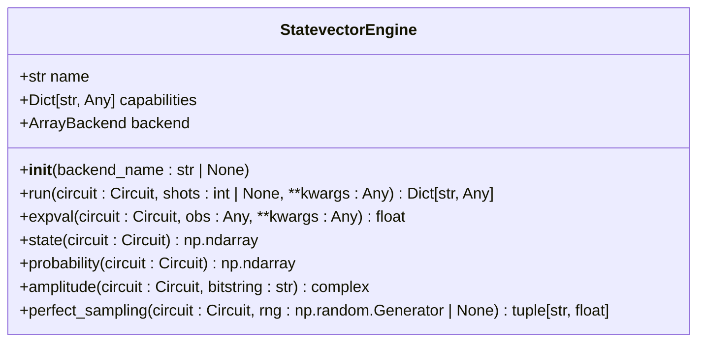

**Diagram sources**
- [simulators/statevector/engine.py](file://src/tyxonq/devices/simulators/statevector/engine.py#L1-L264)

### Matrix Product State (MPS) Simulator
The Matrix Product State simulator represents the quantum state using a tensor network decomposition. This approach enables simulation of larger systems when entanglement is limited, with memory and time complexity scaling with bond dimension rather than 2^n. The simulator supports bond dimension truncation to control computational resources.

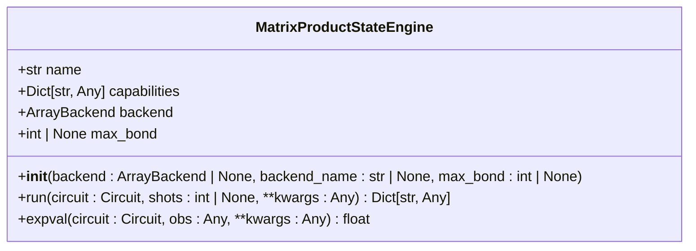

**Diagram sources**
- [simulators/matrix_product_state/engine.py](file://src/tyxonq/devices/simulators/matrix_product_state/engine.py#L1-L212)

### Density Matrix Simulator
The density matrix simulator represents the quantum state as a mixed state using a 2^n × 2^n density matrix. This implementation is particularly suited for noise studies as it natively supports Kraus channel application. With O(4^n) memory complexity, it is more resource-intensive than statevector simulation but provides a complete description of mixed quantum states.

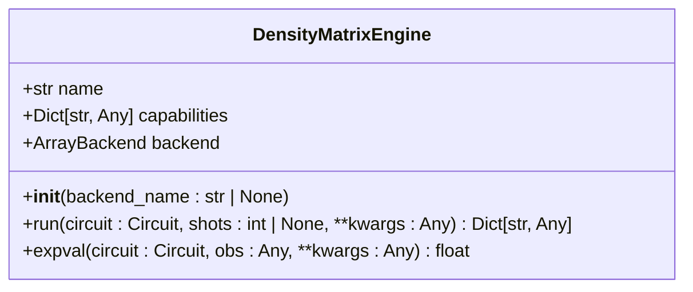

**Diagram sources**
- [simulators/density_matrix/engine.py](file://src/tyxonq/devices/simulators/density_matrix/engine.py#L1-L208)

### Noise Channels
The noise module provides implementations of common quantum noise channels that can be applied to simulations. These channels are implemented as Kraus operators and can be applied to density matrices to model various types of quantum noise.

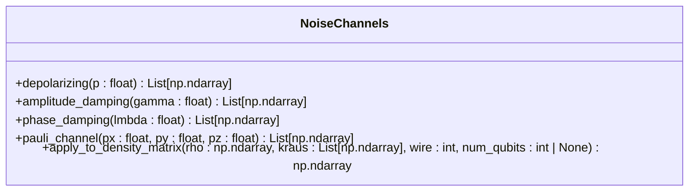

**Diagram sources**
- [simulators/noise/channels.py](file://src/tyxonq/devices/simulators/noise/channels.py#L1-L64)

## Hardware Drivers

TyxonQ provides hardware drivers for interfacing with physical quantum processors. These drivers handle the communication protocol, task submission, and result retrieval for different quantum computing platforms.

### TyxonQ Hardware Driver
The TyxonQ hardware driver enables communication with TyxonQ quantum processors through a cloud API. It handles task submission, polling for results, and error handling for remote execution on TyxonQ hardware.

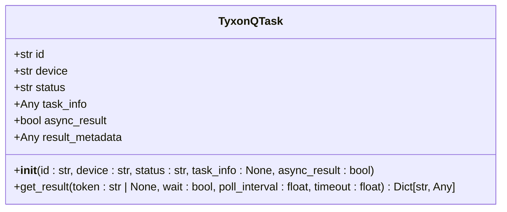

**Diagram sources**
- [hardware/tyxonq/driver.py](file://src/tyxonq/devices/hardware/tyxonq/driver.py#L1-L192)

### IBM Quantum Driver
The IBM Quantum driver provides a skeleton interface for connecting to IBM Quantum systems. This driver is designed to be extended with Qiskit adapters to enable submission of circuits to IBM's quantum processors.

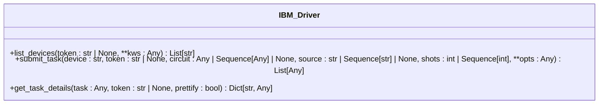

**Diagram sources**
- [hardware/ibm/driver.py](file://src/tyxonq/devices/hardware/ibm/driver.py#L1-L39)

## Session Management and Execution Workflow

The Devices module provides a comprehensive session management system that handles the execution workflow from circuit submission to result retrieval. This system abstracts the differences between local simulation and remote hardware execution.

### Device Task Management
The `DeviceTask` class provides a unified wrapper for both synchronous and asynchronous execution results. This abstraction allows the same interface to be used for both local simulators (immediate results) and remote hardware (polling for completion).

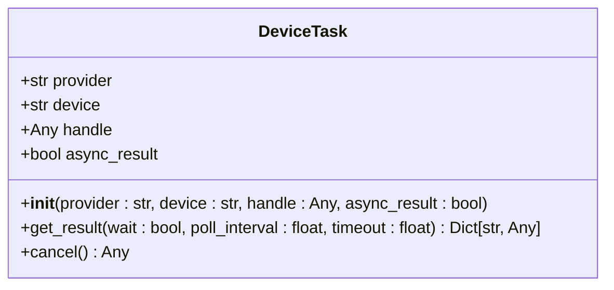

**Diagram sources**
- [base.py](file://src/tyxonq/devices/base.py#L6-L39)

### Execution Workflow
The execution workflow in TyxonQ follows a consistent pattern regardless of the target device. The process begins with device selection and configuration, followed by circuit compilation (if necessary), task submission, and finally result retrieval.

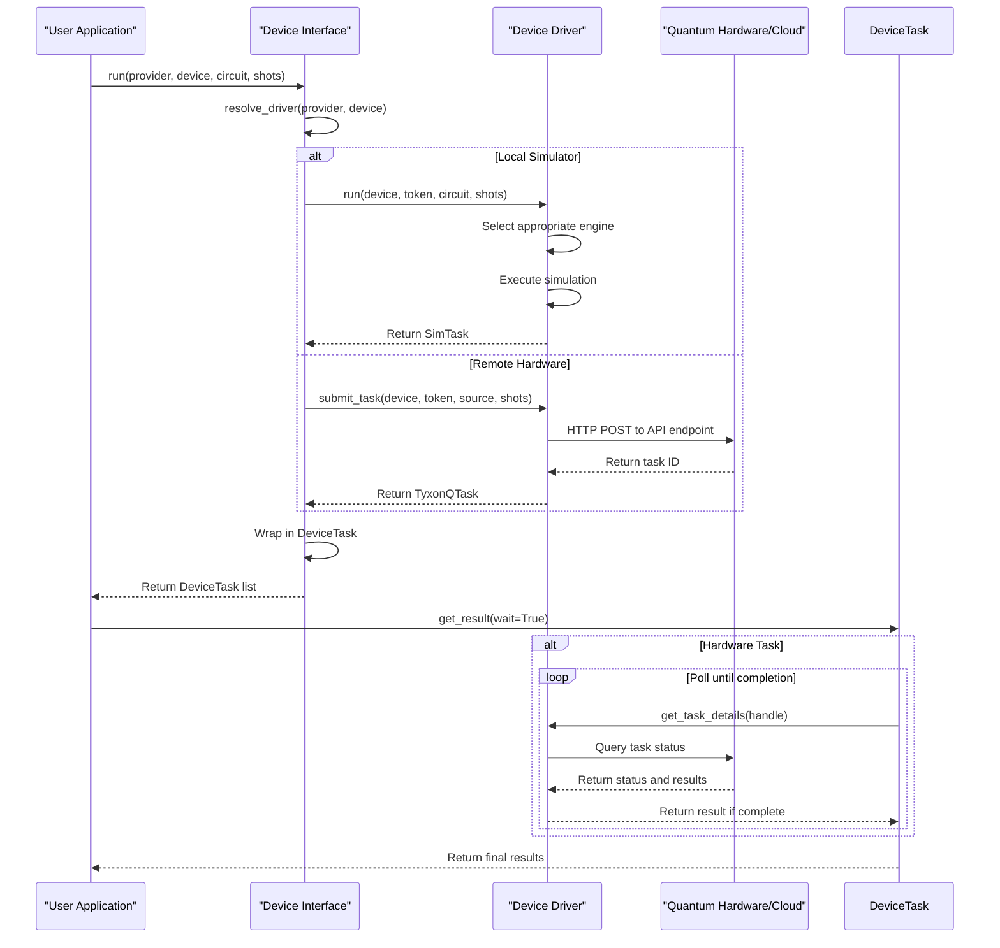

**Diagram sources**
- [base.py](file://src/tyxonq/devices/base.py#L131-L290)
- [simulators/driver.py](file://src/tyxonq/devices/simulators/driver.py#L1-L141)
- [hardware/tyxonq/driver.py](file://src/tyxonq/devices/hardware/tyxonq/driver.py#L1-L192)

### Segmented Shot Planning
The session module provides functionality for executing segmented shot plans, where a single circuit is executed in multiple segments with different shot counts. This enables advanced sampling strategies and error mitigation techniques.

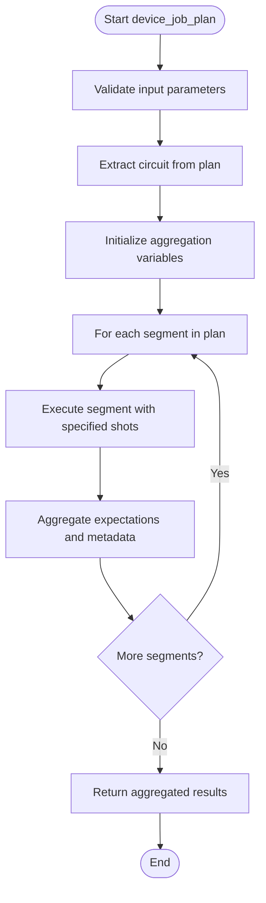

**Diagram sources**
- [session.py](file://src/tyxonq/devices/session.py#L9-L47)

## Configuration Options

The Devices module provides extensive configuration options for device selection, noise modeling, and execution parameters. These options can be set globally or overridden for individual executions.

### Device Selection
Device selection in TyxonQ can be specified through provider and device identifiers. The system supports multiple providers including 'simulator', 'tyxonq', and 'ibm', with various device options within each provider.

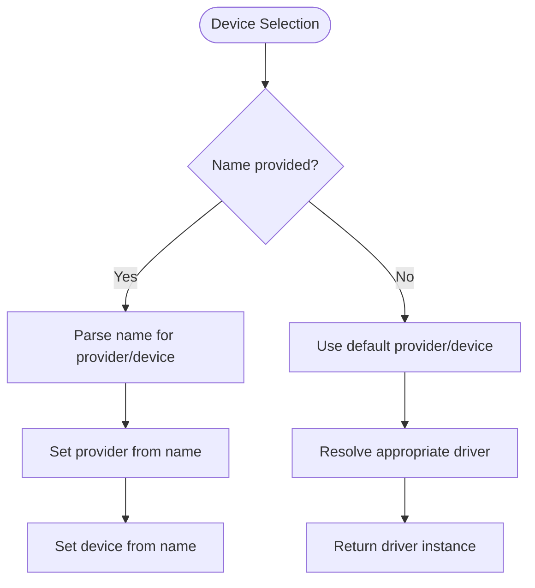

**Diagram sources**
- [base.py](file://src/tyxonq/devices/base.py#L80-L114)

### Noise Modeling
TyxonQ provides a global noise configuration system that enables noise modeling in simulations. The noise system supports various noise types including depolarizing, amplitude damping, phase damping, and Pauli channels.

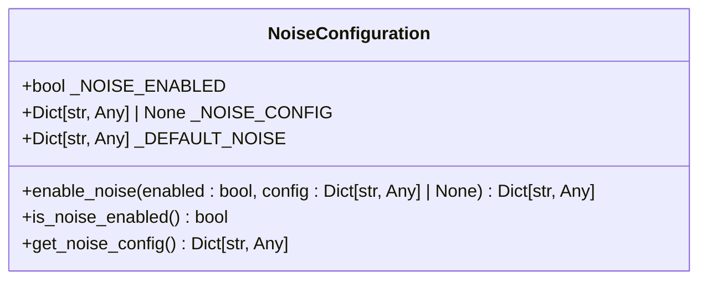

**Diagram sources**
- [base.py](file://src/tyxonq/devices/base.py#L149-L154)
- [examples/noise_controls_demo.py](file://examples/noise_controls_demo.py#L1-L46)

### Execution Parameters
The execution system supports various parameters that control the behavior of circuit execution, including shot count, backend selection, and numerical precision.

**Section sources**
- [base.py](file://src/tyxonq/devices/base.py#L131-L290)

## Integration with Compiler, Numerics, and Postprocessing

The Devices module integrates seamlessly with other components of the TyxonQ framework, including the compiler, numerics, and postprocessing systems.

### Compiler Integration
The device layer works closely with the compiler to ensure circuits are properly compiled before execution on hardware. For local simulators, circuits can be executed directly, while hardware execution requires pre-compilation to a supported format.

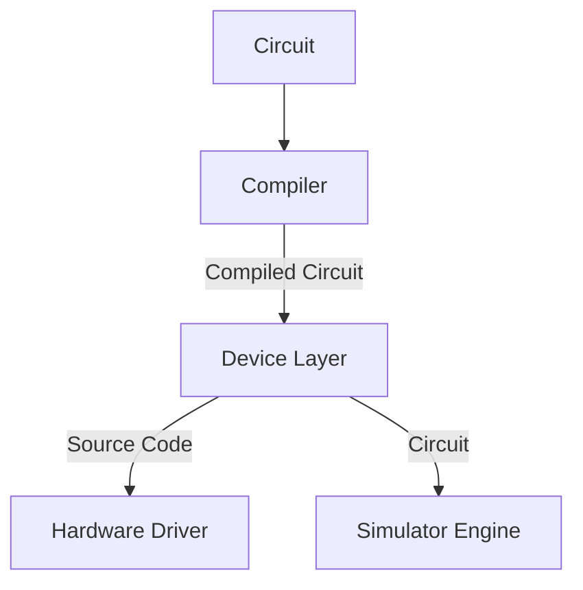

**Section sources**
- [base.py](file://src/tyxonq/devices/base.py#L131-L290)

### Numerics Integration
Simulator engines integrate with the numerics system to support different computational backends including NumPy, PyTorch, and CuPy. This allows simulations to leverage GPU acceleration when available.

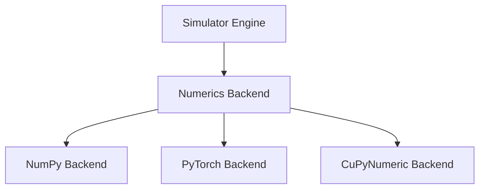

**Section sources**
- [simulators/statevector/engine.py](file://src/tyxonq/devices/simulators/statevector/engine.py#L1-L264)
- [simulators/matrix_product_state/engine.py](file://src/tyxonq/devices/simulators/matrix_product_state/engine.py#L1-L212)
- [simulators/density_matrix/engine.py](file://src/tyxonq/devices/simulators/density_matrix/engine.py#L1-L208)

### Postprocessing Integration
The device execution results are structured to integrate seamlessly with the postprocessing system. The `RunResult` format includes fields for samples, expectations, and metadata that can be directly consumed by postprocessing functions.

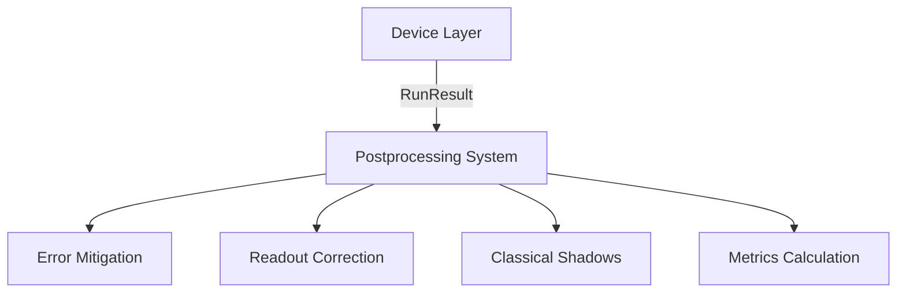

**Section sources**
- [base.py](file://src/tyxonq/devices/base.py#L55-L64)

## Examples

The following examples demonstrate common usage patterns for the Devices module.

### Device Configuration and Execution
This example shows how to configure and execute circuits on different devices:

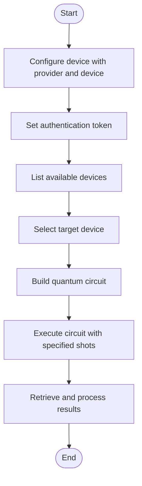

**Section sources**
- [examples/cloud_api_devices.py](file://examples/cloud_api_devices.py#L1-L28)

### Noise Modeling in Simulation
This example demonstrates how to enable and configure noise modeling in simulations:

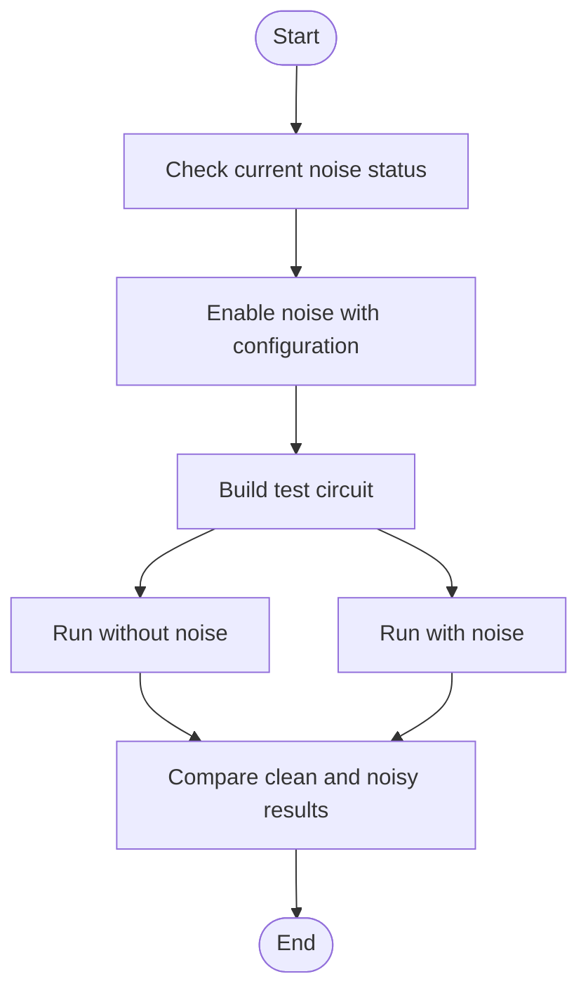

**Section sources**
- [examples/noise_controls_demo.py](file://examples/noise_controls_demo.py#L1-L46)