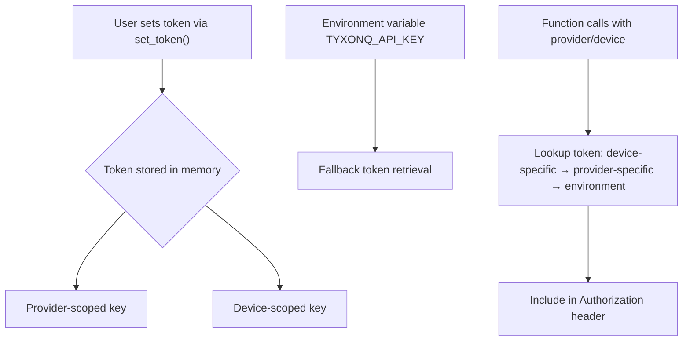
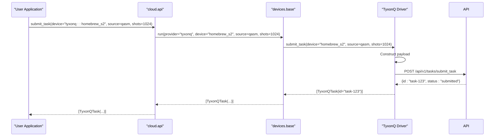
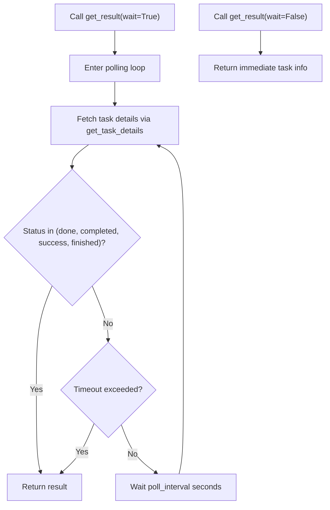
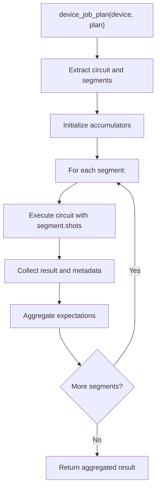
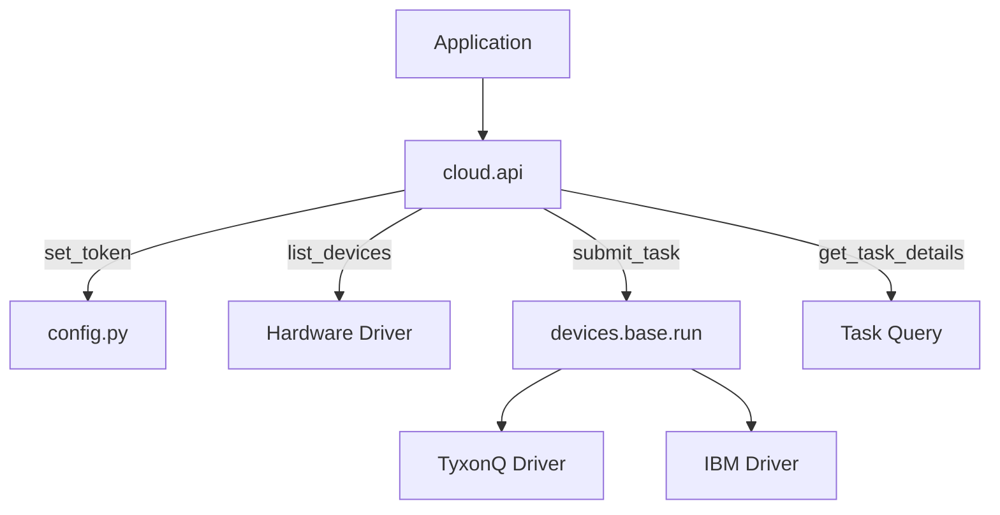
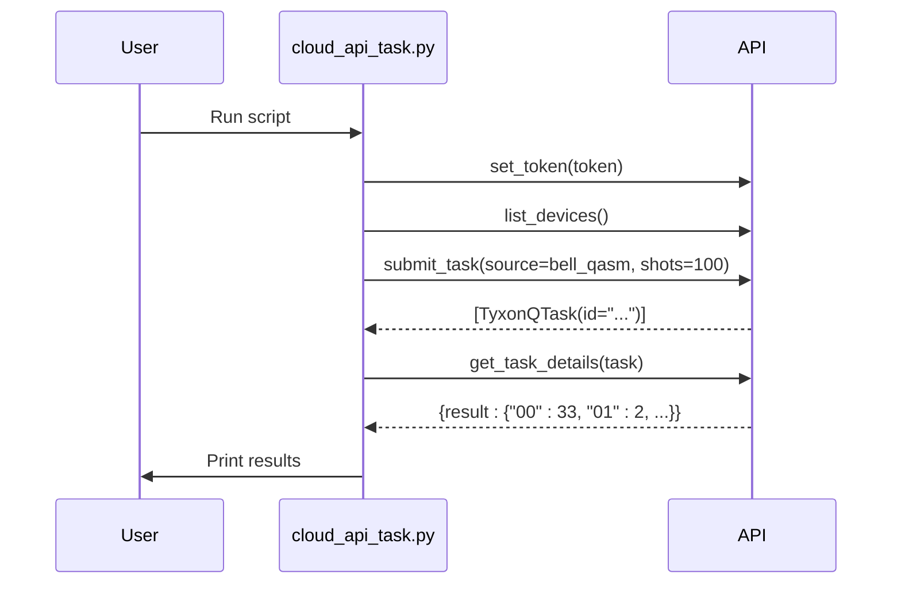

# Hardware Drivers

<cite>
**Referenced Files in This Document**   
- [driver.py](file://src/tyxonq/devices/hardware/tyxonq/driver.py)
- [driver.py](file://src/tyxonq/devices/hardware/ibm/driver.py)
- [config.py](file://src/tyxonq/devices/hardware/config.py)
- [session.py](file://src/tyxonq/devices/session.py)
- [api.py](file://src/tyxonq/cloud/api.py)
- [api.py](file://src/tyxonq/compiler/api.py)
- [cloud_api_task.py](file://examples/cloud_api_task.py)
- [cloud_api_devices.py](file://examples/cloud_api_devices.py)
</cite>

## Table of Contents
1. [Introduction](#introduction)
2. [Authentication and Configuration](#authentication-and-configuration)
3. [Device Management](#device-management)
4. [Job Submission and Execution](#job-submission-and-execution)
5. [Result Retrieval and Task Monitoring](#result-retrieval-and-task-monitoring)
6. [Hardware Session Management](#hardware-session-management)
7. [Compiler Integration and Hardware-Aware Optimization](#compiler-integration-and-hardware-aware-optimization)
8. [Cloud API Integration](#cloud-api-integration)
9. [Usage Examples](#usage-examples)
10. [Conclusion](#conclusion)

## Introduction
This document provides comprehensive API documentation for the hardware drivers in TyxonQ, focusing on the TyxonQ processor driver and IBM Quantum driver. It details the mechanisms for authentication, device selection, job submission, and result retrieval. The document also explains the hardware session management system, configuration of execution parameters, and the mapping between abstract circuit operations and native hardware gates. Integration with the compiler pipeline for hardware-aware optimization and with the cloud API module for remote job handling is addressed, supported by examples from `examples/cloud_api_task.py` and `examples/cloud_api_devices.py` demonstrating cloud-based hardware execution.

## Authentication and Configuration
The authentication and configuration system in TyxonQ is managed through the `config.py` module, which handles API tokens and default settings for hardware providers and devices. Users can set tokens for specific providers or devices using the `set_token` function, which stores credentials in memory and supports environment variable fallbacks. Default provider and device preferences can be configured using `set_default`, enabling streamlined access across sessions.

Authentication tokens are scoped by provider and device, allowing flexible credential management. The system first checks in-memory tokens before falling back to the `TYXONQ_API_KEY` environment variable. Endpoint URLs and API versions are configurable via environment variables (`TYXONQ_BASE_URL`, `TYXONQ_API_VERSION`) or defaults defined in the `ENDPOINTS` dictionary.



**Diagram sources**
- [config.py](file://src/tyxonq/devices/hardware/config.py#L1-L68)

**Section sources**
- [config.py](file://src/tyxonq/devices/hardware/config.py#L1-L68)
- [api.py](file://src/tyxonq/cloud/api.py#L1-L124)

## Device Management
Device discovery and property inspection are handled through standardized interfaces in the hardware drivers. The `list_devices` function provides a unified way to enumerate available quantum devices across providers. For the TyxonQ driver, this queries a remote endpoint and returns device IDs prefixed with `tyxonq::`. The IBM driver currently serves as a skeleton and returns an empty list pending full integration.

Device properties such as qubit count, connectivity, and operational status can be retrieved using `list_properties`, which normalizes responses into a consistent format. Device identifiers follow the convention `provider::device_id`, enabling unambiguous targeting in job submissions.

```mermaid
graph TB
Client[Application] --> API[cloud.api.list_devices]
API --> Driver[Hardware Driver]
Driver --> |TyxonQ| TyxonQDriver[tyxonq/driver.py]
Driver --> |IBM| IBMDriver[ibm/driver.py]
TyxonQDriver --> HTTP[POST /api/v1/devices/list]
HTTP --> Server[TyxonQ Cloud API]
Server --> Response[{"devices": [...]}]
Response --> Parser[Extract device IDs]
Parser --> Format[Format as tyxonq::device_id]
Format --> Return[Return device list]
```

**Diagram sources**
- [driver.py](file://src/tyxonq/devices/hardware/tyxonq/driver.py#L1-L193)
- [driver.py](file://src/tyxonq/devices/hardware/ibm/driver.py#L1-L40)
- [api.py](file://src/tyxonq/cloud/api.py#L1-L124)

**Section sources**
- [driver.py](file://src/tyxonq/devices/hardware/tyxonq/driver.py#L1-L193)
- [driver.py](file://src/tyxonq/devices/hardware/ibm/driver.py#L1-L40)
- [cloud_api_devices.py](file://examples/cloud_api_devices.py#L1-L29)

## Job Submission and Execution
Job submission in TyxonQ is abstracted through the `submit_task` interface, which supports both circuit objects and raw source code (e.g., OPENQASM). The TyxonQ driver accepts source code in OPENQASM format and forwards it to the cloud API with execution parameters including device target, shot count, and language specification.

The `run` function serves as an alias for `submit_task`, providing compatibility with existing code patterns. Jobs are submitted via HTTP POST to the `/tasks/submit_task` endpoint with a JSON payload containing device, shots, source, and version information. On submission failure, the system attempts to retrieve device properties for diagnostic purposes.

For IBM hardware, the driver currently raises `NotImplementedError`, indicating that backend integration via Qiskit adapters is pending. The unified interface ensures that once implemented, IBM devices will integrate seamlessly with the existing workflow.



**Diagram sources**
- [driver.py](file://src/tyxonq/devices/hardware/tyxonq/driver.py#L1-L193)
- [driver.py](file://src/tyxonq/devices/hardware/ibm/driver.py#L1-L40)
- [api.py](file://src/tyxonq/cloud/api.py#L1-L124)

**Section sources**
- [driver.py](file://src/tyxonq/devices/hardware/tyxonq/driver.py#L1-L193)
- [api.py](file://src/tyxonq/cloud/api.py#L1-L124)
- [cloud_api_task.py](file://examples/cloud_api_task.py#L1-L65)

## Result Retrieval and Task Monitoring
Results are retrieved using the `get_task_details` function, which queries the status and output of a submitted task. The `TyxonQTask` class encapsulates task state and provides a `get_result` method with optional blocking behavior. When `wait=True`, the method polls the server at regular intervals until completion or timeout.

The response structure is normalized to include counts, shots, device metadata, and raw API response data. Task status transitions are tracked through states such as "processing", "done", "completed", and "success". The system handles both synchronous and asynchronous result retrieval patterns.



**Diagram sources**
- [driver.py](file://src/tyxonq/devices/hardware/tyxonq/driver.py#L1-L193)

**Section sources**
- [driver.py](file://src/tyxonq/devices/hardware/tyxonq/driver.py#L1-L193)
- [cloud_api_task.py](file://examples/cloud_api_task.py#L1-L65)

## Hardware Session Management
Hardware session management is facilitated through the `device_job_plan` function in `session.py`, which enables segmented execution of quantum circuits with aggregated results. This supports advanced execution patterns such as adaptive measurements and dynamic circuit scheduling.

The session system accepts a plan dictionary containing a circuit and a list of segments, each specifying shot counts and measurement bases. Results from individual segments are collected and combined, with expectation values summed across segments. Metadata includes per-segment execution records and total shot counts, enabling detailed analysis of execution characteristics.



**Diagram sources**
- [session.py](file://src/tyxonq/devices/session.py#L1-L51)

**Section sources**
- [session.py](file://src/tyxonq/devices/session.py#L1-L51)

## Compiler Integration and Hardware-Aware Optimization
The compiler integration layer, exposed through `compiler/api.py`, enables hardware-aware circuit optimization and translation. The `compile` function serves as a unified entry point, supporting multiple compilation engines including native TyxonQ and Qiskit-based flows.

When targeting TyxonQ hardware such as `homebrew_s2`, circuits are automatically compiled to OPENQASM 2.0 format. The compilation pipeline can be customized through `compile_plan` and `device_rule` parameters, allowing for hardware-specific optimizations such as gate decomposition, qubit mapping, and circuit simplification.

Integration with the hardware drivers ensures that compilation decisions consider target device constraints, enabling efficient execution on real quantum processors.

```mermaid
graph TD
A[Circuit] --> B[compile()]
B --> C{Target is TyxonQ?}
C --> |Yes| D[NativeCompiler → QASM2]
C --> |No| E[QiskitCompiler]
D --> F[Optimized for hardware constraints]
E --> G[Qiskit-optimized circuit]
F --> H[submit_task with source]
G --> I[submit_task with circuit]
```

**Diagram sources**
- [api.py](file://src/tyxonq/compiler/api.py#L1-L66)
- [driver.py](file://src/tyxonq/devices/hardware/tyxonq/driver.py#L1-L193)

**Section sources**
- [api.py](file://src/tyxonq/compiler/api.py#L1-L66)
- [driver.py](file://src/tyxonq/devices/hardware/tyxonq/driver.py#L1-L193)

## Cloud API Integration
The cloud API module (`cloud/api.py`) provides a facade that unifies access to quantum hardware through a consistent interface. It delegates operations to hardware-specific drivers based on provider identifiers, enabling a pluggable architecture.

Key functions include `set_token`, `list_devices`, `submit_task`, and `get_task_details`, all of which route to appropriate driver implementations. The `run` function serves as a high-level entry point that integrates compilation, execution, and post-processing.

The API supports both direct source submission and circuit-based workflows, accommodating different levels of abstraction in quantum program development.



**Diagram sources**
- [api.py](file://src/tyxonq/cloud/api.py#L1-L124)
- [config.py](file://src/tyxonq/devices/hardware/config.py#L1-L68)

**Section sources**
- [api.py](file://src/tyxonq/cloud/api.py#L1-L124)

## Usage Examples
Two primary usage patterns are demonstrated in the example files:

1. **Legacy-style submission**: Direct submission of OPENQASM source code using `submit_task`, followed by polling for results.
2. **Chain-style execution**: Building a circuit using the high-level API, compiling it, and executing with automatic result handling.

The `cloud_api_devices.py` example shows device enumeration, while `cloud_api_task.py` demonstrates both submission patterns with error handling and result inspection.



**Diagram sources**
- [cloud_api_task.py](file://examples/cloud_api_task.py#L1-L65)
- [cloud_api_devices.py](file://examples/cloud_api_devices.py#L1-L29)

**Section sources**
- [cloud_api_task.py](file://examples/cloud_api_task.py#L1-L65)
- [cloud_api_devices.py](file://examples/cloud_api_devices.py#L1-L29)

## Conclusion
The TyxonQ hardware driver system provides a robust, extensible interface for quantum hardware access, with current support for TyxonQ cloud processors and a foundation for IBM Quantum integration. The architecture separates concerns through a layered design: authentication and configuration, device management, job execution, result retrieval, session management, and compiler integration. The cloud API facade enables consistent access patterns across providers, while the session system supports advanced execution workflows. Examples demonstrate practical usage patterns for cloud-based quantum computing.