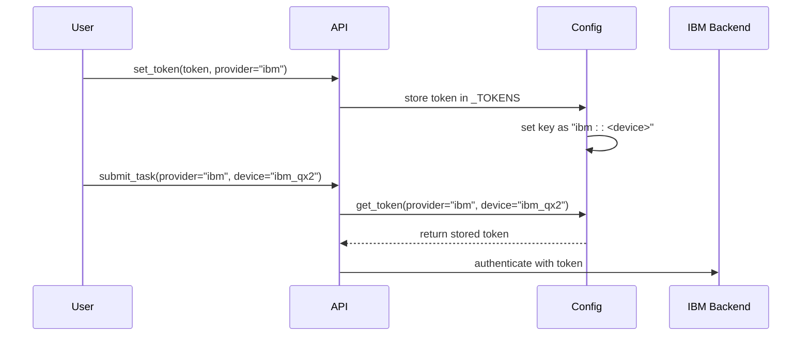
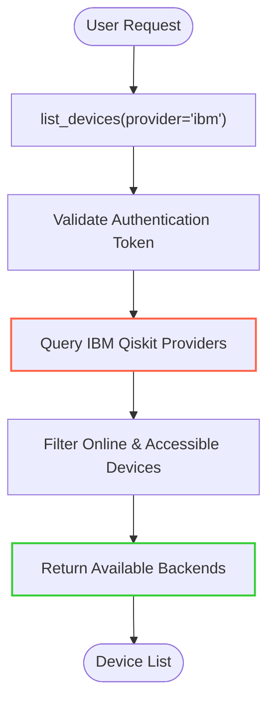
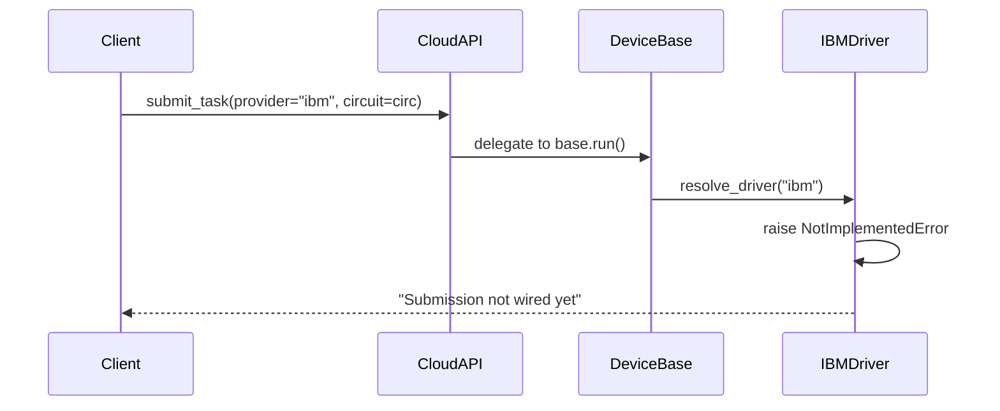
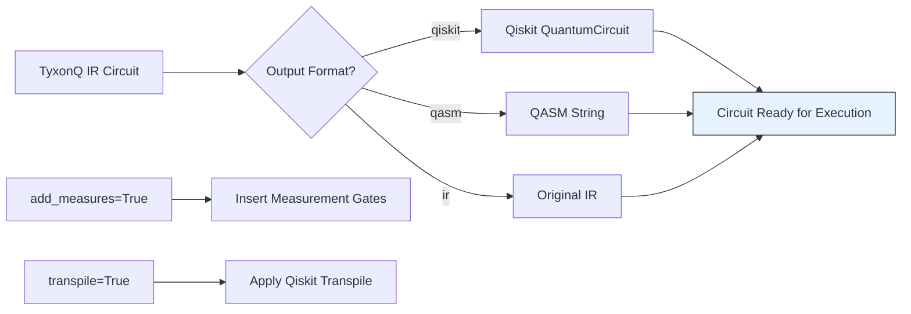
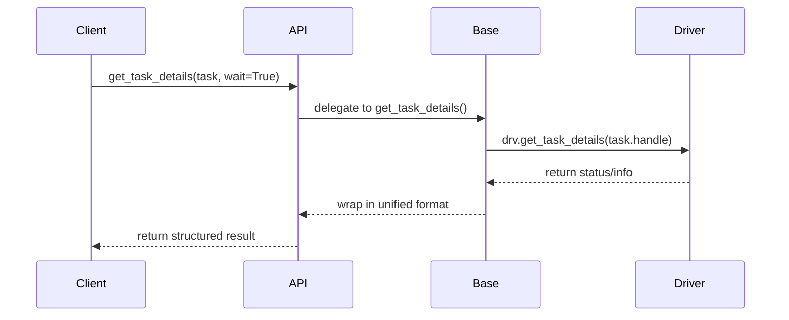

# IBM Quantum Driver

<cite>
**Referenced Files in This Document**   
- [driver.py](file://src/tyxonq/devices/hardware/ibm/driver.py)
- [qiskit_compiler.py](file://src/tyxonq/compiler/compile_engine/qiskit/qiskit_compiler.py)
- [api.py](file://src/tyxonq/cloud/api.py)
- [config.py](file://src/tyxonq/devices/hardware/config.py)
- [cloud_api_devices.py](file://examples/cloud_api_devices.py)
</cite>

## Table of Contents
1. [Introduction](#introduction)
2. [Authentication Process](#authentication-process)
3. [Backend Discovery and Device Selection](#backend-discovery-and-device-selection)
4. [Job Submission and Execution Flow](#job-submission-and-execution-flow)
5. [Circuit Compilation and Translation](#circuit-compilation-and-translation)
6. [Configuration Options](#configuration-options)
7. [Usage Examples](#usage-examples)
8. [Integration with Qiskit Backend](#integration-with-qiskit-backend)
9. [Handling Hardware Constraints](#handling-hardware-constraints)
10. [Result Fetching Mechanism](#result-fetching-mechanism)

## Introduction
The IBM Quantum driver within TyxonQ provides a unified interface for interacting with IBM's quantum computing infrastructure. It enables users to authenticate, discover available backends, submit quantum circuits, and retrieve execution results through a standardized API. The driver acts as a bridge between TyxonQ's intermediate representation (IR) and IBM's Qiskit ecosystem, facilitating seamless execution on real quantum hardware or simulators.

**Section sources**
- [driver.py](file://src/tyxonq/devices/hardware/ibm/driver.py#L1-L39)

## Authentication Process
Authentication with IBM Quantum services is managed through API tokens. Users can set their credentials using the `set_token` function, which stores the token in memory or environment variables for subsequent requests. The authentication system supports provider-specific and device-specific token scoping, allowing flexible access control across different quantum providers and devices.

Tokens can be configured programmatically or via environment variables such as `TYXONQ_API_KEY`. The driver retrieves tokens based on the specified provider and device context, falling back to environment variables when in-memory tokens are not available.



**Diagram sources**
- [config.py](file://src/tyxonq/devices/hardware/config.py#L10-L67)
- [api.py](file://src/tyxonq/cloud/api.py#L37-L70)

**Section sources**
- [config.py](file://src/tyxonq/devices/hardware/config.py#L10-L67)
- [api.py](file://src/tyxonq/cloud/api.py#L37-L70)

## Backend Discovery and Device Selection
The driver supports backend discovery through the `list_devices` function, which queries available quantum devices from the specified provider. Currently, the IBM driver is implemented as a skeleton and returns an empty list, indicating that integration with actual IBM Qiskit providers is pending.

Device selection is handled through the `device` parameter in task submission, where users specify the target backend by name. The system resolves the appropriate driver based on the provider prefix (e.g., "ibm::quantum_device") and applies corresponding execution rules and constraints.



**Diagram sources**
- [driver.py](file://src/tyxonq/devices/hardware/ibm/driver.py#L16-L18)
- [api.py](file://src/tyxonq/cloud/api.py#L37-L38)

**Section sources**
- [driver.py](file://src/tyxonq/devices/hardware/ibm/driver.py#L16-L18)
- [api.py](file://src/tyxonq/cloud/api.py#L37-L38)

## Job Submission and Execution Flow
Job submission is facilitated through the `submit_task` function, which delegates execution to the underlying hardware driver. For IBM devices, this function currently raises a `NotImplementedError`, indicating that the integration with IBM's execution backend is not yet complete.

The execution flow follows a unified pattern across all providers:
1. Authentication token validation
2. Circuit compilation (if auto_compile=True)
3. Task serialization and transmission
4. Job queuing on the target backend
5. Asynchronous execution monitoring

The system supports both synchronous and asynchronous execution modes, with configurable polling intervals and timeouts for result retrieval.



**Diagram sources**
- [driver.py](file://src/tyxonq/devices/hardware/ibm/driver.py#L23-L32)
- [api.py](file://src/tyxonq/cloud/api.py#L41-L62)

**Section sources**
- [driver.py](file://src/tyxonq/devices/hardware/ibm/driver.py#L23-L32)
- [api.py](file://src/tyxonq/cloud/api.py#L41-L62)

## Circuit Compilation and Translation
The Qiskit compiler component translates TyxonQ's intermediate representation into Qiskit-compatible circuits for execution on IBM hardware. This process involves several stages:

1. **IR to Qiskit Conversion**: The `ir_to_qiskit` adapter transforms the abstract circuit into a Qiskit `QuantumCircuit` object.
2. **Transpilation**: If enabled, the circuit is optimized and mapped to the target device's topology using Qiskit's transpiler.
3. **Measurement Insertion**: Optional automatic addition of measurement gates at the end of the circuit.
4. **Output Formatting**: Conversion to various output formats (Qiskit object, QASM string, etc.).

The compiler accepts configuration options such as optimization level, basis gates, and coupling map constraints, which are passed through to Qiskit's transpilation pipeline.



**Diagram sources**
- [qiskit_compiler.py](file://src/tyxonq/compiler/compile_engine/qiskit/qiskit_compiler.py#L22-L76)

**Section sources**
- [qiskit_compiler.py](file://src/tyxonq/compiler/compile_engine/qiskit/qiskit_compiler.py#L22-L76)

## Configuration Options
The driver supports several configuration options for controlling circuit optimization and execution behavior:

- **Optimization Level**: Controls the aggressiveness of circuit optimization during transpilation
- **Dynamic Circuit Support**: Enables or disables support for mid-circuit measurement and feedback
- **Readout Error Mitigation**: Activates measurement error correction protocols
- **Basis Gates**: Specifies the native gate set for the target device
- **Coupling Map**: Defines the qubit connectivity constraints of the quantum processor

These options are passed as keyword arguments to the `compile` method and are normalized before being forwarded to Qiskit's transpiler.

**Section sources**
- [qiskit_compiler.py](file://src/tyxonq/compiler/compile_engine/qiskit/qiskit_compiler.py#L22-L76)

## Usage Examples
The following example demonstrates how to use the cloud API to list available devices and execute circuits on IBM hardware:

```python
from __future__ import annotations

import os
import json
import tyxonq as tq
import getpass

def main():
    token = getpass.getpass("Enter your token: ")
    if token:
        tq.set_token(token, provider="tyxonq", device=None)
    devs = tq.api.list_devices(provider="tyxonq") if hasattr(tq, "api") else []
    print(json.dumps(devs, indent=2, ensure_ascii=False))

if __name__ == "__main__":
    main()
```

This script prompts the user for an API token, sets it for the specified provider, and lists all available devices. The same pattern can be extended to submit quantum circuits by calling `submit_task` with a circuit object and target device.

**Section sources**
- [cloud_api_devices.py](file://examples/cloud_api_devices.py#L1-L28)

## Integration with Qiskit Backend
The driver is designed to integrate with Qiskit's backend system through adapter functions that convert between TyxonQ's IR and Qiskit's `QuantumCircuit` format. The integration layer handles:

- Logical-to-physical qubit mapping
- Gate decomposition into native basis gates
- Topology-aware routing and SWAP insertion
- Pulse-level control parameterization (future)

Although the current implementation is a skeleton, the architecture is designed to support full bidirectional conversion between TyxonQ and Qiskit representations, enabling seamless execution on IBM's quantum hardware.

**Section sources**
- [driver.py](file://src/tyxonq/devices/hardware/ibm/driver.py#L1-L39)
- [qiskit_compiler.py](file://src/tyxonq/compiler/compile_engine/qiskit/qiskit_compiler.py#L1-L83)

## Handling Hardware Constraints
The driver must account for various hardware-specific limitations when executing quantum circuits:

- **Pulse-Level Control Limitations**: Not all gates can be implemented with arbitrary pulse shapes; the system must respect the device's calibrated gate set.
- **Measurement Feedback Delays**: Real-time feedback operations are constrained by classical processing latency.
- **Coherence Time Limits**: Circuits must complete within the qubits' T1 and T2 coherence times.
- **Connectivity Restrictions**: Two-qubit gates can only be applied between physically connected qubits.

These constraints are enforced during the compilation phase, where the transpiler optimizes the circuit to fit within the target device's architectural limitations.

**Section sources**
- [driver.py](file://src/tyxonq/devices/hardware/ibm/driver.py#L1-L39)
- [qiskit_compiler.py](file://src/tyxonq/compiler/compile_engine/qiskit/qiskit_compiler.py#L22-L76)

## Result Fetching Mechanism
Results are retrieved through the `get_task_details` function, which queries the execution status and returns measurement outcomes. The system supports both synchronous and asynchronous result retrieval with configurable polling intervals.

For IBM devices, this functionality is currently not implemented and raises a `NotImplementedError`. However, the expected return format follows a unified schema that includes:

- Raw measurement counts
- Normalized probabilities
- Execution metadata (shots, device, timestamps)
- Error information (if applicable)

The result fetching mechanism is designed to handle long-running jobs by providing progress updates and timeout protection.



**Diagram sources**
- [driver.py](file://src/tyxonq/devices/hardware/ibm/driver.py#L35-L36)
- [api.py](file://src/tyxonq/cloud/api.py#L65-L70)

**Section sources**
- [driver.py](file://src/tyxonq/devices/hardware/ibm/driver.py#L35-L36)
- [api.py](file://src/tyxonq/cloud/api.py#L65-L70)