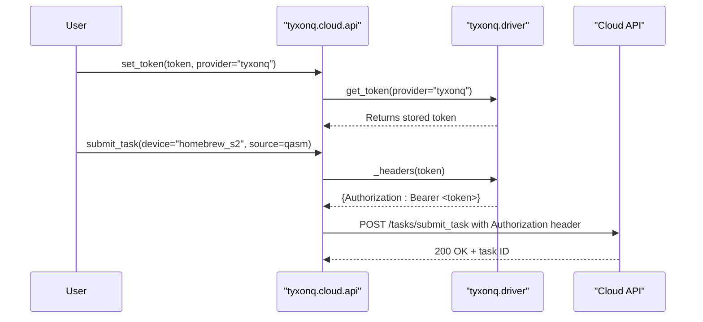
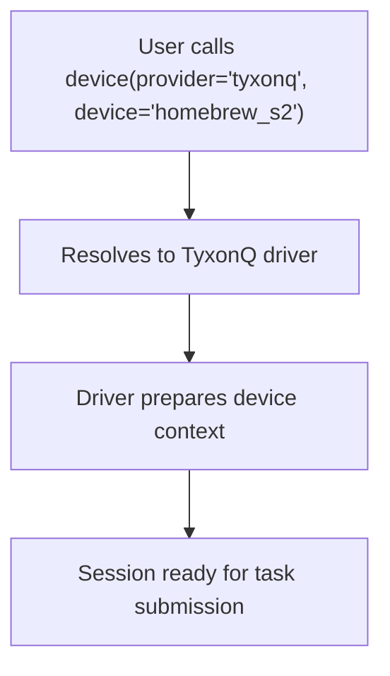
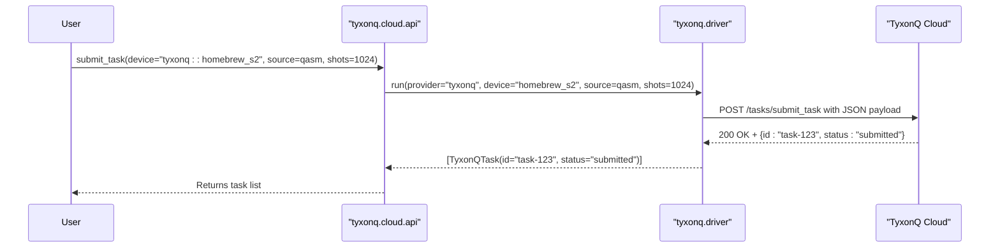
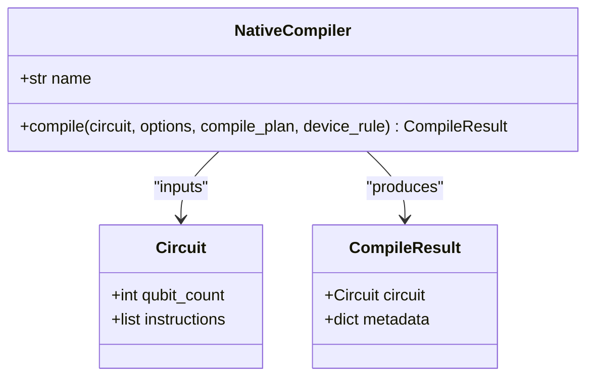
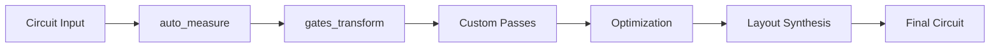
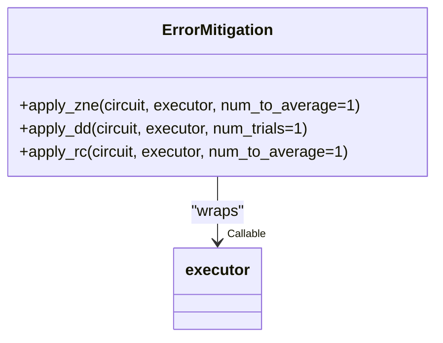
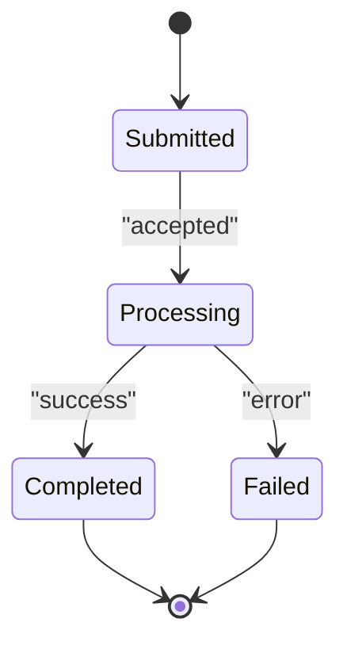

# TyxonQ Processor Driver

<cite>
**Referenced Files in This Document**   
- [driver.py](file://src/tyxonq/devices/hardware/tyxonq/driver.py)
- [api.py](file://src/tyxonq/cloud/api.py)
- [cloud_api_task.py](file://examples/cloud_api_task.py)
- [cloud_api_task_qaoa.py](file://examples/cloud_api_task_qaoa.py)
- [native_compiler.py](file://src/tyxonq/compiler/compile_engine/native/native_compiler.py)
- [session.py](file://src/tyxonq/devices/session.py)
- [error_mitigation.py](file://src/tyxonq/postprocessing/error_mitigation.py)
- [config.py](file://src/tyxonq/config.py)
</cite>

## Table of Contents
1. [Introduction](#introduction)
2. [Authentication Mechanism](#authentication-mechanism)
3. [Device Session Initialization](#device-session-initialization)
4. [Job Submission Workflow](#job-submission-workflow)
5. [Execution Configuration Parameters](#execution-configuration-parameters)
6. [Quantum Operation to Native Gate Mapping](#quantum-operation-to-native-gate-mapping)
7. [Compiler Pipeline Integration](#compiler-pipeline-integration)
8. [Error Mitigation Strategies](#error-mitigation-strategies)
9. [Job Status Polling and Result Retrieval](#job-status-polling-and-result-retrieval)
10. [Performance Tuning and Calibration Data Access](#performance-tuning-and-calibration-data-access)
11. [Practical Examples](#practical-examples)
12. [Conclusion](#conclusion)

## Introduction
The TyxonQ-native hardware driver provides a cloud-based interface for executing quantum circuits on TyxonQ quantum processors. This documentation details the API workflow for authentication, device access, job submission, and result retrieval. It covers configuration options for execution settings, the mapping of abstract quantum operations to native gate sets, integration with the compiler pipeline for hardware-aware optimization, and error mitigation techniques. Practical examples demonstrate VQE and QAOA workloads executed via the cloud API.

**Section sources**
- [driver.py](file://src/tyxonq/devices/hardware/tyxonq/driver.py#L1-L192)
- [api.py](file://src/tyxonq/cloud/api.py#L1-L123)

## Authentication Mechanism
Authentication to the TyxonQ cloud API is managed through bearer tokens. Users can set their API token using the `set_token` function, which stores credentials globally or per provider/device. The token is automatically included in HTTP headers for all API requests via the `_headers` function in the driver module. If no token is provided during API calls, the system attempts to retrieve a default token configured via environment variables or prior `set_token` calls. The authorization header follows the format `Bearer <token>`, ensuring secure transmission of credentials.

**Diagram sources**
- [api.py](file://src/tyxonq/cloud/api.py#L1-L123)
- [driver.py](file://src/tyxonq/devices/hardware/tyxonq/driver.py#L1-L192)

**Section sources**
- [api.py](file://src/tyxonq/cloud/api.py#L1-L123)
- [driver.py](file://src/tyxonq/devices/hardware/tyxonq/driver.py#L1-L192)
- [config.py](file://src/tyxonq/config.py#L1-L96)

## Device Session Initialization
Device sessions are initialized by specifying the target hardware via provider and device identifiers. The `device` function in the cloud API resolves the appropriate driver based on the provider (e.g., "tyxonq") and device name (e.g., "homebrew_s2"). Device discovery is supported through the `list_devices` function, which queries the cloud API for available TyxonQ processors and returns their identifiers. Device properties such as qubit count, connectivity, and calibration status can be retrieved using `list_properties`. Sessions are stateless and tied to the duration of individual task submissions.

**Diagram sources**
- [api.py](file://src/tyxonq/cloud/api.py#L1-L123)
- [driver.py](file://src/tyxonq/devices/hardware/tyxonq/driver.py#L1-L192)

**Section sources**
- [api.py](file://src/tyxonq/cloud/api.py#L1-L123)
- [driver.py](file://src/tyxonq/devices/hardware/tyxonq/driver.py#L1-L192)

## Job Submission Workflow
The job submission workflow involves preparing a quantum circuit in OPENQASM format or as a TyxonQ Circuit object, configuring execution parameters, and submitting via the `submit_task` function. The cloud API delegates to the underlying device driver, which sends a POST request to the `/tasks/submit_task` endpoint with the circuit source, device ID, shot count, and language specification. Upon successful submission, a `TyxonQTask` object is returned containing the task ID and status. The task can be polled for completion using `get_task_details`.

**Diagram sources**
- [api.py](file://src/tyxonq/cloud/api.py#L1-L123)
- [driver.py](file://src/tyxonq/devices/hardware/tyxonq/driver.py#L1-L192)

**Section sources**
- [api.py](file://src/tyxonq/cloud/api.py#L1-L123)
- [driver.py](file://src/tyxonq/devices/hardware/tyxonq/driver.py#L1-L192)
- [cloud_api_task.py](file://examples/cloud_api_task.py#L1-L64)

## Execution Configuration Parameters
Execution settings are configured through parameters passed to `submit_task`. Key parameters include:
- **shots**: Number of circuit repetitions (default: 1024)
- **lang**: Source language (default: "OPENQASM")
- **device**: Target hardware identifier
- **token**: Authentication token (optional if pre-configured)

Additional options can be passed via `**kws` for advanced configurations such as priority scheduling or custom remarks. The shot count directly impacts statistical accuracy and execution time, with higher values providing better estimation of expectation values at the cost of longer queue times.

**Section sources**
- [driver.py](file://src/tyxonq/devices/hardware/tyxonq/driver.py#L1-L192)
- [api.py](file://src/tyxonq/cloud/api.py#L1-L123)

## Quantum Operation to Native Gate Mapping
The TyxonQ processor supports a native gate set consisting of single-qubit rotations (`rx`, `rz`, `h`) and two-qubit entangling gates (`cx`, `cz`). Abstract quantum operations are mapped to this basis during compilation. The `NativeCompiler` automatically decomposes higher-level gates into the supported basis set. For example, arbitrary single-qubit gates are decomposed into sequences of `rx` and `rz` rotations, while multi-qubit gates are converted to `cx` or `cz` based on hardware connectivity constraints.

**Diagram sources**
- [native_compiler.py](file://src/tyxonq/compiler/compile_engine/native/native_compiler.py#L1-L101)

**Section sources**
- [native_compiler.py](file://src/tyxonq/compiler/compile_engine/native/native_compiler.py#L1-L101)
- [driver.py](file://src/tyxonq/devices/hardware/tyxonq/driver.py#L1-L192)

## Compiler Pipeline Integration
The compiler pipeline integrates with the native compilation engine to perform hardware-aware circuit optimization and layout synthesis. The `NativeCompiler` executes a configurable compilation plan that includes stages such as gate rewriting, measurement insertion, and gate transformation. Optimization levels can be specified via the `optimization_level` parameter. The compilation pipeline also supports shot scheduling through the `schedule` function, which segments large shot counts into manageable batches based on device constraints.

**Diagram sources**
- [native_compiler.py](file://src/tyxonq/compiler/compile_engine/native/native_compiler.py#L1-L101)
- [session.py](file://src/tyxonq/devices/session.py#L1-L50)

**Section sources**
- [native_compiler.py](file://src/tyxonq/compiler/compile_engine/native/native_compiler.py#L1-L101)
- [session.py](file://src/tyxonq/devices/session.py#L1-L50)

## Error Mitigation Strategies
The driver supports basic error mitigation techniques through the `postprocessing/error_mitigation.py` module. Available methods include:
- **Zero Noise Extrapolation (ZNE)**: Placeholder implementation that averages multiple executions
- **Dynamical Decoupling (DD)**: Applies pulse sequences to suppress decoherence (skeleton implementation)
- **Readout Correction (RC)**: Averages results to mitigate measurement errors

These methods are implemented as executor wrappers that apply mitigation strategies before circuit execution. Each function accepts an executor callable and returns a mitigated result. The current implementations serve as placeholders for more sophisticated error mitigation to be integrated in future releases.

**Diagram sources**
- [error_mitigation.py](file://src/tyxonq/postprocessing/error_mitigation.py#L1-L81)

**Section sources**
- [error_mitigation.py](file://src/tyxonq/postprocessing/error_mitigation.py#L1-L81)

## Job Status Polling and Result Retrieval
Job status is monitored through the `get_task_details` function, which queries the cloud API for task state. The `TyxonQTask.get_result` method provides a convenience interface with built-in polling, waiting for task completion with configurable `poll_interval` (default: 2.0s) and `timeout` (default: 60.0s). The task status transitions through states such as "submitted", "processing", and "completed". Results are returned as a dictionary containing measurement counts and metadata including shot count and device information.

**Diagram sources**
- [driver.py](file://src/tyxonq/devices/hardware/tyxonq/driver.py#L1-L192)

**Section sources**
- [driver.py](file://src/tyxonq/devices/hardware/tyxonq/driver.py#L1-L192)
- [cloud_api_task.py](file://examples/cloud_api_task.py#L1-L64)

## Performance Tuning and Calibration Data Access
Performance tuning is achieved through optimization level settings and shot scheduling. The `optimization_level` parameter controls the aggressiveness of circuit optimizations, with higher levels enabling more extensive rewriting and simplification. Calibration data can be accessed via `list_properties`, which returns device-specific information such as gate fidelities, coherence times, and connectivity maps. This data can inform circuit compilation decisions and error mitigation strategies.

**Section sources**
- [driver.py](file://src/tyxonq/devices/hardware/tyxonq/driver.py#L1-L192)
- [native_compiler.py](file://src/tyxonq/compiler/compile_engine/native/native_compiler.py#L1-L101)

## Practical Examples
### VQE Workflow Example
The `cloud_api_task.py` example demonstrates a variational quantum eigensolver (VQE) workflow using a Bell state circuit. It shows two submission patterns: (1) direct submission of OPENQASM source, and (2) circuit construction via the TyxonQ API followed by compilation and execution. The example includes token authentication, device listing, and synchronous result retrieval.

### QAOA Workflow Example
The `cloud_api_task_qaoa.py` example implements a Quantum Approximate Optimization Algorithm (QAOA) circuit for a 6-qubit problem. It constructs a parameterized QAOA ansatz with `rzz` and `rx` gates, submits the circuit via direct HTTP POST to the cloud API, and polls for results after a 60-second delay. This demonstrates low-level API interaction for complex variational circuits.

**Section sources**
- [cloud_api_task.py](file://examples/cloud_api_task.py#L1-L64)
- [cloud_api_task_qaoa.py](file://examples/cloud_api_task_qaoa.py#L1-L84)

## Conclusion
The TyxonQ-native hardware driver provides a comprehensive cloud API for executing quantum workloads on TyxonQ processors. It supports secure authentication, flexible job submission, hardware-aware compilation, and basic error mitigation. The integration with the compiler pipeline enables optimization and layout synthesis, while the examples demonstrate practical workflows for VQE and QAOA algorithms. Future enhancements will expand error mitigation capabilities and provide more detailed calibration data access.