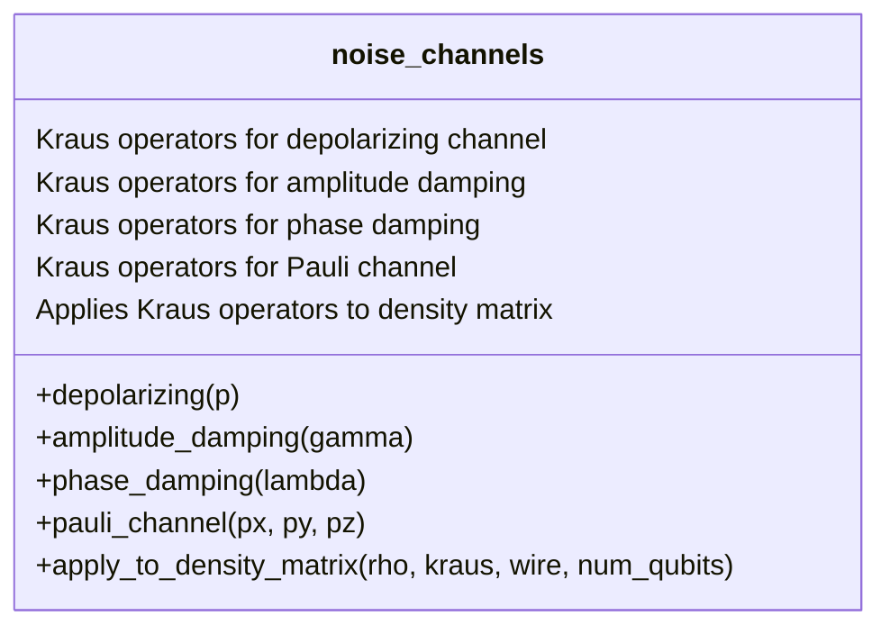
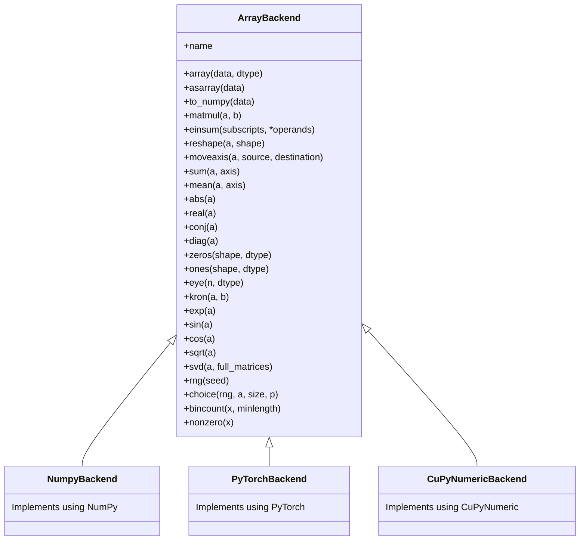
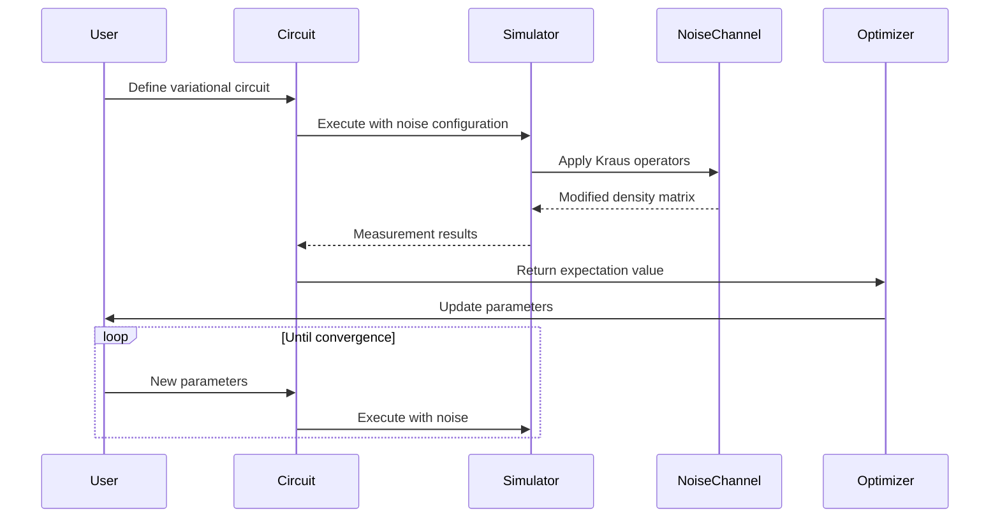
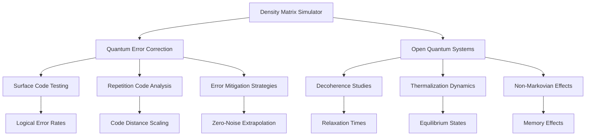

# Density Matrix Simulator

<cite>
**Referenced Files in This Document**   
- [engine.py](file://src/tyxonq/devices/simulators/density_matrix/engine.py)
- [channels.py](file://src/tyxonq/devices/simulators/noise/channels.py)
- [cupynumeric_backend.py](file://src/tyxonq/numerics/backends/cupynumeric_backend.py)
- [numpy_backend.py](file://src/tyxonq/numerics/backends/numpy_backend.py)
- [pytorch_backend.py](file://src/tyxonq/numerics/backends/pytorch_backend.py)
- [noise_controls_demo.py](file://examples/noise_controls_demo.py)
- [vqe_noisyopt.py](file://examples/vqe_noisyopt.py)
</cite>

## Table of Contents
1. [Introduction](#introduction)
2. [Core Engine Implementation](#core-engine-implementation)
3. [Noise Channel Integration](#noise-channel-integration)
4. [Numerics Backend System](#numerics-backend-system)
5. [Configuration Options](#configuration-options)
6. [Noisy Variational Workflows](#noisy-variational-workflows)
7. [Performance Characteristics](#performance-characteristics)
8. [Use Cases](#use-cases)

## Introduction
The Density Matrix Simulator provides a framework for simulating mixed quantum states using density matrices. This approach enables accurate modeling of open quantum systems and noise effects through Kraus operator formalism. The simulator supports various noise models including depolarizing, amplitude damping, phase damping, and general Pauli channels. It integrates with multiple numerical backends (NumPy, PyTorch, CuPyNumeric) for flexible computation across CPU and GPU platforms. The system is designed for quantum error correction studies, open quantum system simulations, and noisy variational quantum algorithms.

## Core Engine Implementation

The density matrix simulator engine implements mixed-state quantum simulation through dense matrix representation. The core class `DensityMatrixEngine` manages the simulation workflow from circuit execution to measurement processing.

```mermaid
classDiagram
class DensityMatrixEngine {
+str name
+dict capabilities
+backend
+__init__(backend_name)
+run(circuit, shots, **kwargs)
+expval(circuit, obs, **kwargs)
+_apply_noise_if_any(rho, noise, wires, n)
+_project_z(rho, qubit, keep, n)
}
DensityMatrixEngine --> "1" "N" init_density : initializes
DensityMatrixEngine --> "1" "N" apply_1q_density : applies
DensityMatrixEngine --> "1" "N" apply_2q_density : applies
DensityMatrixEngine --> "1" "N" exp_z_density : computes
DensityMatrixEngine --> "1" "1" noise_channels : uses
```

**Diagram sources**
- [engine.py](file://src/tyxonq/devices/simulators/density_matrix/engine.py#L31-L205)

**Section sources**
- [engine.py](file://src/tyxonq/devices/simulators/density_matrix/engine.py#L1-L208)

## Noise Channel Integration

The simulator integrates noise channels through Kraus operator formalism, with noise models defined in the channels module. Each noise type generates corresponding Kraus operators that are applied to the density matrix during simulation.



**Diagram sources**
- [channels.py](file://src/tyxonq/devices/simulators/noise/channels.py#L6-L61)

**Section sources**
- [channels.py](file://src/tyxonq/devices/simulators/noise/channels.py#L1-L64)
- [engine.py](file://src/tyxonq/devices/simulators/density_matrix/engine.py#L150-L185)

## Numerics Backend System

The numerics backend system provides a unified interface for array operations across different computational frameworks. This abstraction enables seamless switching between NumPy, PyTorch, and CuPyNumeric backends.



**Diagram sources**
- [numpy_backend.py](file://src/tyxonq/numerics/backends/numpy_backend.py#L1-L165)
- [pytorch_backend.py](file://src/tyxonq/numerics/backends/pytorch_backend.py#L1-L259)
- [cupynumeric_backend.py](file://src/tyxonq/numerics/backends/cupynumeric_backend.py#L1-L255)

**Section sources**
- [numpy_backend.py](file://src/tyxonq/numerics/backends/numpy_backend.py#L1-L165)
- [pytorch_backend.py](file://src/tyxonq/numerics/backends/pytorch_backend.py#L1-L259)
- [cupynumeric_backend.py](file://src/tyxonq/numerics/backends/cupynumeric_backend.py#L1-L255)

## Configuration Options

The simulator supports configurable noise parameters and purification methods through keyword arguments. Noise strength, decoherence rates, and channel types can be specified at runtime.

| Configuration Parameter | Description | Default Value | Valid Range |
|------------------------|-------------|---------------|-------------|
| **type** | Noise channel type | None | "depolarizing", "amplitude_damping", "phase_damping", "pauli", "readout" |
| **p** | Depolarizing probability | 0.0 | [0.0, 1.0] |
| **gamma** | Amplitude damping rate | 0.0 | [0.0, 1.0] |
| **lambda** | Phase damping coefficient | 0.0 | [0.0, 1.0] |
| **px, py, pz** | Pauli channel probabilities | 0.0 | [0.0, 1.0] with px+py+pz ≤ 1.0 |
| **cals** | Readout calibration matrices | None | Dictionary of 2x2 matrices |
| **use_noise** | Enable noise simulation | False | True, False |

**Section sources**
- [engine.py](file://src/tyxonq/devices/simulators/density_matrix/engine.py#L50-L145)
- [channels.py](file://src/tyxonq/devices/simulators/noise/channels.py#L6-L61)

## Noisy Variational Workflows

The simulator supports noisy variational quantum algorithms through examples demonstrating noise-aware optimization. Two primary workflows are illustrated: noise control demonstration and noisy VQE optimization.



**Diagram sources**
- [noise_controls_demo.py](file://examples/noise_controls_demo.py#L1-L46)
- [vqe_noisyopt.py](file://examples/vqe_noisyopt.py#L1-L288)

**Section sources**
- [noise_controls_demo.py](file://examples/noise_controls_demo.py#L1-L46)
- [vqe_noisyopt.py](file://examples/vqe_noisyopt.py#L1-L288)

## Performance Characteristics

The density matrix simulator exhibits exponential scaling with system size, with memory requirements of O(4^N) and computational complexity of O(poly(gates)*4^N). Performance optimization techniques are implemented to mitigate these scaling challenges.

```mermaid
flowchart TD
A[Start Simulation] --> B{N-qubit System}
B --> C[Memory: O(4^N)]
B --> D[Time: O(poly(gates)*4^N)]
C --> E[Memory Optimization]
D --> F[Computational Optimization]
E --> G[Backend Selection]
E --> H[Data Type Optimization]
F --> I[Efficient Linear Algebra]
F --> J[Parallel Computation]
G --> K[Numpy for CPU]
G --> L[PyTorch for GPU]
G --> M[CuPyNumeric for Accelerated]
H --> N[complex64 vs complex128]
I --> O[Einstein Summation]
J --> P[Vectorized Operations]
```

**Diagram sources**
- [engine.py](file://src/tyxonq/devices/simulators/density_matrix/engine.py#L1-L208)
- [numpy_backend.py](file://src/tyxonq/numerics/backends/numpy_backend.py#L1-L165)
- [pytorch_backend.py](file://src/tyxonq/numerics/backends/pytorch_backend.py#L1-L259)

**Section sources**
- [engine.py](file://src/tyxonq/devices/simulators/density_matrix/engine.py#L1-L208)
- [numerics](file://src/tyxonq/numerics/backends/)

## Use Cases

The Density Matrix Simulator is particularly valuable for quantum error correction research and open quantum system studies. Its ability to model various noise channels makes it ideal for developing and testing error mitigation strategies.

### Quantum Error Correction
The simulator enables testing of quantum error correcting codes by applying controlled noise models and evaluating code performance under realistic conditions. Surface codes, repetition codes, and other QEC schemes can be validated against specific noise profiles.

### Open Quantum Systems
For open quantum system simulations, the density matrix formalism naturally captures system-environment interactions through Kraus operators. This allows researchers to study decoherence processes, thermalization, and non-Markovian dynamics.



**Diagram sources**
- [engine.py](file://src/tyxonq/devices/simulators/density_matrix/engine.py#L1-L208)
- [channels.py](file://src/tyxonq/devices/simulators/noise/channels.py#L1-L64)

**Section sources**
- [engine.py](file://src/tyxonq/devices/simulators/density_matrix/engine.py#L1-L208)
- [channels.py](file://src/tyxonq/devices/simulators/noise/channels.py#L1-L64)
- [vqe_noisyopt.py](file://examples/vqe_noisyopt.py#L1-L288)