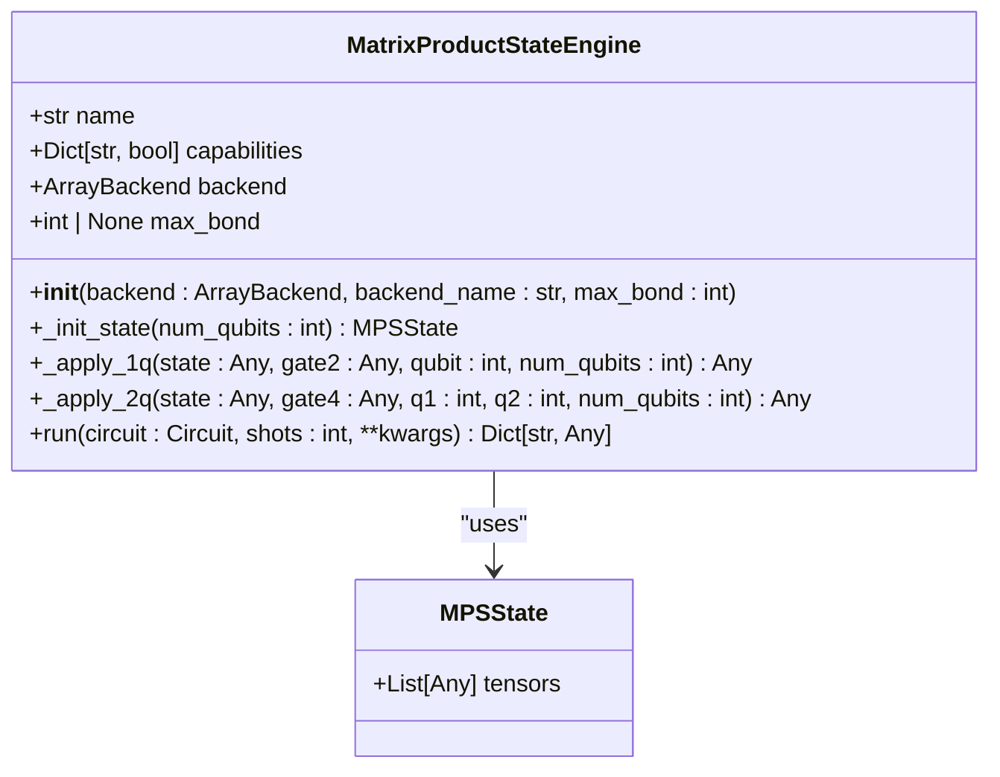
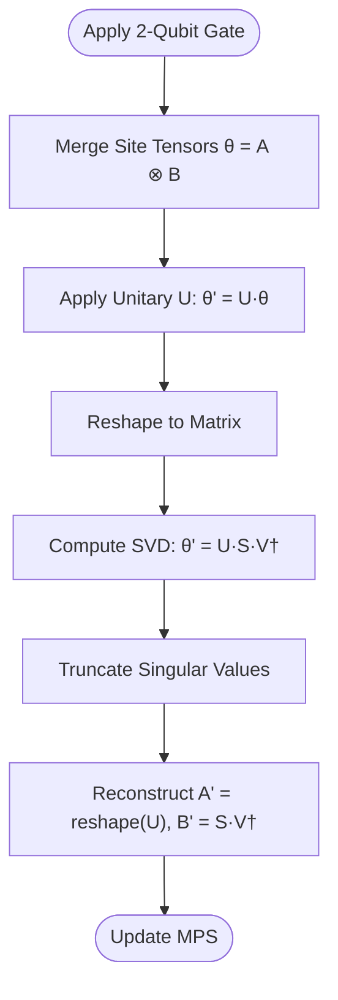

# Matrix Product State (MPS) Simulator

<cite>
**Referenced Files in This Document**   
- [engine.py](file://src/tyxonq/devices/simulators/matrix_product_state/engine.py)
- [matrix_product_state.py](file://src/tyxonq/libs/quantum_library/kernels/matrix_product_state.py)
- [mpsvsexact.py](file://examples-ng/mpsvsexact.py)
- [time_evolution.py](file://examples-ng/time_evolution.py)
- [cupynumeric_backend.py](file://src/tyxonq/numerics/backends/cupynumeric_backend.py)
</cite>

## Table of Contents
1. [Introduction](#introduction)
2. [Core Components](#core-components)
3. [Tensor Network Representation](#tensor-network-representation)
4. [Bond Dimension Truncation and Entanglement Management](#bond-dimension-truncation-and-entanglement-management)
5. [Configuration Parameters](#configuration-parameters)
6. [Numerics Backend Integration](#numerics-backend-integration)
7. [Quantum Library MPS Kernels](#quantum-library-mps-kernels)
8. [Practical Examples from examples-ng](#practical-examples-from-examples-ng)
9. [Accuracy vs. Performance Trade-offs](#accuracy-vs-performance-trade-offs)
10. [Optimization Strategies](#optimization-strategies)
11. [Use Cases and Advantages](#use-cases-and-advantages)

## Introduction
The Matrix Product State (MPS) Simulator is a quantum circuit simulation engine designed to efficiently simulate quantum systems with limited entanglement by representing the quantum state as a tensor network. This approach enables the simulation of larger qubit systems than possible with full statevector methods, particularly when entanglement remains bounded. The simulator leverages bond dimension truncation to control computational complexity and integrates with high-performance numerics backends such as CuPyNumeric for GPU-accelerated computation. It supports key quantum operations including single- and two-qubit gates, measurement, and noise-aware evolution, making it suitable for deep circuits and time evolution simulations.

## Core Components

The MPS Simulator is implemented across several core components that handle state representation, gate application, and backend integration. The primary engine orchestrates circuit execution using tensor network operations, while kernel functions manage low-level MPS manipulations.

**Section sources**
- [engine.py](file://src/tyxonq/devices/simulators/matrix_product_state/engine.py#L1-L212)
- [matrix_product_state.py](file://src/tyxonq/libs/quantum_library/kernels/matrix_product_state.py#L1-L234)

## Tensor Network Representation

The simulator represents the quantum state using a Matrix Product State (MPS), a one-dimensional tensor network where each qubit is associated with a site tensor of shape (Dl, 2, Dr). Here, Dl and Dr denote the left and right bond dimensions, respectively, and the physical index of size 2 corresponds to the qubit's |0⟩ and |1⟩ states. This decomposition allows the state to be stored efficiently when entanglement between subsystems is low, as the bond dimensions remain small.

The MPS structure is managed by the `MPSState` class, which holds a list of tensors and supports operations such as initialization, gate application, and state reconstruction. The initial state is typically prepared as a product state (e.g., |0...0⟩) with unit bond dimensions, ensuring minimal memory usage at the start of simulation.



**Diagram sources**
- [matrix_product_state.py](file://src/tyxonq/libs/quantum_library/kernels/matrix_product_state.py#L36-L43)
- [engine.py](file://src/tyxonq/devices/simulators/matrix_product_state/engine.py#L34-L209)

**Section sources**
- [matrix_product_state.py](file://src/tyxonq/libs/quantum_library/kernels/matrix_product_state.py#L36-L43)
- [engine.py](file://src/tyxonq/devices/simulators/matrix_product_state/engine.py#L34-L209)

## Bond Dimension Truncation and Entanglement Management

During circuit execution, two-qubit gates increase entanglement, which manifests as growth in bond dimensions. To prevent exponential scaling, the simulator applies Singular Value Decomposition (SVD) after each gate operation, optionally truncating the resulting singular values based on user-defined criteria.

The `apply_2q_nn` function performs nearest-neighbor two-qubit gate application with SVD recompression. It merges adjacent site tensors, applies the gate, reshapes into a matrix, and computes the SVD. The `_truncate_svd` utility then enforces two truncation policies:
- **Hard cutoff via `max_bond`**: Limits the bond dimension to a specified maximum.
- **Threshold-based cutoff via `svd_cutoff`**: Discards singular values below a given threshold.

For non-nearest-neighbor gates, the `apply_2q` function uses SWAP operations to bring qubits into adjacency before applying the gate, then reverses the SWAPs to restore the original ordering. This routing mechanism ensures full connectivity while preserving the MPS structure.



**Diagram sources**
- [matrix_product_state.py](file://src/tyxonq/libs/quantum_library/kernels/matrix_product_state.py#L100-L174)
- [matrix_product_state.py](file://src/tyxonq/libs/quantum_library/kernels/matrix_product_state.py#L175-L200)

**Section sources**
- [matrix_product_state.py](file://src/tyxonq/libs/quantum_library/kernels/matrix_product_state.py#L70-L200)

## Configuration Parameters

The simulator exposes several configuration parameters to control accuracy and performance:

- **`max_bond`**: Maximum allowed bond dimension. Setting this limits memory and computational cost but may reduce fidelity.
- **`svd_cutoff`**: Threshold for singular value truncation. Small singular values are discarded to compress the state.
- **`backend`**: Numerics backend (e.g., NumPy, PyTorch, CuPyNumeric) used for tensor operations.
- **`use_noise`**: Enables noise-aware simulation with depolarizing or readout noise models.

These parameters are passed during engine initialization and influence all subsequent operations. For example, setting `max_bond=50` ensures that no bond exceeds dimension 50, enabling simulation of deep circuits at the cost of potential approximation error.

**Section sources**
- [engine.py](file://src/tyxonq/devices/simulators/matrix_product_state/engine.py#L40-L45)

## Numerics Backend Integration

The MPS Simulator integrates with the numerics backend system to leverage optimized array operations. The `MatrixProductStateEngine` accepts a backend instance (e.g., `CuPyNumericBackend`) that provides implementations of operations such as `einsum`, `svd`, `reshape`, and `matmul`.

The `cupynumeric_backend.py` file defines the `CuPyNumericBackend` class, which enables GPU-accelerated computation by wrapping CuPyNumeric functions. This is particularly beneficial for large-scale simulations where tensor contractions dominate runtime. The backend abstraction allows seamless switching between CPU and GPU execution without modifying the core simulation logic.

```mermaid
graph TB
subgraph "MPS Simulator"
Engine[MatrixProductStateEngine]
MPSOps[MPS Kernels]
end
subgraph "Numerics Backend"
CuPyNumeric[CuPyNumericBackend]
NumPy[NumPyBackend]
PyTorch[PyTorchBackend]
end
Engine --> CuPyNumeric : "uses"
MPSOps --> CuPyNumeric : "uses"
CuPyNumeric --> GPU[(GPU Memory)]
```

**Diagram sources**
- [engine.py](file://src/tyxonq/devices/simulators/matrix_product_state/engine.py#L34-L209)
- [cupynumeric_backend.py](file://src/tyxonq/numerics/backends/cupynumeric_backend.py#L1-L256)

**Section sources**
- [cupynumeric_backend.py](file://src/tyxonq/numerics/backends/cupynumeric_backend.py#L1-L256)
- [engine.py](file://src/tyxonq/devices/simulators/matrix_product_state/engine.py#L34-L209)

## Quantum Library MPS Kernels

The `matrix_product_state.py` module in the quantum library provides low-level kernel functions for MPS manipulation. These include:
- `init_product_state`: Initializes an MPS in a computational basis state.
- `apply_1q`: Applies a single-qubit gate to a site tensor.
- `apply_2q_nn`: Applies a nearest-neighbor two-qubit gate with SVD compression.
- `to_statevector`: Reconstructs the full statevector for small systems (used in testing).
- `bond_dims`: Returns the bond dimensions of the MPS for monitoring entanglement.

These kernels are designed for clarity and minimal dependency, using only NumPy-like interfaces. The simulator engine wraps these functions and delegates heavy computations to the active numerics backend.

**Section sources**
- [matrix_product_state.py](file://src/tyxonq/libs/quantum_library/kernels/matrix_product_state.py#L1-L234)

## Practical Examples from examples-ng

The `examples-ng` directory contains practical demonstrations of the MPS Simulator:

- **`mpsvsexact.py`**: Compares MPS simulation against exact statevector results for a 15-qubit, 20-layer circuit. It evaluates energy expectation values and fidelity across varying bond dimensions (2 to 100), illustrating the trade-off between accuracy and computational cost.
- **`time_evolution.py`**: Benchmarks time evolution under a Heisenberg Hamiltonian using different methods, including matrix exponentiation and ODE solvers. While not MPS-specific, it demonstrates integration with the numerics backend for large-scale simulations.

These examples highlight the use of `MPSCircuit` with `set_split_rules` to configure bond dimension limits and show how estimated fidelity correlates with real fidelity when bond truncation is applied.

**Section sources**
- [mpsvsexact.py](file://examples-ng/mpsvsexact.py#L1-L91)
- [time_evolution.py](file://examples-ng/time_evolution.py#L1-L74)

## Accuracy vs. Performance Trade-offs

The primary trade-off in MPS simulation is between accuracy and performance, governed by the maximum bond dimension and truncation threshold. Higher bond dimensions preserve more entanglement and yield more accurate results but increase memory and time complexity quadratically with bond size.

The `mpsvsexact.py` example demonstrates this by showing that energy estimates converge to exact values as bond dimension increases. For shallow circuits or low-entanglement states, even small bond dimensions (e.g., 10–20) can achieve high fidelity. However, deep circuits or those generating high entanglement may require larger bonds or suffer from approximation errors.

Additionally, the use of `svd_cutoff` allows adaptive compression, where only significant singular values are retained. This can improve performance without substantial loss of accuracy in many practical scenarios.

**Section sources**
- [mpsvsexact.py](file://examples-ng/mpsvsexact.py#L50-L91)

## Optimization Strategies

To optimize tensor contractions in the MPS Simulator, the following strategies are recommended:

- **Use `opt-einsum`**: The simulator relies on `einsum` for tensor contractions. Integrating `opt-einsum` can automatically find optimal contraction paths, reducing computational overhead.
- **Leverage GPU acceleration**: Use the `CuPyNumericBackend` for large-scale simulations to exploit GPU parallelism in tensor operations.
- **Minimize SWAP routing**: Design circuits with nearest-neighbor interactions when possible to avoid costly SWAP-based routing.
- **Batch operations**: When simulating parameterized circuits, vectorize over parameters using `vmap` or similar constructs to amortize setup costs.

These optimizations can significantly reduce simulation time, especially for variational algorithms involving repeated circuit evaluations.

**Section sources**
- [cupynumeric_backend.py](file://src/tyxonq/numerics/backends/cupynumeric_backend.py#L1-L256)
- [engine.py](file://src/tyxonq/devices/simulators/matrix_product_state/engine.py#L100-L150)

## Use Cases and Advantages

The MPS Simulator excels in scenarios where entanglement is bounded or grows slowly, such as:
- **1D quantum circuits** with local interactions.
- **Time evolution** under local Hamiltonians (e.g., Heisenberg model).
- **Variational algorithms** like VQE with shallow entangling layers.
- **Noisy intermediate-scale quantum (NISQ)** simulations where decoherence limits entanglement.

Compared to full statevector simulation, MPS offers exponential memory savings when bond dimensions are small. For example, a 50-qubit system with max bond dimension 100 requires only ~10^5 complex numbers per site, far less than the 2^50 ≈ 10^15 elements needed for a full statevector.

Thus, the MPS Simulator enables the study of quantum systems beyond the reach of exact methods, making it a powerful tool for research and development in quantum computing.

**Section sources**
- [mpsvsexact.py](file://examples-ng/mpsvsexact.py#L1-L91)
- [time_evolution.py](file://examples-ng/time_evolution.py#L1-L74)
- [engine.py](file://src/tyxonq/devices/simulators/matrix_product_state/engine.py#L1-L212)