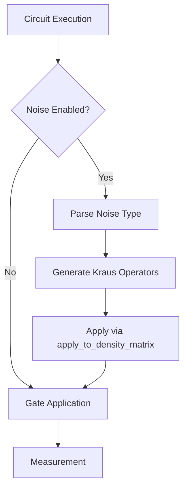

# Noise Modeling and Channels

<cite>
**Referenced Files in This Document**   
- [channels.py](file://src/tyxonq/devices/simulators/noise/channels.py)
- [noise_calibration.py](file://examples-ng/noise_calibration.py)
- [noisy_qml.py](file://examples-ng/noisy_qml.py)
- [noise_controls_demo.py](file://examples/noise_controls_demo.py)
- [engine.py](file://src/tyxonq/devices/simulators/density_matrix/engine.py)
</cite>

## Table of Contents
1. [Introduction](#introduction)
2. [Supported Quantum Channels](#supported-quantum-channels)
3. [Integration with Simulators](#integration-with-simulators)
4. [Noise Model Construction and Calibration](#noise-model-construction-and-calibration)
5. [Usage Patterns and Examples](#usage-patterns-and-examples)
6. [Common Challenges and Best Practices](#common-challenges-and-best-practices)

## Introduction
TyxonQ provides a comprehensive noise modeling framework centered on the `channels.py` module, enabling realistic simulation of quantum circuits under various noise conditions. This document details the supported quantum channels, their integration into density matrix and matrix product state (MPS) simulators, and practical workflows for constructing and calibrating noise models. The system supports both global and device-level noise configuration, facilitating robustness testing, error mitigation benchmarking, and hardware-aware algorithm development.

**Section sources**
- [channels.py](file://src/tyxonq/devices/simulators/noise/channels.py#L1-L61)
- [noise_controls_demo.py](file://examples/noise_controls_demo.py#L1-L46)

## Supported Quantum Channels

### Depolarizing Channel
The depolarizing channel models isotropic noise where the qubit state is replaced with the maximally mixed state with probability $ p $. The Kraus operators are:
- $ K_0 = \sqrt{1-p} \cdot I $
- $ K_1 = \sqrt{p/3} \cdot X $
- $ K_2 = \sqrt{p/3} \cdot Y $
- $ K_3 = \sqrt{p/3} \cdot Z $

This channel uniformly mixes the Pauli errors and is parameterized by a single depolarization probability $ p \in [0,1] $.

### Amplitude Damping Channel
The amplitude damping channel models energy dissipation in a qubit, such as spontaneous emission from the excited state $|1\rangle$ to the ground state $|0\rangle$. It is parameterized by damping rate $ \gamma \in [0,1] $ with Kraus operators:
- $ K_0 = \begin{bmatrix}1 & 0 \\ 0 & \sqrt{1-\gamma}\end{bmatrix} $
- $ K_1 = \begin{bmatrix}0 & \sqrt{\gamma} \\ 0 & 0\end{bmatrix} $

This channel captures T1 relaxation processes in superconducting qubits.

### Phase Damping Channel
The phase damping channel models pure dephasing without energy loss, capturing T2* processes. Parameterized by $ \lambda \in [0,1] $, its Kraus operators are:
- $ K_0 = \begin{bmatrix}1 & 0 \\ 0 & \sqrt{1-\lambda}\end{bmatrix} $
- $ K_1 = \begin{bmatrix}0 & 0 \\ 0 & \sqrt{\lambda}\end{bmatrix} $

This channel reduces coherence between $|0\rangle$ and $|1\rangle$ states.

### Pauli Channel
The Pauli channel generalizes independent X, Y, and Z errors with probabilities $ p_x, p_y, p_z $. The survival probability is $ p_0 = 1 - (p_x + p_y + p_z) $, with Kraus operators:
- $ K_0 = \sqrt{p_0} \cdot I $
- $ K_1 = \sqrt{p_x} \cdot X $
- $ K_2 = \sqrt{p_y} \cdot Y $
- $ K_3 = \sqrt{p_z} \cdot Z $

This allows asymmetric noise modeling reflecting real device characteristics.

**Section sources**
- [channels.py](file://src/tyxonq/devices/simulators/noise/channels.py#L6-L40)

## Integration with Simulators

### Density Matrix Simulator
The density matrix simulator natively supports Kraus channel application through direct matrix operations. The `apply_to_density_matrix` function uses tensor contraction via `einsum` to apply noise operators to specific qubits within the full density matrix $ \rho $. The simulator engine processes noise configurations by:
1. Parsing the noise type and parameters from the configuration dictionary
2. Generating corresponding Kraus operators using functions from `channels.py`
3. Applying the noise to specified wires during circuit execution

**Diagram sources**
- [channels.py](file://src/tyxonq/devices/simulators/noise/channels.py#L43-L61)
- [engine.py](file://src/tyxonq/devices/simulators/density_matrix/engine.py#L167-L194)

### Matrix Product State (MPS) Simulator
While not detailed in the provided code, the MPS simulator supports noise through compressed representations, enabling simulation of larger systems with noise at the cost of approximation. The integration follows similar patterns to the density matrix simulator but operates on tensor network representations.

**Section sources**
- [engine.py](file://src/tyxonq/devices/simulators/density_matrix/engine.py#L167-L194)

## Noise Model Construction and Calibration

### Global and Device-Level Control
TyxonQ provides both global and per-device noise configuration:
- `enable_noise(enabled, config)`: Sets global noise configuration
- `is_noise_enabled()`: Checks global noise status
- `get_noise_config()`: Retrieves current noise configuration
- Device-level `use_noise` and `noise` parameters override global settings

This hierarchical control enables flexible experimentation with different noise scenarios.

### Thermal Relaxation Calibration
The `noise_calibration.py` example demonstrates systematic calibration of T1 and T2 relaxation times:
1. **T1 Calibration**: Prepare excited state and measure population decay over time delays
2. **T2 Calibration**: Use Hahn echo sequence to measure coherence decay
3. **Curve Fitting**: Fit exponential decay models to extract T1/T2 parameters

The calibration workflow uses `DMCircuit` for density matrix simulation and `curve_fit` for parameter estimation, enabling validation against hardware data.

### Readout Error Mitigation
The framework includes readout error characterization and mitigation:
1. **Calibration Matrix Construction**: Measure all computational basis states
2. **Inversion Method**: Apply matrix inversion to recover ideal probabilities
3. **Constrained Optimization**: Use quadratic programming for physically valid results

This enables error mitigation in both simulation and hardware execution contexts.

**Section sources**
- [noise_calibration.py](file://examples-ng/noise_calibration.py#L1-L214)
- [noise_controls_demo.py](file://examples/noise_controls_demo.py#L1-L46)

## Usage Patterns and Examples

### Layer-Wise Noise Assignment
The `noisy_qml.py` example demonstrates Monte Carlo noise simulation with vmapped execution:
- Noise parameters are broadcast across circuit layers
- Random seeds enable reproducible stochastic noise application
- Vectorized execution across noise realizations enables statistical analysis

This pattern supports robust quantum machine learning with noise-aware training.

### Custom Noise Models
Users can construct custom noise models by:
1. Defining noise dictionaries with type and parameters
2. Applying noise at circuit construction or execution time
3. Combining multiple noise channels for composite models

The framework supports both gate-level and measurement-level noise injection.

### Benchmarking and Validation
Examples demonstrate:
- Comparison of noisy vs. noiseless execution
- Error mitigation effectiveness
- Robustness testing under varying noise levels
- Hardware fidelity estimation

These workflows enable systematic evaluation of algorithm performance under realistic conditions.

**Section sources**
- [noisy_qml.py](file://examples-ng/noisy_qml.py#L1-L227)
- [noise_controls_demo.py](file://examples/noise_controls_demo.py#L1-L46)

## Common Challenges and Best Practices

### Noise Model Overfitting
Avoid overfitting by:
- Using physically motivated noise parameters
- Validating against multiple circuit types
- Employing cross-validation techniques
- Regularizing noise parameters in calibration

### Simulation Slowdown
Mitigate performance issues by:
- Using MPS simulator for large systems
- Limiting noise to critical circuit sections
- Employing Monte Carlo sampling instead of full density matrix simulation
- Utilizing JIT compilation and vectorization

### Validation Against Hardware
Ensure realism through:
- Calibrating parameters from device characterization data
- Comparing simulation results with hardware execution
- Using device-specific noise profiles
- Incorporating temporal and spatial noise variations

### Balancing Realism and Feasibility
Best practices include:
- Starting with simple noise models and increasing complexity gradually
- Focusing noise modeling on bottleneck operations
- Using noise-aware compilation to reduce error impact
- Combining simulation with analytical error bounds

**Section sources**
- [noise_calibration.py](file://examples-ng/noise_calibration.py#L1-L214)
- [noisy_qml.py](file://examples-ng/noisy_qml.py#L1-L227)