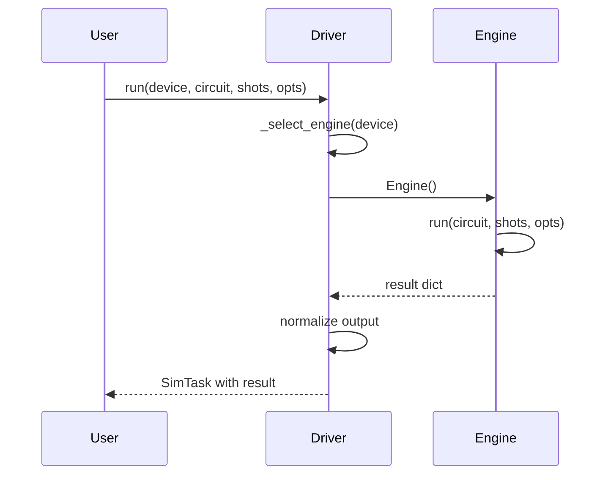
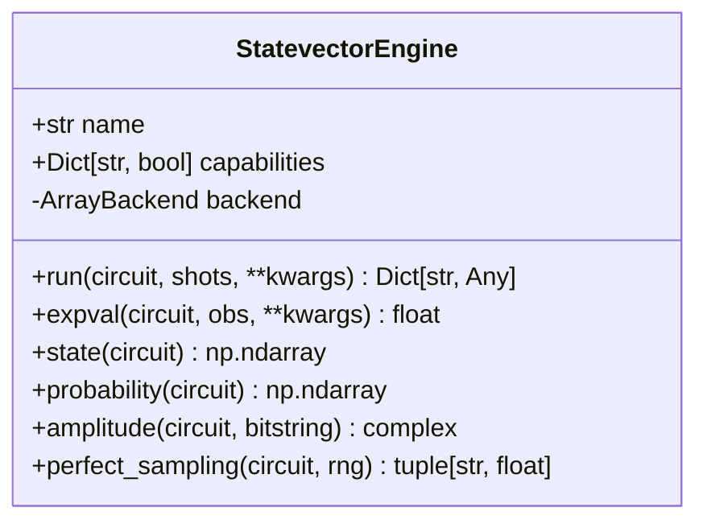
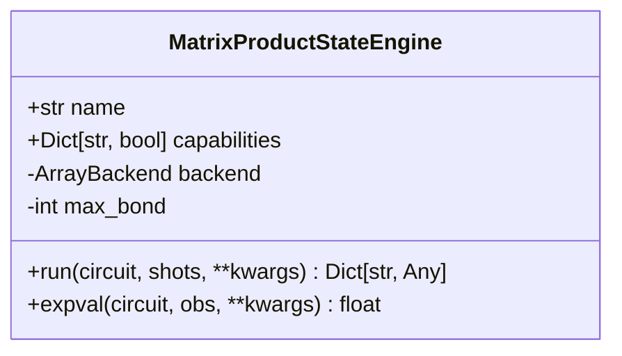
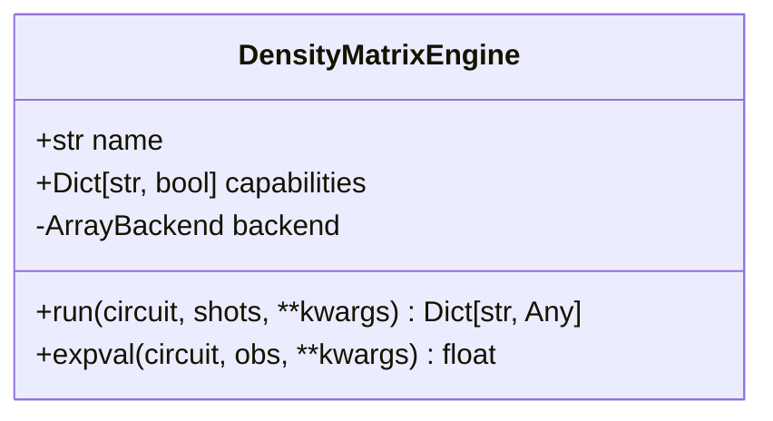
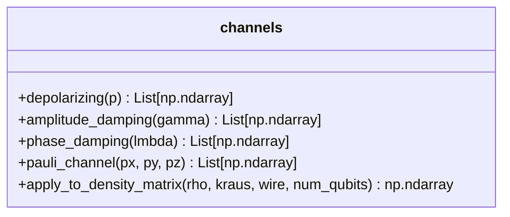
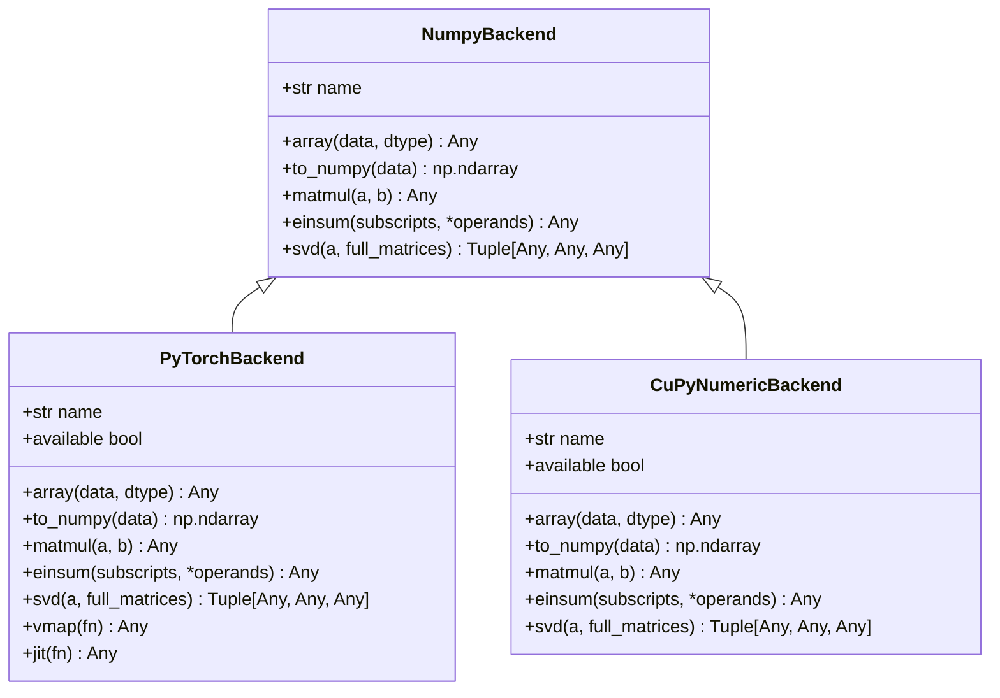
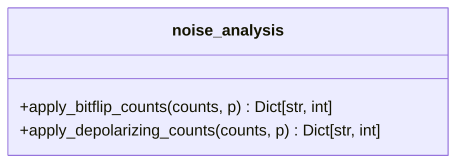
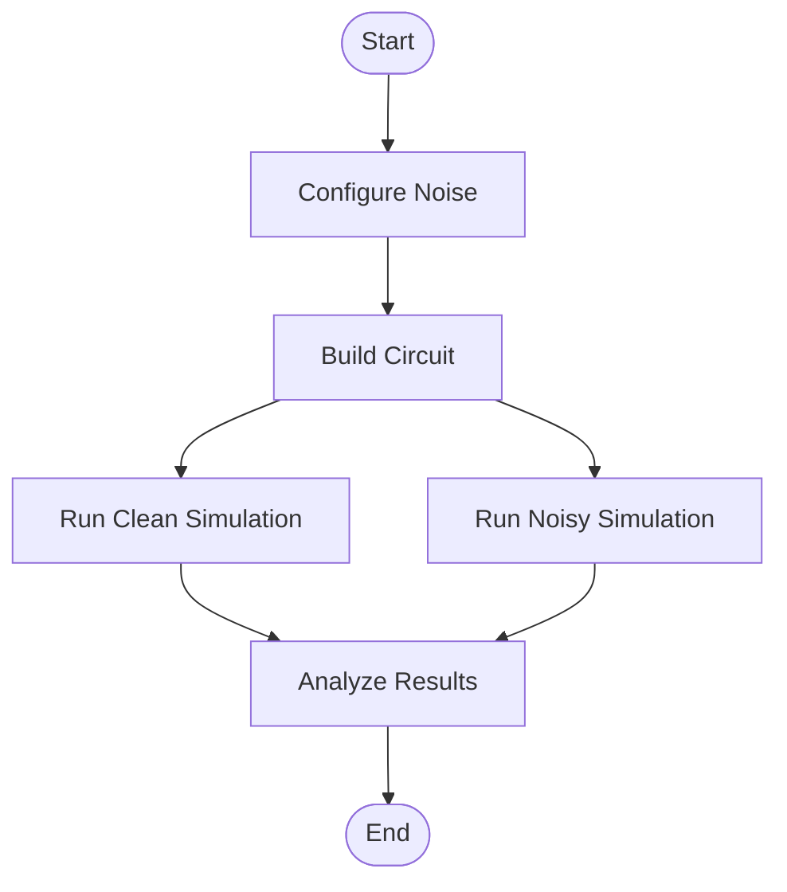

# Simulators

<cite>
**Referenced Files in This Document**   
- [driver.py](file://src/tyxonq/devices/simulators/driver.py)
- [statevector/engine.py](file://src/tyxonq/devices/simulators/statevector/engine.py)
- [matrix_product_state/engine.py](file://src/tyxonq/devices/simulators/matrix_product_state/engine.py)
- [density_matrix/engine.py](file://src/tyxonq/devices/simulators/density_matrix/engine.py)
- [noise/channels.py](file://src/tyxonq/devices/simulators/noise/channels.py)
- [numpy_backend.py](file://src/tyxonq/numerics/backends/numpy_backend.py)
- [pytorch_backend.py](file://src/tyxonq/numerics/backends/pytorch_backend.py)
- [cupynumeric_backend.py](file://src/tyxonq/numerics/backends/cupynumeric_backend.py)
- [noise_analysis.py](file://src/tyxonq/postprocessing/noise_analysis.py)
- [noise_controls_demo.py](file://examples/noise_controls_demo.py)
- [vqe_noisyopt.py](file://examples/vqe_noisyopt.py)
- [vqe_shot_noise.py](file://examples/vqe_shot_noise.py)
</cite>

## Table of Contents
1. [Introduction](#introduction)
2. [Simulator Driver Interface and Execution Workflow](#simulator-driver-interface-and-execution-workflow)
3. [Statevector Simulator](#statevector-simulator)
4. [Matrix Product State (MPS) Simulator](#matrix-product-state-mps-simulator)
5. [Density Matrix Simulator](#density-matrix-simulator)
6. [Noise Channels Module](#noise-channels-module)
7. [Numerics Backend Integration](#numerics-backend-integration)
8. [Postprocessing Layer Integration](#postprocessing-layer-integration)
9. [Configuration Parameters](#configuration-parameters)
10. [Usage Examples](#usage-examples)
11. [Conclusion](#conclusion)

## Introduction
TyxonQ provides a suite of quantum simulators designed for different use cases and computational requirements. This document details the implementation and usage of three core simulators: the Statevector simulator for exact pure-state simulation, the Matrix Product State (MPS) simulator for efficient simulation of low-entanglement circuits, and the Density Matrix simulator for modeling mixed states and realistic noise. The simulators are unified under a common driver interface and support integration with various numerics backends and postprocessing tools. This documentation covers the architecture, configuration, and practical usage of these components.

## Simulator Driver Interface and Execution Workflow
The simulator driver provides a unified entry point for executing quantum circuits across different simulation backends. It abstracts the selection and initialization of specific simulator engines based on the requested device.

**Diagram sources**  
- [driver.py](file://src/tyxonq/devices/simulators/driver.py#L66-L113)
- [driver.py](file://src/tyxonq/devices/simulators/driver.py#L17-L64)

The `run` function in `driver.py` serves as the primary interface, accepting a device identifier, quantum circuit, shot count, and optional parameters. It delegates to the appropriate engine based on the device name (e.g., "simulator::statevector", "simulator::mps"). The driver normalizes outputs into a standard format containing counts, expectations, probabilities, statevectors, and metadata. The `SimTask` class encapsulates results and provides a consistent interface for task management, though simulator tasks are always immediately available.

**Section sources**  
- [driver.py](file://src/tyxonq/devices/simulators/driver.py#L6-L141)

## Statevector Simulator
The Statevector simulator represents quantum states as dense complex vectors of size 2^n, enabling exact simulation of pure states for small to medium-sized systems.

**Diagram sources**  
- [statevector/engine.py](file://src/tyxonq/devices/simulators/statevector/engine.py#L31-L261)

The `StatevectorEngine` class implements the core simulation logic, supporting gates such as H, RZ, RX, CX, and measurement operations. It integrates with the numerics backend system through `get_backend` and uses optimized gate kernels from `libs.quantum_library.kernels.gates`. For shot-based simulations, it samples from the probability distribution derived from the statevector. When noise is enabled via the `use_noise` parameter, it applies depolarizing noise by attenuating Z-expectation values. The engine also provides helper methods for accessing the final statevector, probabilities, amplitudes, and performing perfect sampling.

**Section sources**  
- [statevector/engine.py](file://src/tyxonq/devices/simulators/statevector/engine.py#L1-L265)

## Matrix Product State (MPS) Simulator
The MPS simulator represents quantum states as matrix product states, enabling efficient simulation of large systems with limited entanglement by controlling the maximum bond dimension.

**Diagram sources**  
- [matrix_product_state/engine.py](file://src/tyxonq/devices/simulators/matrix_product_state/engine.py#L34-L209)

The `MatrixProductStateEngine` class implements MPS-based simulation with support for 1-qubit and 2-qubit gates. It uses SWAP routing for non-local gates and allows bond dimension truncation through the `max_bond` parameter, which caps the maximum bond dimension during 2-qubit gate application. This truncation enables simulation of larger systems at the cost of approximation accuracy. The engine reconstructs the full statevector when necessary for measurement or sampling, making it suitable for circuits with low entanglement. Noise is modeled similarly to the statevector simulator through expectation value attenuation.

**Section sources**  
- [matrix_product_state/engine.py](file://src/tyxonq/devices/simulators/matrix_product_state/engine.py#L1-L213)

## Density Matrix Simulator
The Density Matrix simulator represents quantum states as 2^n × 2^n density matrices, enabling simulation of mixed states and realistic noise channels through Kraus operator formalism.

**Diagram sources**  
- [density_matrix/engine.py](file://src/tyxonq/devices/simulators/density_matrix/engine.py#L31-L205)

The `DensityMatrixEngine` class implements density matrix evolution using Kraus operators for noise channels. It natively supports depolarizing, amplitude damping, phase damping, and Pauli noise channels through integration with the noise module. Noise is applied after each gate operation via the `_apply_noise_if_any` method, which uses Kraus operators to transform the density matrix. This approach provides physically accurate noise modeling at the cost of higher computational complexity (O(4^n) memory). The engine supports both shot-based sampling from the diagonal of the density matrix and analytic expectation value computation.

**Section sources**  
- [density_matrix/engine.py](file://src/tyxonq/devices/simulators/density_matrix/engine.py#L1-L209)

## Noise Channels Module
The noise module provides implementations of common quantum noise channels using the Kraus operator formalism, enabling realistic modeling of decoherence and gate errors.

**Diagram sources**  
- [noise/channels.py](file://src/tyxonq/devices/simulators/noise/channels.py#L1-L65)

The `channels.py` module defines functions for generating Kraus operators for various noise models: depolarizing noise (equal probability of X, Y, Z errors), amplitude damping (energy relaxation), phase damping (dephasing), and general Pauli channels. The `apply_to_density_matrix` function applies these operators to a density matrix at specified qubit locations using tensor network contractions via `einsum`. This modular design allows easy extension with additional noise channels. The density matrix simulator uses these functions directly for physical noise simulation, while other simulators use simplified noise models.

**Section sources**  
- [noise/channels.py](file://src/tyxonq/devices/simulators/noise/channels.py#L1-L65)

## Numerics Backend Integration
The simulators integrate with a pluggable numerics backend system that supports multiple array libraries, enabling flexibility in computational resources and performance characteristics.

**Diagram sources**  
- [numpy_backend.py](file://src/tyxonq/numerics/backends/numpy_backend.py#L1-L166)
- [pytorch_backend.py](file://src/tyxonq/numerics/backends/pytorch_backend.py#L1-L260)
- [cupynumeric_backend.py](file://src/tyxonq/numerics/backends/cupynumeric_backend.py#L1-L256)

The backend system, located in `numerics/backends/`, provides a unified interface for array operations across NumPy, PyTorch, and CuPyNumeric. Each backend implements a common set of methods for array creation, linear algebra, tensor contractions, and random number generation. The `get_backend` function selects the appropriate backend based on name, allowing simulators to operate on CPU (NumPy), GPU (PyTorch), or accelerated hardware (CuPyNumeric). This abstraction enables seamless switching between backends without modifying simulator code. PyTorch backend additionally supports automatic differentiation and JIT compilation.

**Section sources**  
- [numpy_backend.py](file://src/tyxonq/numerics/backends/numpy_backend.py#L1-L166)
- [pytorch_backend.py](file://src/tyxonq/numerics/backends/pytorch_backend.py#L1-L260)
- [cupynumeric_backend.py](file://src/tyxonq/numerics/backends/cupynumeric_backend.py#L1-L256)

## Postprocessing Layer Integration
The postprocessing layer provides tools for analyzing simulation results, including noise mitigation techniques that can be applied to classical measurement outcomes.

**Diagram sources**  
- [noise_analysis.py](file://src/tyxonq/postprocessing/noise_analysis.py#L1-L106)

The `postprocessing` module includes utilities for classical postprocessing of measurement counts. The `noise_analysis.py` file provides functions to apply approximate noise models directly to counts dictionaries, enabling quick analysis of noise impact without re-simulation. `apply_bitflip_counts` models independent bit-flip errors, while `apply_depolarizing_counts` approximates depolarizing noise by mixing counts with the uniform distribution. These tools are useful for baseline comparisons and error mitigation studies. The postprocessing layer can be chained after simulation using the `.postprocessing()` method in the circuit API.

**Section sources**  
- [noise_analysis.py](file://src/tyxonq/postprocessing/noise_analysis.py#L1-L106)

## Configuration Parameters
Simulators support various configuration parameters that control accuracy, performance, and noise modeling. These parameters are passed as keyword arguments to the `run` method.

| Parameter | Default | Description | Applicable Simulators |
|---------|---------|-------------|---------------------|
| `shots` | 1024 | Number of measurement shots; 0 for analytic results | All |
| `use_noise` | False | Enable noise modeling | All |
| `noise` | None | Noise configuration dictionary | All |
| `backend_name` | None | Numerics backend ("numpy", "pytorch", "cupynumeric") | All |
| `max_bond` | None | Maximum bond dimension for MPS truncation | MPS only |
| `p` | 0.0 | Depolarizing error probability | All (when use_noise=True) |
| `gamma` | 0.0 | Amplitude damping rate | Density Matrix |
| `lambda` | 0.0 | Phase damping rate | Density Matrix |
| `cals` | None | Readout calibration matrices | All |

The `noise` parameter accepts a dictionary specifying the noise model type and parameters. For example, `{"type": "depolarizing", "p": 0.01}` configures 1% depolarizing noise. The `max_bond` parameter in the MPS simulator controls the trade-off between accuracy and memory usage, with larger values preserving more entanglement at higher computational cost.

**Section sources**  
- [statevector/engine.py](file://src/tyxonq/devices/simulators/statevector/engine.py#L31-L261)
- [matrix_product_state/engine.py](file://src/tyxonq/devices/simulators/matrix_product_state/engine.py#L34-L209)
- [density_matrix/engine.py](file://src/tyxonq/devices/simulators/density_matrix/engine.py#L31-L205)

## Usage Examples
The examples directory contains demonstrations of simulator usage with different backends and noise configurations.

**Diagram sources**  
- [noise_controls_demo.py](file://examples/noise_controls_demo.py#L1-L47)

The `noise_controls_demo.py` example demonstrates noise configuration and comparison between clean and noisy simulations. It shows how to enable global noise with `tq.enable_noise()` and override noise settings at the device level. The example runs the same circuit on the statevector simulator with and without noise, comparing the resulting Z-expectation values. This pattern illustrates the typical workflow: circuit construction, device configuration, execution, and result analysis.

The `vqe_noisyopt.py` and `vqe_shot_noise.py` examples demonstrate variational quantum algorithms with both exact (statevector) and finite-shot (counts-based) simulation paths. They show how to compute expectation values from measurement counts by grouping Pauli terms and applying appropriate basis rotations. These examples highlight the integration between simulation, postprocessing, and optimization libraries for practical quantum algorithm development.

**Section sources**  
- [noise_controls_demo.py](file://examples/noise_controls_demo.py#L1-L47)
- [vqe_noisyopt.py](file://examples/vqe_noisyopt.py#L1-L289)
- [vqe_shot_noise.py](file://examples/vqe_shot_noise.py#L1-L223)

## Conclusion
TyxonQ's simulator suite provides a comprehensive set of tools for quantum circuit simulation across different computational regimes. The Statevector simulator offers exact pure-state simulation for small systems, the MPS simulator enables efficient simulation of large, low-entanglement circuits through bond dimension control, and the Density Matrix simulator provides physically accurate noise modeling through Kraus operators. These simulators are unified under a common driver interface and integrate seamlessly with multiple numerics backends and postprocessing tools. The flexible configuration system allows users to control simulation accuracy, performance, and noise characteristics, making TyxonQ suitable for a wide range of quantum computing research and development tasks.