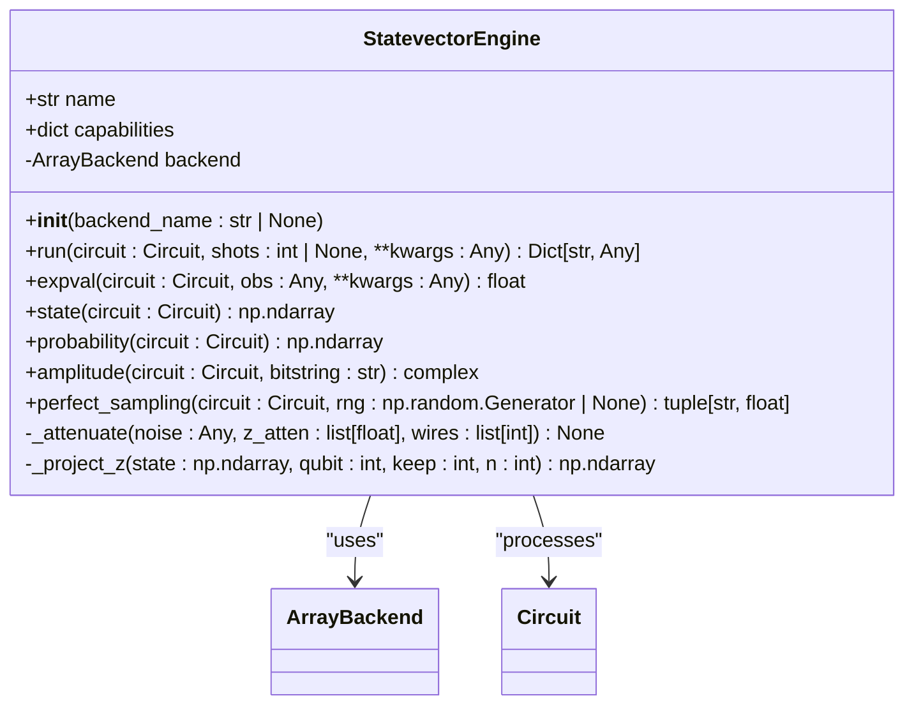
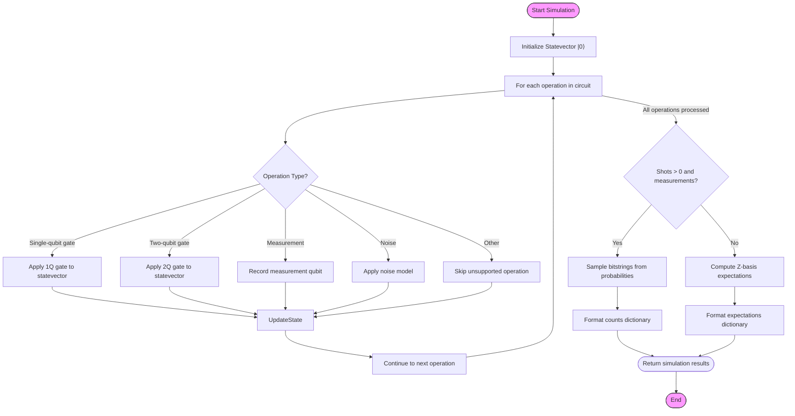
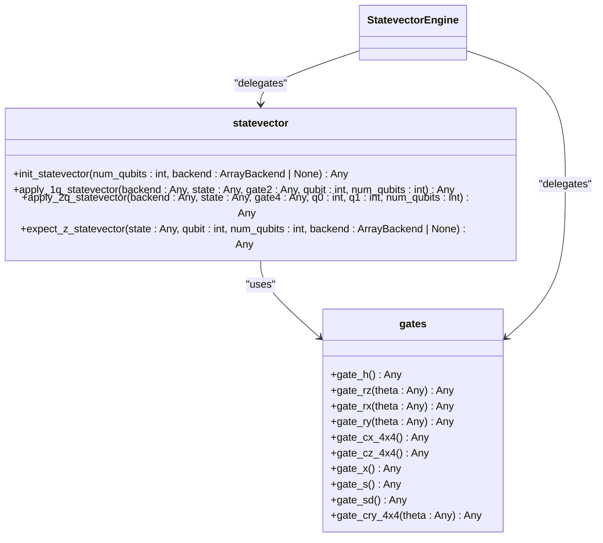
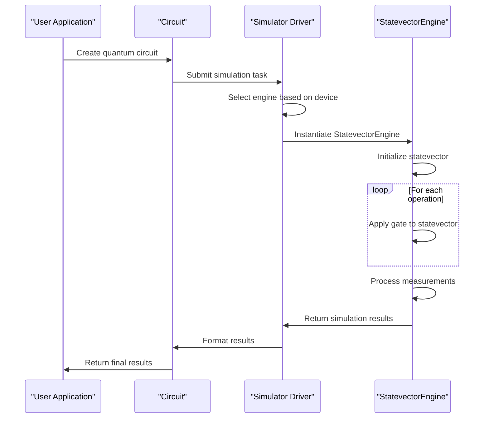
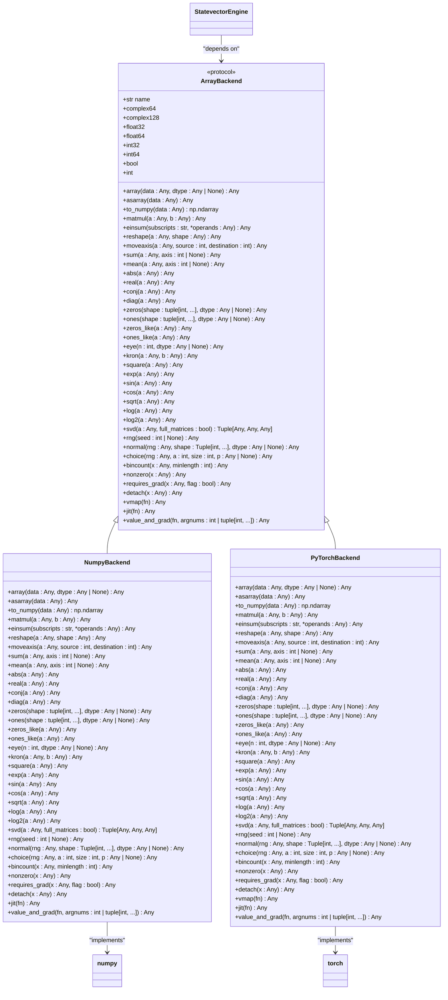
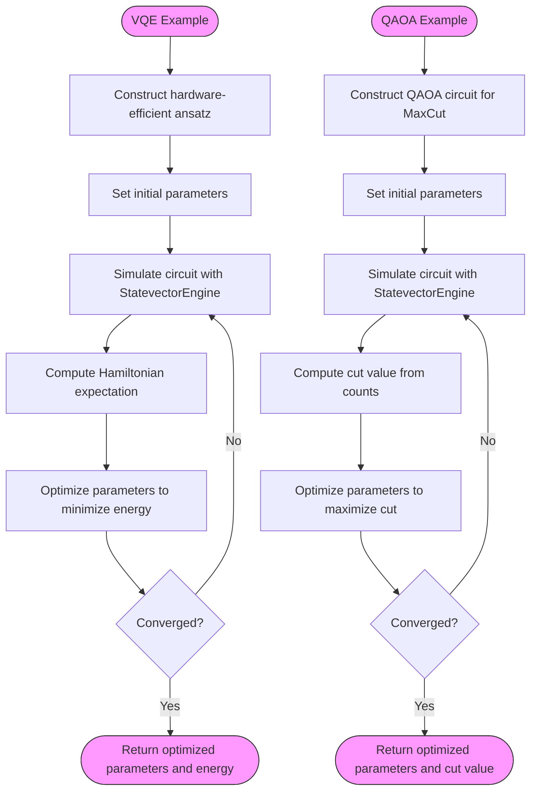

# Statevector Simulator

<cite>
**Referenced Files in This Document**   
- [engine.py](file://src/tyxonq/devices/simulators/statevector/engine.py)
- [statevector.py](file://src/tyxonq/libs/quantum_library/kernels/statevector.py)
- [gates.py](file://src/tyxonq/libs/quantum_library/kernels/gates.py)
- [pytorch_backend.py](file://src/tyxonq/numerics/backends/pytorch_backend.py)
- [numpy_backend.py](file://src/tyxonq/numerics/backends/numpy_backend.py)
- [api.py](file://src/tyxonq/numerics/api.py)
- [context.py](file://src/tyxonq/numerics/context.py)
- [vqe_extra.py](file://examples/vqe_extra.py)
- [simple_qaoa.py](file://examples/simple_qaoa.py)
</cite>

## Table of Contents
1. [Introduction](#introduction)
2. [Engine Implementation](#engine-implementation)
3. [Circuit Execution Workflow](#circuit-execution-workflow)
4. [State Propagation Methods](#state-propagation-methods)
5. [Integration with Base Simulator Driver](#integration-with-base-simulator-driver)
6. [Unified Numerics Backend](#unified-numerics-backend)
7. [Configuration Options](#configuration-options)
8. [Usage Examples](#usage-examples)
9. [Performance Considerations](#performance-considerations)
10. [Common Issues and Best Practices](#common-issues-and-best-practices)

## Introduction
The Statevector Simulator in TyxonQ is a full-state quantum circuit simulator that represents the quantum state as a dense complex vector of size 2^n, where n is the number of qubits. This simulator enables exact simulation of quantum circuits by maintaining and evolving the complete statevector through quantum operations. It supports a variety of quantum gates, measurement operations, noise models, and provides helper methods for state analysis. The simulator integrates with TyxonQ's unified numerics backend system, allowing execution with different computational backends such as NumPy and PyTorch, which enables both standard simulation and gradient-based optimization for variational quantum algorithms.

**Section sources**
- [engine.py](file://src/tyxonq/devices/simulators/statevector/engine.py#L1-L50)

## Engine Implementation
The Statevector Simulator is implemented as the `StatevectorEngine` class in the `engine.py` module. The engine follows a modular design that separates the simulation logic from the numerical computation backend. The core implementation provides a pluggable architecture where the numerical operations are delegated to a unified backend interface, allowing seamless switching between different computational frameworks. The engine supports a comprehensive set of quantum operations including single-qubit gates (h, rx, ry, rz, x, s, sdg), two-qubit gates (cx, cz, cry), measurement operations (measure_z), and state manipulation operations (project_z, reset). The implementation is optimized for performance while maintaining numerical accuracy, with careful attention to memory management and computational efficiency.

**Diagram sources **
- [engine.py](file://src/tyxonq/devices/simulators/statevector/engine.py#L31-L261)

**Section sources**
- [engine.py](file://src/tyxonq/devices/simulators/statevector/engine.py#L31-L261)

## Circuit Execution Workflow
The circuit execution workflow in the Statevector Simulator follows a systematic process that begins with circuit initialization and proceeds through gate application, measurement handling, and result generation. When a circuit is executed, the simulator first initializes the statevector to the |0⟩ state using the `init_statevector` function. It then iterates through each operation in the circuit, applying the corresponding unitary transformation to the statevector. For measurement operations, the simulator either returns sampled bitstrings when shots are specified or computes expectation values when shots are zero. The workflow supports both noisy and noiseless simulation modes, with noise parameters controlled through explicit switches in the execution options. The execution process is designed to be efficient and scalable, with optimizations for common quantum circuit patterns.

**Diagram sources **
- [engine.py](file://src/tyxonq/devices/simulators/statevector/engine.py#L39-L162)

**Section sources**
- [engine.py](file://src/tyxonq/devices/simulators/statevector/engine.py#L39-L162)

## State Propagation Methods
The Statevector Simulator implements state propagation through specialized methods that apply quantum gates to the statevector using tensor operations. Single-qubit gates are applied using the `apply_1q_statevector` function, which reshapes the statevector into a multi-dimensional tensor, applies the gate matrix using Einstein summation, and then reshapes back to the linear statevector form. Two-qubit gates are applied similarly using the `apply_2q_statevector` function, which handles the more complex tensor contractions required for multi-qubit operations. The simulator also provides specialized methods for computing expectation values, particularly for Pauli-Z operators, using the `expect_z_statevector` function which efficiently computes the difference between probabilities of measuring |0⟩ and |1⟩ states. These propagation methods are optimized for performance and numerical stability, leveraging the unified numerics backend for efficient array operations.

**Diagram sources **
- [statevector.py](file://src/tyxonq/libs/quantum_library/kernels/statevector.py#L1-L54)
- [gates.py](file://src/tyxonq/libs/quantum_library/kernels/gates.py#L1-L205)

**Section sources**
- [statevector.py](file://src/tyxonq/libs/quantum_library/kernels/statevector.py#L1-L54)
- [gates.py](file://src/tyxonq/libs/quantum_library/kernels/gates.py#L1-L205)

## Integration with Base Simulator Driver
The Statevector Simulator integrates with TyxonQ's base simulator driver interface through a standardized plugin architecture. The driver system provides a uniform API for submitting quantum tasks and retrieving results across different simulator types. The Statevector Simulator is registered as a supported device type ("simulator::statevector") and can be selected through the device parameter in simulation requests. The integration follows the factory pattern, where the driver selects the appropriate engine based on the device specification and instantiates it with the required configuration. This design enables seamless switching between different simulation backends while maintaining a consistent user interface. The driver also handles task management, result formatting, and error handling, providing a robust execution environment for quantum simulations.

**Diagram sources **
- [driver.py](file://src/tyxonq/devices/simulators/driver.py#L1-L141)
- [engine.py](file://src/tyxonq/devices/simulators/statevector/engine.py#L31-L261)

**Section sources**
- [driver.py](file://src/tyxonq/devices/simulators/driver.py#L1-L141)

## Unified Numerics Backend
The Statevector Simulator relies on TyxonQ's unified numerics backend system for all array operations, enabling execution with different computational frameworks such as NumPy, PyTorch, and CuPyNumeric. The backend system provides a consistent interface for array creation, mathematical operations, and linear algebra functions, abstracting away the differences between the underlying frameworks. The simulator accesses the backend through the `get_backend` function, which returns an instance of the `ArrayBackend` protocol. This design allows users to select their preferred computational backend at runtime, facilitating both standard simulation and gradient-based optimization. The unified backend also supports advanced features such as automatic differentiation when using the PyTorch backend, enabling efficient computation of gradients for variational quantum algorithms.

**Diagram sources **
- [api.py](file://src/tyxonq/numerics/api.py#L1-L194)
- [numpy_backend.py](file://src/tyxonq/numerics/backends/numpy_backend.py#L1-L165)
- [pytorch_backend.py](file://src/tyxonq/numerics/backends/pytorch_backend.py#L1-L259)

**Section sources**
- [api.py](file://src/tyxonq/numerics/api.py#L1-L194)
- [numpy_backend.py](file://src/tyxonq/numerics/backends/numpy_backend.py#L1-L165)
- [pytorch_backend.py](file://src/tyxonq/numerics/backends/pytorch_backend.py#L1-L259)

## Configuration Options
The Statevector Simulator provides several configuration options to control its behavior and performance characteristics. The primary configuration parameter is the backend selection, which can be specified through the `backend_name` parameter in the engine constructor or through the global backend configuration system. The simulator supports three backend options: "numpy" for CPU-based computation with NumPy, "pytorch" for GPU-accelerated computation with PyTorch, and "cupynumeric" for high-performance computing with CuPy. Additional configuration options include precision settings, which can be controlled through the backend's dtype system, and gradient support, which is automatically enabled when using the PyTorch backend. The simulator also supports noise models through the `use_noise` parameter, which can be configured with different noise types such as depolarizing noise and readout error.

**Section sources**
- [engine.py](file://src/tyxonq/devices/simulators/statevector/engine.py#L31-L261)
- [context.py](file://src/tyxonq/numerics/context.py#L1-L52)
- [config.py](file://src/tyxonq/config.py#L1-L96)

## Usage Examples
The Statevector Simulator can be used to implement variational quantum algorithms such as VQE (Variational Quantum Eigensolver) and QAOA (Quantum Approximate Optimization Algorithm). In the VQE example, the simulator is used to compute the expectation value of a Hamiltonian by measuring the energy of a parameterized quantum circuit. The circuit is constructed using a hardware-efficient ansatz, and the parameters are optimized to minimize the energy. In the QAOA example, the simulator is used to solve a MaxCut problem by constructing a QAOA circuit and optimizing the parameters to maximize the cut value. Both examples demonstrate the use of the simulator with different backends, including the PyTorch backend for automatic differentiation and gradient computation. The examples also show how to use the simulator's helper methods for state analysis and result processing.

**Diagram sources **
- [vqe_extra.py](file://examples/vqe_extra.py#L1-L195)
- [simple_qaoa.py](file://examples/simple_qaoa.py#L1-L192)

**Section sources**
- [vqe_extra.py](file://examples/vqe_extra.py#L1-L195)
- [simple_qaoa.py](file://examples/simple_qaoa.py#L1-L192)

## Performance Considerations
The Statevector Simulator has significant performance considerations due to the exponential growth of the statevector with the number of qubits. The memory complexity is O(2^n) where n is the number of qubits, and the time complexity is approximately O(poly(gates)*2^n) where poly(gates) represents the polynomial dependence on the number of gates. This limits the practical simulation size to around 30-40 qubits on modern hardware, depending on the available memory. The simulator's performance can be optimized by using appropriate backends, with the PyTorch backend providing GPU acceleration for larger simulations. For variational algorithms, the simulator can be more efficient than sampling-based approaches when the number of shots is large, as it computes exact probabilities rather than sampling from them. However, for very deep circuits or circuits with many entangling gates, the computational cost can become prohibitive.

**Section sources**
- [engine.py](file://src/tyxonq/devices/simulators/statevector/engine.py#L1-L50)

## Common Issues and Best Practices
When using the Statevector Simulator, several common issues should be considered. Numerical instability can occur when simulating deep circuits or circuits with many entangling gates, leading to accumulation of floating-point errors. This can be mitigated by using higher precision arithmetic when available. Backend compatibility issues may arise when switching between different computational backends, particularly when using advanced features such as automatic differentiation. Best practices for leveraging the PyTorch backend for gradient computation include using the `requires_grad` parameter to mark tensors for autodifferentiation and using the `value_and_grad` function to compute both the function value and its gradient efficiently. For memory-intensive simulations, it is recommended to use the most efficient backend available and to minimize the number of intermediate statevector operations. Additionally, when implementing variational algorithms, it is often more efficient to compute gradients analytically using parameter shift rules rather than relying on automatic differentiation for very large circuits.

**Section sources**
- [engine.py](file://src/tyxonq/devices/simulators/statevector/engine.py#L31-L261)
- [pytorch_backend.py](file://src/tyxonq/numerics/backends/pytorch_backend.py#L1-L259)
- [vqe_extra.py](file://examples/vqe_extra.py#L1-L195)
- [simple_qaoa.py](file://examples/simple_qaoa.py#L1-L192)