# Circuits Library API

<cite>
**Referenced Files in This Document**   
- [vqe.py](file://src/tyxonq/libs/circuits_library/vqe.py)
- [qaoa_ising.py](file://src/tyxonq/libs/circuits_library/qaoa_ising.py)
- [trotter_circuit.py](file://src/tyxonq/libs/circuits_library/trotter_circuit.py)
- [ucc.py](file://src/tyxonq/libs/circuits_library/ucc.py)
- [variational.py](file://src/tyxonq/libs/circuits_library/variational.py)
- [blocks.py](file://src/tyxonq/libs/circuits_library/blocks.py)
- [qubit_state_preparation.py](file://src/tyxonq/libs/circuits_library/qubit_state_preparation.py)
- [hamiltonians.py](file://src/tyxonq/libs/circuits_library/hamiltonians.py)
- [utils.py](file://src/tyxonq/libs/circuits_library/utils.py)
- [simple_qaoa.py](file://examples/simple_qaoa.py)
- [vqe_extra.py](file://examples/vqe_extra.py)
</cite>

## Table of Contents
1. [Introduction](#introduction)
2. [Circuit Templates](#circuit-templates)
   - [VQE Ansatzes](#vqe-ansatzes)
   - [QAOA/Ising Models](#qaoa-ising-models)
   - [Trotter-Suzuki Decomposition Circuits](#trotter-suzuki-decomposition-circuits)
   - [UCC/UCCSD Templates](#ucc-uccsd-templates)
   - [General Variational Circuit Builders](#general-variational-circuit-builders)
3. [Block-Based Circuit Construction Utilities](#block-based-circuit-construction-utilities)
4. [State Preparation Routines](#state-preparation-routines)
5. [Integration with Core IR System and Compiler Pipeline](#integration-with-core-ir-system-and-compiler-pipeline)
6. [Best Practices for Template Customization](#best-practices-for-template-customization)
7. [Performance Considerations](#performance-considerations)
8. [Usage Examples](#usage-examples)
9. [Conclusion](#conclusion)

## Introduction
The Circuits Library module of TyxonQ provides a comprehensive suite of quantum circuit templates and utilities designed to facilitate the construction of variational quantum algorithms, time evolution simulations, and chemistry-inspired ansatzes. This API documentation details the available circuit templates including VQE ansatzes, QAOA/Ising models, Trotter-Suzuki decomposition circuits, UCC/UCCSD templates, and general variational circuit builders. The library emphasizes backend-agnostic design, operating primarily on the core IR system while enabling integration with numerical backends for simulation and optimization. Key features include block-based circuit construction, state preparation routines, and seamless integration with the compiler pipeline.

**Section sources**
- [vqe.py](file://src/tyxonq/libs/circuits_library/vqe.py#L1-L152)
- [qaoa_ising.py](file://src/tyxonq/libs/circuits_library/qaoa_ising.py#L1-L68)
- [trotter_circuit.py](file://src/tyxonq/libs/circuits_library/trotter_circuit.py#L1-L91)

## Circuit Templates

### VQE Ansatzes
The VQE module provides utilities for constructing hardware-efficient ansatzes and evaluating energy expectations from measurement counts. The `build_hwe_ansatz_ops` function constructs a parameterized circuit with alternating layers of entangling gates and single-qubit rotations.


**Diagram sources**
- [vqe.py](file://src/tyxonq/libs/circuits_library/vqe.py#L25-L45)

The `energy_from_counts` function computes the expectation value of a Hamiltonian from measurement counts, supporting only Z-basis measurements. The `parameter_shift_gradient` function implements the parameter-shift rule for gradient computation, while `evaluate_energy` provides a one-shot evaluation of energy expectation.

**Section sources**
- [vqe.py](file://src/tyxonq/libs/circuits_library/vqe.py#L47-L152)
- [vqe_extra.py](file://examples/vqe_extra.py#L1-L195)

### QAOA/Ising Models
The QAOA/Ising module implements the Quantum Approximate Optimization Algorithm for Ising-type Hamiltonians. The `qaoa_ising` function constructs the QAOA ansatz with cost and mixer layers.


**Diagram sources**
- [qaoa_ising.py](file://src/tyxonq/libs/circuits_library/qaoa_ising.py#L10-L68)

The function supports different mixer types (X, XY, ZZ) and coupling patterns (nearest-neighbor or full). Cost terms are implemented using RZ and RZZ gates, while mixer terms use RX, RXX, RYY, or RZZ gates based on the specified mixer type.

**Section sources**
- [qaoa_ising.py](file://src/tyxonq/libs/circuits_library/qaoa_ising.py#L1-L68)
- [simple_qaoa.py](file://examples/simple_qaoa.py#L1-L192)

### Trotter-Suzuki Decomposition Circuits
The Trotter-Suzuki module provides functions for constructing time-evolution circuits using first-order Trotterization. The `build_trotter_circuit` function decomposes the time evolution operator into a sequence of Pauli term exponentials.


**Diagram sources**
- [trotter_circuit.py](file://src/tyxonq/libs/circuits_library/trotter_circuit.py#L1-L91)

The `_apply_single_term` helper function implements exponentials of single-qubit and two-qubit Pauli terms using native gates (RZ, H-RZ-H, CX-RZ-CX). Currently, only first-order Trotterization is supported.

**Section sources**
- [trotter_circuit.py](file://src/tyxonq/libs/circuits_library/trotter_circuit.py#L1-L91)

### UCC/UCCSD Templates
The UCC module implements Unitary Coupled Cluster circuits for quantum chemistry applications. The `build_ucc_circuit` function constructs UCC circuits from excitation operators and parameters.


**Diagram sources**
- [ucc.py](file://src/tyxonq/libs/circuits_library/ucc.py#L1-L128)

The function supports different modes (fermion, qubit, hcb) and can either implement gate-level UCC operations or Trotterized Pauli evolution. Multi-control RY gates are decomposed using the `build_multicontrol_ry_ops` utility.

**Section sources**
- [ucc.py](file://src/tyxonq/libs/circuits_library/ucc.py#L1-L128)

### General Variational Circuit Builders
The variational module provides flexible tools for constructing layered Pauli-based ansatzes. The `build_layered_pauli_circuit` function constructs circuits from grouped ansatz operators.

```mermaid
flowchart TD
Start([Start]) --> BuildLayered["build_layered_pauli_circuit()"]
BuildLayered --> InitState["Initialize from circuit or statevector"]
InitState --> LoopLayers["For each layer"]
LoopLayers --> LoopGroups["For each group"]
LoopGroups --> GetParams["Get parameter theta"]
GetParams --> LoopOps["For each ansatz op"]
LoopOps --> CheckCompile["compile_evolution?"]
CheckCompile --> |No| AddExpGate["Add exp(-iθP) gate"]
CheckCompile --> |Yes| AddPauliOps["Add Pauli evolution ops"]
AddExpGate --> NextOp
AddPauliOps --> NextOp
NextOp --> LoopOps
LoopOps --> NextGroup
NextGroup --> LoopGroups
LoopGroups --> NextLayer
NextLayer --> LoopLayers
LoopLayers --> ReturnCircuit["Return circuit"]
ReturnCircuit --> End([End])
```



**Diagram sources**
- [variational.py](file://src/tyxonq/libs/circuits_library/variational.py#L1-L253)

The module also includes utilities for computing parameter time derivatives and implementing variational quantum dynamics algorithms.

**Section sources**
- [variational.py](file://src/tyxonq/libs/circuits_library/variational.py#L1-L253)

## Block-Based Circuit Construction Utilities
The blocks module provides reusable circuit building blocks that operate on the core IR circuit representation. The `example_block` function implements a hardware-efficient block with CX entanglers and RX/RZ rotations.


**Diagram sources**
- [blocks.py](file://src/tyxonq/libs/circuits_library/blocks.py#L1-L83)

The `build_hwe_ry_ops` function constructs a hardware-efficient ansatz with RY rotations and CNOT entanglers, supporting barrier insertion between layers.

**Section sources**
- [blocks.py](file://src/tyxonq/libs/circuits_library/blocks.py#L1-L83)

## State Preparation Routines
The qubit_state_preparation module provides functions for preparing initial states for quantum algorithms. The `get_init_circuit` function serves as a routing function between device and numeric runtimes.

```mermaid
graph TD
A[get_init_circuit] --> B{runtime == "device"?}
B --> |Yes| C[get_device_init_circuit]
B --> |No| D{runtime == "numeric"?}
D --> |Yes| E[get_numeric_init_circuit]
D --> |No| F[Error]
C --> G[Return Circuit]
E --> H[Return Statevector]
G --> I[End]
H --> I
```

**Diagram sources**
- [qubit_state_preparation.py](file://src/tyxonq/libs/circuits_library/qubit_state_preparation.py#L1-L225)

The `get_device_init_circuit` function constructs device-executable circuits for Hartree-Fock states or arbitrary bitstrings, while `get_numeric_init_circuit` returns statevectors for numeric simulation. The `get_circuit_givens_swap` function implements Givens rotation circuits for orbital optimization.

**Section sources**
- [qubit_state_preparation.py](file://src/tyxonq/libs/circuits_library/qubit_state_preparation.py#L1-L225)

## Integration with Core IR System and Compiler Pipeline
The Circuits Library integrates seamlessly with the core IR system and compiler pipeline. All circuit construction functions return `Circuit` objects that can be processed by the compiler stages including decomposition, optimization, and code generation.


**Diagram sources**
- [vqe.py](file://src/tyxonq/libs/circuits_library/vqe.py#L1-L152)
- [qaoa_ising.py](file://src/tyxonq/libs/circuits_library/qaoa_ising.py#L1-L68)

The library functions operate at the IR level, allowing the compiler to apply optimizations such as gate merging, lightcone simplification, and measurement reduction.

**Section sources**
- [vqe.py](file://src/tyxonq/libs/circuits_library/vqe.py#L1-L152)
- [qaoa_ising.py](file://src/tyxonq/libs/circuits_library/qaoa_ising.py#L1-L68)
- [trotter_circuit.py](file://src/tyxonq/libs/circuits_library/trotter_circuit.py#L1-L91)

## Best Practices for Template Customization
When customizing circuit templates, follow these best practices:
1. Maintain backend-agnostic design by operating on IR circuits and Python sequences
2. Use the provided utility functions for common operations like Pauli evolution
3. Leverage the block-based construction approach for modular circuit design
4. Ensure parameter handling is consistent across templates
5. Validate circuit correctness through simulation before deployment

The library's design encourages composition of building blocks rather than monolithic template functions.

**Section sources**
- [blocks.py](file://src/tyxonq/libs/circuits_library/blocks.py#L1-L83)
- [utils.py](file://src/tyxonq/libs/circuits_library/utils.py#L1-L181)

## Performance Considerations
When scaling circuit depth, consider the following performance aspects:
1. The parameter-shift gradient scales linearly with the number of parameters
2. Trotterization error decreases with more steps but increases circuit depth
3. Multi-control gate decompositions significantly increase gate count
4. Measurement overhead grows with the number of required basis rotations
5. State preparation circuits should minimize unnecessary operations

For large-scale simulations, consider using the numeric backend with automatic differentiation instead of sampling-based estimation.

**Section sources**
- [vqe.py](file://src/tyxonq/libs/circuits_library/vqe.py#L1-L152)
- [trotter_circuit.py](file://src/tyxonq/libs/circuits_library/trotter_circuit.py#L1-L91)
- [variational.py](file://src/tyxonq/libs/circuits_library/variational.py#L1-L253)

## Usage Examples
The examples directory contains practical demonstrations of the Circuits Library:

**QAOA Example** ([simple_qaoa.py](file://examples/simple_qaoa.py)):
- Constructs QAOA circuits for MaxCut optimization
- Compares sampling-based and autograd-based evaluation
- Demonstrates chain API usage with device and postprocessing

**VQE Example** ([vqe_extra.py](file://examples/vqe_extra.py)):
- Implements VQE for TFIM Hamiltonian
- Uses parameter-shift gradients
- Compares counts-based and autograd-based approaches

These examples illustrate the integration of circuit templates with the broader TyxonQ ecosystem.

**Section sources**
- [simple_qaoa.py](file://examples/simple_qaoa.py#L1-L192)
- [vqe_extra.py](file://examples/vqe_extra.py#L1-L195)

## Conclusion
The Circuits Library module provides a comprehensive set of tools for constructing quantum circuits for variational algorithms, time evolution, and quantum chemistry. By operating at the IR level and maintaining backend-agnostic design, the library enables flexible circuit construction while ensuring compatibility with the compiler pipeline. The modular design with reusable blocks and utilities facilitates customization and extension for specific use cases. When scaling circuit depth, users should consider the trade-offs between accuracy, circuit complexity, and computational resources.