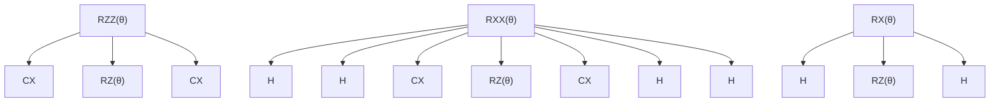

# QAOA and Ising Circuits

<cite>
**Referenced Files in This Document**   
- [qaoa_ising.py](file://src/tyxonq/libs/circuits_library/qaoa_ising.py)
- [simple_qaoa.py](file://examples/simple_qaoa.py)
</cite>

## Table of Contents
1. [Introduction](#introduction)
2. [Function Parameters](#function-parameters)
3. [Cost Layer Implementation](#cost-layer-implementation)
4. [Mixer Layer Options](#mixer-layer-options)
5. [Coupling Patterns](#coupling-patterns)
6. [Circuit Compilation Requirements](#circuit-compilation-requirements)
7. [Usage Examples](#usage-examples)
8. [Configuration Options](#configuration-options)
9. [Validation Rules](#validation-rules)

## Introduction
The QAOA (Quantum Approximate Optimization Algorithm) and Ising model circuit templates provide a framework for constructing quantum circuits to solve combinatorial optimization problems. The `qaoa_ising` function generates parameterized quantum circuits based on problem Hamiltonians expressed as Pauli Z terms. This documentation details the implementation, parameters, and usage patterns for these circuit templates.

**Section sources**
- [qaoa_ising.py](file://src/tyxonq/libs/circuits_library/qaoa_ising.py#L7-L65)

## Function Parameters
The `qaoa_ising` function accepts the following parameters for circuit construction:

- `num_qubits`: Integer specifying the number of qubits in the circuit
- `nlayers`: Integer indicating the number of QAOA layers (p parameter)
- `pauli_z_terms`: Sequence of sequences representing Pauli Z terms in the Hamiltonian
- `weights`: Sequence of float values representing weights for each Pauli term
- `params`: Sequence of float values containing variational parameters for cost and mixer layers
- `mixer`: String specifying the mixer type ("X", "XY", or "ZZ")
- `full_coupling`: Boolean indicating whether to use complete mixer connectivity

The function returns a `Circuit` object containing the constructed quantum circuit in intermediate representation format.

**Section sources**
- [qaoa_ising.py](file://src/tyxonq/libs/circuits_library/qaoa_ising.py#L7-L65)

## Cost Layer Implementation
The cost layer implements the problem Hamiltonian using RZ and RZZ gates for single and two-qubit Z terms respectively:

- For single-qubit Z terms: Implements RZ gates with angle 2.0 × weight × parameter
- For two-qubit ZZ terms: Implements RZZ gates with angle weight × parameter
- The cost layer applies Hadamard gates to all qubits as initial state preparation
- Each QAOA layer applies the cost Hamiltonian evolution based on the problem structure

The implementation directly encodes the Pauli Z terms from the problem Hamiltonian into the circuit structure.

**Section sources**
- [qaoa_ising.py](file://src/tyxonq/libs/circuits_library/qaoa_ising.py#L25-L38)

## Mixer Layer Options
The mixer layer provides three options for quantum mixing operations:

- **X Mixer**: Uses RX gates on all qubits with parameter θₘ
- **XY Mixer**: Uses RXX and RYY gates on coupled qubit pairs with parameter θₘ
- **ZZ Mixer**: Uses RZZ gates on coupled qubit pairs with parameter θₘ

The mixer type is specified by the `mixer` parameter and determines the quantum dynamics during the mixing phase of QAOA.

**Section sources**
- [qaoa_ising.py](file://src/tyxonq/libs/circuits_library/qaoa_ising.py#L40-L65)

## Coupling Patterns
The `full_coupling` parameter controls the connectivity pattern for mixer operations:

- When `full_coupling=False`: Uses a linear coupling pattern with alternating pairs and periodic boundary conditions
- When `full_coupling=True`: Uses complete coupling where all qubit pairs are connected

The linear coupling pattern creates pairs in two steps: even-odd pairs followed by odd-even pairs, with an additional wrap-around connection for periodic boundaries.

**Section sources**
- [qaoa_ising.py](file://src/tyxonq/libs/circuits_library/qaoa_ising.py#L39-L50)

## Circuit Compilation Requirements
The circuit compilation process requires decomposition of higher-level gates into native gate sequences:

- RZZ gates decompose to CX-RZ(θ)-CX sequences
- RXX gates decompose to H⊗H-CX-RZ(θ)-CX-H⊗H sequences
- RYY gates decompose to (S†H)⊗(S†H)-CX-RZ(θ)-CX-(HS)⊗(HS) sequences
- RX gates decompose to H-RZ(θ)-H sequences

The decomposition stage converts these parametric rotations into the native gate set {H, RZ, CX} for execution on quantum hardware.

**Diagram sources**
- [rotations.py](file://src/tyxonq/compiler/stages/decompose/rotations.py#L39-L66)

**Section sources**
- [rotations.py](file://src/tyxonq/compiler/stages/decompose/rotations.py#L10-L66)

## Usage Examples
The `simple_qaoa.py` example demonstrates MaxCut problem formulation using QAOA:

- Constructs a graph using NetworkX with weighted edges
- Builds a QAOA circuit for MaxCut optimization
- Implements ZZ interactions using CX-RZ-CX decomposition
- Uses RX gates for the X mixer layer
- Measures all qubits in the Z basis for readout

The example shows both sampling-based execution and autograd-based optimization paths for objective function evaluation.

**Section sources**
- [simple_qaoa.py](file://examples/simple_qaoa.py#L41-L85)

## Configuration Options
The circuit templates support various configuration options for different problem Hamiltonians:

- Different mixer types (X, XY, ZZ) for various mixing dynamics
- Flexible coupling patterns (linear or full) for mixer connectivity
- Weighted Pauli terms for general Ising Hamiltonians
- Parameterized layer count for adjustable circuit depth
- Support for both single-qubit and two-qubit Z terms in the cost Hamiltonian

These options allow the circuit template to be adapted to a wide range of combinatorial optimization problems.

**Section sources**
- [qaoa_ising.py](file://src/tyxonq/libs/circuits_library/qaoa_ising.py#L7-L65)

## Validation Rules
The implementation includes validation rules for proper circuit construction:

- Pauli Z terms must contain exactly 1 or 2 qubit indices (single or two-qubit terms)
- Parameter count must be sufficient for all layers (2 × nlayers parameters required)
- Qubit indices must be within valid range [0, num_qubits-1]
- Mixer type must be one of the supported options ("X", "XY", "ZZ")
- Weight sequences must match the number of Pauli terms

The function raises `ValueError` exceptions when these validation rules are violated.

**Section sources**
- [qaoa_ising.py](file://src/tyxonq/libs/circuits_library/qaoa_ising.py#L34-L37)
- [qaoa_ising.py](file://src/tyxonq/libs/circuits_library/qaoa_ising.py#L63-L65)