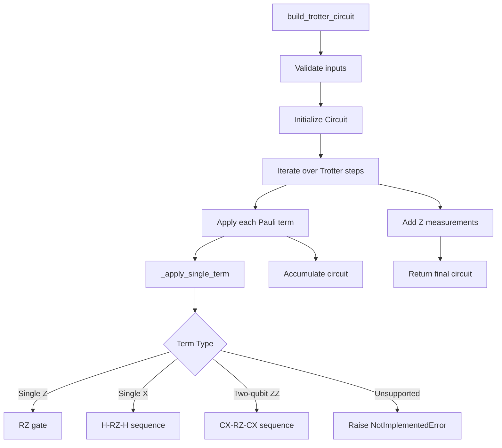
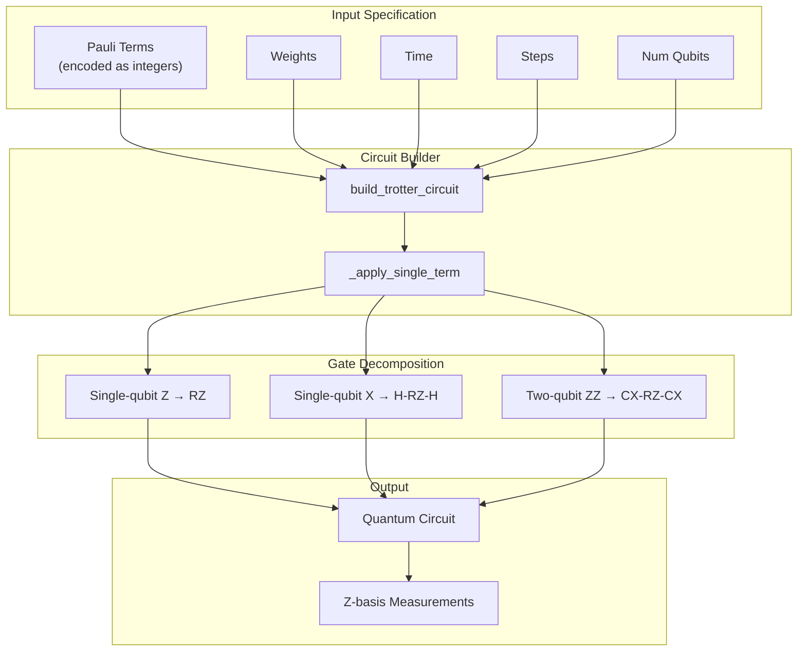
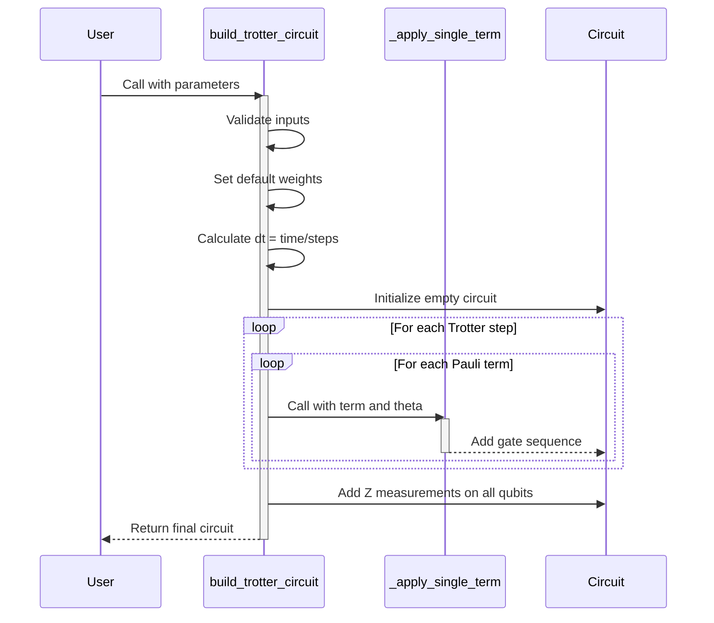
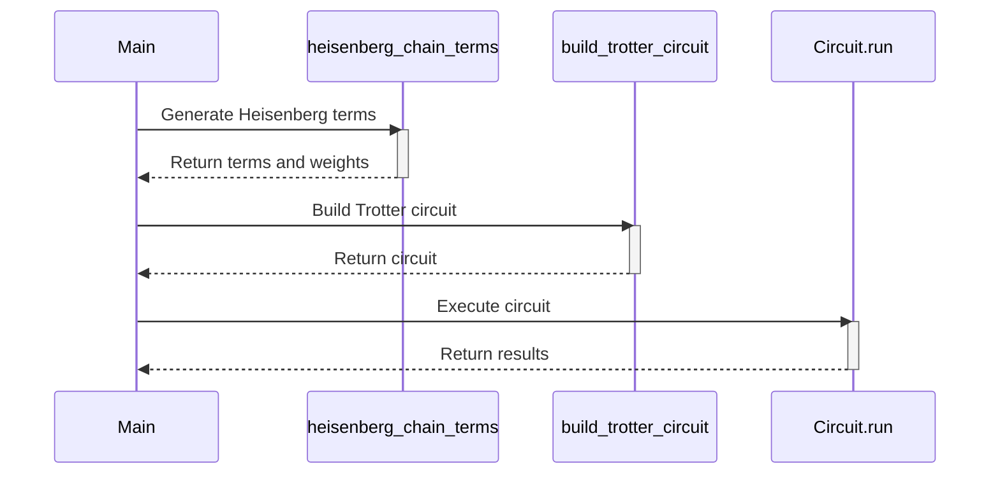
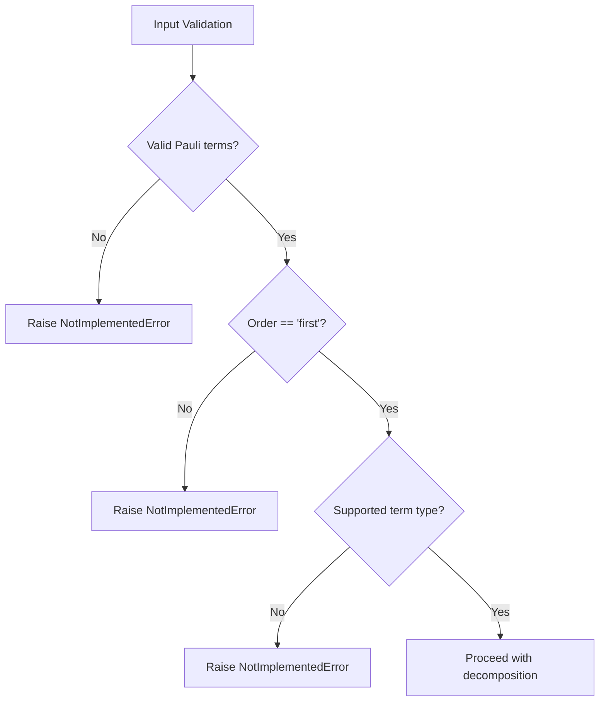

# Trotter-Suzuki Circuits

<cite>
**Referenced Files in This Document**   
- [trotter_circuit.py](file://src/tyxonq/libs/circuits_library/trotter_circuit.py)
- [timeevolution_trotter.py](file://examples/timeevolution_trotter.py)
- [circuit.py](file://src/tyxonq/core/ir/circuit.py)
</cite>

## Table of Contents
1. [Introduction](#introduction)
2. [Core Components](#core-components)
3. [Architecture Overview](#architecture-overview)
4. [Detailed Component Analysis](#detailed-component-analysis)
5. [Usage Examples](#usage-examples)
6. [Error Handling and Input Validation](#error-handling-and-input-validation)
7. [Limitations and Future Work](#limitations-and-future-work)
8. [Conclusion](#conclusion)

## Introduction

The Trotter-Suzuki decomposition provides a method for simulating quantum dynamics by approximating the time evolution operator of a Hamiltonian. This document details the implementation of first-order Trotter circuits within the TyxonQ framework, focusing on the `build_trotter_circuit` function and its supporting components. The implementation enables simulation of quantum systems by decomposing Hamiltonians into sequences of native quantum gates, with automatic measurement insertion and support for configurable Trotter steps.

**Section sources**
- [trotter_circuit.py](file://src/tyxonq/libs/circuits_library/trotter_circuit.py#L38-L85)
- [timeevolution_trotter.py](file://examples/timeevolution_trotter.py#L1-L58)

## Core Components

The Trotter circuit implementation consists of two primary functions: `build_trotter_circuit` for constructing the overall evolution circuit and `_apply_single_term` for decomposing individual Pauli terms into native gate sequences. These components work together to transform a Hamiltonian specification into an executable quantum circuit.



**Diagram sources**
- [trotter_circuit.py](file://src/tyxonq/libs/circuits_library/trotter_circuit.py#L7-L85)

**Section sources**
- [trotter_circuit.py](file://src/tyxonq/libs/circuits_library/trotter_circuit.py#L7-L85)

## Architecture Overview

The Trotter circuit construction follows a modular architecture where high-level circuit generation is separated from low-level gate decomposition. The system takes a Hamiltonian expressed as Pauli terms and constructs a time-evolution circuit through sequential application of exponentiated Pauli operators.



**Diagram sources**
- [trotter_circuit.py](file://src/tyxonq/libs/circuits_library/trotter_circuit.py#L7-L85)

**Section sources**
- [trotter_circuit.py](file://src/tyxonq/libs/circuits_library/trotter_circuit.py#L7-L85)

## Detailed Component Analysis

### build_trotter_circuit Function

The `build_trotter_circuit` function serves as the main entry point for constructing Trotterized evolution circuits. It accepts a Hamiltonian specification through Pauli terms encoded as integer sequences (0=I, 1=X, 2=Y, 3=Z), along with weights, evolution time, number of Trotter steps, and qubit count.



**Diagram sources**
- [trotter_circuit.py](file://src/tyxonq/libs/circuits_library/trotter_circuit.py#L38-L85)

**Section sources**
- [trotter_circuit.py](file://src/tyxonq/libs/circuits_library/trotter_circuit.py#L38-L85)

### _apply_single_term Helper

The `_apply_single_term` function handles the decomposition of individual Pauli terms into native quantum gates. It supports three specific patterns: single-qubit Z rotations (implemented as RZ gates), single-qubit X rotations (implemented as H-RZ-H sequences), and two-qubit ZZ interactions (implemented as CX-RZ-CX sequences).

```mermaid
flowchart TD
A["_apply_single_term"] --> B{"Non-identity qubits"}
B --> |0| C["Return unchanged"]
B --> |1| D{"Single-qubit type"}
D --> |Z (3)| E["Add RZ(2θ)"]
D --> |X (1)| F["Add H-RZ(2θ)-H"]
D --> |Y (2)| G["Raise NotImplementedError"]
B --> |2| H{"Two-qubit type"}
H --> |ZZ| I["Add CX-RZ(2θ)-CX"]
H --> |Other| J["Raise NotImplementedError"]
```

**Diagram sources**
- [trotter_circuit.py](file://src/tyxonq/libs/circuits_library/trotter_circuit.py#L7-L35)

**Section sources**
- [trotter_circuit.py](file://src/tyxonq/libs/circuits_library/trotter_circuit.py#L7-L35)

## Usage Examples

The implementation is demonstrated in the `timeevolution_trotter.py` example, which simulates Heisenberg chain dynamics. The example constructs a Hamiltonian with nearest-neighbor XX, YY, and ZZ interactions and evolves the system using the Trotter circuit.



**Diagram sources**
- [timeevolution_trotter.py](file://examples/timeevolution_trotter.py#L1-L58)

**Section sources**
- [timeevolution_trotter.py](file://examples/timeevolution_trotter.py#L1-L58)

## Error Handling and Input Validation

The implementation includes comprehensive error handling for unsupported features and invalid inputs. The `build_trotter_circuit` function validates that only first-order Trotter decomposition is requested and that Pauli terms are provided in the expected format. The `_apply_single_term` function raises `NotImplementedError` for unsupported Pauli patterns, including Y-terms and multi-qubit interactions beyond ZZ.



**Diagram sources**
- [trotter_circuit.py](file://src/tyxonq/libs/circuits_library/trotter_circuit.py#L7-L85)

**Section sources**
- [trotter_circuit.py](file://src/tyxonq/libs/circuits_library/trotter_circuit.py#L7-L85)

## Limitations and Future Work

Current limitations include the lack of support for Y-terms in Pauli strings and the restriction to first-order Trotter decomposition. The implementation only supports single-qubit Z/X and two-qubit ZZ terms, with other patterns raising `NotImplementedError`. Future work could extend the `_apply_single_term` function to handle Y-rotations through S†HS sequences and support higher-order Trotter formulas for improved accuracy.

Accuracy considerations include the trade-off between Trotter step count and simulation fidelity. Larger step counts reduce Trotter error but increase circuit depth and potential noise accumulation. The locality of the Hamiltonian also affects accuracy, with more local interactions generally requiring fewer steps for convergence.

**Section sources**
- [trotter_circuit.py](file://src/tyxonq/libs/circuits_library/trotter_circuit.py#L7-L85)

## Conclusion

The Trotter-Suzuki circuit implementation provides a foundational tool for quantum dynamics simulation within the TyxonQ framework. By decomposing Hamiltonians into native gate sequences and automatically handling measurement insertion, it enables straightforward simulation of quantum systems. The modular design separates circuit construction from gate decomposition, allowing for future extensions to support additional Pauli patterns and higher-order integration methods.