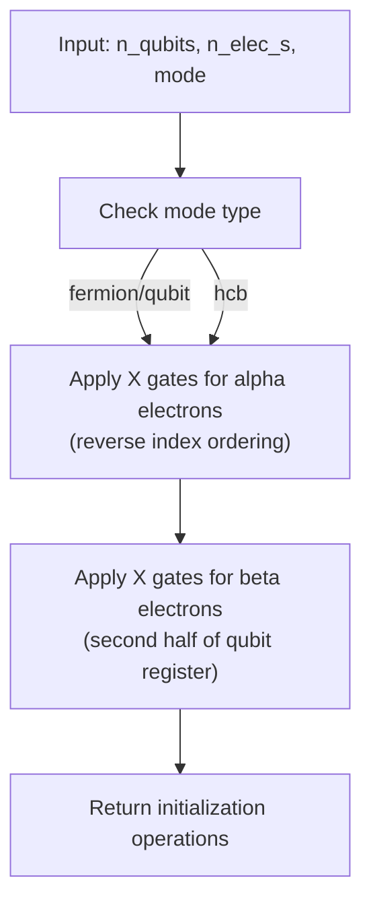
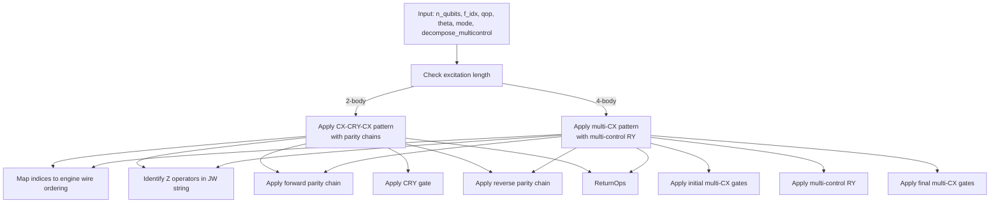
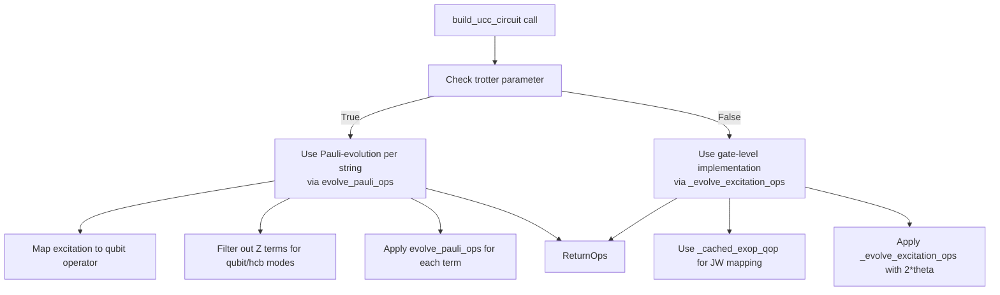
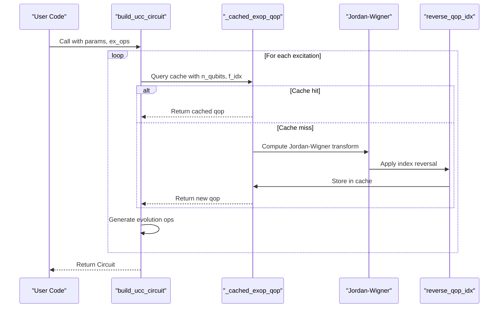

# UCC Circuits

<cite>
**Referenced Files in This Document**   
- [ucc.py](file://src/tyxonq/libs/circuits_library/ucc.py)
- [utils.py](file://src/tyxonq/libs/circuits_library/utils.py)
- [pauli_io.py](file://src/tyxonq/libs/hamiltonian_encoding/pauli_io.py)
- [circuit.py](file://src/tyxonq/core/ir/circuit.py)
- [cloud_uccsd_hea_demo.py](file://examples/cloud_uccsd_hea_demo.py)
</cite>

## Table of Contents
1. [Introduction](#introduction)
2. [Core Parameters of build_ucc_circuit](#core-parameters-of-build_ucc_circuit)
3. [Hartree-Fock Initialization](#hartree-fock-initialization)
4. [Excitation Operator Evolution](#excitation-operator-evolution)
5. [Trotter and Gate Decomposition Strategies](#trotter-and-gate-decomposition-strategies)
6. [Jordan-Wigner Transformation Optimization](#jordan-wigner-transformation-optimization)
7. [Usage Examples and Workflow Integration](#usage-examples-and-workflow-integration)
8. [Electron Conservation and Excitation Rules](#electron-conservation-and-excitation-rules)
9. [Error Handling and Parameter Validation](#error-handling-and-parameter-validation)

## Introduction
The Unitary Coupled Cluster (UCC) circuit templates provide a framework for constructing variational quantum circuits used in quantum chemistry simulations. These circuits implement the exponential of anti-Hermitian excitation operators to model electron correlation effects. The `build_ucc_circuit` function serves as the primary interface for generating UCC circuits with support for various excitation types, fermionic or qubit mode handling, and different implementation strategies. This documentation details the core components, parameterization, and implementation logic behind the UCC circuit construction.

## Core Parameters of build_ucc_circuit
The `build_ucc_circuit` function accepts several key parameters that define the structure and behavior of the generated UCC circuit:
- `params`: Sequence of floating-point values representing the amplitudes for each excitation operator.
- `n_qubits`: Integer specifying the total number of qubits in the system.
- `n_elec_s`: Tuple of integers indicating the number of alpha and beta electrons, or total electrons as an integer.
- `ex_ops`: Sequence of tuples defining the excitation operators by their orbital indices.
- `param_ids`: Optional sequence mapping parameters to specific excitation operators.
- `mode`: String specifying the representation mode ("fermion", "qubit", or "hcb").
- `init_state`: Optional initial circuit state; if None, Hartree-Fock initialization is used.
- `decompose_multicontrol`: Boolean flag enabling decomposition of multi-control gates.
- `trotter`: Boolean flag switching between gate-level and Pauli-evolution implementations.

These parameters allow flexible configuration of UCC circuits for different molecular systems and simulation requirements.

**Section sources**
- [ucc.py](file://src/tyxonq/libs/circuits_library/ucc.py#L82-L122)

## Hartree-Fock Initialization
The `_hf_init_ops` function generates the initial state preparation operations for the Hartree-Fock reference state. It supports three modes: "fermion", "qubit", and "hcb" (hard-core boson). For fermionic and qubit modes, the function applies X gates to the appropriate qubits based on the electron configuration. The orbital ordering follows a legacy convention where OpenFermion indices are reversed to match the engine's wire ordering. Alpha electrons occupy the highest-energy orbitals first, followed by beta electrons in the second half of the qubit register. This initialization ensures proper electron number conservation and provides a physically meaningful starting point for the variational optimization.

**Diagram sources**
- [ucc.py](file://src/tyxonq/libs/circuits_library/ucc.py#L12-L25)

**Section sources**
- [ucc.py](file://src/tyxonq/libs/circuits_library/ucc.py#L12-L25)

## Excitation Operator Evolution
The `_evolve_excitation_ops` function implements the evolution of excitation operators using CX-CRY-CX patterns. For 2-body excitations, it constructs a standard pattern with parity chain operators to handle Jordan-Wigner string operators. The function first maps the excitation indices to the engine's wire ordering by reversing the indices. It then identifies Z operators in the Jordan-Wigner string and applies parity chain operations before and after the CRY gate. For 4-body excitations, a more complex pattern involving multiple CX gates and multi-control RY operations is used. The `_parity_chain_ops` function manages the Jordan-Wigner string operators by applying a sequence of CX gates followed by a CZ gate, with reverse ordering for the uncomputation step.

**Diagram sources**
- [ucc.py](file://src/tyxonq/libs/circuits_library/ucc.py#L43-L73)
- [ucc.py](file://src/tyxonq/libs/circuits_library/ucc.py#L28-L40)

**Section sources**
- [ucc.py](file://src/tyxonq/libs/circuits_library/ucc.py#L43-L73)
- [ucc.py](file://src/tyxonq/libs/circuits_library/ucc.py#L28-L40)

## Trotter and Gate Decomposition Strategies
The `trotter` parameter controls the implementation strategy for excitation operator evolution. When `trotter=True`, the function uses Pauli-evolution per string, decomposing each term in the qubit operator into a sequence of single-qubit rotations and entangling gates. This approach follows the Trotter-Suzuki decomposition and is suitable for hardware-efficient implementations. When `trotter=False`, the function uses gate-level implementations with CX-CRY-CX patterns, which are more accurate but require deeper circuits. The `decompose_multicontrol` parameter determines whether multi-control RY gates are decomposed into elementary gates or kept as high-level operations. The `build_multicontrol_ry_ops` function provides the decomposition logic, currently defaulting to inlined gate sequences due to lack of subcircuit support in the IR runtime.

**Diagram sources**
- [ucc.py](file://src/tyxonq/libs/circuits_library/ucc.py#L82-L122)
- [utils.py](file://src/tyxonq/libs/circuits_library/utils.py#L61-L107)

**Section sources**
- [ucc.py](file://src/tyxonq/libs/circuits_library/ucc.py#L82-L122)
- [utils.py](file://src/tyxonq/libs/circuits_library/utils.py#L61-L107)

## Jordan-Wigner Transformation Optimization
The `_cached_exop_qop` function implements caching of Jordan-Wigner transformations to optimize repeated calculations. It uses the `@lru_cache` decorator with a maximum size of 4096 entries to store previously computed qubit operators. The function first converts the excitation operator to a FermionOperator using `ex_op_to_fop`, then applies the Jordan-Wigner transformation from OpenFermion. The resulting qubit operator indices are reversed to match the engine's wire ordering convention using `reverse_qop_idx`. This caching mechanism significantly improves performance when the same excitation operators are used multiple times, such as in iterative optimization loops or when constructing circuits for different parameter values.

**Diagram sources**
- [ucc.py](file://src/tyxonq/libs/circuits_library/ucc.py#L75-L78)
- [pauli_io.py](file://src/tyxonq/libs/hamiltonian_encoding/pauli_io.py#L111-L119)
- [pauli_io.py](file://src/tyxonq/libs/hamiltonian_encoding/pauli_io.py#L86-L92)

**Section sources**
- [ucc.py](file://src/tyxonq/libs/circuits_library/ucc.py#L75-L78)
- [pauli_io.py](file://src/tyxonq/libs/hamiltonian_encoding/pauli_io.py#L111-L119)
- [pauli_io.py](file://src/tyxonq/libs/hamiltonian_encoding/pauli_io.py#L86-L92)

## Usage Examples and Workflow Integration
The `cloud_uccsd_hea_demo.py` example demonstrates the integration of UCC circuits in a complete quantum chemistry workflow. It shows how to construct molecular Hamiltonians using PySCF, create UCCSD instances, and execute variational algorithms on both local and cloud-based devices. The demo illustrates the use of classical providers for Hartree-Fock calculations and integrals, while leveraging quantum devices for the energy evaluation. This hybrid approach enables efficient exploration of quantum algorithms without requiring full quantum resources for all computational steps. The example also demonstrates the use of HEA (Hardware-Efficient Ansatz) circuits for comparison with UCCSD, highlighting the flexibility of the framework for different ansatz types.

**Section sources**
- [cloud_uccsd_hea_demo.py](file://examples/cloud_uccsd_hea_demo.py#L1-L56)

## Electron Conservation and Excitation Rules
The UCC circuit implementation enforces electron conservation through careful construction of excitation operators. Single and double excitations preserve the total electron number by promoting electrons from occupied to virtual orbitals. The `unpack_nelec` function handles different electron specification formats, ensuring consistent interpretation of the electron configuration. Excitation operators are generated based on the molecular orbital space, with restrictions to maintain proper spin symmetry. The framework supports both restricted and unrestricted excitations, allowing for flexible configuration of the active space. The excitation operator generation follows standard quantum chemistry conventions, with orbital indices mapped to qubit indices according to the specified mapping (e.g., Jordan-Wigner, parity).

**Section sources**
- [ucc.py](file://src/tyxonq/libs/circuits_library/ucc.py#L12-L25)
- [utils.py](file://src/tyxonq/libs/circuits_library/utils.py#L17-L24)

## Error Handling and Parameter Validation
The UCC circuit implementation includes comprehensive error handling and parameter validation. The `build_ucc_circuit` function validates input parameters and raises appropriate exceptions for unsupported configurations. For example, it raises a `NotImplementedError` if an unsupported `init_state` type is provided, ensuring that only `None` or `Circuit` objects are accepted. The `_evolve_excitation_ops` function includes assertions to verify that 4-body excitations have exactly four indices. The `evolve_pauli_ops` function validates Pauli symbols and raises `ValueError` for invalid inputs. These validation checks help prevent silent failures and provide clear error messages for debugging. The framework also includes structural validation in the `Circuit` class, ensuring that qubit indices are within bounds and operation formats are correct.

**Section sources**
- [ucc.py](file://src/tyxonq/libs/circuits_library/ucc.py#L82-L122)
- [utils.py](file://src/tyxonq/libs/circuits_library/utils.py#L28-L58)
- [circuit.py](file://src/tyxonq/core/ir/circuit.py#L48-L727)