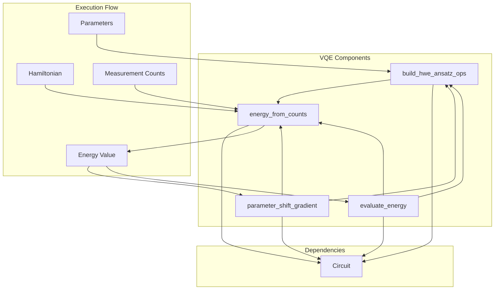
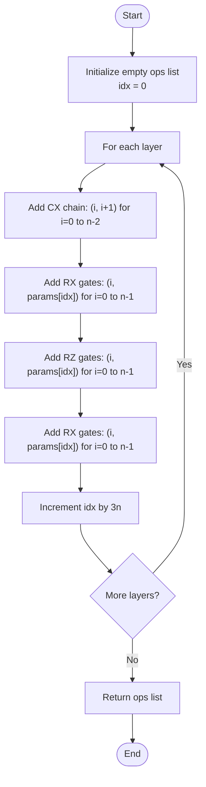
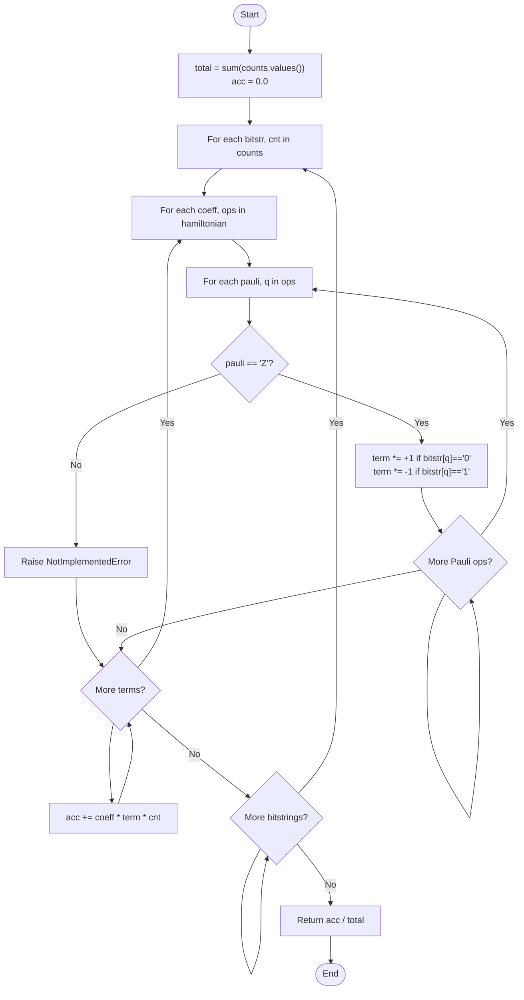
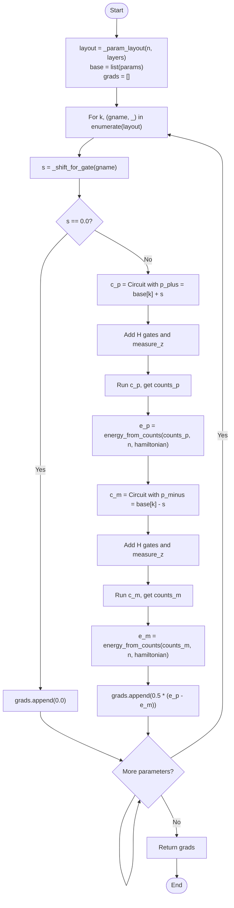
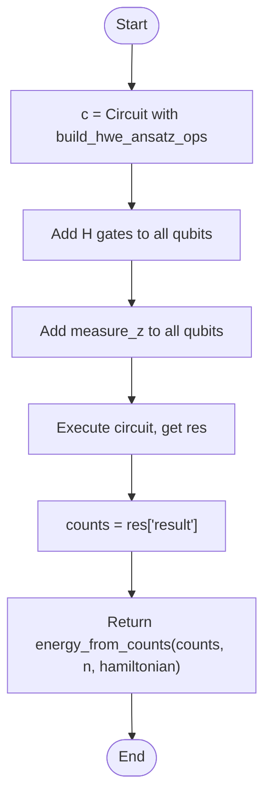

# VQE Circuits

<cite>
**Referenced Files in This Document**   
- [vqe.py](file://src/tyxonq/libs/circuits_library/vqe.py)
- [vqe_extra.py](file://examples/vqe_extra.py)
- [circuit.py](file://src/tyxonq/core/ir/circuit.py)
</cite>

## Table of Contents
1. [Introduction](#introduction)
2. [Core Components](#core-components)
3. [Architecture Overview](#architecture-overview)
4. [Detailed Component Analysis](#detailed-component-analysis)
5. [Usage Examples](#usage-examples)
6. [Performance Considerations](#performance-considerations)
7. [Error Handling](#error-handling)
8. [Conclusion](#conclusion)

## Introduction

This document provides comprehensive API documentation for VQE (Variational Quantum Eigensolver) circuit templates in TyxonQ. The focus is on the hardware-efficient ansatz construction and energy evaluation workflow, which are essential for quantum chemistry and optimization applications. The documented components enable users to construct parameterized quantum circuits, estimate Hamiltonian expectations from measurement results, compute gradients via the parameter-shift rule, and perform end-to-end energy evaluation. These functions are designed to work within TyxonQ's chainable API execution model, supporting both simulation and hardware execution through a unified interface.

## Core Components

The VQE functionality is implemented in the `src/tyxonq.libs.circuits_library.vqe` module, which provides four core functions for constructing and evaluating variational quantum circuits. The `build_hwe_ansatz_ops` function generates circuit operations for a hardware-efficient ansatz with RX-RZ-RX layers, configurable by qubit count and circuit depth. The `energy_from_counts` function computes Hamiltonian expectation values from measurement results, assuming proper basis transformations have been applied. The `parameter_shift_gradient` function implements the parameter-shift rule for gradient computation, using ±π/2 shifts for RX and RZ gates. Finally, the `evaluate_energy` function serves as a convenience wrapper that orchestrates the complete energy evaluation workflow. These components work together to provide a complete VQE solution that is decoupled from specific numerical backends and depends only on the Circuit IR construction and execution API.

**Section sources**
- [vqe.py](file://src/tyxonq/libs/circuits_library/vqe.py#L22-L149)

## Architecture Overview

**Diagram sources**
- [vqe.py](file://src/tyxonq/libs/circuits_library/vqe.py#L22-L149)

**Section sources**
- [vqe.py](file://src/tyxonq/libs/circuits_library/vqe.py#L1-L152)

## Detailed Component Analysis

### build_hwe_ansatz_ops Function

The `build_hwe_ansatz_ops` function constructs a hardware-efficient ansatz circuit with a specific layer structure: CX chain → RX(n) → RZ(n) → RX(n). This pattern is repeated for the specified number of layers, creating a deep parameterized circuit suitable for variational algorithms. The function takes the number of qubits (n), number of layers, and a sequence of parameters as inputs. The parameter sequence length must be exactly 3*n*layers, corresponding to the three rotation gates (RX, RZ, RX) applied to each qubit in each layer. The CX gates form a linear chain connecting adjacent qubits, providing entanglement between neighboring qubits. This ansatz design balances expressibility with hardware feasibility, as the gate set and connectivity pattern are compatible with typical superconducting qubit architectures.

**Diagram sources**
- [vqe.py](file://src/tyxonq/libs/circuits_library/vqe.py#L22-L40)

**Section sources**
- [vqe.py](file://src/tyxonq/libs/circuits_library/vqe.py#L22-L40)

### energy_from_counts Function

The `energy_from_counts` function estimates the expectation value of a Hamiltonian from measurement counts, assuming the circuit has already applied the necessary basis transformations for the target measurement basis. The function operates under the assumption that measurements are performed in the Z-basis, requiring the caller to apply appropriate basis rotations (such as H for X-basis or HS† for Y-basis) before measurement. The Hamiltonian is represented as a list of terms, where each term consists of a coefficient and a list of Pauli operators with their target qubits. The function computes the expectation by iterating through all measurement bitstrings, calculating the contribution of each Hamiltonian term to the total energy, and weighting by the measurement frequency. Currently, only Z-type Pauli terms are supported, with other terms raising a NotImplementedError. This design choice emphasizes the separation of concerns between circuit construction (which handles basis transformations) and expectation value computation.

**Diagram sources**
- [vqe.py](file://src/tyxonq/libs/circuits_library/vqe.py#L43-L64)

**Section sources**
- [vqe.py](file://src/tyxonq/libs/circuits_library/vqe.py#L43-L64)

### parameter_shift_gradient Function

The `parameter_shift_gradient` function implements the parameter-shift rule for computing gradients of the energy expectation with respect to circuit parameters. This technique is essential for gradient-based optimization in VQE and other variational quantum algorithms. The function works by evaluating the energy at two shifted parameter values (±π/2 for RX and RZ gates) and computing the gradient as half the difference between these evaluations. For each parameter in the circuit, the function constructs two circuits: one with the parameter increased by π/2 and another with it decreased by π/2. It then executes both circuits, computes the energy expectation for each using `energy_from_counts`, and calculates the gradient component. The function supports configurable shot counts and device selection, allowing users to balance accuracy and computational cost. The implementation assumes that basis transformations for Hamiltonian measurement have been applied in the circuit, maintaining consistency with the `energy_from_counts` function.

**Diagram sources**
- [vqe.py](file://src/tyxonq/libs/circuits_library/vqe.py#L84-L129)

**Section sources**
- [vqe.py](file://src/tyxonq/libs/circuits_library/vqe.py#L84-L129)

### evaluate_energy Function

The `evaluate_energy` function provides a convenience wrapper for end-to-end energy evaluation in VQE workflows. It combines circuit construction, basis transformation, measurement, and expectation value computation into a single function call, simplifying the user interface for common use cases. The function takes the number of qubits, number of ansatz layers, parameter values, and Hamiltonian as inputs, along with optional execution parameters such as shot count and device selection. It first constructs the hardware-efficient ansatz circuit using `build_hwe_ansatz_ops`, then applies Hadamard gates to all qubits to transform to the X-basis (assuming the Hamiltonian contains X-type terms), adds Z-basis measurements, executes the circuit, and finally computes the energy expectation from the measurement counts using `energy_from_counts`. This function serves as the primary interface for energy evaluation in VQE algorithms, abstracting away the complexity of the underlying workflow while maintaining compatibility with the modular design of the individual components.

**Diagram sources**
- [vqe.py](file://src/tyxonq/libs/circuits_library/vqe.py#L132-L149)

**Section sources**
- [vqe.py](file://src/tyxonq/libs/circuits_library/vqe.py#L132-L149)

## Usage Examples

The `vqe_extra.py` example demonstrates the integration of VQE components into a complete workflow for a transverse-field Ising model (TFIM) Hamiltonian. The example shows how to handle Hamiltonians with multiple measurement settings by performing separate circuit executions for different Pauli terms. For Z-type terms (ZZ interactions), a direct Z-basis measurement is performed, while for X-type terms (transverse field), a basis transformation with Hadamard gates is applied before Z-basis measurement. The `energy_tfim` function combines results from both measurement settings to compute the total energy expectation. The `grad_tfim_ps` function implements parameter-shift gradient computation for this multi-setting scenario, demonstrating how to extend the basic gradient computation to more complex Hamiltonians. The example also includes a comparison with a direct statevector simulation using PyTorch autograd, highlighting the flexibility of TyxonQ's architecture in supporting both sampling-based and exact numerical methods.

**Section sources**
- [vqe_extra.py](file://examples/vqe_extra.py#L1-L195)

## Performance Considerations

The VQE implementation in TyxonQ is designed with performance and scalability in mind, particularly for deep circuits and noisy environments. The hardware-efficient ansatz structure with linear CX chains minimizes gate count while providing sufficient entanglement for many quantum chemistry problems. However, deep circuits with many layers may suffer from noise accumulation and barren plateaus in optimization landscapes. The parameter-shift gradient computation requires two circuit evaluations per parameter, leading to a total of 2×P evaluations for P parameters, which can become computationally expensive for large circuits. Shot allocation is a critical performance consideration, as higher shot counts improve energy estimation accuracy but increase execution time. The implementation supports configurable shot counts to allow users to balance accuracy and efficiency based on their specific requirements and hardware constraints. For noise resilience, the modular design allows integration with error mitigation techniques provided in the postprocessing module, such as readout error correction and zero-noise extrapolation.

**Section sources**
- [vqe.py](file://src/tyxonq/libs/circuits_library/vqe.py#L1-L152)
- [vqe_extra.py](file://examples/vqe_extra.py#L1-L195)

## Error Handling

The VQE components include specific error handling for unsupported operations and invalid inputs. The `energy_from_counts` function raises a NotImplementedError when encountering non-Z Pauli terms, enforcing the design principle that basis transformations must be handled in the circuit construction phase rather than during expectation value computation. This clear separation of concerns prevents ambiguous behavior and ensures that users explicitly specify their measurement strategy. Parameter validation is performed through Python type hints and runtime checks, with the `build_hwe_ansatz_ops` function requiring a parameter sequence of exactly 3×n×layers elements. The circuit execution framework provides additional error handling for invalid qubit indices and unsupported operations, with comprehensive validation in the Circuit class constructor. These error handling mechanisms ensure robust operation and provide clear feedback to users when incorrect usage patterns are detected.

**Section sources**
- [vqe.py](file://src/tyxonq/libs/circuits_library/vqe.py#L43-L64)
- [circuit.py](file://src/tyxonq/core/ir/circuit.py#L48-L727)

## Conclusion

The VQE circuit templates in TyxonQ provide a comprehensive and modular framework for variational quantum algorithms. The documented components—`build_hwe_ansatz_ops`, `energy_from_counts`, `parameter_shift_gradient`, and `evaluate_energy`—form a cohesive API that balances flexibility with ease of use. The hardware-efficient ansatz design supports deep circuits with configurable depth, while the parameter-shift gradient implementation enables gradient-based optimization with theoretical guarantees. The modular architecture separates circuit construction from expectation value computation, allowing for flexible integration with different measurement strategies and error mitigation techniques. The inclusion of usage examples demonstrates practical application to quantum chemistry problems, while performance considerations and error handling ensure robust operation in real-world scenarios. This VQE framework serves as a foundation for quantum algorithm development in TyxonQ, supporting both research and production applications in quantum computing.