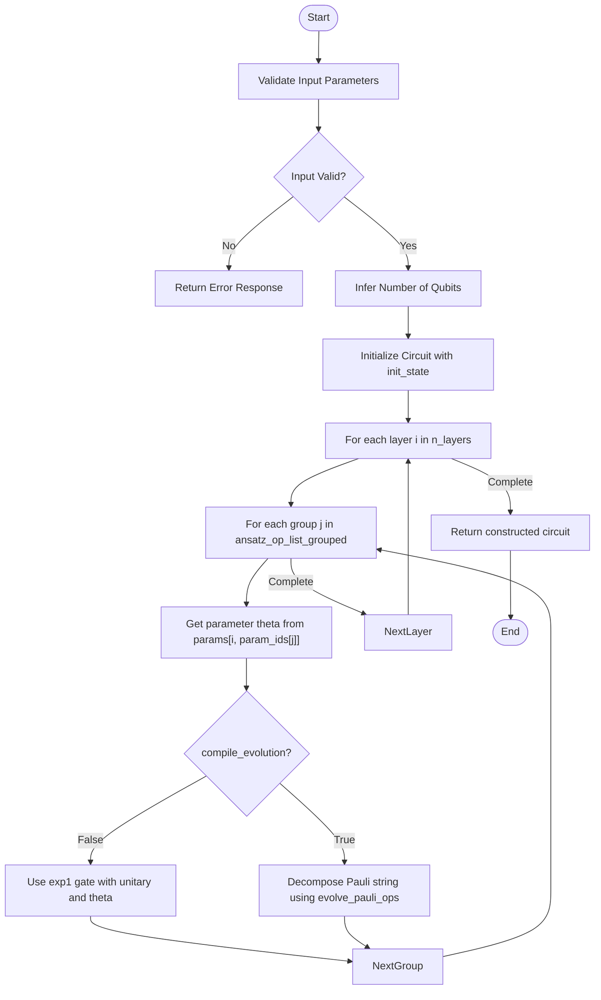
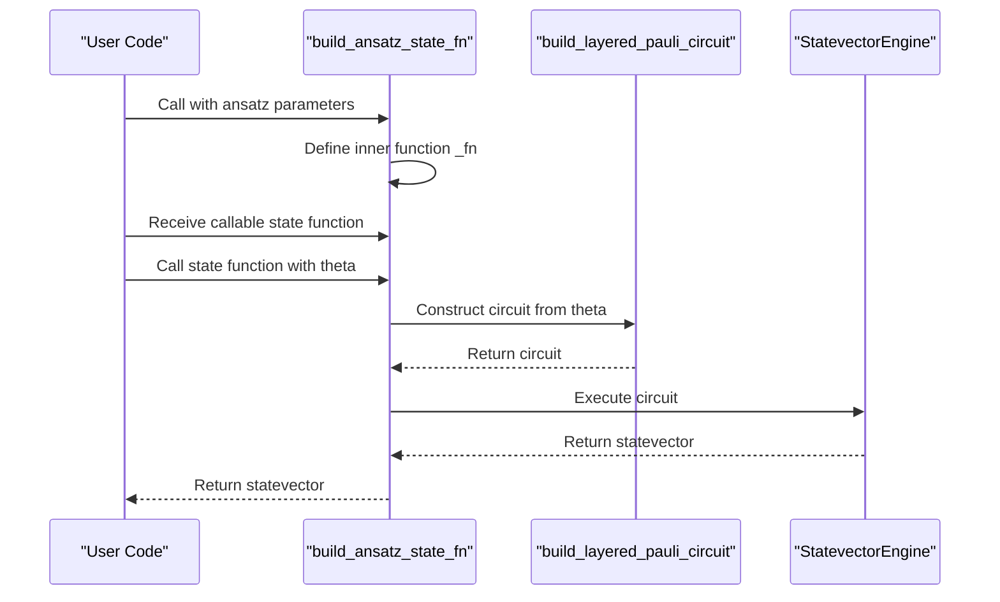
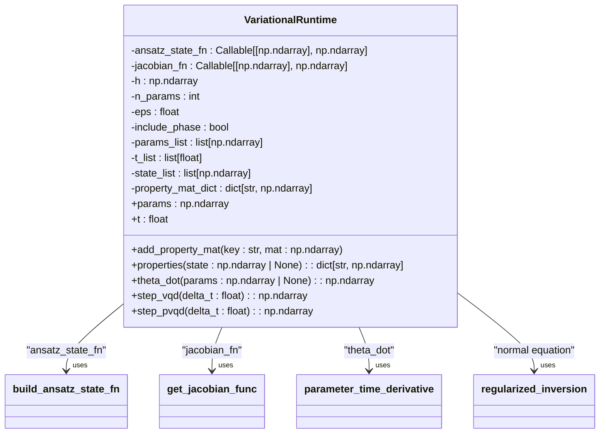
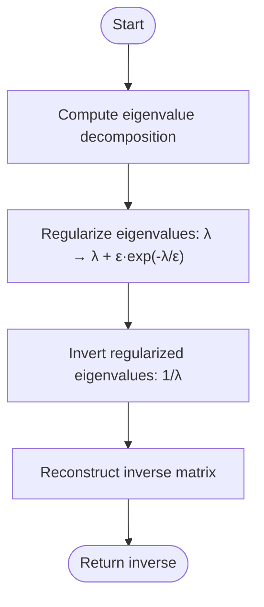

# Variational Circuits

<cite>
**Referenced Files in This Document**   
- [variational.py](file://src/tyxonq/libs/circuits_library/variational.py)
- [utils.py](file://src/tyxonq/libs/circuits_library/utils.py)
- [variational_dynamics.py](file://examples-ng/variational_dynamics.py)
</cite>

## Table of Contents
1. [Introduction](#introduction)
2. [Core Components](#core-components)
3. [Circuit Construction](#circuit-construction)
4. [State Preparation and Jacobian Computation](#state-preparation-and-jacobian-computation)
5. [Variational Runtime](#variational-runtime)
6. [Numerical Stability and Error Handling](#numerical-stability-and-error-handling)
7. [Usage Examples](#usage-examples)
8. [Conclusion](#conclusion)

## Introduction

This document provides comprehensive API documentation for the variational circuit templates within the TyxonQ framework. The system enables construction of parameterized quantum circuits for variational quantum dynamics simulations, particularly for time evolution of quantum states under Hamiltonian dynamics. The core functionality revolves around layered Pauli-based ansatz circuits, with support for both direct gate decomposition and exp1 gate usage. The documentation covers the primary components including circuit construction utilities, state preparation functions, Jacobian computation, and the `VariationalRuntime` class for executing variational quantum dynamics algorithms such as VQD (Variational Quantum Deflation) and PVQD (Projected Variational Quantum Dynamics).

**Section sources**
- [variational.py](file://src/tyxonq/libs/circuits_library/variational.py#L1-L20)
- [variational_dynamics.py](file://examples-ng/variational_dynamics.py#L1-L20)

## Core Components

The variational circuit system consists of several interconnected components that work together to enable variational quantum dynamics simulations. At the core is the `build_layered_pauli_circuit` function for constructing parameterized circuits from grouped Pauli operator lists, complemented by the `build_ansatz_state_fn` utility for creating JIT-compiled state preparation functions. The `get_jacobian_func` provides finite-difference Jacobian computation, while the `VariationalRuntime` class orchestrates the time evolution process. Supporting utilities like `regularized_inversion` and `parameter_time_derivative` handle the numerical aspects of solving the normal equation for parameter updates. These components work in concert to implement variational algorithms for quantum dynamics, with careful attention to numerical stability and computational efficiency.

**Section sources**
- [variational.py](file://src/tyxonq/libs/circuits_library/variational.py#L18-L251)

## Circuit Construction

### Layered Pauli Circuit Builder

The `build_layered_pauli_circuit` function constructs parameterized quantum circuits from grouped Pauli operator lists, enabling the creation of layered variational ansatz circuits. The function accepts several key parameters: `ansatz_op_list_grouped` (a list of grouped Pauli operators), `n_layers` (number of circuit layers), `init_state` (initial quantum state), `params` (circuit parameters), and `param_ids` (parameter indexing for layered scheduling).

A critical feature is the `compile_evolution` mode parameter, which determines how Pauli evolutions are implemented. When `compile_evolution=False` (default), the function uses exp1 gates to represent Pauli evolutions, preserving the high-level structure of the circuit. When `compile_evolution=True`, it decomposes Pauli evolutions directly into native gates using the `evolve_pauli_ops` utility, which transforms Pauli strings into sequences of Hadamard, CNOT, and RZ gates according to standard decomposition patterns.

**Diagram sources**
- [variational.py](file://src/tyxonq/libs/circuits_library/variational.py#L18-L56)
- [utils.py](file://src/tyxonq/libs/circuits_library/utils.py#L28-L58)

### Ansatz Operator Type

The `AnsatzOp` type definition specifies the structure of Pauli operators used in the ansatz construction. It is defined as a tuple containing four elements: the unitary matrix representation of the Pauli operator, a complex coefficient, a string name for the operator, and a list of qubit indices where the operator acts. This type enables flexible specification of Pauli terms in the variational ansatz, supporting both single-qubit and multi-qubit operators.

**Section sources**
- [variational.py](file://src/tyxonq/libs/circuits_library/variational.py#L11-L11)

### Pauli Evolution Decomposition

The `evolve_pauli_ops` utility function implements the decomposition of Pauli string evolutions into native quantum gates. For a given Pauli string (specified as a tuple of qubit indices and Pauli symbols) and evolution angle, it generates a sequence of gates that implements the unitary evolution. The decomposition follows standard patterns: X operators are handled with Hadamard gates, Y operators with S† and H gates, and Z operators require no initial transformation. The function then creates a ladder of CNOT gates to propagate the phase, applies the RZ rotation on the last qubit, and reverses the CNOT ladder and basis transformations.

**Section sources**
- [utils.py](file://src/tyxonq/libs/circuits_library/utils.py#L28-L58)

## State Preparation and Jacobian Computation

### Ansatz State Function Builder

The `build_ansatz_state_fn` utility creates JIT-compiled functions for preparing quantum states from variational parameters. It returns a callable that maps parameter vectors to statevectors, leveraging the `build_layered_pauli_circuit` function internally to construct the circuit and a statevector simulator engine to compute the resulting quantum state. The function is decorated with `_jit_if_available` to enable just-in-time compilation for improved performance when supported by the backend.

**Diagram sources**
- [variational.py](file://src/tyxonq/libs/circuits_library/variational.py#L59-L72)

### Jacobian Computation

The `get_jacobian_func` function provides finite-difference Jacobian computation for variational state preparation functions. It returns a callable that computes the full Jacobian matrix (statevector derivatives with respect to parameters) using central differences. For each parameter, it evaluates the state function at perturbed parameter values (θ+ε and θ-ε) and computes the derivative as (ψ(θ+ε) - ψ(θ-ε)) / (2ε). The resulting Jacobian has shape (2^n, P) where n is the number of qubits and P is the number of parameters.

**Section sources**
- [variational.py](file://src/tyxonq/libs/circuits_library/variational.py#L75-L88)

## Variational Runtime

### Runtime Architecture

The `VariationalRuntime` class provides a backend-agnostic framework for variational quantum dynamics simulations. It encapsulates the state of the simulation, including current parameters, time, and state history, while providing methods for time evolution via VQD and PVQD algorithms.

**Diagram sources**
- [variational.py](file://src/tyxonq/libs/circuits_library/variational.py#L152-L251)

### Properties and State Management

The `VariationalRuntime` class maintains several key properties through its state lists: `params_list` stores the history of parameter vectors, `t_list` tracks the simulation time at each step, and `state_list` preserves the quantum states at each time point. The class provides property accessors `params` and `t` that return the current values from these lists. Additional observables can be tracked through the `add_property_mat` method, which registers matrices for which expectation values will be computed, and the `properties` method, which calculates these expectation values for a given state.

**Section sources**
- [variational.py](file://src/tyxonq/libs/circuits_library/variational.py#L175-L195)

### Time Evolution Methods

The runtime supports two primary time evolution methods: `step_vqd` implements the standard VQD algorithm by computing the parameter time derivative and updating parameters via Euler integration, while `step_pvqd` implements the projected VQD algorithm using optimization to minimize the distance between the variational state and the exact time-evolved state. The `step_pvqd` method includes a fallback to `step_vqd` if the optimization fails, ensuring robustness in execution.

**Section sources**
- [variational.py](file://src/tyxonq/libs/circuits_library/variational.py#L225-L251)

## Numerical Stability and Error Handling

### Regularized Matrix Inversion

The `regularized_inversion` function implements a numerically stable method for inverting matrices that may be ill-conditioned or singular. It uses eigenvalue regularization, adding a nonlinear regularization term ε·exp(-λ/ε) to small eigenvalues before inversion. This approach prevents division by zero and reduces sensitivity to small eigenvalues, which is critical for solving the normal equation in variational algorithms where the Fisher information matrix may have near-zero eigenvalues.

**Diagram sources**
- [variational.py](file://src/tyxonq/libs/circuits_library/variational.py#L91-L95)

### Parameter Time Derivative

The `parameter_time_derivative` function solves the normal equation to compute the time derivative of variational parameters. It constructs the left-hand side matrix from the Jacobian (Fisher information matrix) and the right-hand side vector from the Hamiltonian action on the state. The function supports an optional phase term that accounts for global phase evolution, which can improve accuracy in certain scenarios. The solution uses the regularized inversion to ensure numerical stability.

**Section sources**
- [variational.py](file://src/tyxonq/libs/circuits_library/variational.py#L98-L124)

### Error Handling

The system includes comprehensive error handling for matrix inversion failures and parameter validation. The `regularized_inversion` function inherently handles singular matrices through eigenvalue regularization. The `step_pvqd` method includes exception handling around the optimization step, falling back to the simpler `step_vqd` method if optimization fails. Parameter validation is performed through assertions in the `build_layered_pauli_circuit` function, which verifies that unitary operators are properly normalized when using exp1 gates.

**Section sources**
- [variational.py](file://src/tyxonq/libs/circuits_library/variational.py#L235-L245)

## Usage Examples

### Quantum Dynamics Simulation

The `variational_dynamics.py` example demonstrates a complete quantum dynamics simulation using the variational framework. It sets up a transverse field Ising model Hamiltonian on a 6-qubit chain and simulates time evolution using the VQD algorithm. The example shows how to initialize the variational runtime, execute time steps, and compare variational results with exact time evolution. It also demonstrates monitoring observables like the expectation value of Z on the first qubit to track the system's dynamics.

**Section sources**
- [variational_dynamics.py](file://examples-ng/variational_dynamics.py#L1-L136)

### Numerical Considerations

The example highlights important numerical considerations for variational quantum dynamics. The time step τ must be chosen carefully to balance accuracy and stability—too large a step can lead to divergence, while too small a step increases computational cost. The Jacobian computation uses a finite difference step size (eps=1e-3) that balances truncation and round-off errors. The regularization parameter (eps=1e-4) in the matrix inversion protects against ill-conditioned systems. These parameters should be tuned based on the specific problem and desired accuracy.

**Section sources**
- [variational_dynamics.py](file://examples-ng/variational_dynamics.py#L1-L136)

## Conclusion

The variational circuit templates in TyxonQ provide a comprehensive framework for implementing variational quantum algorithms, particularly for quantum dynamics simulations. The system's modular design separates concerns between circuit construction, state preparation, Jacobian computation, and time evolution, enabling flexible and reusable components. The support for both high-level exp1 gates and compiled gate decompositions offers a trade-off between circuit interpretability and execution efficiency. The numerical stability features, including regularized inversion and robust error handling, make the framework suitable for practical applications. The provided examples demonstrate effective usage patterns and highlight important considerations for parameter selection and numerical accuracy in variational quantum algorithms.