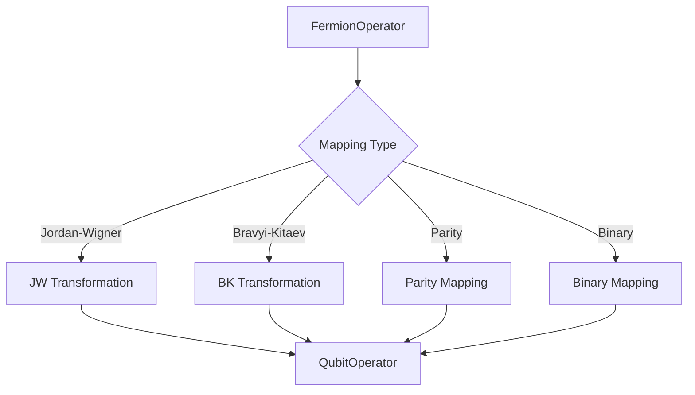
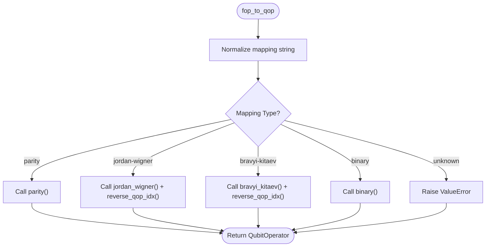
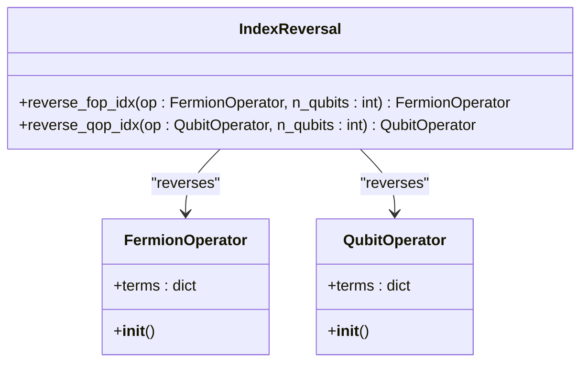

# Fermion-to-Qubit Mapping

<cite>
**Referenced Files in This Document**   
- [fermion_to_qubit.py](file://src/tyxonq/libs/hamiltonian_encoding/fermion_to_qubit.py)
- [pauli_io.py](file://src/tyxonq/libs/hamiltonian_encoding/pauli_io.py)
- [hamiltonian_building.py](file://examples/hamiltonian_building.py)
- [hchainhamiltonian.py](file://examples/hchainhamiltonian.py)
</cite>

## Table of Contents
1. [Introduction](#introduction)
2. [Core Mapping Strategies](#core-mapping-strategies)
3. [Primary Interface: fop_to_qop](#primary-interface-fop_to_qop)
4. [Parity Mapping with Two-Qubit Reduction](#parity-mapping-with-two-qubit-reduction)
5. [Binary Mapping with Checksum Code](#binary-mapping-with-checksum-code)
6. [Index Ordering Compatibility](#index-ordering-compatibility)
7. [Usage Examples in Quantum Chemistry](#usage-examples-in-quantum-chemistry)
8. [Error Conditions and Validation](#error-conditions-and-validation)
9. [Conclusion](#conclusion)

## Introduction

The fermion-to-qubit mapping functionality in TyxonQ provides essential tools for transforming fermionic operators into qubit operators, enabling quantum algorithms for quantum chemistry simulations. This documentation details the available mapping strategies—Jordan-Wigner, Bravyi-Kitaev, Parity, and Binary transformations—and their implementation within the framework. The primary entry point, `fop_to_qop`, serves as a unified interface for applying these mappings based on user-specified parameters such as mapping type, number of spin-orbitals, and electron count.

These mappings are critical for encoding molecular Hamiltonians into forms suitable for quantum computation, particularly in variational quantum eigensolvers (VQE) and other quantum simulation workflows. The system integrates with OpenFermion for operator handling while extending functionality through custom transformations and optimizations.

**Section sources**
- [fermion_to_qubit.py](file://src/tyxonq/libs/hamiltonian_encoding/fermion_to_qubit.py#L1-L20)

## Core Mapping Strategies

TyxonQ implements four major fermion-to-qubit mapping strategies:

1. **Jordan-Wigner Transformation**: A direct mapping that preserves locality but results in non-local Pauli strings.
2. **Bravyi-Kitaev Transformation**: Offers logarithmic-weight Pauli strings, balancing locality and operator weight.
3. **Parity Mapping**: Enables two-qubit reduction by exploiting particle number conservation.
4. **Binary Mapping**: Utilizes checksum codes to reduce qubit count while preserving symmetry.

Each strategy is implemented as a separate function within the `fermion_to_qubit.py` module, allowing modular access and composition. The choice of mapping affects both the number of required qubits and the structure of the resulting Hamiltonian, influencing circuit depth and measurement requirements.



**Diagram sources**
- [fermion_to_qubit.py](file://src/tyxonq/libs/hamiltonian_encoding/fermion_to_qubit.py#L78-L95)

**Section sources**
- [fermion_to_qubit.py](file://src/tyxonq/libs/hamiltonian_encoding/fermion_to_qubit.py#L1-L98)

## Primary Interface: fop_to_qop

The `fop_to_qop` function serves as the central interface for fermion-to-qubit transformations. It accepts four parameters:

- `fop`: Input FermionOperator to be transformed
- `mapping`: String specifying the mapping strategy ("jordan-wigner", "bravyi-kitaev", "parity", or "binary")
- `n_sorb`: Number of spin-orbitals in the system
- `n_elec`: Electron count, either as an integer (total electrons) or tuple (alpha, beta electrons)

The function dispatches to the appropriate transformation based on the mapping parameter, normalizing input case and validating against supported options. Unsupported mapping types trigger a `ValueError`. For Jordan-Wigner and Bravyi-Kitaev mappings, the output undergoes index reversal via `reverse_qop_idx` to maintain consistent qubit ordering conventions.



**Diagram sources**
- [fermion_to_qubit.py](file://src/tyxonq/libs/hamiltonian_encoding/fermion_to_qubit.py#L78-L88)

**Section sources**
- [fermion_to_qubit.py](file://src/tyxonq/libs/hamiltonian_encoding/fermion_to_qubit.py#L78-L95)

## Parity Mapping with Two-Qubit Reduction

The Parity mapping implementation includes a two-qubit reduction technique that exploits electron number conservation to eliminate two qubits from the representation. This optimization requires an even number of spin-orbitals and proper handling of electron counts.

The transformation first applies `reverse_fop_idx` to reorder fermionic operators before applying the core parity transformation via `_parity_core`. Two qubits—located at indices `[n_modes // 2 - 1, n_modes - 1]`—are removed from the final operator. Their expected measurement outcomes are replaced with phase factors derived from the total electron count:

- Phase for alpha electrons: (-1)^(n_alpha)
- Phase for beta electrons: (-1)^(n_alpha + n_beta)

When the total electron count is provided as an integer, it must be even; otherwise, users must specify separate alpha and beta counts via a tuple. This constraint ensures proper phase calculation and prevents invalid reductions.

```mermaid
flowchart TD
A[Input FermionOperator] --> B[Apply reverse_fop_idx]
B --> C[Core Parity Transformation]
C --> D{Check n_elec type}
D --> |int| E{Even electron count?}
D --> |tuple| F[Use n_alpha, n_beta]
E --> |No| G[Raise ValueError]
E --> |Yes| H[Compute n_alpha = n_beta = n_elec//2]
H --> I[Calculate phase_alpha = (-1)^n_alpha]
I --> J[Calculate phase_beta = (-1)^(n_alpha+n_beta)]
F --> I
J --> K[Remove reduction qubits]
K --> L[Apply phase factors to Z terms]
L --> M[Adjust remaining qubit indices]
M --> N[Output QubitOperator]
```

**Diagram sources**
- [fermion_to_qubit.py](file://src/tyxonq/libs/hamiltonian_encoding/fermion_to_qubit.py#L34-L75)

**Section sources**
- [fermion_to_qubit.py](file://src/tyxonq/libs/hamiltonian_encoding/fermion_to_qubit.py#L34-L75)

## Binary Mapping with Checksum Code

The Binary mapping employs a checksum code to achieve qubit reduction while preserving symmetry constraints. This transformation uses OpenFermion's `binary_code_transform` in conjunction with `checksum_code` to encode the fermionic operator.

The implementation assumes an equal distribution of alpha and beta electrons when given a total electron count. The checksum code is constructed with parameters based on half the number of spatial orbitals and the parity of half the electron count per spin channel. This approach effectively reduces the qubit count by one while maintaining the necessary physical constraints of the system.

The transformation is particularly useful for systems where full two-qubit reduction is not applicable, offering a middle ground between standard mappings and the more aggressive parity reduction.

**Section sources**
- [fermion_to_qubit.py](file://src/tyxonq/libs/hamiltonian_encoding/fermion_to_qubit.py#L22-L32)

## Index Ordering Compatibility

To ensure compatibility across different components and maintain consistent qubit indexing, TyxonQ provides two index reversal functions:

- `reverse_fop_idx`: Reverses the index order of fermionic operators
- `reverse_qop_idx`: Reverses the index order of qubit operators

These functions are crucial for aligning with external libraries like OpenFermion, which may use different indexing conventions (e.g., big-endian vs little-endian). The `reverse_qop_idx` function is automatically applied in the Jordan-Wigner and Bravyi-Kitaev pathways to ensure consistent output ordering.

The reversal operation transforms index `i` to `n_qubits - 1 - i`, effectively flipping the qubit ordering. This standardization enables seamless integration between different parts of the framework and ensures reproducible results across various quantum chemistry workflows.



**Diagram sources**
- [pauli_io.py](file://src/tyxonq/libs/hamiltonian_encoding/pauli_io.py#L86-L100)

**Section sources**
- [pauli_io.py](file://src/tyxonq/libs/hamiltonian_encoding/pauli_io.py#L86-L100)

## Usage Examples in Quantum Chemistry

The fermion-to-qubit mapping functionality integrates into quantum chemistry workflows through examples such as `hamiltonian_building.py` and `hchainhamiltonian.py`. These demonstrate how molecular Hamiltonians are constructed and transformed for quantum simulation.

In `hchainhamiltonian.py`, the workflow begins with molecular data construction using OpenFermion, followed by fermionic Hamiltonian generation. The transformation pipeline applies orbital reordering (`up_then_down`) and binary code transformation with checksum code before converting to qubit operators. This example illustrates end-to-end Hamiltonian construction from molecular geometry to sparse matrix representation.

The `hamiltonian_building.py` example, while focused on TFIM models, demonstrates similar patterns of operator construction and measurement that would be applied to chemically-derived Hamiltonians after fermion-to-qubit mapping.

**Section sources**
- [hamiltonian_building.py](file://examples/hamiltonian_building.py#L1-L93)
- [hchainhamiltonian.py](file://examples/hchainhamiltonian.py#L1-L76)

## Error Conditions and Validation

The mapping system includes several validation checks to prevent incorrect usage:

1. **Unsupported Mapping Types**: The `fop_to_qop` function validates the mapping parameter against known strategies and raises `ValueError` for unrecognized types.
2. **Odd Electron Counts in Parity Mapping**: When using integer electron counts with Parity mapping, the system verifies that the count is even. For odd totals, users must provide separate alpha and beta counts as a tuple.
3. **Even Spin-Orbital Requirement**: Parity mapping with two-qubit reduction requires an even number of spin-orbitals, enforced by an assertion in the `parity` function.
4. **Index Bounds Checking**: The reversal functions validate that operator indices are within the specified number of qubits.

These validations ensure physically meaningful transformations and prevent silent errors that could compromise simulation results.

**Section sources**
- [fermion_to_qubit.py](file://src/tyxonq/libs/hamiltonian_encoding/fermion_to_qubit.py#L45-L55)

## Conclusion

The fermion-to-qubit mapping system in TyxonQ provides a robust and flexible framework for quantum chemistry simulations. By offering multiple transformation strategies with optimizations like two-qubit reduction and checksum encoding, it enables efficient Hamiltonian representation tailored to specific hardware constraints and algorithmic requirements. The unified `fop_to_qop` interface simplifies access to these advanced mappings while maintaining rigorous validation and compatibility across components.